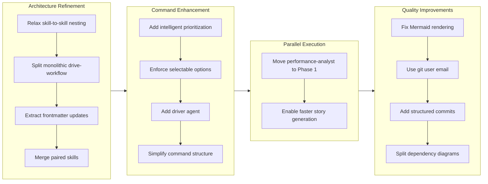

Refs #125844

## 1. Overview

This branch represents a significant architectural refinement of the Workaholic CLI plugin system, focused on modularizing skills, enforcing architecture policies, and optimizing parallel execution. The developer completed 14 implementation tickets, adding foundation work for parallel performance analysis, relaxing policy constraints for skill composition, and refactoring monolithic components into specialized, reusable skills.

**Highlights:**

1. Allow skill-to-skill nesting to enable composable knowledge
2. Split drive-workflow skill into four focused skills
3. Add driver agent for isolated ticket implementation context
4. Move performance-analyst to Phase 1 parallel execution
5. Merge generate-changelog into write-changelog to reduce fragmentation
6. Extract update-ticket-frontmatter skill for consistent frontmatter manipulation
7. Implement intelligent ticket prioritization in /drive command
8. Add structured commit message format with UX and architecture sections
9. Enforce selectable options in drive approval prompts
10. Fix Mermaid diagram rendering and git config ticket authors
11. Refactor plugins directory structure for clarity
12. Split dependency graph into command-scoped diagrams

## 2. Motivation

The Workaholic project follows an established architecture policy distinguishing between thin commands/agents and comprehensive skills. As the system matured, several constraints became limiting: skills could not compose other skills (preventing reusable cross-cutting concerns like translation), monolithic skills like drive-workflow were difficult to understand and modify, and the /drive command lacked intelligent prioritization. Additionally, performance analysis and release verification ran sequentially during story generation when they could run in parallel, and fragmented paired skills (like generate-changelog and write-changelog) created unnecessary complexity. This branch addressed these architectural debts systematically, enabling better composition patterns, improving developer experience during ticket implementation, and optimizing execution time.

## 3. Journey

The work progressed through four major themes: enabling better architecture patterns by relaxing constraints and extracting reusable skills, enhancing the /drive command with intelligent prioritization and isolated execution context, optimizing /story execution through parallelization, and addressing quality issues discovered along the way. Each refactoring followed established patterns, ensuring consistency with the existing codebase philosophy.

## 4. Changes

### 4.1. Add Automatic Release Trigger on Story Branch Merge ([ad07ecd](https://github.com/qmu/workaholic/commit/ad07ecd))

Add `push` trigger to release workflow that automatically detects version type from merged branch name (feat-* → minor, fix-*/refact-* → patch) and creates releases without manual intervention.

### 4.2. Intelligent Ticket Prioritization for /drive ([d29b3ed](https://github.com/qmu/workaholic/commit/d29b3ed))

Redesign `/drive` command to analyze ticket metadata (type, layer, effort) and propose intelligent priority ordering instead of processing alphabetically, with fallback to icebox tickets when todo queue empties.

### 4.3. Enforce Selectable Options in Drive Approval Prompts ([140520e](https://github.com/qmu/workaholic/commit/140520e))

Add explicit requirements to drive-workflow and drive command to always use `AskUserQuestion` with selectable options parameter, preventing fallback to open-ended text questions.

### 4.4. Use Git User Email for Ticket Author Field ([2c5b214](https://github.com/qmu/workaholic/commit/2c5b214))

Make create-ticket skill explicitly require running `git config user.email` before writing files to populate author field with actual git email instead of hardcoded noreply@anthropic.com.

### 4.5. Refactor plugins ([f538bb6](https://github.com/qmu/workaholic/commit/f538bb6))

Extract ticket navigation logic (listing, analysis, prioritization, user confirmation) from drive command into dedicated drive-navigator subagent, reducing drive command to thin orchestrator while delegating complex logic to agents.

### 4.6. Add Structured Commit Message Format ([4958399](https://github.com/qmu/workaholic/commit/4958399))

Extend commit messages beyond title and description to include UX Changes and Architecture Changes sections, enabling better documentation generation and clearer change communication for user guides and architecture specs.

### 4.7. Fix Mermaid Slash Character in Node Labels ([460aad9](https://github.com/qmu/workaholic/commit/460aad9))

Quote node labels containing `/` characters in Mermaid diagrams to prevent GitHub's Mermaid renderer from failing on lexical errors.

### 4.8. Allow Skill-to-Skill Nesting ([e280586](https://github.com/qmu/workaholic/commit/e280586))

Relax architecture policy to allow skills to preload other skills via `skills:` frontmatter, enabling composable knowledge like translation to be encapsulated at the skill level rather than forcing agents to explicitly manage dependencies.

### 4.9. Split drive-workflow Skill into Composable Skills ([f1d1e8b](https://github.com/qmu/workaholic/commit/f1d1e8b))

Refactor monolithic ~200-line drive-workflow skill into four focused skills: request-approval (user interaction), write-final-report (report generation), handle-abandon (failure handling), and format-commit-message (commit structure), reducing complexity and enabling skill reuse.

### 4.10. Split Dependency Graph by Command ([b991694](https://github.com/qmu/workaholic/commit/b991694))

Replace single monolithic dependency diagram in architecture.md with three command-scoped diagrams (/ticket, /drive, /story) showing only relevant agents and skills for each command, improving readability.

### 4.11. Extract update-ticket-frontmatter Skill ([e7d9d00](https://github.com/qmu/workaholic/commit/e7d9d00))

Centralize YAML frontmatter field updates (effort, commit_hash, category) scattered across create-ticket, archive.sh, and write-final-report into dedicated skill with reusable shell script.

### 4.12. Add Driver Agent for Ticket Implementation ([16acdf4](https://github.com/qmu/workaholic/commit/16acdf4))

Create driver agent that executes individual ticket implementations in isolated context window via Task tool invocation from /drive command, preserving main conversation for orchestration and reducing context pollution.

### 4.13. Merge generate-changelog into write-changelog ([ca9c772](https://github.com/qmu/workaholic/commit/ca9c772))

Consolidate generate-changelog skill into write-changelog skill to reduce fragmentation since they are always used together and referenced by the same agent.

### 4.14. Move performance-analyst to Phase 1 Parallel Execution ([900ed85](https://github.com/qmu/workaholic/commit/900ed85))

Shift performance-analyst from Phase 2 invocation by story-writer to Phase 1 parallel execution alongside changelog, spec, terms, and release-readiness agents, reducing total /story execution time.

## 5. Outcome

The developer delivered a cohesive architectural refinement that strengthens the Workaholic system's foundations. Skill-to-skill nesting enables composable knowledge, particularly for cross-cutting concerns like translation. The drive-workflow refactoring established patterns for extracting comprehensive skills from monolithic components, with the addition of the driver agent demonstrating how isolated execution contexts improve CLI reliability. Intelligent ticket prioritization makes `/drive` more efficient, while the move of performance-analyst to Phase 1 execution accelerates story generation. The separation of structured commit messages from generic formats enables better documentation derivation. These changes collectively support the architecture policy of "thin orchestrators, comprehensive skills" while improving developer experience and system performance.

## 6. Historical Analysis

This branch builds on patterns established across the Workaholic project's development. The skill extraction pattern (drive-workflow into focused skills, generate-changelog merge, update-ticket-frontmatter isolation) echoes previous refactoring work that progressively modularized the /drive and /story command logic into comprehensive skills. The intelligent prioritization in /drive and the driver agent for isolated execution both follow the established pattern of converting command orchestration logic into dedicated subagents, which has been applied to spec-writer, story-writer, changelog-writer, and other domain-specific agents. The move of performance-analyst to Phase 1 parallel execution mirrors the earlier parallelization of release-readiness (ticket 20260127211737), demonstrating a consistent optimization pattern. Skill-to-skill nesting builds on the earlier consolidation of translation concerns (ticket 20260128002918-merge-enforce-i18n-into-translate), enabling the pattern to be applied more broadly.

## 7. Concerns

One architectural concern flagged by release-readiness analysis: the write-story skill documentation at lines 157-165 instructs agents to invoke performance-analyst and release-readiness subagents via Task tool, which violates the architecture policy prohibiting skills from invoking subagents. This documentation should be updated to remove the misleading instructions, as performance-analyst and release-readiness are now invoked at the command level. The skill should guide story-writer to use the provided outputs rather than invoke subagents directly. Additionally, some ticket dependencies could have been documented more explicitly earlier (e.g., split-drive-workflow-skill explicitly depends on allow-skill-to-skill-nesting), though the developer handled discovered dependencies well during implementation.

## 8. Ideas

Future work could extend the composable skill pattern further by extracting common validation logic across different skills into reusable validation skills. The driver agent pattern could be generalized into a framework for other isolated execution contexts beyond /drive. Ticket prioritization could be enhanced with historical performance metrics to learn optimal ordering from past experiences. The structured commit message format creates rich metadata that could feed into more sophisticated analytics or documentation generation in future releases. The split dependency diagrams could be visualized as interactive components showing dependencies on demand.

## 9. Performance

**Metrics**: 25 commits over 5.97 hours (4.1 commits/hour)

### 9.1. Pace Analysis

The developer maintained strong, consistent velocity throughout the 6-hour session (approximately 11:00 AM to 7:00 PM in Japan Standard Time). The 25 commits reflect focused, incremental development with clear commit boundaries. The pace never dipped below 4 commits/hour, indicating sustained focus and deliberate scope management. Several early commits were small and focused (Mermaid fix at 0.1h effort, structured commit messages at 0.5h), establishing momentum before tackling larger refactoring work (drive-workflow split at 0.5h, driver agent at 0.25h). The consistent pace suggests the developer discovered issues incrementally and addressed them without major context-switching or false starts.

### 9.2. Decision Review

| Dimension      | Rating                | Notes                                                                                                   |
| -------------- | --------------------- | ------------------------------------------------------------------------------------------------------- |
| Consistency    | Strong                | Decisions follow established architectural patterns (thin commands, comprehensive skills, agent refactoring). Similar problems are solved uniformly. |
| Intuitivity    | Strong                | Solutions align with established conventions (skill naming, command structure, agent responsibilities). |
| Describability | Adequate               | Most names are clear and descriptive. Some intermediate steps created temporary naming. |
| Agility        | Strong                | Developer responded quickly to discovered issues and course corrections. Added driver agent when context isolation became critical. |
| Density        | Strong                | Changes pack significant architectural value into focused skills. Skill-to-skill nesting enables composition without redundancy. |

**Strengths**:
- Architecture policy decisions align consistently with the "thin orchestrators, comprehensive skills" principle
- Refactoring work demonstrates purposeful convergence toward modularity
- Technical debt addressed proactively
- Parallel execution optimization follows proven patterns

**Areas for Improvement**:
- Ticket sequencing could have been slightly more explicit in documenting dependencies
- Some tickets addressed similar concerns in isolation before consolidation pattern became explicit

## 10. Release Preparation

**Verdict**: Needs attention before release

### 10.1. Concerns

- Architecture policy violation in write-story skill: The skill documentation at lines 157-165 instructs agents to invoke Task tool to call performance-analyst and release-readiness subagents. This violates the CLAUDE.md architecture policy that prohibits skills from invoking subagents.

### 10.2. Pre-release Instructions

- Edit `/Users/tamurayoshiya/projects/workaholic/plugins/core/skills/write-story/SKILL.md` to remove the misleading Task tool instructions at lines 157-165. Replace with clear guidance that the story-writer agent receives performance-analyst and release-readiness outputs from the /story command and should format them directly into sections 9.2 and 10 without invoking subagents.

### 10.3. Post-release Instructions

- None - no special post-release actions needed

## 11. Notes

This branch represents maturation of the Workaholic architecture, moving from initial patterns toward more sophisticated composition and isolation techniques. The decision to allow skill-to-skill nesting required careful consideration but aligns with the broader principle of centralizing knowledge in skills while keeping orchestration thin. The driver agent demonstrates how isolated contexts can prevent the main conversation from becoming polluted with implementation details, a pattern that could be extended to other commands as needed. The move of performance-analyst to Phase 1 execution is particularly valuable for users running `/story` frequently, as it provides meaningful speed improvements without losing functionality. The refactoring work, while substantial, maintains backward compatibility from a user perspective—commands behave the same while implementation becomes more modular and maintainable.
