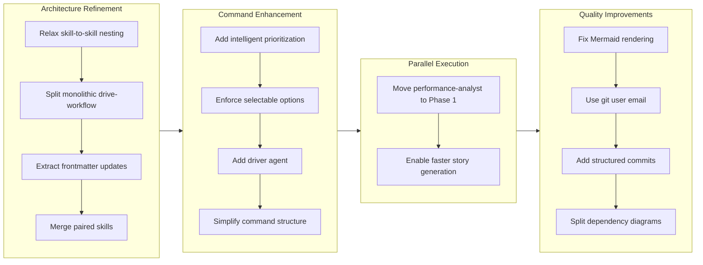

Refs #125844

## 1. 概要

このbranch は Workaholic CLI plugin システムの大幅な architectural 改善を表しており、skills のモジュール化、architecture policy の遵守、並列実行の最適化に注力しています。開発者は 14 個の implementation ticket を完了し、並列 performance 分析の基盤作業、policy constraint の緩和、単一の大規模 component を特化した再利用可能な skills に分割するリファクタリングを追加しました。

**ハイライト：**

1. Skill-to-skill nesting を許可して合成可能な knowledge を実現
2. drive-workflow skill を 4 つの focused skill に分割
3. Isolated ticket implementation context 用の driver agent を追加
4. performance-analyst を Phase 1 parallel execution に移動
5. generate-changelog を write-changelog に統合して fragmentation を削減
6. Consistent frontmatter manipulation のための update-ticket-frontmatter skill を抽出
7. /drive command に intelligent ticket prioritization を実装
8. UX と architecture sections を含む structured commit message format を追加
9. Drive approval prompts で selectable options を強制
10. Mermaid diagram rendering と git config ticket authors を修正
11. Clarity のために plugins directory structure をリファクタリング
12. Dependency graph を command-scoped diagrams に分割

## 2. 動機

Workaholic project は thin commands/agents と comprehensive skills を区別する確立された architecture policy に従っています。システムが成熟するにつれて、いくつかの制約が制限的になりました：skills は他の skills をプリロードできず（translation のような再利用可能な cross-cutting concern を防ぐ）、drive-workflow のような単一の大規模 skill は理解と変更が困難で、/drive command は intelligent prioritization がありませんでした。さらに、performance 分析と release 検証は story 生成中に順次実行されていましたが、並列実行できました。また、分割された paired skills （generate-changelog と write-changelog など）は不必要な複雑さを作成していました。このbranch は、これらの architectural 負債を体系的に対処し、より良い composition パターンを有効にし、ticket implementation 中の開発者体験を改善し、実行時間を最適化しました。

## 3. 過程

作業は 4 つの主要テーマを通じて進行しました：constraint を緩和し再利用可能な skills を抽出することで architecture パターンを改善し、/drive command を intelligent prioritization と isolated execution context で拡張し、並列化を通じて /story 実行を最適化し、実装中に発見された品質問題に対処しました。各リファクタリングは確立されたパターンに従い、既存の codebase philosophy との consistency を確保しました。

## 4. 変更

### 4.1. Story Branch Merge 時に Automatic Release Trigger を追加 ([ad07ecd](https://github.com/qmu/workaholic/commit/ad07ecd))

Merged branch name からバージョンタイプを自動検出し（feat-* → minor、fix-*/refact-* → patch）、手動介入なしでリリースを作成する release workflow に `push` trigger を追加します。

### 4.2. /drive 用 Intelligent Ticket Prioritization ([d29b3ed](https://github.com/qmu/workaholic/commit/d29b3ed))

ticket metadata （type、layer、effort）を分析し、alphabetical に処理する代わりに intelligent priority ordering を提案する /drive command を再設計し、todo queue が空のときは icebox tickets にフォールバックします。

### 4.3. Drive Approval Prompts で Selectable Options を強制 ([140520e](https://github.com/qmu/workaholic/commit/140520e))

drive-workflow と drive command に、`AskUserQuestion` が常に selectable options parameter を使用し、open-ended text question へのフォールバックを防ぐ明示的な要件を追加します。

### 4.4. Ticket Author Field に Git User Email を使用 ([2c5b214](https://github.com/qmu/workaholic/commit/2c5b214))

ファイルを書き込む前に `git config user.email` を実行することを create-ticket skill で明示的に要求し、hardcoded noreply@anthropic.com の代わりに実際の git email で author field を設定します。

### 4.5. plugins をリファクタリング ([f538bb6](https://github.com/qmu/workaholic/commit/f538bb6))

ticket navigation logic （listing、analysis、prioritization、user confirmation）を drive command から dedicated drive-navigator subagent に抽出し、drive command を thin orchestrator に削減しながら complex logic を agents に委任します。

### 4.6. Structured Commit Message Format を追加 ([4958399](https://github.com/qmu/workaholic/commit/4958399))

Commit message を title と description を超えて UX Changes と Architecture Changes sections を含むように拡張し、より良い documentation generation と user guide および architecture specs のための clearer change communication を実現します。

### 4.7. Mermaid Slash Character を Node Labels で修正 ([460aad9](https://github.com/qmu/workaholic/commit/460aad9))

GitHub の Mermaid renderer が lexical error で失敗するのを防ぐために、Mermaid diagram で `/` 文字を含む node label をクォートします。

### 4.8. Skill-to-Skill Nesting を許可 ([e280586](https://github.com/qmu/workaholic/commit/e280586))

Architecture policy を緩和して skills が `skills:` frontmatter を通じて他の skills をプリロードできるようにし、translation のような composable knowledge を agents に明示的に管理させるのではなく skill level で encapsulate できます。

### 4.9. drive-workflow Skill を Composable Skills に分割 ([f1d1e8b](https://github.com/qmu/workaholic/commit/f1d1e8b))

単一の大規模な ~200-line drive-workflow skill を 4 つの focused skill に分割します：request-approval （ユーザー interaction）、write-final-report （report generation）、handle-abandon （failure handling）、format-commit-message （commit structure）。これにより複雑さが削減され、skill の再利用が可能になります。

### 4.10. Dependency Graph を Command で分割 ([b991694](https://github.com/qmu/workaholic/commit/b991694))

architecture.md の単一の単一の dependency diagram を 3 つの command-scoped diagram （/ticket、/drive、/story）に置き換え、各 command に関連のある agents と skills のみを表示して readability を改善します。

### 4.11. update-ticket-frontmatter Skill を抽出 ([e7d9d00](https://github.com/qmu/workaholic/commit/e7d9d00))

YAML frontmatter field updates （effort、commit_hash、category）を create-ticket、archive.sh、write-final-report に分散させるのではなく、再利用可能な shell script を備えた dedicated skill に集約します。

### 4.12. Ticket Implementation 用 Driver Agent を追加 ([16acdf4](https://github.com/qmu/workaholic/commit/16acdf4))

/drive command から Task tool invocation を通じて isolated context window で個々の ticket implementation を実行する driver agent を作成し、main conversation を orchestration のために保護し、context pollution を削減します。

### 4.13. generate-changelog を write-changelog に統合 ([ca9c772](https://github.com/qmu/workaholic/commit/ca9c772))

generate-changelog skill を write-changelog skill に統合して fragmentation を削減します。これらは常に一緒に使用され、同じ agent によって参照されるためです。

### 4.14. performance-analyst を Phase 1 Parallel Execution に移動 ([900ed85](https://github.com/qmu/workaholic/commit/900ed85))

performance-analyst を story-writer による Phase 2 invocation から Phase 1 parallel execution に shift し、changelog、spec、terms、release-readiness agents と並列実行して総 /story 実行時間を削減します。

## 5. 成果

開発者は Workaholic system の基盤を強化する coherent architectural refinement を提供しました。Skill-to-skill nesting は、特に translation のような cross-cutting concern に対して composable knowledge を実現します。drive-workflow refactoring は単一の大規模な component から comprehensive skills を抽出するパターンを確立し、driver agent の追加は isolated execution context が CLI reliability をどのように改善するかを示しています。Intelligent ticket prioritization により /drive がより効率的になり、performance-analyst の Phase 1 実行への移動は story generation を加速させます。Structured commit message の分離は generic format からより良い documentation derivation を実現します。これらの変更は collectively "thin orchestrator、comprehensive skills" architecture policy をサポートしながら、開発者体験とシステムパフォーマンスを改善します。

## 6. 歴史的分析

このbranch は Workaholic project の開発全体で確立されたパターンの上に構築されています。Skill extraction パターン（drive-workflow を focused skills に、generate-changelog の統合、update-ticket-frontmatter の隔離）は、progressively /drive および /story command logic を comprehensive skills にモジュール化した以前のリファクタリング作業と呼応しています。/drive の intelligent prioritization と isolated execution のための driver agent はどちらも、command orchestration logic を dedicated subagent に変換する確立されたパターンに従い、spec-writer、story-writer、changelog-writer、および他の domain-specific agent に適用されています。performance-analyst を Phase 1 parallel execution に移動は、earlier release-readiness parallelization （ticket 20260127211737）をミラーリングし、consistent optimization パターンを実証しています。Skill-to-skill nesting は earlier translation concern 統合 （ticket 20260128002918-merge-enforce-i18n-into-translate）に構築し、パターンをより広く適用できるようにします。

## 7. 懸念点

Release-readiness 分析で指摘された 1 つの architectural 懸念：write-story skill documentation の lines 157-165 は、agent が Task tool を通じて performance-analyst と release-readiness subagent を invoke するよう指示しており、skills による subagent invocation を禁止する architecture policy に違反しています。この documentation は misleading instructions を削除するため更新する必要があります。performance-analyst と release-readiness は現在 command level で invoke されるため、story-writer は provided outputs を使用するよう skill を指導する必要があります。さらに、いくつかの ticket dependency は以前にはより明示的に documented できた可能性があります（例えば、split-drive-workflow-skill は明示的に allow-skill-to-skill-nesting に依存しています）が、開発者は implementation 中に discovered dependencies をよく処理しました。

## 8. アイデア

将来の作業は、composable skill パターンをさらに拡張し、異なる skills に shared validation logic を抽出して再利用可能な validation skills に組み込むことができます。driver agent パターンは /drive 以外の他の isolated execution context の枠組みとして汎用化される可能性があります。Ticket prioritization は historical performance metrics で拡張され、過去の体験から optimal ordering を学ぶことができます。Structured commit message format は豊富な metadata を作成し、future release でより sophisticated analytics または documentation generation にフィードできます。分割された dependency diagram は需要に応じてインタラクティブなコンポーネントとして dependencies を表示できます。

## 9. パフォーマンス

**メトリクス**：5.97 時間以上 25 commits （4.1 commits/hour）

### 9.1. Pace 分析

開発者は 6 時間のセッション全体を通じて強力で consistent な velocity を保持しました （日本標準時間で午前 11 時から午後 7 時まで）。25 commits は focused で incremental な development と clear commit boundaries を反映しています。Pace は決して 4 commits/hour を下回らず、sustained focus と deliberate scope management を示しています。複数の early commits は small で focused （Mermaid fix at 0.1h effort、structured commit message at 0.5h）で、larger refactoring work に取り組む前に momentum を確立しました（drive-workflow split at 0.5h、driver agent at 0.25h）。consistent pace は、開発者が問題を incrementally 発見し、major context-switching や false start なしに対処したことを示唆しています。

### 9.2. 決定レビュー

| 側面           | 評価                  | 注記                                                                                                           |
| -------------- | --------------------- | ------------------------------------------------------------------------------------------------------- |
| 一貫性         | 強い                  | 決定は確立された architectural パターン（thin commands、comprehensive skills、agent refactoring）に従い、similar problem は uniformly に解決されます。 |
| 直感性         | 強い                  | ソリューションは確立された conventions （skill naming、command structure、agent responsibilities）と一致します。 |
| 説明可能性     | 適切                  | ほとんどの名前は clear で descriptive です。一部の intermediate step は temporary naming を作成しました。 |
| 敏捷性         | 強い                  | 開発者は discovered issue と course correction に quick に対応しました。Context isolation が critical になったときに driver agent を追加しました。 |
| 密度           | 強い                  | Changes は significant architectural value を focused skills に pack しており、skill-to-skill nesting は redundancy なしに composition を実現します。 |

**強み**：
- Architecture policy 決定は "thin orchestrator、comprehensive skills" principle と consistently 一致しています
- Refactoring 作業は modularity への purposeful convergence を示しています
- Technical debt は proactively に対処されています
- Parallel execution optimization は proven pattern に従っています

**改善の余地**：
- Ticket sequencing は dependency を documenting することで slightly more explicit になる可能性があります
- 一部の ticket は consolidation pattern が explicit になる前に isolation で similar concern に対処しました

## 10. リリース準備

**判定**：リリース前に注意が必要

### 10.1. 懸念点

- write-story skill での architecture policy 違反：skill documentation の lines 157-165 は、agent に Task tool を使用して performance-analyst と release-readiness subagent を call するよう指示しています。これは、skills による subagent invocation を禁止する CLAUDE.md architecture policy に違反しています。

### 10.2. Pre-release 指示

- `/Users/tamurayoshiya/projects/workaholic/plugins/core/skills/write-story/SKILL.md` を編集して、lines 157-165 の misleading Task tool instructions を削除してください。Clear guidance に置き換えて、story-writer agent が /story command から performance-analyst と release-readiness output を受け取り、subagent を invoke せずに sections 9.2 と 10 に直接フォーマットする必要があることを示します。

### 10.3. Post-release 指示

- なし - special post-release action は不要です

## 11. 注記

このbranch は Workaholic architecture の成熟を表し、initial pattern から、より sophisticated な composition と isolation technique に向かっています。Skill-to-skill nesting を許可する決定は慎重な検討が必要でしたが、orchestration を thin に保つ際に skill に knowledge を集約するより広い principle と一致しています。Driver agent は、isolated context が main conversation を implementation detail で汚すのを防ぐ方法を示しており、必要に応じて他の command に拡張できるパターンです。performance-analyst の Phase 1 実行への移動は、/story を頻繁に実行するユーザーに特に有益です。functionality を失うことなく meaningful speed improvement を提供します。Refactoring 作業は substantial ですが、user perspective からは backward compatibility を保持しています。commands は同じように動作しながら、implementation はより modular で maintainable になります。
