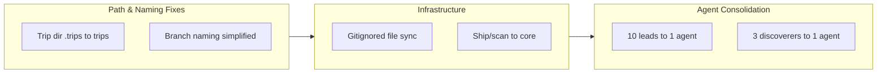

## 1. Overview

This branch refines the plugin architecture that emerged from the trip session that polished the trippin plugin's autonomous workflow. After the trip established consolidated reviews, event logging, agent symmetry, and overnight autonomy, this branch delivered six drive tickets: fixing the trip directory path convention, simplifying branch naming, adding gitignored file sync before worktree erase, moving ship and scan commands to the core plugin, and consolidating 13 thin subagent files into 2 parameterized agents.

**Highlights:**

1. Consolidated 10 lead agents and 3 discoverer agents into 2 parameterized agents (-11 files)
2. Moved ship and scan commands from work plugin to core plugin for proper dependency flow
3. Improved worktree lifecycle with gitignored file sync prompt before erase

## 2. Motivation

The original trip session (trip-20260319-040153) redesigned the trippin plugin's trip command with four demands: review efficiency, trip records, agent symmetry, and overnight polish. After that foundational work merged, several rough edges remained in the broader plugin ecosystem: the trip directory used a dot-prefixed path inconsistent with conventions, branch naming carried a redundant feature suffix, the ship and scan commands lived in the wrong plugin given their cross-cutting nature, and dozens of thin subagent files existed that could be consolidated into parameterized agents. This branch addresses those refinements systematically.

## 3. Changes

Summary: Six tickets progressed from convention fixes through infrastructure restructuring to agent consolidation.

### 3-1. Fix trip directory path ([48537a3](https://github.com/qmu/workaholic/commit/48537a3))

Renamed `.trips` to `trips` across all plugin files. The dot-prefixed path was inconsistent with the `.workaholic/` convention where only the top-level data directory is hidden.

### 3-2. Simplify branch naming ([be9e092](https://github.com/qmu/workaholic/commit/be9e092))

Removed the redundant feature suffix from branch names, changing from `work-TIMESTAMP-FEATURE` to `work-TIMESTAMP` only. The feature description in the branch name was unreliable and duplicated the ticket title.

### 3-3. Add gitignored file sync prompt ([a0773c9](https://github.com/qmu/workaholic/commit/a0773c9))

Added a prompt before worktree erase in the ship workflow that detects gitignored file changes and offers to sync them back to the main worktree before cleanup.

### 3-4. Move ship and scan commands to core ([7db879e](https://github.com/qmu/workaholic/commit/7db879e))

Relocated `/ship` and `/scan` commands from the work plugin to the core plugin. These commands serve all workflows (drive, trip) and should not depend on the work plugin.

### 3-5. Consolidate 10 lead agents ([dd595b1](https://github.com/qmu/workaholic/commit/dd595b1))

Replaced 10 identical lead agent files (a11y-lead, db-lead, delivery-lead, infra-lead, observability-lead, quality-lead, recovery-lead, security-lead, test-lead, ux-lead) with a single parameterized `lead.md` that receives the domain as a prompt parameter. Updated the select-scan-agents output schema to separate leads into domain-qualified objects.

### 3-6. Consolidate 3 discoverer agents ([fa8cfdb](https://github.com/qmu/workaholic/commit/fa8cfdb))

Replaced 3 thin discoverer agent files (history-discoverer, source-discoverer, ticket-discoverer) with a single `discoverer.md` that receives the mode (history, source, ticket) as a prompt parameter. Updated ticket-organizer to use the parameterized agent.

## 4. Outcome

All six tickets implemented and committed successfully. The plugin architecture is cleaner: 11 fewer agent files, commands in the correct plugin, and consistent naming conventions. The select-scan-agents output schema was improved to cleanly separate managers, leads (with domain objects), and writers. The parameterized agent pattern is now established as a reusable consolidation approach for thin wrappers.

## 5. Historical Analysis

This branch builds on a series of consolidation efforts in the codebase:
- The drivin skills consolidation (12 directories to 5) established the pattern of reducing thin wrappers
- The lead agent reset (resetting all 10 lead policies) showed these agents are treated as a uniform group
- The parallel discovery architecture (history + source + ticket discoverers) created the 3 agents now consolidated

## 6. Concerns

- The consolidated lead agent preloads all 14 skills (10 domain + 4 framework), increasing context consumption per invocation. Currently acceptable (~300-400 lines) but may need revisiting if lead skills grow significantly. (from architectural analysis)
- The consolidated discoverer agent uses the union of tools (Bash, Read, Glob, Grep), meaning source and ticket modes gain Bash access they previously lacked. This is a minor tool scope relaxation. (from architectural analysis)

## 7. Ideas

- Consolidate the 3 manager agents (project-manager, architecture-manager, quality-manager) using the same parameterized pattern -- they follow a similar dispatcher structure
- Consider whether pr-creator could be inlined into story-writer rather than existing as a separate thin agent

## 8. Successful Development Patterns

- **Parameterized agent pattern**: Single agent file with mode/domain parameter replaces N identical thin wrappers. Caller passes the parameter in the prompt. Agent routes to the appropriate skill section. Established with leads (10 to 1) and discoverers (3 to 1).
- **Schema-based output restructuring**: When consolidating agents that callers reference by slug, restructure the caller's output schema (e.g., select.sh leads array with domain objects) rather than using convention-based compound identifiers.

## 9. Release Preparation

**Verdict**: Ready for release

### 9-1. Concerns

- None - all changes are configuration/documentation, no runtime behavior affected

### 9-2. Pre-release Instructions

- None - standard release process applies

### 9-3. Post-release Instructions

- None - no special post-release actions needed

## 10. Notes

Trip Activity Log (22 events)

| Timestamp | Agent | Event | Target | Impact |
| --------- | ----- | ----- | ------ | ------ |
| 2026-03-19T04:40:30+09:00 | Constructor | implementation-started | coding | All 6 design phases being implemented |
| 2026-03-19T04:40:53+09:00 | Constructor | implementation-complete | coding | All scripts pass bash -n syntax checks, all agent files pass schema symmetry verification |
| 2026-03-19T04:41:09+09:00 | Planner | test-plan-created | coding | Test plan for validating Design v2 implementation |
| 2026-03-19T04:41:47+09:00 | Architect | codebase-discovered | coding | Read all modified and new files to prepare for structural review |
| 2026-03-19T04:42:26+09:00 | Leader | gate-passed | concurrent-launch | All 3 agents completed concurrent tasks; advancing to review and testing |
| 2026-03-19T04:42:48+09:00 | Architect | analytical-review-complete | coding | Structural review of all implementation changes against Design v2 and Model v2 |
| 2026-03-19T04:51:41+09:00 | Planner | e2e-test-complete | coding | All 9 test categories pass: script syntax, directory structure, event logging, guardrail, schema symmetry, backward compat, structural consistency |
| 2026-03-19T04:52:15+09:00 | Leader | gate-passed | review-and-testing | Architect approved with observations, Planner approved with all 9 tests passing; no iteration needed |
| 2026-03-19T04:52:20+09:00 | Leader | phase-transition | complete | Coding Phase complete; all agents approved implementation |
| 2026-03-19T13:16:52+09:00 | constructor | implementation-complete | plugins/trippin/ | One-turn review protocol implemented across SKILL.md, trip.md, and all three agent files |
| 2026-03-19T13:17:40+09:00 | architect | analytical-review-complete | reviews/one-turn-review-architect.md | Structural review of one-turn review implementation against Model v2 complete; approved with observations |
| 2026-03-19T13:18:26+09:00 | planner | e2e-test-complete | reviews/one-turn-review-planner.md | Business validation of one-turn review protocol complete; approved with observations on efficiency gain |
| 2026-03-19T13:18:52+09:00 | leader | phase-transition | complete/done | All three agents approved one-turn review implementation; trip complete |
| 2026-03-19T13:25:50+09:00 | leader | phase-transition | plugins/trippin | Polish pass: remove redundancy, fix agent symmetry, tighten prompts for overnight reliability |
| 2026-03-19T13:33:41+09:00 | leader | artifact-revised | SKILL.md | Remove duplicate deprecation notice from Artifact Storage section |
| 2026-03-19T13:39:52+09:00 | leader | phase-transition | deep-polish | Deep polish pass: enforce CLAUDE.md line count guidelines across all trippin plugin files |
| 2026-03-19T15:53:26+09:00 | planner | test-plan-created | all | Test plan v3 ready; task #5 can execute after Constructor completes task #1 |
| 2026-03-19T16:00:01+09:00 | planner | e2e-test-complete | all | 32/33 tests pass, implementation approved with one pre-existing observation |

