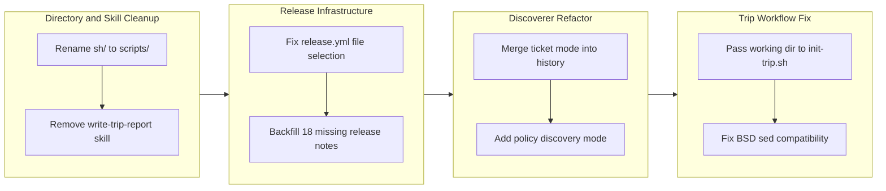

## 1. Overview

This branch performs housekeeping and structural improvements across the workaholic plugin ecosystem: renaming legacy directory paths, removing obsolete skills, fixing broken release note infrastructure, refactoring the discoverer agent's mode architecture, and correcting trip artifact generation to respect worktree boundaries. Five tickets addressed directory naming consistency, dead code removal, a deterministic release note selection bug in CI, discoverer mode consolidation from history/source/ticket to history/source/policy, and a worktree-aware trip artifact path fix with a BSD sed compatibility correction.

**Highlights:**

1. Fixed release.yml to deterministically select release notes by branch name instead of non-deterministic `ls -t` timestamp ordering, and backfilled 18 missing release notes
2. Refactored the Discoverer agent from history/source/ticket to history/source/policy modes, merging ticket duplicate detection into history and adding policy-based standards discovery
3. Fixed trip artifacts landing in the main worktree instead of the trip worktree, with a portable BSD sed fix for macOS compatibility

## 2. Motivation

Several forms of accumulated technical debt converged in this branch. The root `sh/` directory was a leftover from an earlier naming convention that had been reversed everywhere except three locations. The `write-trip-report` skill had been superseded by the unified story-writer agent but never removed, leaving dead code in the report pipeline. The `release.yml` workflow had been silently publishing stale release notes for every release since v1.0.30 due to a `ls -t` timestamp approach that became non-deterministic in CI where `actions/checkout` sets all file timestamps to checkout time. The discoverer agent's ticket mode duplicated functionality already present in history mode, while lacking the ability to surface repository standards and conventions. Finally, the trip workflow was generating artifacts in the wrong worktree root, causing them to be left uncommitted and excluded from PRs.

## 3. Changes

The branch progressed through four phases: first cleaning up legacy directory naming and removing the obsolete write-trip-report skill, then fixing the release note infrastructure with a deterministic file selection strategy and backfilling 18 missing notes, refactoring the discoverer agent to merge duplicate detection into history mode and introduce policy discovery, and finally fixing the trip artifact worktree boundary issue with a portable sed replacement.

### 3-1. Rename sh/ directories to scripts/ across the repository ([54fb2ff](https://github.com/qmu/workaholic/commit/54fb2ff))

Renamed the root `sh/` directory to `scripts/` and fixed two stale `${skill_dir}sh/` path references in standards plugin gather scripts. All 21 skill directories already used `scripts/` -- this addressed the three remaining inconsistencies from an earlier naming reversal.

### 3-2. Remove write-trip-report skill ([953fc88](https://github.com/qmu/workaholic/commit/953fc88))

Removed the `write-trip-report` skill (89 lines) and its companion `gather-artifacts.sh` script (127 lines) from the work plugin. Updated the report command's trip mode to invoke the story-writer agent instead of the manual gather-artifacts workflow, completing the report pipeline unification.

### 3-3. Fix missing release notes and release.yml file selection ([f6ea316](https://github.com/qmu/workaholic/commit/f6ea316))

Replaced the non-deterministic `ls -t` file selection in `release.yml` with merge-commit branch name extraction and a lexicographic sort fallback. Backfilled 18 missing release notes from story files spanning 11 `feat-*` branches, 5 `drive-*` branches, and 2 other branches. Regenerated the release-notes README index with all 31 entries.

### 3-4. Refactor Discoverer: merge History+Ticket modes, add Policy mode ([c0e4447](https://github.com/qmu/workaholic/commit/c0e4447))

Merged the Discover Ticket section into Discover History so that a single history discovery pass now searches archive, todo, and icebox directories while performing duplicate/overlap analysis. Added a new Discover Policy mode that examines CLAUDE.md, rules directories, configuration files, and standards plugin content to surface repository conventions. Updated the discoverer agent, ticket-organizer, and search script accordingly.

### 3-5. Fix trip artifacts landing in main worktree instead of trip worktree ([3f2fd2a](https://github.com/qmu/workaholic/commit/3f2fd2a))

Added an optional `working-dir` argument to `init-trip.sh` so the trip command can pass the worktree path for artifact generation. Updated `trip.md` to supply `<working_dir>` to the initialization script. Additionally replaced the GNU-only `sed 's/./\U&/'` in `trip-commit.sh` with a portable `awk` alternative to fix macOS producing `[UConstructor]` instead of `[Constructor]`.

## 4. Outcome

The branch resolved five distinct areas of accumulated technical debt. Directory naming is now fully consistent across the repository with all script directories using the `scripts/` convention. The report pipeline is simplified by removing the obsolete write-trip-report skill and routing all modes through the story-writer agent. Release note publishing is now deterministic, with 18 historically missing notes backfilled and the selection algorithm based on branch name rather than filesystem timestamps. The discoverer agent's architecture is cleaner -- history mode handles both historical context and duplicate detection, while the new policy mode provides standards-aware discovery for ticket creation. Trip artifacts now correctly land in the trip worktree, ensuring they are committed and included in PRs.

## 5. Historical Analysis

The directory naming cleanup traces back to ticket 20260127102007 which originally renamed `scripts/` to `sh/` for brevity, followed by a large-scale reversal that missed three locations. The write-trip-report removal is the final step in a unification arc that began with 20260403230427 (unifying trip report to drive format) and continued through the work plugin merger. The release note bug was noted as a consideration in ticket 20260212182713 but deferred as out-of-scope -- this branch finally addressed it. The discoverer refactoring continues a consolidation trajectory established by 20260406185951 (consolidating three discoverer agents into one parameterized agent) and follows the same structural pattern as 20260406182846 (consolidating 10 lead agents into a single parameterized lead). The trip worktree fix builds on the worktree management infrastructure added in work-20260404-101424, where gitignored file sync was introduced for the worktree lifecycle.

## 6. Concerns

- The `release.yml` merge-commit branch name extraction depends on GitHub's merge commit message format, which varies by merge strategy; a lexicographic sort fallback mitigates this but could select the wrong file if branch naming conventions change (see [f6ea316](https://github.com/qmu/workaholic/commit/f6ea316) in `.github/workflows/release.yml`)
- The merged History mode output schema is more complex, combining historical context fields with ticket moderation fields; the ticket-organizer must correctly parse the `moderation` field from a single response instead of a separate discoverer call (see [c0e4447](https://github.com/qmu/workaholic/commit/c0e4447) in `plugins/work/agents/ticket-organizer.md`)
- The `search.sh` change uses intentionally unquoted `$SEARCH_DIRS` for word splitting across multiple directories, which is a deliberate shell practice but could surprise reviewers expecting quoted variables (see [c0e4447](https://github.com/qmu/workaholic/commit/c0e4447) in `plugins/work/skills/discover/scripts/search.sh`)
- The `define-lead.md` schema was simplified by removing fixed policy subsection structure (Implementation/Review/Documentation/Execution) in favor of freeform policies; existing leads were not updated in this branch and retain their original content under the new schema (see [c0e4447](https://github.com/qmu/workaholic/commit/c0e4447) in `.claude/rules/define-lead.md`)

## 7. Ideas

- Consider re-publishing the most recent GitHub Release (v1.0.44) with correct release notes now that the selection bug is fixed
- Add automated validation that `search.sh` results include todo and icebox tickets in integration tests
- Extend the policy discovery mode to also examine CI/CD configurations (.github/workflows/) for deployment conventions
- Consider removing backward compatibility for `drive-*` and `trip/*` branch patterns in detect-context.sh now that all active branches use the `work-` prefix

## 8. Successful Development Patterns

- Sequencing the cleanup tickets (directory rename, skill removal) before the infrastructure fixes (release notes, discoverer refactor) ensured a clean baseline -- removing dead code first reduced the surface area for subsequent changes
- Merging the ticket mode into history mode rather than simply renaming it preserved all existing functionality while eliminating the separate discoverer invocation, reducing parallel agent calls from three-with-overlap to three-with-distinct-purposes
- Using a fallback strategy in `release.yml` (branch name extraction with lexicographic sort fallback) rather than a single approach provided resilience against merge strategy variations without requiring configuration changes
- Addressing the BSD sed compatibility issue alongside the worktree fix demonstrated the value of reading consideration sections in tickets -- the sed bug was noted as a separate concern in the ticket's considerations and was fixed in the same commit
- Expanding `search.sh` with a simple directory existence loop rather than complex conditional logic followed the established shell script principle of keeping bundled scripts minimal and avoiding inline conditionals

## 9. Release Preparation

**Verdict**: Ready for release

### 9-1. Concerns

- None - changes are configuration-only plugin restructuring and script fixes with no runtime impact beyond the intended improvements

### 9-2. Pre-release Instructions

- None - standard release process applies

### 9-3. Post-release Instructions

- None - no special post-release actions needed

## 10. Notes

This branch represents a maintenance-focused development cycle addressing accumulated technical debt across five distinct areas. The fixes range from trivial (directory rename) to architecturally significant (discoverer mode refactoring), but share a common theme: eliminating inconsistencies and dead code that had accumulated over the previous 20+ branches of feature development. The release note backfill alone addresses a gap that had been silently degrading the quality of GitHub Releases since v1.0.30.
