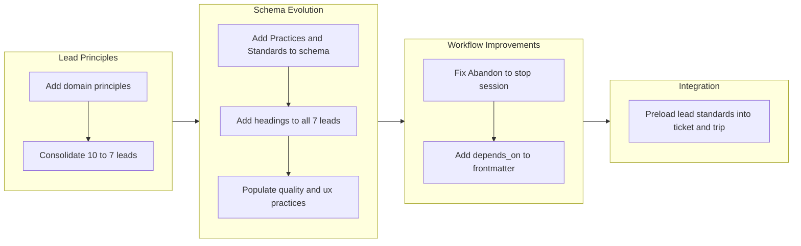

## 1. Overview

This branch matured the lead skill architecture from flat policy lists into a structured four-tier knowledge framework (Role, Policies, Practices, Standards), consolidated 10 lead domains down to 7 by merging overlapping concerns, fixed a UX violation in the drive command's abandonment flow, and added dependency tracking to the ticket frontmatter schema for ordered execution of split tickets. The work originated as a trip-mode exploration of lead skill content -- populating domain-specific principles across security, database, infrastructure, and recovery leads -- then transitioned into ticket-driven structural improvements.

**Highlights:**

1. Introduced a four-tier lead skill structure (Role, Policies, Practices, Standards) with schema enforcement, validation, and example content
2. Consolidated 10 leads into 7 by merging infra+recovery into reliability and a11y into ux
3. Added `depends_on` frontmatter field for topological sorting of split ticket execution order

## 2. Motivation

The lead skills had been reset to empty Policies sections in the previous branch, leaving them as structural shells awaiting domain-specific content. A trip-mode exploration began populating these policies with concrete principles -- ISMS and defense-in-depth for security, persistence guarantees for database, capacity planning for infrastructure, recovery time objectives for recovery. As domain content grew, two structural problems emerged: several leads had substantial overlap (infrastructure and recovery both addressed system resilience; accessibility was a subset of user experience), and the flat Policies section could not distinguish between abstract principles and concrete, measurable criteria. The developer consolidated overlapping leads to eliminate redundancy, then introduced a tiered structure so that each domain could progressively refine its knowledge from high-level principles through actionable practices to pass/fail standards. Separately, two workflow gaps were addressed: the drive command's "Abandon" option silently continued to the next ticket (violating the user-consent principle established across multiple prior branches), and split tickets lacked dependency metadata, forcing the drive-navigator to guess execution order.

## 3. Changes

The branch progressed through four phases: trip-mode exploration populated domain-specific principles across four lead skills, then a consolidation reduced overlapping domains from 10 to 7 leads. The schema was extended with Practices and Standards tiers, applied across all leads, and populated in quality and ux domains. Two workflow improvements fixed the drive abandonment flow and added dependency tracking to tickets. A final integration commit wired lead standards into the ticket and trip workflows.

### 3-1. Add ISMS and defense-in-depth principles to security lead skill ([58d7a7a](https://github.com/qmu/workaholic/commit/58d7a7a))

Added information security management system (ISMS) principles and defense-in-depth policy content to the security lead skill, establishing the first populated domain-specific policies after the policy reset.

### 3-2. Add persistence principles to db lead skill ([1029b3c](https://github.com/qmu/workaholic/commit/1029b3c))

Populated the database lead skill with persistence guarantee principles covering data durability, consistency models, and backup/recovery policies.

### 3-3. Add infrastructure principles to infra lead skill ([cb47bc7](https://github.com/qmu/workaholic/commit/cb47bc7))

Added capacity planning, scaling, and infrastructure-as-code principles to the infrastructure lead skill.

### 3-4. Add recovery principles to recovery lead skill ([ab7365c](https://github.com/qmu/workaholic/commit/ab7365c))

Populated the recovery lead skill with recovery time objective (RTO), recovery point objective (RPO), and incident response principles.

### 3-5. Consolidate leads: merge infra+recovery into reliability, a11y into ux ([13c74ad](https://github.com/qmu/workaholic/commit/13c74ad))

Merged the infrastructure and recovery leads into a single reliability lead, and merged the accessibility lead into the ux lead. Removed the now-redundant lead-infra, lead-recovery, lead-a11y, and lead-test skill files. Updated the lead agent, all three manager skills, and the scan agent selection logic to reference the consolidated 7-domain set.

### 3-6. Fix drive "Abandon" behavior to stop session instead of silently continuing ([5275688](https://github.com/qmu/workaholic/commit/5275688))

Changed the drive command's "Abandon" option to stop the session and return to the completion summary, rather than silently continuing to the next ticket. Updated both the drive skill option description and the drive command's abandon handler to break the loop and go to Phase 4, aligning with the user-consent principle.

### 3-7. Add Practices and Standards sections to lead schema ([578c566](https://github.com/qmu/workaholic/commit/578c566))

Extended the define-lead schema in `.claude/rules/define-lead.md` with Practices and Standards as optional tiers below Policies, creating a four-tier structure from abstract to concrete. Added guidelines, validation checklist items, and a worked example in the testing-lead template. Updated the lead count from 10 to 7.

### 3-8. Add Practices and Standards headings to all 7 lead skills ([5f9e0e0](https://github.com/qmu/workaholic/commit/5f9e0e0))

Added empty `## Practices` and `## Standards` section headings to all 7 lead skills (db, delivery, observability, quality, reliability, security, ux), establishing the structural scaffolding for progressive content population.

### 3-9. Add depends_on field to ticket frontmatter for dependency tracking ([bf57f48](https://github.com/qmu/workaholic/commit/bf57f48))

Added `depends_on` as an optional YAML list field to the ticket frontmatter schema. Updated the ticket-organizer to populate dependencies when splitting, the drive-navigator to perform topological sorting, the validation hook to check filename patterns, and the update script to handle the new field.

### 3-10. Add practices to quality and ux lead skills ([38e759f](https://github.com/qmu/workaholic/commit/38e759f))

Populated the quality lead with practices for AI e2e testability, test isolation, and coverage tracking. Populated the ux lead with practices for progressive disclosure, error recovery, and user-consent workflows.

### 3-11. Add AI e2e testability policy and preload lead standards into ticket and trip workflows ([c303615](https://github.com/qmu/workaholic/commit/c303615))

Added an AI e2e testability policy to the quality lead and a contrast/motion sensitivity standard to the ux lead. Preloaded lead skills (quality, ux, security, reliability) into the architect, constructor, planner, and ticket-organizer agents so that implementation work is informed by domain standards. Updated CLAUDE.md design principle description.

## 4. Outcome

The lead skill architecture evolved from a flat, mostly-empty structure into a tiered knowledge framework capable of expressing domain expertise at multiple levels of specificity. The consolidation from 10 to 7 leads eliminated redundancy between overlapping domains while preserving all content through merges rather than deletions. The four-tier structure (Role, Policies, Practices, Standards) provides a clear progression path for each domain: abstract principles are refined into actionable practices, which are then codified as measurable pass/fail criteria. Two domains (quality and ux) now have populated practices sections demonstrating this progression. The drive command's abandonment flow was corrected to respect the user-consent principle established across multiple prior iterations. The `depends_on` frontmatter field enables the drive-navigator to execute split tickets in the correct dependency order through topological sorting rather than guessing based on type priority alone.

## 5. Historical Analysis

The lead architecture has undergone several structural evolutions traced through the ticket history. The original define-lead skill (20260209160336) established the schema template, which was moved to `.claude/rules/` for path-scoped enforcement (20260209181813). The Role/Goal/Responsibility heading hierarchy was restructured (20260219165413), and Default Policies were renamed to Policies with content reset (20260404002424). This branch extends that trajectory with the most significant structural addition since the schema's creation -- two new tiers that formalize the distinction between principles, practices, and standards.

The lead consolidation follows a trajectory established by the previous branch's agent consolidation (20260406182846), which merged 10 individual lead agents into a single parameterized agent. This branch applies the same consolidation principle to the skill layer, reducing 10 domain skills to 7 by merging those with substantial overlap.

The drive abandonment fix continues a long pattern of refinements to the approval flow, with five related tickets spanning branches from drive-20260131 through drive-20260302, all reinforcing the principle that the drive command should never autonomously continue without user consent.

The `depends_on` field extends the ticket frontmatter schema that has been incrementally built since the original YAML frontmatter ticket (20260124210721), through validation hook enforcement (20260129041924), and intelligent drive prioritization (20260131125946).

## 6. Concerns

- The lead consolidation removed four skill files (lead-infra, lead-recovery, lead-a11y, lead-test) and their content was merged into reliability and ux leads; any external references to the removed skill names will need updating (see [13c74ad](https://github.com/qmu/workaholic/commit/13c74ad) in `plugins/standards/skills/`)
- The `depends_on` validation hook warns but does not block on missing referenced tickets, since during a split operation the dependent ticket may be validated before the prerequisite is written; this means invalid references could persist undetected (see [bf57f48](https://github.com/qmu/workaholic/commit/bf57f48) in `plugins/work/hooks/validate-ticket.sh`)
- Topological sort in the drive-navigator is described in prose rather than extracted to a shell script; if the sorting logic grows more complex, it should be extracted to follow the shell script principle (see [bf57f48](https://github.com/qmu/workaholic/commit/bf57f48) in `plugins/work/agents/drive-navigator.md`)
- The modified `plugins/standards/skills/lead-ux/SKILL.md` shows as modified in working tree at branch snapshot time, though it appears committed in the final state

## 7. Ideas

- Populate Practices and Standards sections for the remaining 5 lead domains (db, delivery, observability, reliability, security) following the quality and ux pattern
- Consider extending the four-tier structure to the manager schema (`define-manager.md`) if it proves effective for leads
- Add automated validation that `depends_on` references resolve to existing tickets when all tickets in a batch have been written
- Consider extracting the drive-navigator's topological sort logic to a shell script as complexity grows

## 8. Successful Development Patterns

- Starting with trip-mode exploration to populate lead policies before attempting structural changes allowed the developer to understand real content needs before designing the tier system -- the four-tier structure emerged from observing that populated policies naturally fell into distinct levels of specificity
- Consolidating overlapping leads after populating their content (rather than before) ensured no domain knowledge was lost -- the infra and recovery content visibly overlapped on resilience concerns, making the merge justification concrete rather than theoretical
- Introducing the Practices and Standards tiers as optional sections avoided forcing immediate updates to all 7 leads, allowing progressive population while keeping existing leads valid under the extended schema
- Fixing the Abandon flow and adding `depends_on` as ticket-driven work after the trip exploration created a natural transition from exploratory content work to structured workflow improvements, demonstrating effective hybrid mode usage

## 9. Release Preparation

**Verdict**: Ready for release

### 9-1. Concerns

- None - changes are configuration-only plugin content (lead skills, schema rules, frontmatter definitions) and instruction updates (drive command, agent preloads) with no runtime impact beyond the intended improvements

### 9-2. Pre-release Instructions

- None - standard release process applies

### 9-3. Post-release Instructions

- None - no special post-release actions needed

## 10. Notes

This branch represents a trip-originated development cycle that evolved into hybrid ticket-driven work. The trip exploration populated lead domain content and discovered structural improvements, which were then formalized as tickets for the schema extension, drive fix, and dependency tracking features. The four-tier lead structure (Role, Policies, Practices, Standards) establishes a knowledge management framework where each domain can progressively refine its expertise from abstract principles to measurable criteria, following an "each tier traces to the one above" traceability chain.
