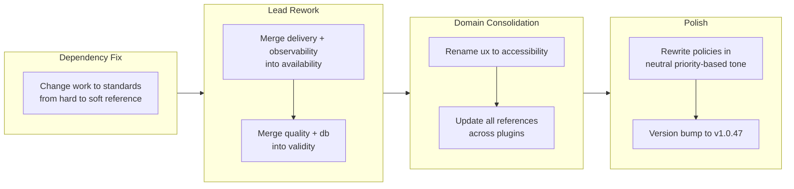

## 1. Overview

This branch consolidates the lead domain architecture from 7 domains to 4 by merging overlapping concerns into broader, more coherent domains: lead-quality and lead-db became lead-validity (centered on logical comprehensiveness), lead-delivery and lead-observability merged into lead-reliability (renamed to lead-availability with CI/CD and observability policies), and lead-ux was renamed to lead-accessibility. All policies were rewritten in a neutral, priority-based tone that states the trade-off each policy accepts, and the work plugin's dependency on standards was downgraded from a hard requirement to a soft reference.

**Highlights:**

1. Consolidated 7 lead domains into 4 (validity, availability, security, accessibility) by merging overlapping concerns while preserving all policy content
2. Introduced a logical-comprehensiveness preamble to lead-validity, redefining quality as static predictability -- cases defined before the program runs
3. Rewrote all policies in a neutral, priority-based tone that explicitly states the trade-off each policy accepts

## 2. Motivation

The previous branch had consolidated 10 lead domains to 7 and introduced a four-tier structure (Role, Policies, Practices, Standards). After living with the 7-domain set, further overlap became apparent: the quality lead's testing and type-safety concerns were inseparable from the db lead's persistence and domain-model policies, since both addressed the same underlying question of logical correctness. Similarly, the delivery lead (CI/CD pipelines) and observability lead (logging, metrics, tracing) both served the availability concern -- a system that cannot be deployed or monitored is effectively unavailable. The ux lead's policies had already absorbed accessibility in the previous consolidation, making the "ux" name misleading when the domain's practices and standards focused on WCAG compliance, tool-first interaction design, and modeless UI. Separately, the policy writing style was inconsistent -- some policies read as imperatives ("Security is not a feature added after the fact"), others as descriptions. A uniform tone was needed so that each policy could be evaluated on its priority ordering and explicit trade-offs rather than its rhetorical force. Finally, the work plugin declared a hard dependency on standards despite only using it for skill preloads and subagent invocations, which are soft references that degrade gracefully when the standards plugin is absent.

## 3. Changes

The branch progressed through four phases: a dependency correction changed the work-to-standards relationship from hard to soft, then two rounds of lead merging combined overlapping domains, followed by a reference update pass across all consuming agents and scripts, and finally a version bump.

### 3-1. Change work-to-standards dependency from hard to soft reference ([70256c5](https://github.com/qmu/workaholic/commit/70256c5))

Updated the work plugin's `plugin.json` to remove standards from the `dependencies` array, reflecting that all cross-plugin references from work to standards are soft references (skill preloads, subagent invocations) that degrade gracefully when the standards plugin is not installed. Updated CLAUDE.md's dependency diagram and documentation to describe the soft reference pattern.

### 3-2. Rework lead skills: merge delivery into reliability, refocus quality around logical comprehensiveness ([4e5ef76](https://github.com/qmu/workaholic/commit/4e5ef76))

Merged lead-delivery (CI/CD pipelines) and lead-observability (logging, metrics, tracing) into lead-reliability, adding CI/CD Automation First and Observable by Design policies. Merged lead-db (persistence strategies) into lead-quality, adding Relational-First Persistence, Domain-Persistence Segregation, and Event Sourcing as Ready Option policies alongside new TDD (Type-Driven Design) and Functional Programming Style policies with Pure/Impure Layer Segregation. Added a logical-comprehensiveness preamble to lead-quality defining quality as the property that every case the application can encounter is represented in the types and handled explicitly.

### 3-3. Consolidate 7 lead domains to 4: validity, availability, security, accessibility ([10b1249](https://github.com/qmu/workaholic/commit/10b1249))

Renamed lead-quality to lead-validity and lead-reliability to lead-availability, renamed lead-ux to lead-accessibility, deleted the now-empty lead-db, lead-delivery, lead-observability, lead-quality, lead-reliability, and lead-ux skill files. Updated all references across the lead agent, scan agent selection skill and script, manager skills (architecture, project, quality), work plugin agents (architect, constructor, planner, ticket-organizer), drive skill, scan command, and define-lead rule. Rewrote all policy sections in the remaining 4 leads using a neutral, priority-based tone that names the trade-off each policy accepts. Regenerated Goal and Responsibility sections following the lead schema.

### 3-4. Bump version to v1.0.47 ([67d0487](https://github.com/qmu/workaholic/commit/67d0487))

Incremented the patch version across all four version files (marketplace.json, core plugin.json, standards plugin.json, work plugin.json).

## 4. Outcome

The lead domain architecture was reduced from 7 domains to 4, each with a clearly bounded concern: validity (logical correctness, type safety, persistence strategy, testing), availability (CI/CD, infrastructure, observability, recovery), security (threat modeling, ISMS, defense in depth), and accessibility (UX design, WCAG compliance, interaction patterns). The consolidation eliminated three skill files whose content was fully absorbed into the surviving domains -- no policy content was lost. All 28 files that referenced the old domain names were updated, including the lead agent, scan selection logic, three manager skills, four work agents, the drive skill, the scan command, the define-lead rule, and CLAUDE.md. The policy rewrite established a consistent voice across all four domains: each policy states what is prioritized, what it is prioritized over, and what trade-off is accepted. The work plugin's dependency on standards was correctly reclassified as soft, matching the runtime behavior where work functions independently when standards is absent.

## 5. Historical Analysis

The lead domain consolidation continues a trajectory that has been reducing redundancy across successive branches. The previous branch (work-20260408-001129) consolidated 10 leads to 7 by merging infra+recovery into reliability and a11y into ux, and introduced the four-tier structure (Role, Policies, Practices, Standards). Before that, branch work-20260406-193458 performed housekeeping including a directory rename and skill removal. The original 10-domain lead set was created in drive-20260208-131649, which migrated 10 analyst subagents into domain-specific leads. The single parameterized lead agent that replaced individual per-domain agents was introduced in work-20260406-193458. This branch takes the consolidation to its logical conclusion: four domains where each represents a genuinely distinct concern rather than a historical artifact of the original analyst-per-domain structure.

The soft dependency pattern formalized in this branch resolves a tension that emerged when the plugin architecture was reorganized in drive-20260329-173608. That branch established the three-plugin structure (core, standards, work) with explicit dependency declarations, but the work-to-standards dependency was declared as hard even though the references were skill preloads that degrade gracefully -- a distinction now correctly captured in the dependency diagram.

## 6. Concerns

- Six lead skill files were deleted (lead-db, lead-delivery, lead-observability, lead-quality, lead-reliability, lead-ux); any external tooling or documentation referencing these filenames by path will need updating (see [10b1249](https://github.com/qmu/workaholic/commit/10b1249) in `plugins/standards/skills/`)
- The scan command's policy validation list was updated to remove `observability.md` and `delivery.md` but still references `recovery.md` which was removed in a previous branch -- this may cause validation warnings (see [10b1249](https://github.com/qmu/workaholic/commit/10b1249) in `plugins/core/commands/scan.md`)
- The viewpoint/policy domain classification in the lead agent changed from 2 viewpoint + 5 policy domains to 1 viewpoint + 3 policy domains; accessibility is now the sole viewpoint domain, which reduces the analyze-viewpoint pathway's coverage (see [10b1249](https://github.com/qmu/workaholic/commit/10b1249) in `plugins/standards/agents/lead.md`)

## 7. Ideas

- Consider whether the viewpoint/policy distinction still warrants two separate analysis frameworks now that only one domain (accessibility) uses the viewpoint path -- merging or simplifying the analysis skills could reduce complexity
- The logical-comprehensiveness preamble in lead-validity could serve as a template for similar preambles in the other three domains, establishing a consistent "what this domain is and how it assures its concern" framing
- The priority-based policy tone ("prioritizing X over Y, the trade-off is Z") could be codified as a policy writing guideline in the define-lead schema to ensure future policies follow the same pattern

## 8. Successful Development Patterns

- Performing the dependency fix (hard to soft) as a separate first commit before the domain consolidation kept the two concerns cleanly separated -- the dependency semantics change is independently reviewable and revertible
- Merging domain content before renaming (quality absorbs db policies, then quality becomes validity) avoided a two-step rename-then-merge that would have created intermediate states with misleading names
- Rewriting all policies in the same commit as the domain rename ensured reviewers see the final form of each policy in context rather than needing to mentally compose a rename diff with a separate style diff
- The priority-based policy tone ("prioritizing X over Y") emerged as a natural way to make trade-offs explicit without being prescriptive -- each policy acknowledges what it costs, which makes the design choices debatable rather than dogmatic

## 9. Release Preparation

**Verdict**: Ready for release

### 9-1. Concerns

- None -- changes are configuration-only plugin content (lead skills, schema rules, agent preloads, scan selection) and documentation updates with no runtime impact beyond the intended domain consolidation

### 9-2. Pre-release Instructions

- None -- standard release process applies

### 9-3. Post-release Instructions

- None -- no special post-release actions needed

## 10. Notes

This branch completes the lead domain consolidation arc that began with 10 domains in drive-20260208-131649, was reduced to 7 in work-20260408-001129, and now reaches 4. The four surviving domains -- validity, availability, security, accessibility -- represent genuinely orthogonal concerns: logical correctness, operational readiness, threat management, and user experience. The naming shift from "quality" to "validity" and from "reliability" to "availability" reflects a deliberate choice to name each domain after the property it assures rather than the activity it performs. The logical-comprehensiveness preamble in lead-validity is the first lead to define its domain concept before listing policies, establishing a pattern where the domain's identity is grounded in a specific definition rather than implied by a collection of rules.
