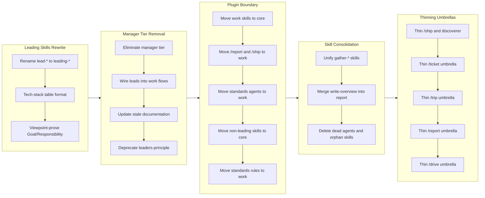

## 1. Overview

This branch carried out a deep restructuring of the workaholic plugin marketplace by eliminating the manager tier from the standards plugin, redrawing the core/work plugin boundary so that core became a pure reusable-skill library while work retained code-aware orchestration, and thinning every work-side command and subagent into a frontmatter-plus-stub alias whose body content lives in its corresponding core skill. Along the way the four `leading-*` skills were rewritten in a humble, trade-off-acknowledging tone, dead agents and orphan skills were deleted, and several skill pairs were merged into single cohesive units. The end state is a sharply tiered architecture: standards holds only four self-contained policy skills, core hosts the knowledge layer, and work contains only thin orchestration that delegates to skills.

**Highlights:**

1. Eliminated the manager tier from the standards plugin and wired the four `leading-*` skills directly into work plugin flows as the project's primary policy lens
2. Redrew the core/work boundary: all reusable skills moved into core, all code-aware commands and agents moved into work, and standards reduced to four `leading-*` skills plus a manifest
3. Thinned six work-side umbrellas (drive, report, trip, ticket, ship, discover) so each command and agent becomes a frontmatter-plus-stub alias of its core skill
4. Merged adjacent skills into cohesive units (gather-git-context + gather-ticket-metadata into gather; write-overview into report) and deleted five dead agents with six orphan skills
5. Rewrote all four leading skills (renamed from `lead-*` to `leading-*`) with a viewpoint-prose Goal/Responsibility format, a tech-stack table for Standards, and policy text that names the trade-off each policy accepts

## 2. Motivation

The branch began from two structural observations about the existing architecture. First, the manager tier in the standards plugin — three `manage-*` skills, three `*-manager` agents, the `managers-principle`, the `/scan` command, and the `.workaholic/constraints/<scope>.md` artifact format — had never paid off in practice: the constraint files were not consulted by the rest of the workflow, the scan command was unused, and the indirection made leading skills harder to read. The leads were already deriving their viewpoint directly from the codebase in trip and ticket flows, so the manager layer added cost without benefit. Second, the core/work plugin boundary had drifted: code-aware commands like `/report` and `/ship` lived in core while reusable skills lived in work, contradicting the intended identity of core as a code-agnostic library. As the restructuring proceeded, a third motivation emerged: work-side agents and commands had accumulated procedural content (workflow steps, AskUserQuestion text, subagent dispatch lists) that duplicated the skill they preloaded, blocking the goal of a Codex-spec-compatible "thin agents and commands as aliases of skills" model. Each thinning ticket moved orchestration prose verbatim into the skill so that runtime behavior was preserved exactly while the surface area of agents and commands shrank to I/O contracts and pointers.

## 3. Changes

The branch progressed through five phases: it opened with a rewrite of the leading skills themselves into a humble viewpoint-prose format, then removed the manager tier and wired the leads directly into the work flows, then redrew the core/work plugin boundary by moving each component to the plugin whose identity matched its dependencies, then consolidated overlapping skills and deleted dead components, and finally thinned every work-side umbrella so that commands and agents became aliases of their core skill while skills carried all procedural content.

### 3-1. Rename lead-* to leading-*, rewrite policies with humble trade-off-acknowledging tone ([86a048c](https://github.com/qmu/workaholic/commit/86a048c))

Renamed the lead policy skills from `lead-*` to `leading-*` and rewrote each policy section in a humble tone that explicitly names the trade-off the policy accepts rather than asserting it as an unconditional imperative. The renaming reflected that these skills express *how to lead* on a concern rather than naming a leader role.

### 3-2. Change Standards section format from H3 paragraphs to tech stack table ([ba4e921](https://github.com/qmu/workaholic/commit/ba4e921))

Converted the Standards section of each leading skill from H3 prose paragraphs into a compact tech-stack table so that downstream readers can scan recommended tools at a glance instead of parsing prose.

### 3-3. Rewrite lead Goal/Responsibility as viewpoint prose ([59bc024](https://github.com/qmu/workaholic/commit/59bc024))

Replaced the imperative bullet-style Goal and Responsibility sections in each leading skill with viewpoint-prose paragraphs that describe how a lead in that domain sees the work. The change reinforced that leads contribute a perspective rather than enforce a checklist.

### 3-4. Eliminate manager tier from standards plugin ([174b988](https://github.com/qmu/workaholic/commit/174b988))

Removed the entire manager tier from the standards plugin: three `manage-*` skills, three `*-manager` agents, the `managers-principle` skill, the `define-manager` rule, the `/scan` command, the `select-scan-agents` skill, and the `.workaholic/constraints/` artifact directory. Tightened leading-skill Role wording from "analyzes" to "derives its viewpoint directly from" so leads no longer reference deleted manager outputs.

### 3-5. Wire leading skills into work plugin flows ([ecac660](https://github.com/qmu/workaholic/commit/ecac660))

Added the four leading-skill preloads to the `/drive` command and the drive skill so the implementation phase respects the leads' policies, added a Lead Lens table to the create-ticket skill, updated the discover skill's Policy section to reference leading skills explicitly, and tightened ticket-organizer wording. Confirmed the trip stack (planner/architect/constructor) already preloads all four leads.

### 3-6. Update stale documentation after manager tier removal ([78278c2](https://github.com/qmu/workaholic/commit/78278c2))

Swept `CLAUDE.md`, `plugins/core/README.md`, and all 10 spec files in `.workaholic/specs/` to remove `/scan` references and stale skills/agents listings — roughly 89 edits trimming 636 lines total. Final verification grep produced zero stale references across the swept set.

### 3-7. Deprecate leaders-principle; merge Vendor Neutrality and Ubiquitous Language into leads ([f6869f2](https://github.com/qmu/workaholic/commit/f6869f2))

Retired the cross-cutting `leaders-principle` skill and redistributed its content: Vendor Neutrality folded into each leading skill's Standards section as a tool-selection rationale, and Ubiquitous Language folded into the leading skill whose domain owns the term.

### 3-8. Move work skills to core ([6229f42](https://github.com/qmu/workaholic/commit/6229f42))

Relocated every skill under `plugins/work/skills/` into `plugins/core/skills/` so that core becomes the home of reusable agentic skills (the knowledge layer) while work retains only code-dependent components (agents, commands, hooks, rules). Rewrote every `${CLAUDE_PLUGIN_ROOT}` path and frontmatter `skills:` reference affected by the move.

### 3-9. Move /report and /ship commands from core to work ([ead532c](https://github.com/qmu/workaholic/commit/ead532c))

Relocated `/report` and `/ship` from `plugins/core/commands/` into `plugins/work/commands/` because both commands are code-aware orchestration that detects drive/trip context and invokes work-specific subagents. After the move, core's command directory is empty and core stops needing the soft reference to work.

### 3-10. Move standards agents to work plugin ([0a7d28e](https://github.com/qmu/workaholic/commit/0a7d28e))

Relocated all eight agents under `plugins/standards/agents/` into `plugins/work/agents/`. All eight (`changelog-writer`, `lead`, `model-analyst`, `overview-writer`, `performance-analyst`, `release-note-writer`, `section-reviewer`, `terms-writer`) are workflow orchestration; under the consolidated boundary, agents belong in work while standards reduces to a pure policy plugin.

### 3-11. Move non-leading standards skills to core ([8902077](https://github.com/qmu/workaholic/commit/8902077))

Relocated ten non-leading skill directories from `plugins/standards/skills/` into `plugins/core/skills/`: `analyze-performance`, `analyze-policy`, `analyze-viewpoint`, `review-sections`, `validate-writer-output`, `write-changelog`, `write-overview`, `write-release-note`, `write-spec`, `write-terms`. After this move, standards' skills directory contains only the four `leading-*` skills.

### 3-12. Move standards rules to work ([36b0835](https://github.com/qmu/workaholic/commit/36b0835))

Moved three path-scoped rule files (`diagrams.md`, `shell.md`, `typescript.md`) from `plugins/standards/rules/` into `plugins/work/rules/`, leaving `plugins/standards/` with exactly `.claude-plugin/plugin.json` plus four `leading-*` skill directories — the most minimal substantive plugin identity.

### 3-13. Unify gather-* skills into single gather skill ([b798b44](https://github.com/qmu/workaholic/commit/b798b44))

Collapsed `gather-git-context` and `gather-ticket-metadata` into a single `core:gather` skill containing both scripts. Scripts were renamed from `gather.sh` to operation-named files (`git-context.sh`, `ticket-metadata.sh`) since the verb is the skill identity and the noun is the script identity.

### 3-14. Merge write-overview into report skill ([feb977c](https://github.com/qmu/workaholic/commit/feb977c))

Absorbed `write-overview/SKILL.md` into `report/SKILL.md` as an Overview Generation section and relocated `collect-commits.sh` into `report/scripts/`. Since `overview-writer` is invoked exactly once by `story-writer` during `/report`, keeping `write-overview` as a separate skill duplicated load surface for a single consumer.

### 3-15. Delete dead agents and orphan skills ([d4352d5](https://github.com/qmu/workaholic/commit/d4352d5))

Removed five subagents with zero callers (`changelog-writer`, `lead`, `model-analyst`, `terms-writer`, `performance-analyst`) and six skills preloaded exclusively by those dead agents (`write-changelog`, `write-spec`, `write-terms`, `analyze-performance`, `analyze-policy`, `analyze-viewpoint`). End-state counts: `plugins/core/skills/` 22 -> 14, `plugins/work/agents/` 17 -> 12.

### 3-16. Thin /ship into core:ship; verify discoverer already thin ([9e779ee](https://github.com/qmu/workaholic/commit/9e779ee))

Reduced `/ship` from 79 to 14 lines by absorbing four workflow sections into `core:ship` as new sections 3-6 with all 10 unique script paths rewritten to same-plugin form and all 7 AskUserQuestion option strings preserved verbatim. Confirmed `discoverer.md` was already thin at 30 lines.

### 3-17. Thin ticket-organizer + /ticket into core:create-ticket ([d819637](https://github.com/qmu/workaholic/commit/d819637))

Shrunk `ticket-organizer.md` from 144 to 29 lines and `/ticket` from 68 to 48 lines. Added Workflow (six numbered steps) and Output Contract (four JSON shapes) sections to `create-ticket/SKILL.md`. Relocated the four `standards:leading-*` soft preloads from agent frontmatter to skill frontmatter.

### 3-18. Thin trip umbrella (planner/architect/constructor + /trip) into core:trip-protocol ([58527ed](https://github.com/qmu/workaholic/commit/58527ed))

Thinned planner, architect, constructor, and `/trip` to about 20 lines each (planner 40->20, architect 40->20, constructor 42->21, /trip 100->16). The three role agents ended up byte-for-byte parallel — frontmatter plus a six-line body referring to skill sections plus the I/O contract.

### 3-19. Thin report umbrella (6 agents + /report) into core:report ([d2ca15e](https://github.com/qmu/workaholic/commit/d2ca15e))

Thinned six work-side report agents and the `/report` command to ~22-32 lines each. Final counts: story-writer 22, pr-creator 22, release-readiness 32, overview-writer 25, section-reviewer 23, release-note-writer 22, /report 12. Lifted shared preloads (`core:trip-protocol`, `core:branching`, `core:gather`) onto `core:report` itself so thinned consumers inherit them transitively.

### 3-20. Thin drive umbrella (drive-navigator + /drive) into core:drive ([a0949ae](https://github.com/qmu/workaholic/commit/a0949ae))

Migrated ~280 lines of work-side procedural content from `drive-navigator.md` (128 lines) and `/drive` (151 lines) into `core:drive` (which grew to 666 lines). End-state: drive-navigator 21 lines, /drive 12 lines. The `standards:leading-*` preloads moved onto `core:drive` itself so the leading skills load transitively from a single source of truth.

## 4. Outcome

The branch produced a sharply tiered marketplace architecture with a clear identity for each plugin. Standards contains exactly four self-contained policy skills (`leading-accessibility`, `leading-availability`, `leading-security`, `leading-validity`) plus a manifest — zero outgoing dependencies, the most minimal substantive plugin shape achievable. Core has become a pure reusable-skill library containing 14 skills (workflow, analysis, writing, review, validation) and zero commands. Work contains all code-aware orchestration: 12 agents, 5 commands, hooks, and the relocated rules. Each work-side command and subagent is now a frontmatter-plus-stub alias of its core skill, achieving the Codex-spec-compatible thin-orchestration model the user requested. Runtime behavior was preserved exactly across every thinning ticket — every script invocation, every AskUserQuestion prompt, every parallel `Task` launch still happens with the same arguments in the same order.

## 5. Historical Analysis

The branch built on patterns established in earlier consolidation work. The previous branch (`work-20260415-163724`) had reduced 7 lead domains to 4 (validity, availability, security, accessibility) and downgraded the work-to-standards dependency from hard to soft; this branch took the next logical step by removing the manager tier that those leads had nominally consumed and replacing the indirection with direct preloads of `leading-*` skills into work-flow surfaces. The plugin boundary redrawing extended the `core` versus `work` separation that had been gradually emerging since the `drivin`/`trippin` plugins were unified into `work` and the marketplace was reorganized into three plugins. The thinning playbook crystallized a convention already visible in earlier skills (`branching`, `ship`) where the skill is named with a noun phrase and scripts inside `scripts/` are named per operation — this branch generalized that into the explicit "thin agent/command as alias of skill" model that now applies uniformly across drive, trip, report, ticket, and ship umbrellas.

## 6. Concerns

- The drive skill still contains short inline `ls -1` and `mv ... && git add ...` invocations migrated verbatim from the navigator that predate the Shell Script Principle (see [a0949ae](https://github.com/qmu/workaholic/commit/a0949ae) in `plugins/core/skills/drive/SKILL.md`)
- Several spec files under `.workaholic/specs/` still reference legacy plugin names (`drivin`, `trippin`, `scanner subagent`) that were outside the prohibited-term grep for the documentation sweep (see [78278c2](https://github.com/qmu/workaholic/commit/78278c2) in `.workaholic/specs/`)
- `.workaholic/specs/stakeholder.md` is owned by `analyze-viewpoint` but has no agent that calls it now that `/scan` is retired; it must be treated as hand-maintained (see [174b988](https://github.com/qmu/workaholic/commit/174b988) in `.workaholic/specs/stakeholder.md`)
- Ticket frontmatter `commit_hash` values across this branch do not match the live branch hashes because of intermediate rebasing/squashing; downstream tooling that joins ticket-frontmatter hashes to git-log entries would need to fall back to subject matching (see ticket files in `.workaholic/tickets/archive/work-20260417-092936/`)

## 7. Ideas

- Lift the emergent naming convention (skill = noun-phrase concept; scripts = operation-named) into an explicit Architecture Policy bullet in `CLAUDE.md` so future skill authors discover it without spelunking
- Consider parameterizing the three byte-for-byte-parallel trip role agents (planner/architect/constructor) into a single agent declaration that the skill instantiates per role, once Codex-spec format supports it
- Extract the inline shell invocations remaining in `core:drive` into dedicated navigator scripts to bring drive into full compliance with the Shell Script Principle
- Add a lint or doc rule that forbids commands in `plugins/core/commands/` so the empty-by-design state of core's command surface is enforced rather than conventional
- Run a follow-up naming-modernization sweep of `.workaholic/specs/` to replace `drivin`/`trippin`/`scanner` mentions with current taxonomy
- Prefer globbing over enumerating specific files in `.claude/rules/*` `paths:` frontmatter so path-scope rules survive future agent/command restructuring without leaving stale references

## 8. Successful Development Patterns

- Distinguishing three content categories during a thinning migration — orchestration steps move to the skill, I/O contract stays on the agent, negative invariants ("never do X") stay on the agent — produced reliably correct thinning results across six umbrellas without changing runtime behavior
- Lifting shared preloads (`core:trip-protocol`, `core:branching`, `core:gather`) onto the umbrella skill itself rather than each thinned consumer eliminated N*K duplication of preload entries and gave the leads a single source of truth
- Running a verification grep after every plugin-boundary move ("zero `../core/` paths inside the target skill", "zero `standards:` Task calls in work", "zero stale skill names in CLAUDE.md") caught every mechanical hazard mechanically — no plugin-boundary move required behavioral debugging
- Always prefixing cross-plugin `Task` invocations with the plugin name (e.g. `standards:section-reviewer` rather than bare `section-reviewer`) made the agent-relocation migrations character-for-character mechanical because a single grep found every call site
- Naming scripts inside a skill after their domain rather than the skill verb (`git-context.sh`, `ticket-metadata.sh` rather than `gather.sh`) reads better both at the preload site (skill name is the verb) and the call site (script name is the noun)
- Computing the full preload graph before deleting dead agents — and only removing skills in the difference between dead-agent preloads and live-agent preloads — prevented orphaning live consumers (e.g. `core:gather` survived even though one of its preloaders, `performance-analyst`, was deleted)
- Path-scope rules with `paths:` glob frontmatter relocated across plugins with near-zero cost (three `git mv` operations plus one documentation line) because they have no name-based callers; preferring path-scope rules over skill preloads for project-wide conventions reduces future relocation cost
- Promoting the policy preloads (`standards:leading-*`) onto the umbrella skill itself rather than the thin command/agent surfaced a clean dependency rule: core may soft-depend on standards via skill preloads, and the leads load transitively into every thinned consumer

## 9. Release Preparation

**Verdict**: Ready for release

### 9-1. Concerns

- None - changes are safe for release. The branch is a refactoring with no runtime behavior changes; every script invocation, every prompt, and every parallel `Task` launch still happens with the same arguments in the same order. Version bump to v1.0.48 is already on the branch (commit 25e8b73).

### 9-2. Pre-release Instructions

- None - standard release process applies.

### 9-3. Post-release Instructions

- After release, monitor the first end-to-end runs of `/drive`, `/report`, `/trip`, `/ticket`, and `/ship` to confirm the thinned umbrellas behave identically to the pre-thinning surface. Each thinning ticket preserved behavior by construction, but a real-session smoke test across all five umbrellas is the cheapest end-to-end confirmation.

## 10. Notes

This branch was developed in trip mode (multi-agent planner/architect/constructor sessions). The 16 archived tickets span roughly four weeks of structural work (April 17 through May 14, 2026) and produced 27 commits including one version bump. Ticket frontmatter `commit_hash` values reflect intermediate hashes from rebased history and may not match the final landed hashes — the section 3 links above use the actual hashes on the current branch.
