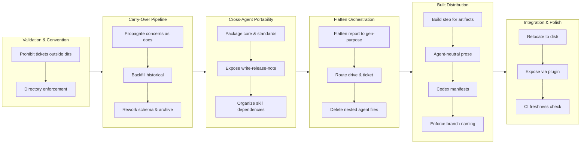

## 1. Overview

This branch restructured the Workaholic plugin architecture to establish a cross-agent distribution model with portable skills and flattened orchestration. The work decoupled Claude-Code-specific patterns from portable workflow knowledge, externalized carry-over tracking, enforced directory conventions, and built CI-guarded infrastructure for committing generated artifacts alongside source-controlled plugins.

**Highlights:**

1. Established cross-agent skill portability for the `core` and `standards` plugins via the Agent Skills standard (`npx skills add qmu/workaholic`)
2. Flattened `report`, `drive`, and `ticket` orchestration from nested subagent chains to direct fan-out from commands to `general-purpose` subagents, deleting the per-workflow agent files
3. Introduced a carry-over concerns pipeline that propagates branch insights across PR boundaries as first-class institutional memory
4. Built an automated artifact pipeline with a CI-guarded `dist/workflows/` directory that serves Codex and the `skills` CLI from a single committed source
5. Enforced directory and branch-naming conventions with validation hooks to keep the workflow structure consistent

## 2. Motivation

Workaholic was originally designed for Claude Code only, with orchestration patterns relying on nested subagent `Task` calls and plugin-specific references. As demand grew to share the structured workflow — ticket specs, parallel drive implementation, branch stories — with other agents (Codex, OpenCode, Pi, and 40+ via the `skills` CLI), that tight coupling became an obstacle. The motivation was to cleanly separate Claude-specific mechanisms from portable workflow knowledge, establish a single committed source for multi-agent distribution, flatten the orchestration to respect subagent capability boundaries, and introduce a carry-over pipeline so insights from one PR inform the next. The approach was modular: extract knowledge into skills, generate agent-neutral artifacts into `dist/`, make the skills preloadable across agents, and replace nested subagent chains with leaf `general-purpose` subagents spawned directly from commands.

## 3. Changes

Development progressed through six phases: validating ticket placement conventions, building a carry-over concerns system to preserve branch insights across PRs, extracting skills into portable units and packaging them for cross-agent discovery, flattening the report/drive/ticket orchestration from nested subagent chains to direct command-spawned `general-purpose` leaves, generating committed artifacts in `dist/` to serve Codex and the `skills` CLI, and finalizing with CI enforcement and documentation. Each phase built on prior architecture; the full arc moved from single-agent configuration toward multi-agent distribution.

### 3-1. Prohibit ticket creation outside `.workaholic/tickets/` ([6c61281](https://github.com/qmu/workaholic/commit/6c61281))

Added directory enforcement so the ticket-organizer output cannot land outside `.workaholic/tickets/`, closing a gap where misplaced specs went unprocessed.

### 3-2. Propagate Story Concerns and Ideas as Carry-Over Documents ([d6b110f](https://github.com/qmu/workaholic/commit/d6b110f))

Reworked story concerns and ideas into a unified carry-over corpus under `.workaholic/concerns/`, giving branch insights a durable home that survives across PRs.

### 3-3. Package core and standards Skills for Cross-Agent Installation ([c6b4200](https://github.com/qmu/workaholic/commit/c6b4200))

Packaged the `core` and `standards` plugins for cross-agent discovery via the Agent Skills standard, marking script-bearing core skills `metadata.internal` so the `skills` CLI hides them while Claude Code still loads them.

### 3-4. Make Portable core Skills Resolve via Spec-Standard Relative Script Paths ([82a9597](https://github.com/qmu/workaholic/commit/82a9597))

Audited Claude-specific references in portable skills and exposed `write-release-note` cross-agent, keeping script-bearing skills internal to preserve deterministic `${CLAUDE_PLUGIN_ROOT}` resolution in the critical path.

### 3-5. Flatten core:report Orchestration onto general-purpose Subagents ([b5c4c01](https://github.com/qmu/workaholic/commit/b5c4c01))

Flattened the `/report` orchestration so the command spawns leaf `general-purpose` subagents directly, removing the intermediate story-writer subagent and keeping fan-out one level deep.

### 3-6. Route Drive and Ticket Orchestration Through general-purpose Subagents ([11b784a](https://github.com/qmu/workaholic/commit/11b784a))

Routed `/drive` and `/ticket` fan-out through `general-purpose` subagents that preload `core` skills, and extracted the remaining inline `ls -1` navigator logic into bundled scripts.

### 3-7. Delete Task-Subagent Files and Update Architecture Policy ([ec726d2](https://github.com/qmu/workaholic/commit/ec726d2))

Deleted the per-workflow agent `.md` files and codified the general-purpose subagent policy in CLAUDE.md, leaving only the Agent Teams members (`planner`, `architect`, `constructor`) as named agents.

### 3-8. スキル依存関係の再編（自己完結スキルへの統合検討） ([8da225f](https://github.com/qmu/workaholic/commit/8da225f))

Reorganized skill dependencies by fan-in: absorbed fan-in=1 utilities into their single callers while keeping the fan-in=5 `branching` skill shared, eliminating cross-plugin references.

### 3-9. Decouple core:ship from trip (pure merge/deploy/verify) ([143f112](https://github.com/qmu/workaholic/commit/143f112))

Decoupled `core:ship` from trip worktree lifecycle so the ship essence is portable; trip-specific worktree mechanics moved into `core:trip-protocol`.

### 3-10. Build step: generate self-contained skill artifacts from DRY core source ([d370d93](https://github.com/qmu/workaholic/commit/d370d93))

Added a build step that generates self-contained portable skill artifacts from the DRY `plugins/core` source, rewriting `${CLAUDE_PLUGIN_ROOT}` to relative paths and stripping internal-only frontmatter.

### 3-11. Make workflow-skill orchestration prose agent-neutral ([4018b6a](https://github.com/qmu/workaholic/commit/4018b6a))

Made the workflow-skill orchestration prose agent-neutral and added `review-sections` frontmatter so the generated artifacts read correctly on non-Claude agents.

### 3-12. Codex plugin manifests, exposure, and docs for the portable workflows ([9738488](https://github.com/qmu/workaholic/commit/9738488))

Added Codex plugin manifests and exposure for the portable workflows, wiring `.agents/plugins/marketplace.json` to the shared generated plugin.

### 3-13. Enforce singular `work-<timestamp>` branch naming across agents ([144220f](https://github.com/qmu/workaholic/commit/144220f))

Enforced singular `work-<timestamp>` branch naming across agents to keep branch detection and routing consistent.

### 3-14. Relocate cross-agent generated output into a committed `dist/` ([83ec9a0](https://github.com/qmu/workaholic/commit/83ec9a0))

Relocated cross-agent generated output into a committed `dist/`, since Codex and the `skills` CLI install by reading repo paths and the artifacts must be present.

### 3-15. Expose the workflow skills to OpenCode via a shared generated plugin ([94ca753](https://github.com/qmu/workaholic/commit/94ca753))

Exposed the workflow skills cross-agent via the shared `dist/workflows` plugin so one neutral generated directory serves Codex, OpenCode, and the `skills` CLI.

### 3-16. Add a CI freshness check so `dist/` cannot drift from `plugins/` ([0fddd5b](https://github.com/qmu/workaholic/commit/0fddd5b))

Added a `Dist Freshness` CI workflow that rebuilds and fails on any `dist/` diff, keeping artifact and source in lockstep, and fixed plugin-source validation.

### 3-17. Update documentation for the `plugins/` (source) + `dist/` (generated) topology ([944be19](https://github.com/qmu/workaholic/commit/944be19))

Updated docs to reflect the `plugins/`-source / `dist/`-generated topology and reframed the repo identity as a cross-agent distribution.

## 4. Outcome

Workaholic moved from a Claude-specific monolith to a cross-agent distribution. The `core` and `standards` skills are now self-contained and installable via `npx skills add qmu/workaholic` on 50+ agents. The Claude Code commands (`/drive`, `/ticket`, `/report`, `/ship`) use `general-purpose` subagent orchestration instead of per-workflow agent files, reducing plugin complexity and enabling reuse. Trip-specific concerns (worktree sync, cleanup, Agent Teams routing) were decoupled from portable skills, allowing the same `core:ship` essence to serve both Claude Code and non-Claude agents. The carry-over propagation pipeline is live, inline shell invocations were extracted to bundled scripts, and a CI freshness check keeps the committed `dist/` artifacts in lockstep with their `plugins/` source.

## 5. Historical Analysis

The branch followed an "audit → flatten → reorganize" arc that recurs in this codebase's structural work: first audit for blocking mechanisms (cross-plugin references, per-workflow agent files, inline shell), then flatten orchestration (remove the per-workflow agents), then reorganize structure (absorb low-fan-in utilities, decouple trip concerns). This incremental pattern proved effective for architectural cleanup without breaking existing behavior, echoing earlier consolidations such as the reduction of skill directories into cohesive units named after their consuming commands.

## 6. Concerns

None.

## 7. Successful Development Patterns

- **Carry-over document lifecycle** — concerns are extracted to `.workaholic/concerns/` on `/ship`, judged still-active or resolved by a dedicated subagent, and either re-surfaced in the next cycle or archived. This preserves risk awareness across branch boundaries without cluttering active work.
- **Fan-in threshold for dependency decisions** — absorbing fan-in=1 utilities into their single caller (zero duplication risk) while keeping fan-in≥2 skills shared is a simple quantitative rule that scales cleanly and eliminated cross-plugin references.
- **Reusable `general-purpose` subagent pattern** — replacing per-workflow agent files with leaf subagents that preload a `core` skill and run a named section made orchestration data-driven (the command supplies skill + section + return schema) and removed duplicated command logic.
- **`metadata.internal` for distribution** — a single per-skill flag solved the deterministic-vs-non-deterministic script-resolution problem (Claude Code keeps `${CLAUDE_PLUGIN_ROOT}`; the `skills` CLI hides script-bearing skills) without forking skill code or maintaining separate distributions.

## 8. Release Preparation

**Verdict**: Ready for release

### 8-1. Concerns

- None - changes are safe for release

### 8-2. Pre-release Instructions

- None - standard release process applies

### 8-3. Post-release Instructions

- None - no special post-release actions needed

## 9. Notes

All carry-over verdicts from previous PRs were resolved this cycle (the inline-shell concern from PR #39 was closed by commit a5c376f and archived). The `dist/` artifacts were verified fresh against the `plugins/` source, and all four version files are synced at 1.0.49.
