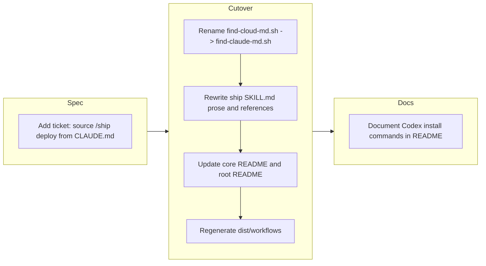

## 1. Overview

This branch consolidated the deploy/verify convention from a separate `cloud.md` file into the project's `CLAUDE.md`, simplifying the `/ship` workflow's deploy/verify sourcing strategy. The Codex install path in the root README was rewritten to point at the actual `codex plugin` commands, and the committed cross-agent distribution under `dist/workflows/` was regenerated to keep source and artifacts synchronized.

**Highlights:**

1. Replaced the `cloud.md` deploy convention with `CLAUDE.md` as a hard cutover (no fallback) across source and `dist/workflows`
2. Renamed `find-cloud-md.sh` → `find-claude-md.sh`, resolving `./CLAUDE.md` only, with the section-detection split preserved (script = path, model = sections)
3. Rewrote `core:ship` SKILL.md §1 ("CLAUDE.md Convention"), script references, fallback semantics, and Ship Flow steps 4–5 — and updated both READMEs
4. Replaced the vague Codex install line in the root README with the concrete `codex plugin marketplace add` / `codex plugin add` commands

## 2. Motivation

`/ship` previously sourced its `## Deploy` and `## Verify` instructions from a bespoke `cloud.md`, duplicating the role of the project's existing `CLAUDE.md` and forcing the finder script to maintain a multi-candidate search path. Centralising those sections into `CLAUDE.md` — the file every project already authors as its instructions surface — removes a redundant convention, lets `core:ship` rely on a single, predictable filename, and aligns the ship workflow with the rest of the marketplace's "instructions live in `CLAUDE.md`" stance. A hard cutover (no `cloud.md` fallback) was chosen deliberately so the contract stays unambiguous; the trade-off — non-Claude agents without a `CLAUDE.md` simply skip deploy — was accepted as an intentional consequence of the design. The Codex install rewrite was a small adjacent fix: the prior README told users that Codex "reads `.agents/plugins/marketplace.json`" without telling them which commands to run, so the actual `codex plugin` invocations were documented in their place.

## 3. Changes

The branch began with a single spec capturing the cutover scope, then executed the rename + rewrite + dist regeneration in one commit, and closed with a small README touch-up that filled a gap surfaced while reviewing the install matrix. `dist-freshness` CI was kept honest throughout: source edits and the regenerated artifacts ship together so the committed `dist/workflows/` always matches a fresh build.

### 3-1. Add ticket for sourcing /ship deploy/verify from CLAUDE.md ([168d3b4](https://github.com/qmu/workaholic/commit/168d3b4))

Filed the implementation spec describing the hard cutover from `cloud.md` to `CLAUDE.md`: the finder rename, the SKILL.md sections to rewrite, the "skip when no `## Deploy` section" semantics, and the dist regeneration requirement. The ticket explicitly documented the accepted cross-agent coupling so it would not be re-litigated during implementation.

### 3-2. Replace cloud.md deploy convention with CLAUDE.md ([13f365e](https://github.com/qmu/workaholic/commit/13f365e))

Executed the cutover: `git mv` renamed `find-cloud-md.sh` → `find-claude-md.sh` (now resolving `./CLAUDE.md` only), ship `SKILL.md` §1 became "CLAUDE.md Convention" with frontmatter, search order, fallback message, and Ship Flow steps 4–5 all rewritten, and both READMEs were updated. `dist/workflows` was regenerated argument-less and the orphaned `find-cloud-md.sh` artifact was staged for deletion so `dist-freshness` stays green.

### 3-3. Document Codex install commands in README ([eef1e93](https://github.com/qmu/workaholic/commit/eef1e93))

Replaced the vague "Codex reads `.agents/plugins/marketplace.json`" line in the install table with the actual sequence: `codex plugin marketplace add qmu/workaholic --ref main`, then `codex plugin add standards@workaholic` and `codex plugin add workflows@workaholic`. Users now have a copy-pasteable install path symmetric with the Claude Code and `skills` CLI rows.

## 4. Outcome

- Migrated `/ship` deploy convention from `cloud.md` to `CLAUDE.md`, establishing a unified project documentation source
- Renamed deploy-doc finder script from `find-cloud-md.sh` to `find-claude-md.sh` with updated path resolution logic
- Rewrote `core:ship` skill (SKILL.md) to reflect the new convention: updated §1 heading, search order, fallback semantics, and deployment flow steps
- Updated documentation across `plugins/core/README.md` and repo root `README.md` to reference `CLAUDE.md` instead of `cloud.md`
- Regenerated committed cross-agent distribution artifacts in `dist/workflows/` to keep source and artifacts synchronized
- Verified zero `cloud.md` references remain in source or generated code; confirmed `verify.mjs` passes

## 5. Historical Analysis

The `cloud.md` convention has been a stable, well-traveled contract since its origin in ticket 20260311105613 (add-ship-drive-command). It was preserved through five relocations, a confirmation gate, the thin-command refactor, and the recent trip decoupling. The convention was explicitly established with a specific search order (`./cloud.md` then `./.workaholic/cloud.md`), skip-if-missing fallback behavior, and the original `find-cloud-md.sh` script structure. A 2026-05-27 ticket (decouple-core-ship-from-trip) established `core:ship` as the cross-agent-portable essence, confirming that the deploy/verify path must remain agent-neutral. Past thin-command and script-relocation work established the current SKILL.md section structure (§1 Convention, §2 Scripts, §5 Flow) and the same-plugin script references using `${CLAUDE_PLUGIN_ROOT}`. This change represents a deliberate redesign of an established contract, motivated by consolidating deployment instructions into the canonical `CLAUDE.md` project file.

## 6. Concerns

### Accepted cross-agent coupling

- **Severity:** low
- **Description:** The new `CLAUDE.md` convention couples `core:ship` to a Claude-specific filename. On non-Claude agents (Codex, OpenCode) without a `CLAUDE.md`, the deploy step skips silently. This is an intentional, accepted consequence of the `CLAUDE.md`-only design and the `find-claude-md.sh` name itself (see [13f365e](https://github.com/qmu/workaholic/commit/13f365e) in `plugins/core/skills/ship/SKILL.md`).
- **How to Fix:** Document the expected behavior in agent-specific docs so users understand why deploy/verify are skipped on non-Claude platforms when no `CLAUDE.md` exists. Not a bug to fix — a contract to maintain.

### Script rename requires stale-artifact cleanup

- **Severity:** low
- **Description:** When a bundled skill script is renamed, `build.mjs` picks up the new name automatically but does not delete the orphaned old artifact. The stale `dist/.../find-cloud-md.sh` had to be manually staged for deletion before committing, or `dist-freshness` CI would have failed (see [13f365e](https://github.com/qmu/workaholic/commit/13f365e) in `dist/workflows/skills/ship/ship/scripts/`).
- **How to Fix:** After regenerating `dist/` following a script rename, verify `git status -- dist/` shows the old script as deleted and explicitly stage it. Consider adding a cleanup pass to `build.mjs` to remove orphaned scripts so the manual step disappears.

## 7. Successful Development Patterns

- **Single-candidate loop preserved in path-resolution script**: Even though only `./CLAUDE.md` is now checked, `find-claude-md.sh` retained the `for candidate in "./CLAUDE.md"; do ...` form. This honors the no-inline-shell principle and makes future additions of alternative locations trivial without re-architecting the script.
- **Script = path resolution, model = section detection**: The finder returns `{found, path}` only; detecting the `## Deploy`/`## Verify` sections stays model-side. Preserving this split kept the change to a single-candidate loop plus prose, rather than adding shell-based section parsing.
- **Source-artifact synchronization via CI guard**: The `dist-freshness.yml` workflow enforces that committed `dist/workflows` artifacts must exactly match a fresh build. This caught the orphaned `find-cloud-md.sh` artifact during local verification and would have failed the PR otherwise, keeping cross-agent distribution in lockstep with source.
- **Hard cutover documented in the spec**: The ticket explicitly framed this as "no fallback, no backward compatibility" up front. That framing prevented the implementer from re-introducing a `cloud.md` candidate "just in case" and kept the contract unambiguous for downstream consumers.

## 8. Release Preparation

**Verdict**: Ready for release

### 8-1. Concerns

- None — changes are safe for release

### 8-2. Pre-release Instructions

- None — standard release process applies

### 8-3. Post-release Instructions

- Announce the `cloud.md` → `CLAUDE.md` cutover to downstream projects: any repo that relied on `./cloud.md` or `./.workaholic/cloud.md` must move its `## Deploy` and `## Verify` sections into the project's `CLAUDE.md`, since `/ship` no longer searches the legacy paths.
