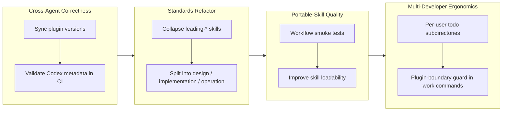

## 1. Overview

This branch hardens workaholic's cross-agent distribution and multi-developer ergonomics. It syncs and CI-validates plugin versions across the Claude and Codex manifests, decomposes the flat `standards` plugin into three focused policy-index skills (design / implementation / operation), partitions the ticket queue per developer, and adds a plugin-boundary guard that stops agents from filesystem-spelunking into stale installs or guessing obsolete plugin namespaces.

**Highlights:**

1. Split the `standards` plugin into three policy-index skills (design / implementation / operation), each linking English hard copies of the canonical qmu.co.jp articles
2. Synced every plugin version through `.claude-plugin/marketplace.json` and added CI validation for the Codex manifests to stop cross-agent version drift
3. Partitioned the todo queue into per-user subdirectories (`tickets/todo/<user>/`) with an author-routed sweep, so one developer's unarchived tickets no longer leak onto another's branch
4. Added a plugin-boundary guard to all five work commands (and a canonical `CLAUDE.md` rule) directing agents to invoke loaded skills by namespace via `${CLAUDE_PLUGIN_ROOT}` instead of reaching into `~/.claude/plugins/marketplaces/` or guessing the obsolete `drivin`/`trippin` names
5. Added hermetic workflow-script smoke tests and improved portable-skill loadability for the generated `dist/workflows` artifacts

## 2. Motivation

Workaholic ships one set of workflow and standards skills to many agents — Claude Code natively, and Codex/OpenCode/Cursor and 40+ others through the generated `dist/` plugin and the `skills` CLI. That fan-out makes two failure modes expensive: manifest version drift across the Claude and Codex surfaces, and generated artifacts that silently fail to load on non-Claude agents. The branch closes both with version synchronization, Codex-metadata CI validation, and hermetic smoke tests. In parallel, day-to-day use surfaced two ergonomic gaps: a single flat todo queue let one developer's tickets ride onto another's branch and get re-driven, and agents loading the plugin via `--plugin-dir` would wander into stale global marketplace installs and guess dead plugin namespaces rather than invoke the already-loaded skill. Per-user subdirectories and the plugin-boundary guard address those directly. The `standards` refactor underpins all of it by making each engineering-policy concern a discoverable, citable index.

## 3. Changes

Work began with cross-agent consistency — syncing plugin versions and wiring CI validation for the Codex manifests — then decomposed the flat `standards` plugin into three policy-index skills linking qmu.co.jp hard copies. Portable-skill quality followed: hermetic smoke tests for the branch/context/archive scripts and loadability fixes for the generated `dist/workflows` artifacts. The branch closed on multi-developer ergonomics: per-user todo subdirectories with an author-routed sweep, and a plugin-boundary guard that keeps agents on the loaded skill instead of stale installs.

### 3-1. Sync Cross-Agent Plugin Versions ([665ee42](https://github.com/qmu/workaholic/commit/665ee42))

Aligned every plugin version through `.claude-plugin/marketplace.json` as the single source of truth, propagating to the per-plugin `plugin.json` files and the Codex manifests so the Claude and cross-agent surfaces never diverge.

### 3-2. Validate Codex Plugin Metadata In CI ([4d8bfba](https://github.com/qmu/workaholic/commit/4d8bfba))

Added CI validation of `.agents/plugins/marketplace.json` and the per-plugin Codex manifests, catching metadata drift and version misalignment before it ships to non-Claude agents.

### 3-3. Improve Portable Workflow Skill Loadability ([5c6f35d](https://github.com/qmu/workaholic/commit/5c6f35d))

Rewrote trigger-oriented frontmatter and substituted Claude-specific terms for agent-neutral prose in the generated `dist/workflows/` skills so they load and trigger correctly across the `skills` CLI ecosystem.

### 3-4. Add Workflow Script Smoke Tests ([de6214a](https://github.com/qmu/workaholic/commit/de6214a))

Added hermetic smoke tests that exercise the branching, context, and archive scripts in throwaway temp repositories — no network, no `gh`, no working-tree mutation — giving deterministic coverage of the workflow critical path.

### 3-5. Per-User Subdirectories Under tickets/todo ([9aab12d](https://github.com/qmu/workaholic/commit/9aab12d))

Moved the active queue to `.workaholic/tickets/todo/<user>/`, keyed by the author's email slug, with an author-routed sweep of root-level strays — so a developer's unarchived tickets no longer leak onto another's branch and get re-driven.

### 3-6. Add an Anti-Spelunking Guard to the Work Plugin Commands ([2ab5754](https://github.com/qmu/workaholic/commit/2ab5754))

Added an identical plugin-boundary guard after the `**Notice:**` in all five work commands, plus a canonical `### Plugin Boundary Rule` in `CLAUDE.md`: invoke loaded skills by namespace (`core:`/`work:`/`standards:`) via `${CLAUDE_PLUGIN_ROOT}`, never read or run anything under `~/.claude/plugins/marketplaces/`, and never guess the obsolete `drivin`/`trippin` namespaces.

## 4. Outcome

- Synced cross-agent plugin versions across the Claude marketplace and Codex manifests, anchored on `.claude-plugin/marketplace.json` (commit 665ee42)
- Extended CI to catch Codex plugin-metadata drift via `.agents/plugins/marketplace.json` and per-plugin manifest checks (commit 4d8bfba)
- Improved portable workflow skill loadability by rewriting frontmatter and neutralizing Claude-specific terms in generated `dist/workflows/` artifacts (commit 5c6f35d)
- Added hermetic workflow-script smoke tests exercising branch/context/archive behavior in temporary repositories (commit de6214a)
- Implemented per-user subdirectories under `.workaholic/tickets/todo/<user>/` with an author-routed sweep of root-level strays (commit 9aab12d)
- Added a plugin-boundary guard to all five work commands and a canonical `CLAUDE.md` rule, prohibiting filesystem spelunking and obsolete-namespace guessing (commit 2ab5754)

## 5. Historical Analysis

The branch advanced three coherent threads: (1) **cross-agent distribution correctness** — resolving manifest drift and validating Codex metadata, a direct continuation of the cross-agent packaging and `dist/` topology work landed in prior branches; (2) **portable skill and script quality** — improving loadability of generated artifacts and adding deterministic coverage, refining the self-contained portable-build pipeline; and (3) **multi-developer DX** — scoping ticket queues per developer and guarding against namespace confusion. The arc continues workaholic's evolution from single-agent Claude Code mechanics toward stable cross-agent contracts and multi-developer workflows.

## 6. Concerns

### (carried from PR #41) Accepted cross-agent coupling

- **Severity:** low
- **Description:** `core:ship` remains coupled to the `CLAUDE.md` filename via `find-claude-md.sh`. This is an accepted contract, not a remediation target, but future refactors of deploy documentation should account for the tight binding.
- **How to Fix:** Document the contract in `CLAUDE.md`'s Deploy section (or nearest equivalent) so deploy-doc renames are caught in review. No code change required on this branch.

### (carried from PR #41) Script rename requires stale artifact cleanup

- **Severity:** low
- **Description:** A proposed orphan-cleanup pass in `build.mjs` to remove old-named script artifacts after cross-skill reference renaming did not land; only `lookupVersion` and `PUBLIC_SUBSTITUTIONS` additions shipped.
- **How to Fix:** Defer orphan cleanup to a follow-up ticket after confirming the current rename strategy won't create orphaned copies in `dist/`. Low urgency.

### Release workflow divergence

- **Severity:** moderate
- **Description:** `.claude/commands/release.md` predates the current three-plugin layout. It references the obsolete `tdd` plugin, omits `standards`/`work`, and lacks the version-sync steps this branch relies on (four `plugins[].version` entries, the standards `.codex-plugin/plugin.json`, and dist regeneration). A future `/release` run could silently miss version files and recreate drift (see commit 665ee42, `CLAUDE.md` Version Management).
- **How to Fix:** Open a follow-up ticket to align `release.md` with the version-bump procedure now documented in `CLAUDE.md`, so human-and-AI release runs converge.

### Spec-relative cross-skill references can ship broken

- **Severity:** moderate
- **Description:** Cross-skill script references must use the full `${SCRIPT_DIR}/../../../../core/skills/.../scripts/` form with literal uppercase `SCRIPT_DIR` for the dist build's regex to detect and copy the closure. Shorter relative forms resolve in source but are invisible to the build and ship broken to Codex and the `skills` CLI (see commit 9aab12d Final Report, `scripts/build-plugins/build.mjs`).
- **How to Fix:** Audit new cross-skill references against `SCRIPT_CROSS_REF` in `build.mjs`, always use the full literal-`SCRIPT_DIR` form, and run `node scripts/build-plugins/verify.mjs` after adding any cross-skill call.

### references/ split deferred pending upstream clarification

- **Severity:** low
- **Description:** Splitting `drive`/`report` operational detail into sibling `references/` files was scoped out because the `skills` CLI and OpenAI agent SDK docs do not document how a `references/` directory beside `SKILL.md` is loaded (see commit 5c6f35d Final Report).
- **How to Fix:** Confirm `references/` loading behavior upstream before reopening; once verified, the split can land in a follow-up ticket.

## 7. Successful Development Patterns

- **Single-source version management**: anchoring every plugin version in `.claude-plugin/marketplace.json` and reading it through one `lookupVersion()` helper in `build.mjs` eliminated duplicate declarations and shrank the drift surface across both Claude and Codex manifests (commits 665ee42, 4d8bfba).
- **Most-specific-first substitution ordering**: the `PUBLIC_SUBSTITUTIONS` list in `build.mjs` must order specific patterns before general ones (e.g. `subagent_type: "general-purpose"` before bare `general-purpose`); documenting the constraint in the list comment prevents silent mismatches (commit 5c6f35d).
- **Hermetic test repositories**: spinning up temp repos with `git -c init.defaultBranch=<name> init` removes dependence on the developer's global git config and makes script tests deterministic and reusable (commit de6214a).
- **Author-routed stray sweep**: routing root-level strays by each ticket's own `author:` frontmatter (falling back to the current user) self-heals the mixed-layout transition without orphaning other developers' tickets, and running it before list operations keeps the queue consistent (commit 9aab12d).
- **Instructional prose guards for what scripts can't enforce**: a terse behavioral guard in each command header — echoed by one canonical `CLAUDE.md` rule — communicates a multi-agent contract (stay on the loaded skill; don't spelunk stale installs) that no script could enforce (commit 2ab5754).

## 8. Release Preparation

**Verdict**: Ready for release

### 8-1. Concerns

- None — changes are safe for release. Build, self-containment verification, Codex metadata validation, and the 47 workflow smoke tests all pass at version 1.0.51.

### 8-2. Pre-release Instructions

- None — standard release process applies.

### 8-3. Post-release Instructions

- None — no special post-release actions needed.

## 9. Notes

This branch is `hybrid` context (carries both trip artifacts and drive-style tickets); the narrative above reflects the drive work. The two carried-over PR #41 concerns remain `still_active` and are surfaced in section 6 for future judging.
