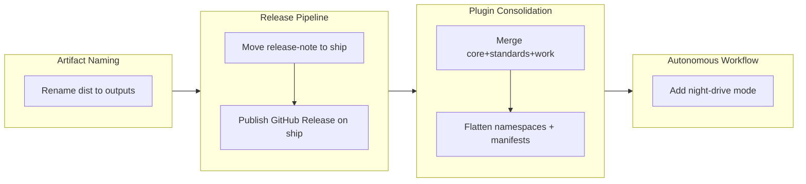

## 1. Overview

This branch consolidates the three authored plugins (`core`, `standards`, `work`) into a single `workaholic` plugin, and overhauls the release/ship pipeline: release-note generation moves from `/report` to `/ship`, ship publishes a GitHub Release (deferring to CI when one already publishes), and `/drive` gains an autonomous "night" mode for unattended overnight runs. The generated artifacts directory was also renamed `dist/` → `outputs/`. All five tickets were implemented in one autonomous night-drive batch with every commit gate-verified.

**Highlights:**

1. Merged `core` + `standards` + `work` into one `plugins/workaholic/` plugin with unified manifests, flattened `workaholic:` namespaces, and `dependencies: []`
2. Moved release-note generation from `/report` to `/ship` (committed before merge), supporting multiple releases per branch
3. Added GitHub Release publishing to `/ship` via `publish-release.sh`, which defers to an existing CI release workflow and otherwise creates the release idempotently
4. Added an autonomous "night drive" mode to `/drive` — upfront batch authorization, then unattended implementation with a morning report
5. Renamed the generated artifacts directory `dist/` → `outputs/` across build scripts, both manifests, the CI guard, and docs

## 2. Motivation

The three-plugin split (`core`/`standards`/`work`) added marketplace and maintenance overhead — three manifests, three version entries, a cross-plugin dependency graph — without buying isolation that mattered, since non-Claude agents only ever consume a plugin's `skills/` directory and ignore commands/agents/hooks. Collapsing to one `workaholic` plugin simplifies discovery and the version surface while preserving the source-vs-artifact split (script-bearing skills stay internal and reach other agents through the generated `outputs/workflows` bundle). In parallel, the release pipeline needed delivery to become the system of record: generating the release note at ship time (not report time) lets each ship carry its own note and unblocks multiple releases per branch, and publishing the GitHub Release from ship — while deferring to any existing CI publisher — keeps release records in-repo without double-publishing. Night-drive mode compresses the feedback loop: queue specs, authorize a batch once, let `/drive` run unattended, review in the morning.

## 3. Changes

Implemented as one autonomous night-drive batch (the user authorized all five upfront, merge last). Each ticket was implemented, run through the full gate suite (build, verify, validate-metadata, 49 smoke tests), and auto-committed; nothing was skipped or stashed.

### 3-1. Rename the generated artifacts directory `dist/` → `outputs/` ([a0d6d4d](https://github.com/qmu/workaholic/commit/a0d6d4d))

`git mv dist outputs` plus a lockstep sweep of every reference: the `build.mjs`/`verify.mjs` constants, both marketplace manifests, the CI guard (renamed to `outputs-freshness.yml`), and the docs. Regenerated byte-identically.

### 3-2. Move release-note generation from `/report` to `/ship` ([8d84ed4](https://github.com/qmu/workaholic/commit/8d84ed4))

Removed release-note generation from `core:report` (Phase 5 step 2 + Phase 6) and added a generate-and-commit step to the `core:ship` Ship Flow before merge, backed by a new `commit-release-note.sh`. `write-release-note`'s output scheme now supports multiple notes per branch (`<branch>.md`, then `-N`).

### 3-3. Publish a GitHub Release on successful ship ([2e74ba3](https://github.com/qmu/workaholic/commit/2e74ba3))

New `publish-release.sh` scans `.github/workflows/` for an existing release publisher and defers to it; otherwise it runs an idempotent `gh release create` targeting the merge commit. Added two hermetic smoke tests for the detection branch.

### 3-4. Collapse `core` + `standards` + `work` into a single `workaholic` plugin ([ddb8e97](https://github.com/qmu/workaholic/commit/ddb8e97))

`git mv`'d all three plugins into `plugins/workaholic/`, wrote one `.claude-plugin`/`.codex-plugin` manifest (`dependencies: []`), flattened `core:`/`standards:`/`work:` namespaces and same-plugin paths, retargeted `build.mjs`, collapsed both marketplace manifests, and fixed the `claude.sh` launcher. All four gates pass.

### 3-5. Add an autonomous "night drive" mode to `/drive` ([1f00672](https://github.com/qmu/workaholic/commit/1f00672))

`/drive` with "night" asks upfront (one `multiSelect`) which tickets to target, then runs them autonomously — skipping the per-ticket approval gate, auto-committing each, skipping-and-recording on failure (`git stash` to isolate partial work) — and prints a whole-night report. Approval is relocated to the upfront batch authorization, not removed.

## 4. Outcome

- Renamed the generated artifacts directory from `dist/` to `outputs/` throughout build scripts, CI guards, and documentation, preserving history and regenerating cleanly.
- Relocated release-note generation from `/report` to `/ship`, establishing a multi-release file scheme to support multiple releases per branch.
- Added GitHub Release publishing to `/ship` via `publish-release.sh`, which detects existing CI release workflows and defers, publishing only when no CI automation exists.
- Merged the three authored plugins into a single `plugins/workaholic/` plugin while preserving cross-agent exposure of pure-prose skills through the regenerated `outputs/workflows/` artifact.
- Introduced an autonomous "night drive" mode to `/drive` with a single upfront authorization and a whole-run report for morning review.

## 5. Historical Analysis

The branch extends established patterns: (1) atomic, self-consistent directory renames with parallel prose updates (precedent: `work-20260518-235327`'s `dist/` creation); (2) Shell-Script-Principle enforcement — conditionals extracted to bundled scripts, never inline markdown (precedent: `work-20260528-091259`'s ship/deploy refactor); (3) plugin topology changes via `git mv` + namespace flattening (precedent: `drive-20260403-230430`'s drivin/trippin→work merge); (4) autonomous-loop friction reduction (precedent: continuous-drive-loop and drive-auto-continue); (5) machine-checkable artifact reachability through the freshness CI and build-gate smoke tests. The release-note relocation mirrors the earlier separation of generation (prose) from publishing (CI-owned vs ship-owned). Night-drive preserves the "explicit upfront authorization" boundary from prior drive-approval work while carving a scoped exception for unattended runs.

## 6. Concerns

### (carried from PR #41) Accepted cross-agent coupling

- **Severity:** low
- **Description:** `core:ship`'s coupling to the `CLAUDE.md` filename (via `find-claude-md.sh`) is unchanged; an accepted contract, not a bug (see `.workaholic/concerns/41-accepted-cross-agent-coupling.md`).
- **How to Fix:** Document it as an intentional boundary in the pending standards narrative rewrite. No code change.

### (carried from PR #41) Script rename requires stale artifact cleanup

- **Severity:** low
- **Description:** `build.mjs` still has no orphan-cleanup pass; renames rely on manual `git mv` + freshness CI to catch leftovers (see `.workaholic/concerns/41-script-rename-requires-stale-artifact-cleanup.md`).
- **How to Fix:** Add a cleanup pass to `build.mjs` that removes orphaned generated artifacts before reassembly.

### (carried from PR #42) References split deferred pending upstream clarification

- **Severity:** moderate
- **Description:** The `references/` skill split remains deferred pending upstream `skills` CLI / agent SDK clarification on how a `references/` dir beside `SKILL.md` is loaded (see `.workaholic/concerns/42-references-split-deferred-pending-upstream-clarification.md`).
- **How to Fix:** Confirm the loading behavior upstream, then land the split in a follow-up.

### (carried from PR #42) Release workflow divergence

- **Severity:** moderate
- **Description:** `.claude/commands/release.md` is stale and now more divergent — it still references `plugins/core` (which no longer exists after the merge) and predates the consolidated version-file set (see `.workaholic/concerns/42-release-workflow-divergence.md`).
- **How to Fix:** Rewrite `/release` to the merged single-plugin version-bump procedure (one `plugin.json` + `.codex-plugin` + `marketplace.json`), or retire it in favour of the documented CLAUDE.md flow.

### (carried from PR #42) Spec-relative cross-skill references remain fragile

- **Severity:** low
- **Description:** Cross-skill `${SCRIPT_DIR}` references must use the full literal form or they ship broken; verified correct in this merge via smoke tests, but the fragility persists for future changes (see `.workaholic/concerns/42-spec-relative-cross-skill-references-can.md`).
- **How to Fix:** Keep `verify.mjs` mandatory after any cross-skill ref change; consider a lint rule flagging short relative skill paths.

### Carry-over pipeline accumulates duplicates

- **Severity:** low
- **Description:** `41-*` and `42-carried-from-pr-41-*` are the same two concerns re-carried; `extract-carryover.sh` re-emits identical concerns each ship, so they compound across PRs (this story's section 6 inherited duplicate pairs).
- **How to Fix:** Canonicalize concern files by basename/content hash in `extract-carryover.sh` (or the carry-over judge) so duplicates merge rather than re-emit.

### Architecture narrative still describes the prior three-plugin model

- **Severity:** low
- **Description:** All functional paths, manifests, build scripts, and the Project Structure/Version Management docs are updated to the single `workaholic` plugin, but CLAUDE.md's Cross-Agent Skill Exposure and distribution prose still frame `core`/`standards`/`work` conceptually (a flag note was added at the dependency section) (see commit ddb8e97).
- **How to Fix:** A dedicated narrative-rewrite pass over CLAUDE.md's Architecture Policy and distribution sections; mechanics are unchanged, only the plugin-name framing is stale. The `workflows` marketplace entry description ("Claude Code users install core/work instead") needs the same fix.

## 7. Successful Development Patterns

- **Atomic topology changes via `git mv` + namespace rewrite + regeneration in one commit** kept the tree working at every step and made the rename/merge auditable; smoke tests verified the new structure end-to-end before review.
- **The gate suite as structural acceptance test** — `build.mjs` + `verify.mjs` + `validate-metadata.mjs` + the 49 smoke tests caught every misalignment in the plugin merge; because the smoke tests actually execute the bundled cross-skill scripts (`user-slug.sh`, `commit.sh`), green gates were high-confidence evidence the path flatten was correct.
- **Shifting release ownership to `/ship`** (note generation + GitHub Release publishing, CI-aware) made `/ship` the system of record for delivery and unblocked multi-release automation.
- **Scoped autonomy via upfront explicit authorization** — night mode relocates approval from per-ticket to one upfront batch selection: explicit scope → autonomous loop within scope → no exceptions → morning report.
- **One plugin can serve both audiences** — script-bearing internal skills (Claude-only, `${CLAUDE_PLUGIN_ROOT}`) and pure-prose exposed skills coexist in one `skills/` dir, with the build filtering which get regenerated into `outputs/workflows/`.

## 8. Release Preparation

**Verdict**: Ready for release

### 8-1. Concerns

- None — changes are safe for release. Build, self-containment verification, Codex metadata validation (aligned at 1.0.52), and 49 workflow smoke tests all pass. The carried concerns above are tracked follow-ups, not release blockers.

### 8-2. Pre-release Instructions

- None — standard release process applies.

### 8-3. Post-release Instructions

- Update your local launch alias to the merged plugin: a single `--plugin-dir .../plugins/workaholic` (the old `core`/`standards`/`work` `--plugin-dir` paths no longer exist).

## 9. Notes

All five tickets were implemented in one autonomous night-drive batch (the inaugural use of the night-drive mode this branch added, hand-executed against its own spec). Nothing was pushed or merged during the run; this report and PR are the first outward step. The branch detects as `trip`/hybrid context due to the repo's historical `.workaholic/trips/` directory; the narrative reflects the drive work.
