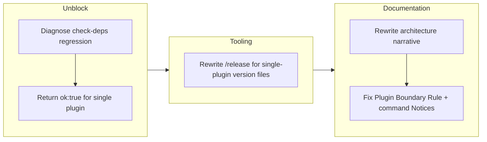

## 1. Overview

This branch delivers three follow-up fixes after the single-plugin consolidation: it repairs a `check-deps` regression that was blocking `/ticket` and `/drive`, rewrites the stale `/release` command for the single-plugin layout, and rewrites the architecture narrative across CLAUDE.md, README, and the command Notice headers to the unified `workaholic` model. A concurrent contributor also abandoned a stray planning-pillar bootstrap ticket (the standards-sync Watcher now self-bootstraps it).

**Highlights:**

1. Fixed a `check-deps` regression that blocked `/ticket` and `/drive` (it probed for a sibling `core` plugin removed by the merge)
2. Rewrote `/release` for the single-plugin version-file set (no more `plugins/core` / `plugins/tdd` / `sync-work.md`)
3. Rewrote the architecture narrative to the single-plugin model — and corrected the anti-spelunking **Plugin Boundary Rule**, which had itself gone stale
4. Abandoned the stray planning-pillar ticket (Watcher self-bootstraps it now)

## 2. Motivation

The single-plugin merge was functionally complete and gate-green, but it left a handful of runtime and documentation edges that the static build gates can't see. `check-deps` is a command pre-check, not exercised by build/verify/validate/smoke, so its sibling-`core`-plugin probe silently broke `/ticket` and `/drive` after the merge. The `/release` command and large stretches of CLAUDE.md/README prose still described the prior three-plugin topology — and one guard, the anti-spelunking Plugin Boundary Rule, actively misdirected by naming the retired plugins as the live ones. This branch closes those gaps so the commands work and the institutional documentation is accurate.

## 3. Changes

Three low-risk Config/doc fixes, each implemented and run through the full gate suite (build, verify, validate-metadata, 49 smoke tests) before commit. A concurrent contributor's commits (planning-pillar path-update + abandonment) also landed on the branch.

### 3-1. Fix check-deps regression after the plugin merge ([8c5884e](https://github.com/qmu/workaholic/commit/8c5884e))

`check.sh` probed for a sibling `core` plugin that the merge removed, so it returned `ok:false` and blocked the `/ticket` and `/drive` pre-checks. Replaced it with an unconditional `{"ok": true}` (one plugin, no external deps) and audited all skill scripts — no other sibling-plugin assumptions remain.

### 3-2. Rewrite the /release command for the single-plugin layout ([6bb8db0](https://github.com/qmu/workaholic/commit/6bb8db0))

`.claude/commands/release.md` still referenced the gone `plugins/core`, a non-existent `plugins/tdd`, and a missing `sync-work.md`. Rewrote it to bump the consolidated version files (`marketplace.json` root + `workaholic` + `workflows` entries, `plugins/workaholic/.claude-plugin` and `.codex-plugin` plugin.json), regenerate `outputs/`, validate alignment, then commit/push — pointing at CLAUDE.md Version Management as the source of truth.

### 3-3. Rewrite CLAUDE.md's architecture narrative for the single-plugin model ([b6ae710](https://github.com/qmu/workaholic/commit/b6ae710))

Collapsed the three-plugin prose (Cross-Agent Skill Exposure, distribution, dependency, component-nesting, design-principle) to the single `workaholic` plugin, preserving the `metadata.internal` gating and `${CLAUDE_PLUGIN_ROOT}` determinism rationale verbatim. Corrected the **Plugin Boundary Rule** (which had listed `core`/`standards`/`work` as live), the five command Notice headers, the `workflows` marketplace description, and restructured README's three plugin sections into one.

## 4. Outcome

- Fixed the `check-deps` regression — removed the sibling-`core`-plugin check (now `{"ok": true}`), unblocking `/ticket` and `/drive`; audited all skill scripts, no other sibling-plugin assumptions remain.
- Rewrote `/release` for the single-plugin version-file set with a regenerate step; removed all stale `plugins/core` / `plugins/tdd` / `sync-work.md` references.
- Rewrote the CLAUDE.md / README / command-Notice architecture narrative to single-plugin framing; corrected the Plugin Boundary Rule anti-spelunking guard, which had wrongly listed retired plugin names.

## 5. Historical Analysis

This branch reflects two patterns from the plugin-merge work: (1) the static build gates (`build`, `verify`, `validate-metadata`, smoke tests) prove artifacts are well-formed but do not exercise runtime pre-checks (`check-deps`, `check-workspace`, `detect-context`) — the regression slipped past precisely because of this gap; (2) documentation that hard-codes topology (the Plugin Boundary Rule, command steps, CLAUDE.md prose) must be updated when the topology changes, or it actively misdirects rather than guards. Both argue for broader runtime validation after structural refactors and for marking stable-contract prose (topology/version files) with explicit refresh triggers.

## 6. Concerns

### (carried from PR #41) Accepted cross-agent coupling

- **Severity:** low
- **Description:** The `core:ship` skill couples to `CLAUDE.md`, a Claude-specific filename. On non-Claude agents without a `CLAUDE.md`, the deploy step skips silently. This is an intentional, accepted contract (see [13f365e](https://github.com/qmu/workaholic/commit/13f365e)).
- **How to Fix:** Document the expected behavior in agent-specific docs so users understand why deploy/verify are skipped on non-Claude platforms. Not a bug — a contract to maintain.

### (carried from PR #41) Script rename requires stale-artifact cleanup

- **Severity:** low
- **Description:** When a bundled skill script is renamed, `build.mjs` picks up the new name but does not delete the orphaned old artifact (it had to be manually staged for deletion to avoid freshness-CI drift).
- **How to Fix:** Add a cleanup pass to `build.mjs` to remove orphaned generated scripts after regeneration.

### (carried from PR #42) references/ split deferred pending upstream clarification

- **Severity:** low
- **Description:** Splitting `drive`/`report` operational detail into sibling `references/` files was scoped out because the `skills` CLI and OpenAI agent SDK docs do not document how a `references/` directory beside `SKILL.md` is loaded.
- **How to Fix:** Confirm `references/` loading behavior upstream before reopening; once verified, land the split in a follow-up.

### (carried from PR #42) Spec-relative cross-skill references can ship broken

- **Severity:** moderate
- **Description:** Cross-skill script references must use the full `${SCRIPT_DIR}/../../../../<skill>/scripts/` form with literal uppercase `SCRIPT_DIR` for the dist build's regex to detect and copy the closure. Shorter relative forms resolve in source but are invisible to the build and ship broken to Codex and the `skills` CLI (`scripts/build-plugins/build.mjs`).
- **How to Fix:** Audit new cross-skill references against `SCRIPT_CROSS_REF` in `build.mjs`, always use the full literal-`SCRIPT_DIR` form, and run `node scripts/build-plugins/verify.mjs` after adding any cross-skill call.

### apply-carryover-verdicts.sh silently skips `{"verdicts": [...]}` input

- **Severity:** moderate
- **Description:** `apply-carryover-verdicts.sh` expects a **bare JSON array**, but the report skill's documented Phase 1 schema and the carry-over judge produce `{"verdicts": [...]}`. Its `python3` then iterates dict keys and processes nothing — so RESOLVED verdicts are never archived. This silently defeated carry-over resolution in the PR #42 and #43 reports and is a root cause of the concern-dir bloat (`plugins/workaholic/skills/report/scripts/apply-carryover-verdicts.sh`).
- **How to Fix:** Make the script accept both `{"verdicts": [...]}` and a bare array (or fix the orchestrator/skill to write the bare `.verdicts` array), and add a smoke test so this can't regress silently.

### Carry-over concern set has ballooned to ~14 active from ~6 unique

- **Severity:** moderate
- **Description:** The still-active set carries chained duplicates (`41-*`, `42-carried-from-41-*`, `43-carried-from-41-*`, `43-carried-from-42-*`). Root causes: the `apply-carryover-verdicts.sh` silent-skip bug above (resolved items never leave the dir) and no dedup in `extract-carryover.sh` (identical concerns re-emitted every ship).
- **How to Fix:** Fix the apply-script bug first, then add dedup-by-canonical-identity (basename/content hash) to `extract-carryover.sh` before re-emitting, so duplicates merge rather than compound.

## 7. Successful Development Patterns

- **Audit runtime pre-checks after structural refactors:** the four static gates passed while a runtime pre-check (`check-deps`) broke. After a topology change, also smoke-run the live command pre-checks — the gates prove artifacts are well-formed, not that the command pipeline still passes.
- **Topology-bound prose needs refresh triggers:** the Plugin Boundary Rule, command Notices, and CLAUDE.md prose all hard-code the plugin topology; when it changes they fail silently and misdirect. Mark such sections with an explicit "update when the plugin layout changes" cue.
- **Mirror a single source of truth:** the rewritten `/release` command points at CLAUDE.md Version Management rather than re-enumerating the version files, so the two can't drift again.
- **End-to-end smoke coverage for orchestration:** the `/report → /ship` pipeline relies on hand-maintained version files and scripts; the apply-script bug surfaced only by running the real flow. A throwaway end-to-end smoke test would catch such orchestration gaps before they land.

## 8. Release Preparation

**Verdict**: Ready for release

### 8-1. Concerns

- None — changes are safe for release. Build, self-containment verification, Codex metadata validation (aligned at 1.0.53), and 49 workflow smoke tests all pass. The carried concerns above are tracked follow-ups, not blockers.

### 8-2. Pre-release Instructions

- None — standard release process applies.

### 8-3. Post-release Instructions

- None — no special post-release actions needed.

## 9. Notes

A concurrent contributor (Claude Opus 4.7, same author) committed on this branch while it was in progress — updating the stray planning-pillar ticket's paths to the merged layout, then abandoning it because the `qmu/workaholic-standards-sync` Watcher gained `Write` and can now self-bootstrap the planning pillar. The abandoned ticket lives under `.workaholic/tickets/abandoned/` and is excluded from the Changes section. The branch detects as `trip`/hybrid context due to the repo's historical `.workaholic/trips/` directory; the narrative reflects the drive work.
