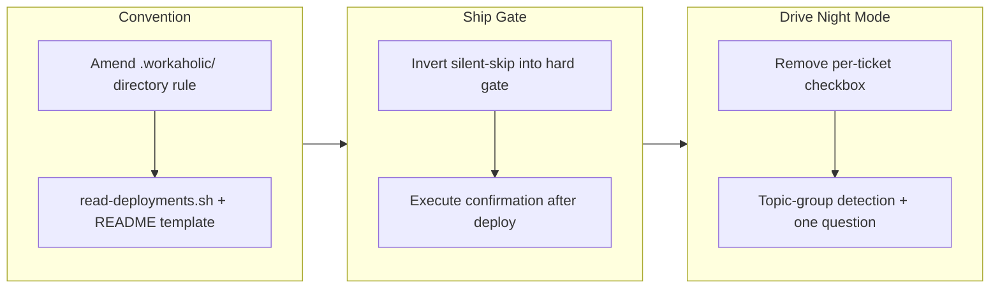

## 1. Overview

This branch tightened the `/ship` deployment workflow and streamlined `/drive` night mode. Deployment now requires an established confirmation method declared in a new `.workaholic/deployments/` directory: `/ship` halts and asks for a verification path instead of silently skipping, then executes the confirmation after deploy. Night `/drive` runs the whole prioritized queue with no per-ticket checkbox, asking a single question only when tickets span clearly distinct topic groups.

**Highlights:**

1. Established the `.workaholic/deployments/` convention (directory rule + frontmatter schema + `read-deployments.sh` reader) for tracking deploy procedures and their success-confirmation methods
2. Reworked `/ship` from silent-skip into a hard gate: a documented confirmation method is required, executed after deploy, and a failed confirmation is a failed ship
3. Removed the per-ticket checkbox from `/drive` night mode; the invocation authorizes the whole batch, with one group-inclusion question only on mixed topics

## 2. Motivation

The previous `/ship` could silently skip verification when no `## Deploy`/`## Verify` section existed in `CLAUDE.md` — collapsing the dangerous ambiguity between "not deployed" and "skipped on purpose" into a quiet success. A deployment with no established way to confirm it reached production should not be shippable. In parallel, night `/drive`'s upfront `multiSelect` made the developer tick every ticket before an unattended run — a selection chore at odds with what "night drive" means and with the project's modeless-design policy. This branch makes deployment confirmation explicit and mandatory, and re-anchors night-drive authorization on the `/drive night` invocation itself, surfacing a decision only at the real branch point (mixed topics).

## 3. Changes

The branch progressed from the structured deployment contract (a deliberate amendment to the closed `.workaholic/` directory rule, plus a POSIX reader and a template), to inverting `/ship`'s long-standing "missing spec = skip" fallback into "missing spec = halt and ask" with post-deploy confirmation execution, to recovering modeless interaction in `/drive` night mode by removing the selection dialog and adding conservative topic-group detection so a question fires only for genuinely unrelated clusters. A version bump to v1.0.54 closed the branch.

### 3-1. Establish the `.workaholic/deployments/` convention ([b166f04](https://github.com/qmu/workaholic/commit/b166f04))

Added `deployments/` to the closed `.workaholic/` directory rule with its frontmatter schema (`title`, `environment`, `confirmation_method` enum, optional non-secret `url`/`endpoint`/`command` locators) and the required `## Procedure` / `## Confirmation` body sections. Added the POSIX `read-deployments.sh` reader (returns `has_confirmation`/`count`/`deployments`) and a `README.md` template documenting the convention and forbidding secrets in the version-controlled files.

### 3-2. Require a verified deployment-confirmation method in `/ship` ([80e721c](https://github.com/qmu/workaholic/commit/80e721c))

Reworked `workaholic:ship`: §1 became a two-source Deployment Contract (`.workaholic/deployments/` preferred, `CLAUDE.md ## Deploy`/`## Verify` fallback); §1-4 inverted the silent-skip fallback into a halt-and-ask gate (provide a verification path / credentials, inspect production, author a deployments entry, or abort); Ship Flow step 5 gates on `has_confirmation` and step 6 became "Confirm", executing the method by type and treating a failed confirmation as a failed ship. Added a `testReadDeployments` smoke test and regenerated `outputs/`.

### 3-3. Night `/drive` runs the whole queue — no per-ticket checkbox ([153ab15](https://github.com/qmu/workaholic/commit/153ab15))

Rewrote the Night Mode section so the `/drive night` invocation authorizes the whole prioritized batch with no `multiSelect` checklist; new §1b fires a single group-inclusion question only when the prioritizer reports ≥2 distinct topic groups. Added a conservative "Detect Topic Groups" step (dependency components reinforced by layer/file overlap, biased toward one group) and a `groups` field to the prioritizer output, plus command-level branching. Regenerated `outputs/`.

## 4. Outcome

- A new `.workaholic/deployments/` convention captures, per target, both the deploy/release procedure and the executable method to confirm success, read into structured JSON by `read-deployments.sh`.
- `/ship` now requires an established confirmation method before completing a deployment: it halts and asks rather than silently skipping, executes the confirmation (`browser` / `server-batch` / `db-query` / `api-probe` / `other`) after deploy, and reports a failed confirmation as a failed ship. The gate stays portable, so the trip path inherits it.
- `/drive` night mode runs the entire prioritized queue without a per-ticket checkbox; topic-group detection surfaces a single group-inclusion question only for genuinely unrelated clusters, recovering modeless-by-default interaction.
- All changes verified: `build` / `verify` / `validate-metadata` pass, and the smoke suite is at 53 passed / 0 failed (including 4 new `read-deployments.sh` cases). `outputs/` regenerated in lockstep; versions aligned at v1.0.54.

## 5. Historical Analysis

The three tickets form a coherent multi-layer expansion of the deployment and drive workflows.

**Ship's evolution.** A lineage through `20260528091259` (move source to `CLAUDE.md`), `20260311105613` (externalized instruction file), and `20260617001707` (bundled-script + "detect a state, then act" convention) culminates here in a **hard gate** that inverts the long-standing "missing spec = skip" fallback into "missing spec = halt and ask." The gate is designed portable (no Claude-only constructs) so the trip path inherits it automatically.

**Drive's interaction design.** The night-drive redesign resolves a tension introduced by `20260617010324` (the per-ticket checkbox). This branch consciously re-anchors approval on the explicit `/drive night` invocation rather than a selection dialog, recovering the modeless-by-default principle from the design policy. Topic-group detection extends the prioritizer's existing metadata work from `20260131125946` to provide a conservative, single-question path for genuinely unrelated batches.

**Pattern convergence.** Both workflows now apply the same "detect a state, then act" shape: the ship gate reads deployments and halts if absent (analogous to `20260617001707`'s CI-publishes detection), and the drive batch reads groups and asks only if split. Neither embeds conditional shell in markdown — all logic lives in bundled scripts returning JSON.

## 6. Concerns

### Workaholic itself now hits the new `/ship` halt path (dogfooding gap)

- **Severity:** moderate
- **Description:** The new gate (see [80e721c](https://github.com/qmu/workaholic/commit/80e721c)) requires a documented confirmation method, but this repo has no real `.workaholic/deployments/` target entry (only the README template) and no `CLAUDE.md ## Deploy`/`## Verify` section. So `read-deployments.sh` returns `has_confirmation: false` and `/ship` on workaholic itself will halt at §1-4. This is the gate working as designed (it halts rather than silently skipping) and was explicitly deferred by the branch's tickets — but it must be resolved before the next clean `/ship`.
- **How to Fix:** Author the repo's own deployment contract — either a `.workaholic/deployments/` entry stating a trivial confirmation ("the merge to `main` is the deployment; confirm the release commit/tag is on `main`") or a `## Verify` section in `CLAUDE.md`.

### Confirmation execution depends on tooling that may be absent in headless/CI sessions

- **Severity:** moderate
- **Description:** Step 6 executes the confirmation by `confirmation_method` — `browser` needs browser tooling, `server-batch` needs shell/SSH access and transient credentials, `db-query` needs a DB client. In a headless or CI ship context those may be unavailable, so a target with a declared method could still be unconfirmable at run time, forcing the §1-4 halt (`plugins/workaholic/skills/ship/SKILL.md` Ship Flow step 6).
- **How to Fix:** Allow a deployment target to declare a confirmation method that is executable in the expected ship environment (e.g. prefer `api-probe`/`db-query` for headless contexts), and document that `browser` confirmations assume an interactive agent. Consider a capability check before deploy.

## 7. Successful Development Patterns

- **"Detect a state, then act" expressed as a JSON-returning leaf script + a command-level decision.** Both new behaviors (the ship gate reading `read-deployments.sh`, the night-drive group question reading the prioritizer's `groups`) compute a boolean/structure in a non-interactive script and leave the `AskUserQuestion` to the command — keeping conditional logic out of markdown and honoring One-Level Fan-Out.
- **Modeless interaction as a policy lens.** Treating the per-ticket checkbox as a "mode" the user is trapped in (per the design policy) gave a principled basis for removing it and replacing it with a single decision at the real branch point.
- **Modeling a new corpus reader on an existing one.** `read-deployments.sh` mirrored `list-active-carryovers.sh`'s frontmatter-scan / JSON-escape / README-skip shape, so the new `.workaholic/` reader was correct on the first pass and matched repo conventions.
- **Grounding ticket assumptions against real build behavior.** Ticket 614 assumed the build bundles ship scripts by per-script SKILL.md reference; running the build proved it copies the whole `ship/scripts/` dir, so the `outputs/` entry was committed rather than wrongly omitted — caught before CI.
- **Conservative-by-default heuristics for optional prompts.** Topic-group detection biases toward a single group so a cohesive queue never triggers a question, preventing the new feature from reintroducing the prompting it was meant to remove.

## 8. Release Preparation

**Verdict**: Ready for release

### 8-1. Concerns

- After this branch merges, the workaholic repo itself has no `.workaholic/deployments/` entry (only the README template) and no `CLAUDE.md ## Deploy`/`## Verify`, so `/ship` on this repo would hit the new §1-4 halt path. This is the gate working as designed (it halts rather than silently skipping) and was explicitly deferred by the branch's tickets — not a defect.

### 8-2. Pre-release Instructions

- None — standard release process applies. Verification suite (`build`/`verify`/`validate-metadata`, 53/0 smoke) is green and `outputs/` is fresh.

### 8-3. Post-release Instructions

- Author the workaholic repo's own deployment contract so future `/ship` runs don't halt: add a `.workaholic/deployments/` entry with a trivial confirmation, or a `## Verify` section in `CLAUDE.md`.

## 9. Notes

**Carry-over handling (deliberate deviation worth flagging):** the carry-over judge found **17 still-active concerns** from PRs #41–#44 (CLAUDE.md coupling, `build.mjs` orphan cleanup, the `references/` split, cross-skill `${SCRIPT_DIR}` fragility, the `apply-carryover-verdicts.sh` silent-skip bug, and the carry-over set ballooning). They remain tracked as active files in `.workaholic/concerns/` and were **not** re-injected into this story's section 6. Rationale: the carry-over judge reads `.workaholic/concerns/` directly, not story bodies, so they stay in the pipeline regardless — whereas prepending all 17 here would cause `extract-carryover.sh` on the next `/ship` to re-emit them as new files, compounding the very ballooning bug they describe (concern #44, `apply-carryover-verdicts.sh` silently skips `{"verdicts":...}` input; no dedup in `extract-carryover.sh`). Fixing those two root causes is the prerequisite for sane carry-over management and should be the next ticket.
