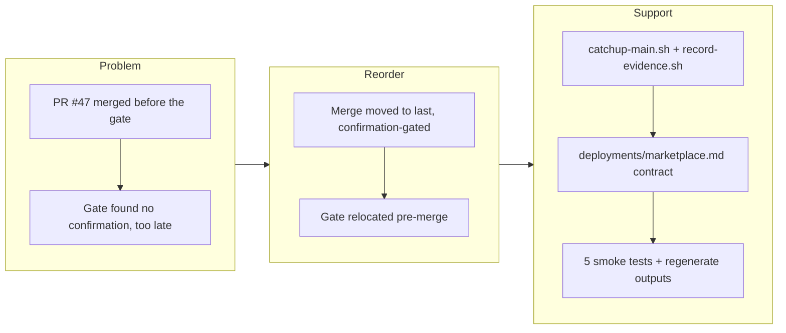

## 1. Overview

This branch fixed a flaw in `/ship`: the previous flow merged the PR before the deployment-confirmation gate ran, so it could not block an unconfirmable change — proven when PR #47 merged to `main` and only then discovered there was no confirmation method. The Ship Flow is reordered so the merge is the **last** step, gated on a passing production confirmation: pre-check → catch up with `main` → deploy + confirm in production (pre-merge) → record evidence in the story/PR → merge → publish release → extract carry-overs.

**Highlights:**

1. Reordered the Ship Flow so the merge is the final, confirmation-gated step — an unconfirmable change never reaches `main` (not merging is the rollback)
2. Added `catchup-main.sh` (sync the branch with `origin/main` pre-deploy) and `record-evidence.sh` (append a non-secret deployment-evidence block to the story before merge)
3. Authored `.workaholic/deployments/marketplace.md` — this repo's own deployment contract — so `/ship` on workaholic exercises a real confirm-before-merge path instead of halting
4. Moved the §1-4 hard gate pre-merge, updated command/skill prose, and added 5 hermetic smoke tests for the new scripts

## 2. Motivation

The deployment-confirmation gate added on the previous branch was positioned *after* the merge, so by the time it ran the change was already on `main` — the merge, the riskiest and least-reversible step, happened before any proof the deployment could be confirmed. PR #47 made this concrete: it merged, then the gate found no confirmation method. Treating the merge as the final step, gated on a passing production confirmation, makes "a deployment that cannot be confirmed is not shippable" actually enforceable, and makes the clean rollback simply *not merging*.

## 3. Changes

The branch began from the PR #47 incident, reordered the Ship Flow so deploy and production confirmation run from the work branch before a final confirmation-gated merge, and added the supporting scripts, this repo's own deployment contract, and tests.

### 3-1. Reorder /ship: deploy and confirm in production before merging the PR ([066714b](https://github.com/qmu/workaholic/commit/066714b))

Reordered the `workaholic:ship` Ship Flow so the merge is the last step, gated on a passing pre-merge production confirmation (pre-check → catch up with `main` → deploy + confirm → record evidence into story/PR → merge → publish release → extract carry-overs). Added `catchup-main.sh` and `record-evidence.sh`, authored `.workaholic/deployments/marketplace.md` (deploy-on-merge target with split pre-merge/post-merge confirmation), updated `commands/ship.md` and the §1/§1-4 prose, added 5 hermetic smoke tests, and regenerated `outputs/`.

## 4. Outcome

- The `/ship` merge is now the final step, gated on a passing production confirmation; deploy and confirm run pre-merge, so an unconfirmable change never lands on `main` (the rollback is simply not merging).
- Two new POSIX scripts: `catchup-main.sh` (merge `origin/<base>` into the branch pre-deploy, abort-and-report on conflict) and `record-evidence.sh` (append a non-secret `## Deployment Evidence` block to the story before merge).
- This repo's own `.workaholic/deployments/marketplace.md` contract defines the marketplace release as a deploy-on-merge target with a pre-merge readiness proof (build/verify/validate/test green, version aligned) and a post-merge promotion check (release tag live). `read-deployments.sh` now returns `has_confirmation: true`, so workaholic's own `/ship` no longer halts.
- Verified: `build`/`verify`/`validate-metadata` pass, smoke at 58/0 (5 new), `outputs/` fresh, versions aligned at v1.0.55.

## 5. Historical Analysis

The deployment-confirmation gate was added on PR #47 but positioned **after** the merge — this branch fixes that ordering gap by moving the gate pre-merge so it can actually prevent shipping. It builds on the `.workaholic/deployments/` convention established on PR #46 (work-20260617-210614) by authoring workaholic's own `marketplace.md` entry and exercising the real confirm-before-merge path. A notable mechanism surfaced: when the flow references the report skill's `create-or-update.sh` to update the PR mid-ship, the build's closure detector copies report's scripts into ship's generated bundle — the designed `${SCRIPT_DIR}` cross-skill closure (carry-over concern #42) working as intended, with `verify.mjs` confirming the bundle stays self-contained.

## 6. Concerns

### `record-evidence.sh` does not scrub secrets from captured evidence

- **Severity:** moderate
- **Description:** `record-evidence.sh` appends the confirmation result/command to the story (which becomes the public PR body) with only an inline comment warning operators not to pass credentials — there is no automatic check (see [066714b](https://github.com/qmu/workaholic/commit/066714b) in `plugins/workaholic/skills/ship/scripts/record-evidence.sh`).
- **How to Fix:** Add a pre-append scan for common secret patterns (API keys, bearer/basic auth, tokens) that refuses or redacts before writing, so evidence cannot leak a secret into the PR/story.

### Confirmation execution depends on tooling that may be absent in headless/CI sessions

- **Severity:** moderate
- **Description:** Ship Flow step 4 executes the confirmation by `confirmation_method` — `browser` needs browser tooling, `server-batch` needs shell/SSH + transient credentials, `db-query` needs a DB client. In a headless/CI ship context those may be unavailable, so a target with a declared method could still be unconfirmable at run time, forcing the §1-4 halt (carried from PR #47; `plugins/workaholic/skills/ship/SKILL.md` Ship Flow step 4).
- **How to Fix:** Let a target declare a method executable in its expected ship environment (prefer `api-probe`/`db-query` for headless), document each method's runtime prerequisites in the deployments template, and consider a pre-deploy capability check that warns when the environment lacks the required tooling.

### Deploy-on-merge vs deploy-from-branch needs clearer guidance in the contract template

- **Severity:** low
- **Description:** The reordered flow's "confirm before merge" cleanly fits branch-deploy-then-merge, but deploy-on-merge projects (the release is published *from* the merge commit) must split confirmation into pre-merge readiness and post-merge promotion — as `.workaholic/deployments/marketplace.md` does. New users may not infer that split from the README template (`.workaholic/deployments/README.md`).
- **How to Fix:** Expand the deployments README/template with both models spelled out and a copyable deploy-on-merge example, and add prose to the §1 Deployment Contract describing when each applies.

## 7. Successful Development Patterns

- **Split confirmation into pre-merge and post-merge stages for deploy-on-merge targets.** When the release is published *from* the merge commit, "confirm before merge" splits into a pre-merge readiness proof (verification suite, version alignment) that gates the merge and a post-merge promotion check (release tag live) — letting staggered pipelines confirm at each stage without moving the merge. `.workaholic/deployments/marketplace.md` makes this concrete.
- **Hermetic smoke tests with temp bare repos.** The new tests create isolated temp dirs and bare git repos (e.g. a temp `origin` for `catchup-main.sh`) instead of touching the working tree, using `git -c init.defaultBranch=…` to avoid global-config dependence — keeping side effects isolated and CI-safe.
- **Cross-skill closure detection is transparent.** Referencing another skill's script via the full `${CLAUDE_PLUGIN_ROOT}/skills/<skill>/scripts/...` form lets the build copy that skill's closure into the generated bundle automatically, with `verify.mjs` confirming self-containment — enabling portable cross-agent artifacts that invoke other skills' scripts.

## 8. Release Preparation

**Verdict**: Ready for release

### 8-1. Concerns

- None — changes are safe for release. The verification suite is green (`build`/`verify`/`validate-metadata`, smoke 58/0), `outputs/` is fresh, versions are aligned at v1.0.55, and the repo's own deployment gate now passes (`has_confirmation: true`).

### 8-2. Pre-release Instructions

- None — standard release process applies.

### 8-3. Post-release Instructions

- None — the GitHub Release for v1.0.55 is published by CI (`.github/workflows/release.yml`); confirm the tag appears post-merge per the deployment contract.

## 9. Notes

This is the first branch to run through the corrected, confirm-before-merge `/ship` flow it defines.

**Carry-over handling:** the judge resolved the PR #47 dogfooding-gap concern (this branch authored `.workaholic/deployments/marketplace.md`, archived to `.workaholic/concerns/archive/`). The other 18 concerns remain `still_active` in `.workaholic/concerns/` (CLAUDE.md coupling, `build.mjs` orphan cleanup, the `references/` split, cross-skill `${SCRIPT_DIR}` fragility, the `apply-carryover-verdicts.sh` silent-skip bug, and the carry-over set ballooning). Only the concerns genuinely arising from or directly relevant to this branch are placed in section 6 above; the rest stay tracked in the corpus (the judge reads it directly) rather than re-injected here, to avoid `extract-carryover.sh` re-emitting duplicates on ship and compounding the ballooning bug (#44). Fixing the `apply-carryover-verdicts.sh` parsing and adding `extract-carryover.sh` dedup remains the prerequisite for sane carry-over management.

## Deployment Evidence

- **When:** 2026-06-18T00:20:47+09:00
- **Target:** Workaholic marketplace plugin (production)
- **Method:** other — pre-merge readiness proof (build/verify/validate/smoke + version)
- **Status:** pass
- **Observed:** outputs/ fresh (empty build diff); verify.mjs + validate-metadata.mjs PASS; smoke 58 passed / 0 failed; version 1.0.55 aligned across all lockstep files. Post-merge: CI (release.yml) publishes the v1.0.55 GitHub Release.
