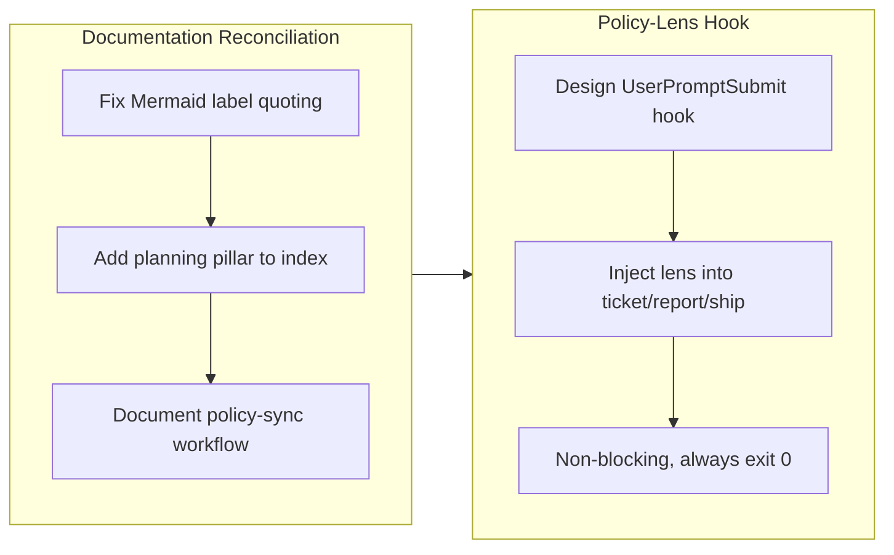

## 1. Overview

This branch makes the engineering policies apply automatically across the workflow by adding an always-triggered policy-lens `UserPromptSubmit` hook, and reconciles the root `README.md` with the current policy model. The hook injects the `planning` / `design` / `implementation` / `operation` lens into `/ticket`, `/report`, and `/ship` instead of relying on hand-written prose that had drifted; the README fix restores a broken Mermaid diagram, adds the `planning` pillar to the policy index, and documents the cross-agent policy-sync workflow.

**Highlights:**

1. Added an always-triggered `policy-lens.sh` `UserPromptSubmit` hook that injects the engineering-policy lens into the workflow commands without blocking execution, replacing per-command prose that still gated on the long-merged `standards` plugin and omitted the `planning` pillar
2. Fixed the README's "When, Where, and How Changes Occur" Mermaid lifecycle diagram, which failed to render on GitHub because node labels contained unquoted forward slashes (violating `rules/diagrams.md`)
3. Added the `planning` (企画) pillar to the README policy index and documented how policies stay synchronized from qmu.co.jp via `standards-sync/*` PRs

## 2. Motivation

The four engineering policies should shape every workflow step — a ticket spec, a report assessment, and a ship decision should all be judged against them, and a new project should get its directory layout and TypeScript conventions enforced from the first ticket. That was attempted through hand-written "Policy Lens" prose duplicated across several command and skill files, and it had drifted badly: every copy still gated on *"when the `standards` plugin is installed"* (a plugin merged into `workaholic` long ago), none mentioned the new `planning` pillar, and `/ship` had no policy lens at all. Centralizing the lens in a single always-on hook removes the drift surface. In parallel, the root README had accumulated its own debt — a Mermaid diagram that rendered an error on GitHub, a policy index missing the planning pillar, and no explanation of the policy-sync mechanism — all worth fixing together so the project's entry document matches reality.

## 3. Changes

The branch first reconciled the README with the current policy model, then centralized the previously-drifted policy lens into a single always-triggered hook covering the workflow commands.

### 3-1. Fix README: broken lifecycle Mermaid diagram, stale policy index, and missing policy-sync explanation ([2daf8e3](https://github.com/qmu/workaholic/commit/2daf8e3))

Quoted the lifecycle flowchart's node labels so the diagram renders on GitHub (the unquoted `[/ticket]`, `[tickets/todo/]`, etc. were parsed as trapezoid-shape syntax, per `rules/diagrams.md`), added the `planning` (企画) pillar to the policy index, and added an explanation of how policies sync from qmu.co.jp through `standards-sync/*` PRs.

### 3-2. Always-triggered policy-lens hook for `/ticket`, `/report`, `/ship` ([b4e57af](https://github.com/qmu/workaholic/commit/b4e57af))

Added a `UserPromptSubmit` hook (`policy-lens.sh`) that injects the `planning` / `design` / `implementation` / `operation` policy lens whenever a workflow command runs, replacing the drifted per-command prose. The hook is non-blocking (always exits 0) and complements the existing blocking ticket-validation hook.

## 4. Outcome

- Added an always-triggered `UserPromptSubmit` hook (`policy-lens.sh`) that injects policy context into `/ticket`, `/report`, and `/ship`, centralizing policy guidance and eliminating stale per-command prose.
- Fixed the broken README Mermaid diagram by quoting node labels with special characters per the project's diagram rules.
- Added the `planning` (企画) policy pillar to the README policy index and descriptions; previously only design/implementation/operation were documented.
- Documented the qmu.co.jp → `standards-sync/*` → merge policy-sync workflow in the README, clarifying how policies stay in sync across platforms.

## 5. Historical Analysis

The `planning` pillar was introduced by an earlier standards sync, which exposed the policy-lens prose as incomplete and stale — it referenced only three pillars and still gated on a `standards` plugin merged into `workaholic` long ago. The policy-lens hook extends a precedent established by the existing ticket-validation hook: adding a context-injecting, non-blocking `UserPromptSubmit` counterpart to complement blocking validation. The README's Mermaid bug mirrors an identical earlier fix where slash-quoting was added to the architecture diagram — same parse error, same solution. This branch finalizes the documentation reconciliation begun by the planning-pillar sync and consolidates the lens mechanism under a single maintainable hook that always points at the authoritative policy skills.

## 6. Concerns

### (carried from PR #41) Accepted cross-agent coupling

- **Severity:** low
- **Description:** The `core:ship` skill couples to the `CLAUDE.md` filename via `find-claude-md.sh`. On non-Claude agents without a `CLAUDE.md`, deploy/verify steps skip silently. This is an intentional, accepted contract (see [13f365e](https://github.com/qmu/workaholic/commit/13f365e) in `plugins/core/skills/ship/SKILL.md`).
- **How to Fix:** Document the expected behavior in agent-specific docs so users understand why deploy/verify are skipped on non-Claude platforms. Not a bug to fix — a contract to maintain.

### (carried from PR #41) Script rename requires stale-artifact cleanup

- **Severity:** low
- **Description:** When a bundled skill script is renamed, `build.mjs` picks up the new name automatically but does not delete the orphaned old artifact. The stale `dist/.../find-cloud-md.sh` had to be manually staged for deletion before committing (see [13f365e](https://github.com/qmu/workaholic/commit/13f365e) in `dist/workflows/skills/ship/ship/scripts/`).
- **How to Fix:** After regenerating `outputs/` following a script rename, verify `git status -- outputs/` shows the old script as deleted and explicitly stage it. Consider adding a cleanup pass to `build.mjs` to remove orphaned scripts so the manual step disappears.

### (carried from PR #42) Accepted cross-agent coupling

- **Severity:** low
- **Description:** `core:ship` remains coupled to the `CLAUDE.md` filename via `find-claude-md.sh`. This is an accepted contract, not a remediation target, but future refactors of deploy documentation should account for the tight binding.
- **How to Fix:** Document the contract in `CLAUDE.md`'s Deploy section (or nearest equivalent) so deploy-doc renames are caught in review. No code change required on this branch.

### (carried from PR #42) Script rename requires stale artifact cleanup

- **Severity:** low
- **Description:** A proposed orphan-cleanup pass in `build.mjs` to remove old-named script artifacts after cross-skill reference renaming did not land; only `lookupVersion` and `PUBLIC_SUBSTITUTIONS` additions shipped.
- **How to Fix:** Defer orphan cleanup to a follow-up ticket after confirming the current rename strategy won't create orphaned copies in `outputs/`. Low urgency.

### (carried from PR #42) references/ split deferred pending upstream clarification

- **Severity:** low
- **Description:** Splitting `drive`/`report` operational detail into sibling `references/` files was scoped out because the `skills` CLI and OpenAI agent SDK docs do not document how a `references/` directory beside `SKILL.md` is loaded.
- **How to Fix:** Confirm `references/` loading behavior upstream before reopening; once verified, the split can land in a follow-up ticket.

### (carried from PR #42) Spec-relative cross-skill references can ship broken

- **Severity:** moderate
- **Description:** Cross-skill script references must use the full `${SCRIPT_DIR}/../../../../<skill>/skills/.../scripts/` form with literal uppercase `SCRIPT_DIR` for the build's regex to detect and copy the closure. Shorter relative forms resolve in source but are invisible to the build and ship broken to Codex and the `skills` CLI (`scripts/build-plugins/build.mjs`).
- **How to Fix:** Audit new cross-skill references against `SCRIPT_CROSS_REF` in `build.mjs`, always use the full literal-`SCRIPT_DIR` form, and run `node scripts/build-plugins/verify.mjs` after adding any cross-skill call.

### (carried from PR #43) Accepted cross-agent coupling

- **Severity:** low
- **Description:** `core:ship`'s coupling to the `CLAUDE.md` filename (via `find-claude-md.sh`) is unchanged; an accepted contract, not a bug (see `.workaholic/concerns/41-accepted-cross-agent-coupling.md`).
- **How to Fix:** Document it as an intentional boundary in the standards narrative. No code change.

### (carried from PR #43) Script rename requires stale artifact cleanup

- **Severity:** low
- **Description:** `build.mjs` still has no orphan-cleanup pass; renames rely on manual `git mv` + freshness CI to catch leftovers (see `.workaholic/concerns/41-script-rename-requires-stale-artifact-cleanup.md`).
- **How to Fix:** Add a cleanup pass to `build.mjs` that removes orphaned generated artifacts before reassembly.

### (carried from PR #43) References split deferred pending upstream clarification

- **Severity:** moderate
- **Description:** The `references/` skill split remains deferred pending upstream `skills` CLI / agent SDK clarification on how a `references/` dir beside `SKILL.md` is loaded (see `.workaholic/concerns/42-references-split-deferred-pending-upstream-clarification.md`).
- **How to Fix:** Confirm the loading behavior upstream, then land the split in a follow-up.

### (carried from PR #43) Spec-relative cross-skill references remain fragile

- **Severity:** low
- **Description:** Cross-skill `${SCRIPT_DIR}` references must use the full literal form or they ship broken; verified correct via smoke tests, but the fragility persists for future changes (see `.workaholic/concerns/42-spec-relative-cross-skill-references-can.md`).
- **How to Fix:** Keep `verify.mjs` mandatory after any cross-skill ref change; consider a lint rule flagging short relative skill paths.

### (carried from PR #44) Accepted cross-agent coupling

- **Severity:** low
- **Description:** The `core:ship` skill couples to `CLAUDE.md`, a Claude-specific filename. On non-Claude agents without a `CLAUDE.md`, the deploy step skips silently. This is an intentional, accepted contract (see [13f365e](https://github.com/qmu/workaholic/commit/13f365e)).
- **How to Fix:** Document the expected behavior in agent-specific docs so users understand why deploy/verify are skipped on non-Claude platforms. Not a bug — a contract to maintain.

### (carried from PR #44) Script rename requires stale-artifact cleanup

- **Severity:** low
- **Description:** When a bundled skill script is renamed, `build.mjs` picks up the new name but does not delete the orphaned old artifact (it had to be manually staged for deletion to avoid freshness-CI drift).
- **How to Fix:** Add a cleanup pass to `build.mjs` to remove orphaned generated scripts after regeneration.

### (carried from PR #44) references/ split deferred pending upstream clarification

- **Severity:** low
- **Description:** Splitting `drive`/`report` operational detail into sibling `references/` files was scoped out because the `skills` CLI and OpenAI agent SDK docs do not document how a `references/` directory beside `SKILL.md` is loaded.
- **How to Fix:** Confirm `references/` loading behavior upstream before reopening; once verified, land the split in a follow-up.

### (carried from PR #44) Spec-relative cross-skill references can ship broken

- **Severity:** moderate
- **Description:** Cross-skill script references must use the full `${SCRIPT_DIR}/../../../../<skill>/scripts/` form with literal uppercase `SCRIPT_DIR` for the build's regex to detect and copy the closure. Shorter relative forms resolve in source but are invisible to the build and ship broken to Codex and the `skills` CLI (`scripts/build-plugins/build.mjs`).
- **How to Fix:** Audit new cross-skill references against `SCRIPT_CROSS_REF` in `build.mjs`, always use the full literal-`SCRIPT_DIR` form, and run `node scripts/build-plugins/verify.mjs` after adding any cross-skill call.

### (carried from PR #47) Confirmation execution depends on tooling that may be absent in headless/CI sessions

- **Severity:** moderate
- **Description:** Ship Flow executes the confirmation by `confirmation_method` — `browser` needs browser tooling, `server-batch` needs shell/SSH access and transient credentials, `db-query` needs a DB client. In a headless or CI ship context those may be unavailable, so a target with a declared method could still be unconfirmable at run time, forcing the §1-4 halt (`plugins/workaholic/skills/ship/SKILL.md`).
- **How to Fix:** Allow a deployment target to declare a confirmation method executable in its expected ship environment (e.g. prefer `api-probe`/`db-query` for headless), and document that `browser` confirmations assume an interactive agent. Consider a capability check before deploy.

### (carried from PR #48) Confirmation execution depends on tooling that may be absent in headless/CI sessions

- **Severity:** moderate
- **Description:** Ship Flow step 4 executes the confirmation by `confirmation_method`; in a headless/CI ship context the required tooling may be unavailable, so a target with a declared method could still be unconfirmable at run time, forcing the §1-4 halt (carried from PR #47; `plugins/workaholic/skills/ship/SKILL.md` Ship Flow step 4).
- **How to Fix:** Let a target declare a method executable in its expected ship environment (prefer `api-probe`/`db-query` for headless), document each method's runtime prerequisites in the deployments template, and consider a pre-deploy capability check that warns when the environment lacks the required tooling.

### (carried from PR #48) Deploy-on-merge vs deploy-from-branch needs clearer guidance in the contract template

- **Severity:** low
- **Description:** The reordered flow's "confirm before merge" cleanly fits branch-deploy-then-merge, but deploy-on-merge projects (the release is published *from* the merge commit) must split confirmation into pre-merge readiness and post-merge promotion — as `.workaholic/deployments/marketplace.md` does. New users may not infer that split from the README template (`.workaholic/deployments/README.md`).
- **How to Fix:** Expand the deployments README/template with both models spelled out and a copyable deploy-on-merge example, and add prose to the §1 Deployment Contract describing when each applies.

### (carried from PR #49) Existing carry-over corpus still contains chained duplicates from before the dedup fix

- **Severity:** low
- **Description:** The dedup fix stops *new* duplication, but the still-active concerns already include chained duplicates accumulated before the fix (e.g. `41-…` carried as `42-carried-from-41-…`, `43-…`, `44-…`). The dedup in [e390172](https://github.com/qmu/workaholic/commit/e390172) prevents re-emission going forward but does not retro-merge what is already there (`.workaholic/concerns/`).
- **How to Fix:** Run a one-time housekeeping pass that canonicalizes and merges existing duplicate carry chains into a single concern file each, archiving the merged duplicates — a scoped cleanup ticket, distinct from the forward-looking dedup already landed.

## 7. Successful Development Patterns

- Centralizing policy guidance in a single always-triggered `UserPromptSubmit` hook (exit 0, never block) makes the mechanism maintainable and prevents the prose drift that accumulated when the lens was duplicated across command/skill files — the non-blocking design keeps it orthogonal to validation logic.
- Keeping policies as skill `.md` files under `skills/*/policies/` with source backlinks to qmu.co.jp, and referring to them by path/namespace rather than embedding them in orchestration prose, ensures the hard copies remain the single source of truth across repeated standards syncs.
- Articulating the diagram-quoting requirement in `rules/diagrams.md` let the same Mermaid-parse fix be reapplied confidently — following the existing rule fixed the README diagram the same way the earlier architecture-diagram fix did.

## 8. Release Preparation

**Verdict**: Ready for release

### 8-1. Concerns

- None — changes are safe for release.

### 8-2. Pre-release Instructions

- None — standard release process applies.

### 8-3. Post-release Instructions

- None — no special post-release actions needed.

## 9. Notes

This branch also merged current `main` (the v1.0.58 standards-sync adding the `golang-coding-standards` policy and renaming the coding-standards/directory-structure policies) and bumped the marketplace version to v1.0.59. The two feature commits originated from separate tickets (`work-20260618-100127` for the README fix, `work-20260618-115347` for the hook); the README ticket's branch was merged in, so both are reported together here. All carried-over concerns target the build/ship/references areas, which this documentation-and-hook branch does not touch — they remain active.
