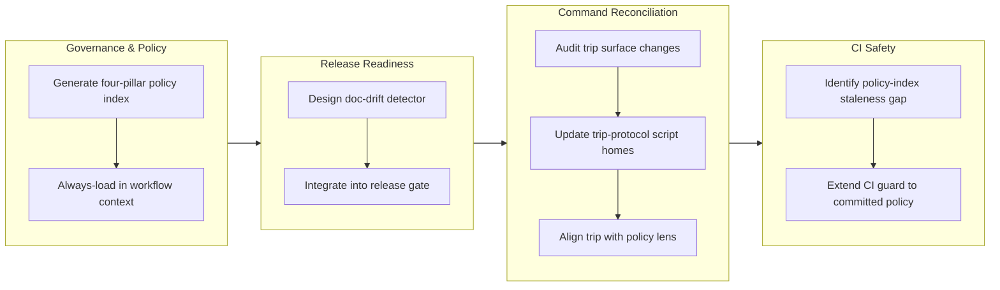

## 1. Overview

This branch hardens the workflow governance system by surfacing engineering policy inside active workflows, detecting documentation drift before release, and reconciling the `/trip` command with recent architectural changes. The result: the four-pillar policy lens (planning, design, implementation, operation) is now actually loaded into context during `/drive` and `/report`, stale meta-documentation is caught at report time rather than after ship, and `/trip` is back in sync with current conventions.

**Highlights:**

1. Added a deterministic doc-drift detector to `/report`'s release-readiness gate, surfacing stale CLAUDE.md / README.md / SKILL.md before ship
2. Injected an always-loaded four-pillar policy index into workflow context, making the engineering standards present during `/drive` and the other lensed commands
3. Reconciled the `/trip` surface with recent architecture: added the policy lens, fixed the stale Trip Ship order, relabeled obsolete plugin-name script homes
4. Guarded the committed policy index against silent staleness in CI by widening the outputs-freshness assertion to cover `hooks/policy-index.md`

## 2. Motivation

The workaholic plugin's workflow commands carry the project's engineering standards as a policy lens, but that lens was never actually loaded into context during execution — teams worked without the planning/design/implementation/operation headings in front of them. Separately, structural changes (new skills, renamed commands, refactored scripts) often went untracked in the meta-docs that index them, discovered only after ship when a review found the drift. And the `/trip` command, newly stabilized by recent architectural work, had fallen behind — missing the policy lens, describing a pre-reorder ship order, and still referencing pre-merge plugin names. This branch surfaces policy as an active context layer, catches documentation drift before it ships, and brings the remaining workflow commands into alignment.

## 3. Changes

Work began by generating an always-loaded policy index from the four pillar skills' headings and injecting it into workflow context so `/drive` and `/report` see the governance framework. In parallel, a deterministic doc-drift detector was designed to flag stale meta-documentation that should have tracked structural changes, wired as both a Section 8 release gate and a durable carry-over concern. The `/trip` surface was then reconciled with current architecture — adding the policy lens section, fixing the stale Trip Ship step order, and relabeling script homes. Finally, CI was hardened by widening the outputs-freshness guard to cover the committed policy index, closing the silent-staleness gap.

### 3-1. Catch /trip surface up to recent architectural changes ([82c7b78](https://github.com/qmu/workaholic/commit/82c7b78))

Reconciled the `/trip` surface with three post-merge changes the other workflow commands had already absorbed: added the policy-lens marker and a Policy Lens section to `commands/trip.md`, rewrote the trip-protocol Trip Ship flow to mirror the current deploy-confirm-before-merge (merge-last) order with the `.workaholic/deployments/` hard gate, and relabeled obsolete `core`/`work` script homes to `branching`/`trip-protocol`. Behavior of the trip protocol is unchanged.

### 3-2. Add /report documentation-drift check ([a2d15c5](https://github.com/qmu/workaholic/commit/a2d15c5))

Added a deterministic documentation-drift check to `/report`'s release-readiness assessment. A new POSIX-sh `doc-drift.sh` emits structural facts (skills/commands/agents/hooks/scripts added, removed, or renamed, and whether the index/meta docs were touched in the same range); the release-readiness leaf judges which candidates are real drift. Confirmed drift surfaces both as a Section 8 ship gate and a durable Section 6 carry-over Concern, while excluding `outputs/` staleness and version drift that other guards own.

### 3-3. Inject always-loaded four-pillar policy index into the workflow lens ([762c1c0](https://github.com/qmu/workaholic/commit/762c1c0))

Made the four-pillar policy index actually present in context during workflows. `build.mjs` now generates `hooks/policy-index.md` (a compact table of contents — headings plus one-line summaries, no bodies) from the four pillar `SKILL.md` `## Policies` sections, and `policy-lens.sh` injects it on the workflow-invocation turn while still referring full policy bodies on-demand. `/drive` was brought into the lens with its own marker. The sentinel rides in the expanded command body, so the index loads once per workflow start, not per prompt.

### 3-4. Guard the committed policy-index against silent staleness in CI ([6d869b6](https://github.com/qmu/workaholic/commit/6d869b6))

Closed a CI freshness blind spot in the previous ticket: `outputs-freshness.yml` runs `build.mjs` (which rewrites the on-disk index) before `verify.mjs` reads it, and its final `git diff` covered only `outputs/`. A hand-edited `## Policies` bullet committed without regenerating the index would have shipped green. The diff assertion now also covers `plugins/workaholic/hooks/policy-index.md`; verified that a stale index turns CI red and a rebuild turns it green.

## 4. Outcome

- **Polish `/trip` command** — reconciled the `/trip` surface (commands/trip.md, trip-protocol skill, and Agent Teams members) with post-merge architectural changes: added the policy-lens marker and Policy Lens section, rewrote the Trip Ship flow to reflect the current deploy-confirm-before-merge order with `.workaholic/deployments/` hard gate, and relabeled obsolete plugin names (core/work → workaholic/branching/trip-protocol).
- **Assess `/report` documentation drift** — added a deterministic doc-drift check to the release-readiness assessment: new bundled script `doc-drift.sh` emits structural facts (skills added/removed/renamed, whether meta-docs were touched), the release-readiness leaf judges which candidates are real drift, and confirmed drift surfaces both as a Section 8 gate and a durable Section 6 Concern via the carry-over pipeline.
- **Always-loaded policy index** — generated the four-pillar policy digest from the `## Policies` sections of the four pillar SKILL.md files, committed it as `plugins/workaholic/hooks/policy-index.md`, and wired it into `policy-lens.sh` to be injected on every tagged workflow turn; brought `/drive` into the policy-lens scope by adding the marker and Policy Lens section to commands/drive.md.
- **Verify stale committed policy index** — hardened the CI freshness guard to catch a stale committed `hooks/policy-index.md` by extending the `outputs-freshness.yml` `git diff` assertion to cover `plugins/workaholic/hooks/policy-index.md` alongside `outputs/`, preventing silent drift when a PR edits the `## Policies` bullets but forgets to regenerate.

## 5. Historical Analysis

- **Documentation drift as a recurrent failure mode** — The `/trip` catch-up and `/report` drift-check tickets both trace back to stale meta-docs lagging structural changes (trip-protocol post-merge, README Mermaid/policy index pre-merge). The new drift check is the first systematic detector; it would have caught the `/trip` lag and the recent README drift reactively. Past tickets show drift is discovered only after ship or through manual audit, motivating the proactive doc-drift lens in `/report`.
- **Policy lens adoption across workflow commands** — The policy-lens hook (PR #51) was intentionally scoped to `/ticket`, `/report`, `/ship` initially, but subsequent work revealed `/trip` (this branch) and `/drive` (also this branch) both needed the same lens for consistency. The pattern: once the lens exists, all commands that change state or make decisions should carry the marker and preload the policies.
- **Generated artifacts require dual freshness guards** — The policy-index digest is the first generated-and-committed artifact outside `outputs/`. The Outputs Freshness CI catches `outputs/` drift via post-build `git diff`, but `policy-index.md` required explicit addition to that diff list. Pattern: any future generated-and-committed file outside `outputs/` must be named in the CI diff assertion, or staleness will silently pass.
- **Single source of truth for generated content** — The policy index is generated FROM the four `## Policies` sections, not hand-duplicated. The `workaholic-standards-sync` controller ensures the source (`## Policies` bullets) stays in sync with qmu.co.jp; this repo's build regenerates the digest automatically. Pattern: generation logic (build.mjs), freshness checks (verify.mjs, CI), and the shared generator (`policy-index.mjs`) all consume one source to prevent parallel drift.

## 6. Concerns

### (carried from PR #41) Accepted cross-agent coupling

- **Severity:** low
- **Description:** The `workaholic:ship` skill couples to the `CLAUDE.md` filename via `find-claude-md.sh`. On non-Claude agents (Codex, OpenCode) without a `CLAUDE.md`, the deploy step skips silently. This is an intentional, accepted consequence of the `CLAUDE.md`-only design (see [13f365e](https://github.com/qmu/workaholic/commit/13f365e) in `plugins/workaholic/skills/ship/SKILL.md`).
- **How to Fix:** Document the expected behavior in agent-specific docs so users understand why deploy/verify are skipped on non-Claude platforms when no `CLAUDE.md` exists. Not a bug to fix — a contract to maintain.

### (carried from PR #41) Script rename requires stale-artifact cleanup

- **Severity:** low
- **Description:** When a bundled skill script is renamed, `build.mjs` picks up the new name automatically but does not delete the orphaned old artifact. The stale `outputs/.../find-cloud-md.sh` had to be manually staged for deletion before committing, or `outputs-freshness` CI would have failed (see [13f365e](https://github.com/qmu/workaholic/commit/13f365e) in `outputs/workflows/skills/ship/ship/scripts/`).
- **How to Fix:** After regenerating `outputs/` following a script rename, verify `git status -- outputs/` shows the old script as deleted and explicitly stage it. Consider adding a cleanup pass to `build.mjs` to remove orphaned scripts so the manual step disappears.

### (carried from PR #42) Accepted cross-agent coupling

- **Severity:** low
- **Description:** `workaholic:ship` remains coupled to the `CLAUDE.md` filename via `find-claude-md.sh`. This is an accepted contract, not a remediation target, but future refactors of deploy documentation should account for the tight binding.
- **How to Fix:** Document the contract in `CLAUDE.md`'s Deploy section (or nearest equivalent) so deploy-doc renames are caught in review. No code change required on this branch.

### (carried from PR #42) Script rename requires stale artifact cleanup

- **Severity:** low
- **Description:** A proposed orphan-cleanup pass in `build.mjs` to remove old-named script artifacts after cross-skill reference renaming did not land; only `lookupVersion` and `PUBLIC_SUBSTITUTIONS` additions shipped.
- **How to Fix:** Defer orphan cleanup to a follow-up ticket after confirming the current rename strategy won't create orphaned copies in `outputs/`. Low urgency.

### (carried from PR #42) Spec-relative cross-skill references can ship broken

- **Severity:** moderate
- **Description:** Cross-skill script references must use the full `${SCRIPT_DIR}/../../../../workaholic/skills/.../scripts/` form with literal uppercase `SCRIPT_DIR` for the dist build's regex to detect and copy the closure. Shorter relative forms resolve in source but are invisible to the build and ship broken to Codex and the `skills` CLI (see commit 9aab12d in `scripts/build-plugins/build.mjs`).
- **How to Fix:** Audit new cross-skill references against `SCRIPT_CROSS_REF` in `build.mjs`, always use the full literal-`SCRIPT_DIR` form, and run `node scripts/build-plugins/verify.mjs` after adding any cross-skill call.

### (carried from PR #42) references/ split deferred pending upstream clarification

- **Severity:** low
- **Description:** Splitting `drive`/`report` operational detail into sibling `references/` files was scoped out because the `skills` CLI and OpenAI agent SDK docs do not document how a `references/` directory beside `SKILL.md` is loaded (see commit 5c6f35d in `plugins/workaholic/skills/report/SKILL.md`).
- **How to Fix:** Confirm `references/` loading behavior upstream before reopening; once verified, the split can land in a follow-up ticket.

### (carried from PR #43) Accepted cross-agent coupling

- **Severity:** low
- **Description:** `workaholic:ship`'s coupling to the `CLAUDE.md` filename (via `find-claude-md.sh`) is unchanged; an accepted contract, not a bug (see `.workaholic/concerns/41-accepted-cross-agent-coupling.md`).
- **How to Fix:** Document it as an intentional boundary in the pending standards narrative rewrite. No code change.

### (carried from PR #43) Script rename requires stale artifact cleanup

- **Severity:** low
- **Description:** `build.mjs` still has no orphan-cleanup pass; renames rely on manual `git mv` + freshness CI to catch leftovers (see `.workaholic/concerns/41-script-rename-requires-stale-artifact-cleanup.md`).
- **How to Fix:** Add a cleanup pass to `build.mjs` that removes orphaned generated artifacts before reassembly.

### (carried from PR #43) References split deferred pending upstream clarification

- **Severity:** moderate
- **Description:** The `references/` skill split remains deferred pending upstream `skills` CLI / agent SDK clarification on how a `references/` dir beside `SKILL.md` is loaded (see `.workaholic/concerns/42-references-split-deferred-pending-upstream-clarification.md`).
- **How to Fix:** Confirm the loading behavior upstream, then land the split in a follow-up.

### (carried from PR #43) Spec-relative cross-skill references remain fragile

- **Severity:** low
- **Description:** Cross-skill `${SCRIPT_DIR}` references must use the full literal form or they ship broken; verified correct in this merge via smoke tests, but the fragility persists for future changes (see `.workaholic/concerns/42-spec-relative-cross-skill-references-can.md`).
- **How to Fix:** Keep `verify.mjs` mandatory after any cross-skill ref change; consider a lint rule flagging short relative skill paths.

### (carried from PR #44) Accepted cross-agent coupling

- **Severity:** low
- **Description:** The `workaholic:ship` skill couples to `CLAUDE.md`, a Claude-specific filename. On non-Claude agents without a `CLAUDE.md`, the deploy step skips silently. This is an intentional, accepted contract (see [13f365e](https://github.com/qmu/workaholic/commit/13f365e)).
- **How to Fix:** Document the expected behavior in agent-specific docs so users understand why deploy/verify are skipped on non-Claude platforms. Not a bug — a contract to maintain.

### (carried from PR #44) Script rename requires stale-artifact cleanup

- **Severity:** low
- **Description:** When a bundled skill script is renamed, `build.mjs` picks up the new name but does not delete the orphaned old artifact (it had to be manually staged for deletion to avoid freshness-CI drift).
- **How to Fix:** Add a cleanup pass to `build.mjs` to remove orphaned generated scripts after regeneration.

### (carried from PR #44) references/ split deferred pending upstream clarification

- **Severity:** low
- **Description:** Splitting `drive`/`report` operational detail into sibling `references/` files was scoped out because the `skills` CLI and OpenAI agent SDK docs do not document how a `references/` directory beside `SKILL.md` is loaded.
- **How to Fix:** Confirm `references/` loading behavior upstream before reopening; once verified, land the split in a follow-up.

### (carried from PR #44) Spec-relative cross-skill references can ship broken

- **Severity:** moderate
- **Description:** Cross-skill script references must use the full `${SCRIPT_DIR}/../../../../<skill>/scripts/` form with literal uppercase `SCRIPT_DIR` for the dist build's regex to detect and copy the closure. Shorter relative forms resolve in source but are invisible to the build and ship broken to Codex and the `skills` CLI (`scripts/build-plugins/build.mjs`).
- **How to Fix:** Audit new cross-skill references against `SCRIPT_CROSS_REF` in `build.mjs`, always use the full literal-`SCRIPT_DIR` form, and run `node scripts/build-plugins/verify.mjs` after adding any cross-skill call.

### (carried from PR #47) Confirmation execution depends on tooling that may be absent in headless/CI sessions

- **Severity:** moderate
- **Description:** Step 6 executes the confirmation by `confirmation_method` — `browser` needs browser tooling, `server-batch` needs shell/SSH access and transient credentials, `db-query` needs a DB client. In a headless or CI ship context those may be unavailable, so a target with a declared method could still be unconfirmable at run time, forcing the §1-4 halt (`plugins/workaholic/skills/ship/SKILL.md` Ship Flow step 6).
- **How to Fix:** Allow a deployment target to declare a confirmation method that is executable in the expected ship environment (e.g. prefer `api-probe`/`db-query` for headless contexts), and document that `browser` confirmations assume an interactive agent. Consider a capability check before deploy.

### (carried from PR #48) Confirmation execution depends on tooling that may be absent in headless/CI sessions

- **Severity:** moderate
- **Description:** Ship Flow step 4 executes the confirmation by `confirmation_method` — `browser` needs browser tooling, `server-batch` needs shell/SSH + transient credentials, `db-query` needs a DB client. In a headless/CI ship context those may be unavailable, so a target with a declared method could still be unconfirmable at run time, forcing the §1-4 halt (carried from PR #47; `plugins/workaholic/skills/ship/SKILL.md` Ship Flow step 4).
- **How to Fix:** Let a target declare a method executable in its expected ship environment (prefer `api-probe`/`db-query` for headless), document each method's runtime prerequisites in the deployments template, and consider a pre-deploy capability check that warns when the environment lacks the required tooling.

### (carried from PR #48) Deploy-on-merge vs deploy-from-branch needs clearer guidance in the contract template

- **Severity:** low
- **Description:** The reordered flow's "confirm before merge" cleanly fits branch-deploy-then-merge, but deploy-on-merge projects (the release is published *from* the merge commit) must split confirmation into pre-merge readiness and post-merge promotion — as `.workaholic/deployments/marketplace.md` does. New users may not infer that split from the README template (`.workaholic/deployments/README.md`).
- **How to Fix:** Expand the deployments README/template with both models spelled out and a copyable deploy-on-merge example, and add prose to the §1 Deployment Contract describing when each applies.

### (carried from PR #49) Existing carry-over corpus still contains chained duplicates from before the dedup fix

- **Severity:** low
- **Description:** This branch stops *new* duplication, but the ~17 still-active concerns already include chained duplicates accumulated before the fix (e.g. `41-…` carried as `42-carried-from-41-…`, `43-…`, `44-…`). The dedup in [e390172](https://github.com/qmu/workaholic/commit/e390172) prevents re-emission going forward but does not retro-merge what is already there (`.workaholic/concerns/`).
- **How to Fix:** Run a one-time housekeeping pass that canonicalizes and merges existing duplicate carry chains into a single concern file each, archiving the merged duplicates — a scoped cleanup ticket, distinct from the forward-looking dedup landed here.

### (carried from PR #51) Confirmation execution depends on tooling that may be absent in headless/CI sessions

- **Severity:** moderate
- **Description:** Ship Flow executes the confirmation by `confirmation_method` — `browser` needs browser tooling, `server-batch` needs shell/SSH access and transient credentials, `db-query` needs a DB client. In a headless or CI ship context those may be unavailable, so a target with a declared method could still be unconfirmable at run time, forcing the §1-4 halt (`plugins/workaholic/skills/ship/SKILL.md`).
- **How to Fix:** Allow a deployment target to declare a confirmation method executable in its expected ship environment (e.g. prefer `api-probe`/`db-query` for headless), and document that `browser` confirmations assume an interactive agent. Consider a capability check before deploy.

### (carried from PR #51) Deploy-on-merge vs deploy-from-branch needs clearer guidance in the contract template

- **Severity:** low
- **Description:** The reordered flow's "confirm before merge" cleanly fits branch-deploy-then-merge, but deploy-on-merge projects (the release is published *from* the merge commit) must split confirmation into pre-merge readiness and post-merge promotion — as `.workaholic/deployments/marketplace.md` does. New users may not infer that split from the README template (`.workaholic/deployments/README.md`).
- **How to Fix:** Expand the deployments README/template with both models spelled out and a copyable deploy-on-merge example, and add prose to the §1 Deployment Contract describing when each applies.

### (carried from PR #51) Existing carry-over corpus still contains chained duplicates from before the dedup fix

- **Severity:** low
- **Description:** The dedup fix stops *new* duplication, but the still-active concerns already include chained duplicates accumulated before the fix (e.g. `41-…` carried as `42-carried-from-41-…`, `43-…`, `44-…`). The dedup in [e390172](https://github.com/qmu/workaholic/commit/e390172) prevents re-emission going forward but does not retro-merge what is already there (`.workaholic/concerns/`).
- **How to Fix:** Run a one-time housekeeping pass that canonicalizes and merges existing duplicate carry chains into a single concern file each, archiving the merged duplicates — a scoped cleanup ticket, distinct from the forward-looking dedup already landed.

## 7. Successful Development Patterns

- **Documentation-first drift detection** — The new `/report` doc-drift check validates that code/structure changes are mirrored in meta-docs at report time, not discovered reactively. This caught the `/trip` lag and recent README drift. Pattern: embedding systematic checks for documentation coherence in release-readiness gates shifts failure discovery upstream, before ship.
- **Single-source regeneration for generated artifacts** — The policy-index digest, once generated from the `## Policies` sections, is committed and guarded by dual freshness checks (in-process `verify.mjs` + post-build CI `git diff`). This ensures the source and artifact stay in lockstep without manual bookkeeping. Pattern: generation logic, freshness checks, and multi-repo generation (sync controller) all import one canonical generator to prevent parallel drift.
- **Marker-based policy lens adoption** — The policy-lens hook fires only when a command carries the `workaholic:policy-lens` sentinel, not based on command name. This allowed `/trip` and `/drive` to opt in independently after the hook was implemented, and future commands can do the same. Pattern: explicit sentinel-based opt-in is more flexible and discoverable than hidden command-name matching.
- **Graceful degradation in deterministic checks** — The `doc-drift.sh` script emits facts (candidates for drift), not verdicts. A missing base branch, absent `docs/` directory, or other environmental variance returns an empty/non-blocking result rather than erroring. The release-readiness leaf then judges; the script stays deterministic and scriptable. Pattern: deferred judgment (script → facts, agent → verdict) keeps the tooling layer lean and operations-safe.
- **Cross-repo artifact coordination** — The `workaholic-standards-sync` controller regenerates the policy index using this repo's own `policy-index.mjs` generator, so the automated path produces byte-identical artifacts. This dual-generation (sync controller + local build) ensures no human-edited divergence. Pattern: when cross-repo coordination is necessary, sharing code/generators is more reliable than duplicating specifications.

## 8. Release Preparation

**Verdict**: Ready for release

### 8-1. Concerns

- None — changes are safe for release. The new doc-drift check was exercised against this branch and returned no candidates: CLAUDE.md was correctly updated for the new hook/script, README needed no structural change, and `outputs/` / `policy-index.md` rebuild clean. All guards (`verify.mjs`, `validate-metadata.mjs`, 75 hermetic smoke tests) pass.

### 8-2. Pre-release Instructions

- None — version already bumped to v1.0.60; standard release process applies.

### 8-3. Post-release Instructions

- None — no special post-release actions needed.

## 9. Notes

- A companion follow-up lives outside this repo: `workaholic-standards-sync`'s `20260619011105-always-loaded-policy-index-digest.md` keeps the four `## Policies` sections (the policy index's source) fresh from qmu.co.jp. The injection side shipped here; the content-sync side is tracked there.
- The 21 carried-over concerns above are unrelated to this branch's work (they target the `ship` skill's CLAUDE.md coupling, `build.mjs` orphan cleanup, the `references/` split, deploy-confirmation tooling in headless contexts, and a one-time carry-over corpus de-duplication). They re-surface for visibility and will carry forward on `/ship` until separately addressed.
