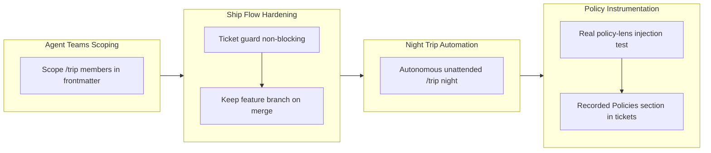

## 1. Overview

This branch delivers six workflow and plugin improvements to the workaholic system. It scopes the `/trip` Agent Teams members in frontmatter so non-trip workflows never invoke them, makes the `/ship` ticket guard non-blocking, adds a Night Trip autonomous unattended mode for `/trip`, preserves the feature branch on merge via `--no-delete-branch`, adds a real (non-mock) test of the policy-lens injection mechanism, and records a mandatory `## Policies` section in tickets so `/drive` and `/trip` refer to the corporate standard policies at implementation time.

**Highlights:**

1. Scope `/trip` Agent Teams members in frontmatter so non-trip workflows never invoke them as subagents
2. Make the `/ship` ticket guard non-blocking — note queued todo tickets, but never prompt or block the merge
3. Add Night Trip: an autonomous, unattended `/trip night` that runs to completion without stopping to ask the developer
4. Keep the feature branch on merge with `--no-delete-branch`, and add a real hermetic policy-lens injection test
5. Record a mandatory `## Policies` section in tickets that `/drive` and `/trip` read before implementing

## 2. Motivation

The workaholic plugin has matured to the point where it needs tighter boundaries between workflow contexts and richer instrumentation for automated runs. Trip-scoped agents prevent accidental invocation outside `/trip`, while Night Trip lets a multi-agent team run overnight unattended on the strength of the trip protocol's existing convergence machinery. Making the ticket guard non-blocking removes spurious friction from `/ship` without sacrificing the real gates. Recording the standard policies directly in each ticket makes it explicitly confirmable — after the fact — which qmu.co.jp-synced engineering policies an implementation answered to, closing the gap between the write-time policy lens and the later `/drive` and `/trip` implementation steps.

## 3. Changes

Development progressed through four interconnected areas: first establishing boundaries between workflow contexts by scoping the trip agents, then hardening the ship flow (non-blocking guard, branch preservation), then unlocking unattended overnight runs with Night Trip, and finally strengthening the policy-lens layer with a real injection test and a durable in-ticket policy record.

### 3-1. Scope the `/trip` Agent Teams members in frontmatter so `/drive` (and other workflows) never invoke them ([510eddb](https://github.com/qmu/workaholic/commit/510eddb))

Rewrote the `planner`, `architect`, and `constructor` agent `description` frontmatter to state they are launched only by `/trip` as Agent Teams members and never as `Task`/`general-purpose` subagents, so the model's auto-delegation in non-trip flows (e.g. `/drive`) never selects them.

### 3-2. Make `/ship`'s ticket guard non-blocking ([76b49fb](https://github.com/qmu/workaholic/commit/76b49fb))

Turned the queued-todo-ticket check into an informational note rather than a gate: `/ship` reports any queued tickets but never prompts or blocks the merge. The real gates — Workspace Guard and pre-merge deployment confirmation — remain intact.

### 3-3. Add Night Trip: an autonomous, unattended `/trip night` ([2965b2c](https://github.com/qmu/workaholic/commit/2965b2c))

Added a night mode to `/trip` that runs the three-agent team to completion with zero developer questions, defaulting to a new isolated worktree, resolving disagreements through the existing review/moderation/convergence-cap machinery, and safe-parking on blockers rather than hanging or running destructive git.

### 3-4. `/ship`: keep the feature branch on merge ([bed4bcd](https://github.com/qmu/workaholic/commit/bed4bcd))

Passed `--no-delete-branch` to `gh pr merge` so the feature branch survives the merge and `/ship` stops prompting to delete the remote branch.

### 3-5. Real (non-mock) test that the policy lens injects the standard policy skills ([e4f12bc](https://github.com/qmu/workaholic/commit/e4f12bc))

Added a hermetic test that runs the actual `policy-lens.sh` hook against the committed policy index and asserts the four-pillar standard policy skills are injected under a workflow command (and withheld otherwise) — proving end-to-end delivery into context without mocking.

### 3-6. Record the standard policies a ticket answers to, and have `/drive` and `/trip` refer to them ([85497b3](https://github.com/qmu/workaholic/commit/85497b3))

Added a mandatory, never-empty `## Policies` section to the ticket template (and its trip equivalent in the Constructor's design artifact) listing the qmu.co.jp-synced policies; `/drive` reads that recorded list and opens each named policy before writing code, and the trip agents do the same from the design artifact.

## 4. Outcome

The branch tightens the plugin's workflow boundaries and instrumentation:

- The `/trip` Agent Teams members (`planner`, `architect`, `constructor`) are scope-guarded in frontmatter so they are never invoked as subagents outside `/trip`.
- `/ship`'s ticket guard is now informational — it surfaces queued todo tickets but never blocks the merge — while the Workspace Guard and deployment-confirmation gates remain.
- `/trip night` runs an autonomous, unattended team session that converges via the 3-round cap with forced moderation and safe-parks on blockers.
- `/ship` keeps the feature branch on merge via `--no-delete-branch`.
- The policy-lens hook has a real, hermetic test proving it injects the standard policy skills under a workflow command.
- Implementation tickets and trip designs now carry a mandatory `## Policies` section recording which standard engineering policies the implementation answers to, read by `/drive` and `/trip` at implementation time.

## 5. Historical Analysis

The changes continue a convergent trajectory of policy-lens and workflow-guard work across recent branches:

- **Policy lens maturation**: the always-on policy-lens hook (`work-20260618-115347`) and its always-loaded index injection (`work-20260618-182253`) now gain a real runtime test and a durable per-ticket record, completing the path from write-time lens to implementation-time reference.
- **Trip protocol autonomy**: Night Trip extends the Night Drive autonomous-queue pattern into the Agent Teams domain. The trip protocol's convergence cap, forced moderation, and 2/3 rollback were already sufficient for unattended termination; Night Trip unlocks them by removing developer stop points and adding safe-park graceful failure.
- **Ship-flow maturation**: the deploy-confirm-before-merge reorder (`work-20260617-231848`) established merge-last with confirmation before merge; this branch removes spurious blocking gates (ticket queue, branch-deletion prompt) while keeping the real ones.
- **Agent scope clarification**: the single-plugin merge (`work-20260617-000311`) unified namespaces and roles; this branch makes the trip-only constraint on the three members unambiguous to the delegating model via frontmatter rather than prose alone.

## 6. Concerns

The following concerns were carried over from prior PRs and remain `still_active` — none of this branch's work intersects their referenced files or remediation triggers. They are deduplicated here to their canonical root issues.

### (carried from PR #41) Accepted cross-agent coupling

- **Severity:** low
- **Description:** The `ship` skill couples the deploy step to the Claude-specific `CLAUDE.md` filename via `find-claude-md.sh`; on non-Claude agents without a `CLAUDE.md`, deploy/verify skip silently. This is an intentional, accepted contract, not a bug (see `.workaholic/concerns/41-accepted-cross-agent-coupling.md`).
- **How to Fix:** Document the expected behavior in agent-specific docs so users understand why deploy/verify are skipped on non-Claude platforms when no `CLAUDE.md` exists. No code change — a contract to maintain.

### (carried from PR #41) Script rename requires stale-artifact cleanup

- **Severity:** low
- **Description:** When a bundled skill script is renamed, `build.mjs` picks up the new name but does not delete the orphaned old artifact, so a stale generated script can linger in `outputs/` until manually staged for deletion (see `.workaholic/concerns/41-script-rename-requires-stale-artifact-cleanup.md`).
- **How to Fix:** Add a cleanup pass to `build.mjs` that removes orphaned generated scripts before reassembly, so the manual `git status -- outputs/` check disappears.

### (carried from PR #42) references/ split deferred pending upstream clarification

- **Severity:** moderate
- **Description:** Splitting `drive`/`report` operational detail into sibling `references/` files was scoped out because the `skills` CLI and OpenAI agent SDK docs do not document how a `references/` directory beside `SKILL.md` is loaded (see `.workaholic/concerns/42-references-split-deferred-pending-upstream-clarification.md`).
- **How to Fix:** Confirm `references/` loading behavior upstream before reopening; once verified, land the split in a follow-up.

### (carried from PR #42) Spec-relative cross-skill references can ship broken

- **Severity:** moderate
- **Description:** Cross-skill script references must use the full `${SCRIPT_DIR}/../../../../<skill>/scripts/` form with literal uppercase `SCRIPT_DIR` for the build's regex to detect and copy the closure; shorter relative forms resolve in source but are invisible to the build and ship broken to Codex and the `skills` CLI (`scripts/build-plugins/build.mjs`; see `.workaholic/concerns/42-spec-relative-cross-skill-references-can.md`).
- **How to Fix:** Audit new cross-skill references against `SCRIPT_CROSS_REF` in `build.mjs`, always use the full literal-`SCRIPT_DIR` form, and run `node scripts/build-plugins/verify.mjs` after adding any cross-skill call; consider a lint rule flagging short relative skill paths.

### (carried from PR #47) Confirmation execution depends on tooling that may be absent in headless/CI sessions

- **Severity:** moderate
- **Description:** The Ship Flow executes the deployment confirmation by `confirmation_method` — `browser` needs browser tooling, `server-batch` needs shell/SSH and transient credentials, `db-query` needs a DB client. In a headless or CI ship context those may be unavailable, so a target with a declared method could still be unconfirmable at run time, forcing the halt-and-ask (`plugins/workaholic/skills/ship/SKILL.md`; see `.workaholic/concerns/47-confirmation-execution-depends-on-tooling-that.md`).
- **How to Fix:** Let a target declare a confirmation method executable in its expected ship environment (prefer `api-probe`/`db-query` for headless), document each method's runtime prerequisites, and consider a pre-deploy capability check that warns when the environment lacks the required tooling.

### (carried from PR #48) Deploy-on-merge vs deploy-from-branch needs clearer guidance in the contract template

- **Severity:** low
- **Description:** The "confirm before merge" flow fits branch-deploy-then-merge cleanly, but deploy-on-merge projects (the release is published from the merge commit) must split confirmation into pre-merge readiness and post-merge promotion; new users may not infer that split from the README template (`.workaholic/deployments/README.md`; see `.workaholic/concerns/48-deploy-on-merge-vs-deploy-from.md`).
- **How to Fix:** Expand the deployments README/template with both models spelled out and a copyable deploy-on-merge example, and add prose to the Deployment Contract describing when each applies.

### (carried from PR #49) Existing carry-over corpus still contains chained duplicates

- **Severity:** low
- **Description:** The dedup fix stops new duplication, but the still-active concerns already include chained duplicates accumulated before the fix (e.g. `41-…` carried as `42-carried-from-41-…`, `43-…`, `44-…`). The fix prevents re-emission going forward but does not retro-merge what is already in `.workaholic/concerns/` (see `.workaholic/concerns/49-existing-carry-over-corpus-still-contains.md`).
- **How to Fix:** Run a one-time housekeeping pass that canonicalizes and merges existing duplicate carry chains into a single concern file each, archiving the merged duplicates — a scoped cleanup ticket, distinct from the forward-looking dedup already landed.

## 7. Successful Development Patterns

- **Agent scoping belongs in machine-readable frontmatter, not prose.** Claude Code's subagent auto-delegation selects by `description` text; a rule in `CLAUDE.md` prose cannot override that signal. Encoding the trip-only constraint in each member's `description` frontmatter is what makes the constraint actually hold across delegating models.
- **Separate fact-gathering (scripts) from policy (skill prose).** The `/ship` ticket-guard change required zero script edits — the script already returned `{clean, count, tickets}`; only the skill's interpretation of those facts changed from "block" to "note." Keeping policy in prose makes gate-vs-note decisions low-risk.
- **Invest in convergence guarantees so unattended modes become subtractive.** Night Trip added no new autonomous-decision logic; the trip protocol's 3-round cap, forced moderation, and 2/3 rollback were already sufficient. Removing developer stop points and adding safe-park graceful failure was enough — a cheap addition on a solid foundation.
- **Test pure-function components against the real thing, not a mock.** The policy-lens hook is a pure stdin→stdout function over a committed file; a hermetic test of the real hook is both simpler and more convincing than a mocked one, and proves delivery into context in practice.
- **Record external-standard references as durable artifact fields.** A mandatory `## Policies` section makes which qmu.co.jp policies an implementation answered to inspectable months later, persisting past the session context where the policy-lens hook fired.
- **Fail-safe-park-and-report is the unattended-run safeguard.** Night Trip terminates in either `complete/done` or a clearly recorded park — never a silent hang or corrupted state — by recording blockers, stopping at the furthest safe state, and never running destructive git or waiting for a human.

## 8. Release Preparation

**Verdict**: Ready for release

### 8-1. Concerns

- None — changes are safe for release. Every change is documentation/configuration (skill prose, agent frontmatter, and regenerated `outputs/` mirrors); the full verification suite passes (`build.mjs`, `verify.mjs`, `validate-metadata.mjs`, and `test-workflow-scripts.mjs` — 91 passed, 0 failed), `outputs/` and the policy index are in lockstep, and version files are aligned at v1.0.61.

### 8-2. Pre-release Instructions

- None — standard release process applies. The version bump to v1.0.61 is already committed on this branch.

### 8-3. Post-release Instructions

- None — no special post-release actions needed.

## 9. Notes

This is a configuration/documentation project with no build step. The carried-over concerns in section 6 are passive institutional memory from earlier PRs and are not regressions introduced by this branch; they will be re-extracted (and deduplicated) by `/ship`. The new `## Policies` ticket section was itself dogfooded: the final ticket on this branch carried the section, and `/drive` opened the listed `implementation` policies (directory-structure, coding-standards, objective-documentation) before implementing.

## Deployment Evidence

- **When:** 2026-06-23T18:05:12+09:00
- **Target:** Workaholic marketplace plugin
- **Method:** other (pre-merge build/verify/test proof)
- **Status:** pass
- **Observed:** outputs/ fresh after rebuild (git porcelain empty); verify.mjs self-contained + policy-index in sync; validate-metadata.mjs version-aligned; test-workflow-scripts.mjs 91 passed 0 failed; version 1.0.61 consistent across all lockstep files
