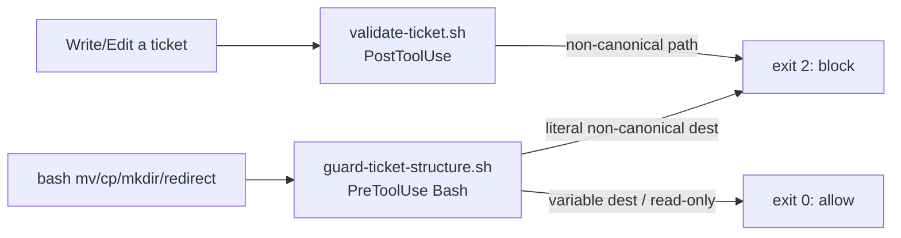

## 1. Overview

Closes the structural-enforcement gap in workaholic's ticket management. The only guard that policed where tickets live — `validate-ticket.sh` — is a **PostToolUse `Write|Edit`** hook, so it never sees `bash mv`/`mkdir`. That blind spot let a consumer repo (data-platform) accrue real drift: an invented `done/` directory, archives nested at `todo/<user>/archive/`, and root-level `todo/` strays. This branch hardens enforcement so `/ticket` and `/drive` cannot produce those layouts.

**Highlights:**

1. Tightened `validate-ticket.sh` location rules: `todo/<user>/` is now mandatory (root-level strays rejected), `abandoned/` is recognized as canonical (fixing a latent rejection bug), and `done/` / nested `todo/<user>/archive/` fall through to the error.
2. Added a new PreToolUse `Bash` guard `guard-ticket-structure.sh` (POSIX sh) that blocks `mv`/`cp`/`mkdir`/redirect commands placing a ticket into a non-canonical location — the move path the Write/Edit hook is blind to. Registered in `hooks.json`; covered by 18 new hermetic tests.

## 2. Motivation

The data-platform repo demonstrated that prose conventions and a Write/Edit-only validator are insufficient: completed tickets were hand-`mv`'d into an invented `done/`, and a stale `archive.sh` (predating the per-user `todo/` convention) archived into `todo/<user>/archive/`. None of these are Write/Edit operations, so the existing hook was silent. The fix had to add a layer that sees shell moves, and to tighten two latent gaps (root strays accepted, `abandoned/` rejected) in the existing validator — so the canonical layout (`todo/<user>/`, `icebox/`, `abandoned/`, `archive/<branch>/`) is machine-enforced, not merely documented.

## 3. Changes

### 3-1. Harden ticket-structure enforcement ([cd240f2](https://github.com/qmu/workaholic/commit/cd240f2))

- **`validate-ticket.sh`**: location block tightened — `^todo/[^/]+/[^/]+$` (mandatory user segment), new `abandoned/` arm, error message enumerates the canonical set and names `done/`/root strays as disallowed. The trailing anchors already reject nested `todo/<user>/archive/`.
- **`guard-ticket-structure.sh`** (new, POSIX `#!/bin/sh`): reads `.tool_input.command`; no-ops on non-tickets / read-only / variable-destination commands; extracts literal `.workaholic/tickets/<path>` tokens from mutating commands and exits 2 when the top-level segment is not `todo|icebox|abandoned|archive` or when an `archive` is nested under `todo/`. Fails open on parse errors.
- **`hooks.json`**: new top-level `PreToolUse`/`Bash` entry registering the guard; description updated.
- **`CLAUDE.md`**: hooks line documents the new guard.
- **`scripts/test-workflow-scripts.mjs`**: 18 hermetic tests (real hook invocation) — validate-ticket accepts the four canonical slots and rejects root stray / `done/` / nested archive; the guard blocks `mv`→`done/`, `mkdir done/`, nested-archive moves, and redirects, while allowing canonical moves, variable destinations (`archive.sh`), read-only commands, and unrelated commands.

## 4. Outcome

- Two complementary layers now enforce the canonical layout: Write/Edit creations (PostToolUse) and shell moves (PreToolUse Bash). The move path that produced every data-platform violation is now blocked at the source.
- `node scripts/test-workflow-scripts.mjs` → **113 passed, 0 failed** (95 prior + 18 new). `node scripts/build-plugins/verify.mjs` green; policy-index in sync; both hook scripts pass `sh -n`/`bash -n`.
- No `outputs/` rebuild needed — hooks are Claude-Code-only and excluded from the generated bundle.

## 5. Historical Analysis

Extends three prior tickets rather than reinventing them: `prohibit-tickets-outside-tickets-dir` (the original `validate-ticket.sh` exit-2 / no-delete discipline), `per-user-todo-subdirectories` (the `todo/<user>/` convention, `sweep-todo.sh`, and the regex this branch tightens), and `enforce-archive-script-usage` (which addressed the `done/` invention **prose-only** — this branch supplies the missing machine enforcement). The new guard reuses the established `print_skill_reference` + exit-2 convention and the same canonical path rules, keeping the two hooks in agreement.

## 6. Concerns

### Two enforcement layers encode one rule (drift risk)

- **Severity:** low
- **Description:** The canonical-path rule now lives in both `validate-ticket.sh` (bash, PostToolUse) and `guard-ticket-structure.sh` (POSIX sh, PreToolUse). Future edits must change both or they will disagree.
- **How to Fix:** Keep the path-shape rules equivalent; consider extracting a shared helper if a third consumer appears.

### `validate-ticket.sh` remains bash (POSIX inconsistency)

- **Severity:** low
- **Description:** `rules/shell.md` mandates POSIX `#!/bin/sh`, but `validate-ticket.sh` is `#!/bin/bash` with `[[ ]]`/`=~`. This branch made a minimal in-place tightening in bash and wrote the new sibling guard in POSIX sh; the inconsistency is a smell (`plugins/workaholic/hooks/validate-ticket.sh`).
- **How to Fix:** Full POSIX conversion of `validate-ticket.sh` as separate housekeeping.

### Enforcement reaches consumer repos only after this release

- **Severity:** moderate
- **Description:** The hooks live in the workaholic plugin; a consumer repo (e.g. data-platform) gains them only once this version is published and the repo updates. data-platform is migrated to `workaholic@workaholic` + `autoUpdate: true`, so it will pull them post-release — but until then, in-flight branches there can still reintroduce `done/` (observed live: data-platform PR #238 reintroduced 17 violations during cleanup).
- **How to Fix:** Ship this branch via `/release`; autoUpdate propagates the enforcement to data-platform automatically.

### Trip unification is unproven by a live `/trip` run

- **Severity:** moderate
- **Description:** (carried from PR #54) The `/trip`-unification protocol change is validated only by the build/verify/metadata/smoke checks and prose review, not a live end-to-end `/trip` (`.workaholic/concerns/54-trip-unification-is-unproven-by-a.md`). Not touched on this branch.
- **How to Fix:** Run a real design-first trip and a queue-execute trip before relying on the new flow.

### (carried from PR #41) Accepted cross-agent coupling

- **Severity:** low
- **Description:** The ship skill couples deploy to the `CLAUDE.md` filename; on non-Claude agents deploy/verify skip silently. Accepted contract, not touched on this branch (`.workaholic/concerns/41-accepted-cross-agent-coupling.md`).
- **How to Fix:** Document the expected behavior in agent-specific docs.

### (carried from PR #41) Script rename requires stale-artifact cleanup

- **Severity:** low
- **Description:** `build.mjs` writes a renamed bundled script but does not delete the orphaned old artifact. Not touched on this branch (`.workaholic/concerns/41-script-rename-requires-stale-artifact-cleanup.md`).
- **How to Fix:** Add a cleanup pass removing orphaned generated scripts before reassembly.

### (carried from PR #42) references/ split deferred pending upstream clarification

- **Severity:** moderate
- **Description:** Splitting `drive`/`report` detail into sibling `references/` files is scoped out pending upstream `skills` CLI / agent SDK clarification (`.workaholic/concerns/42-references-split-deferred-pending-upstream-clarification.md`).
- **How to Fix:** Confirm `references/` loading upstream, then land the split.

### (carried from PR #42) Spec-relative cross-skill references can ship broken

- **Severity:** moderate
- **Description:** Cross-skill script refs must use the full `${SCRIPT_DIR}/../…/workaholic/skills/<x>/scripts/` form or `build.mjs` ships them broken to non-Claude agents (`.workaholic/concerns/42-spec-relative-cross-skill-references-can.md`).
- **How to Fix:** Land the cross-skill-ref lint and keep the full literal form.

### (carried from PR #47) Confirmation execution depends on tooling absent in headless/CI

- **Severity:** moderate
- **Description:** Ship executes deployment confirmation by `confirmation_method`; headless/CI may lack the required tooling (`.workaholic/concerns/47-confirmation-execution-depends-on-tooling-that.md`).
- **How to Fix:** Land the headless capability check; prefer `api-probe`/`db-query` headless.

### (carried from PR #48) Deploy-on-merge vs deploy-from-branch guidance missing

- **Severity:** low
- **Description:** The deployments README/template does not spell out deploy-on-merge vs deploy-from-branch (`.workaholic/concerns/48-deploy-on-merge-vs-deploy-from.md`).
- **How to Fix:** Land the deployments-template guidance.

### (carried from PR #49) Carry-over corpus contains chained duplicates

- **Severity:** low
- **Description:** Active concerns still include chained duplicates accumulated before the dedup fix (`.workaholic/concerns/49-existing-carry-over-corpus-still-contains.md`).
- **How to Fix:** Land the triage branch which canonicalizes and archives the duplicate chains.

## 7. Successful Development Patterns

- **Diagnose-then-enforce from a live failure**: the guard's design was driven by a real consumer (data-platform), so it targets the actual move path that broke, not a hypothetical one.
- **Two complementary hooks over one leaky one**: PostToolUse for tool-writes, PreToolUse for shell-moves — each covers the other's blind spot rather than duplicating it.
- **Conservative guard, no false positives**: literal-path-only with variable/glob and read-only pass-through, proven by 18 tests including the `archive.sh` variable-destination and read-only-of-a-messy-tree cases.
- **Extend prior tickets, don't reinvent**: reused the existing exit-2/`print_skill_reference` discipline and canonical path rules so the two enforcement layers stay in agreement.

## 8. Release Preparation

**Verdict**: Ready for release

### 8-1. Concerns

None that block release. New code is Claude-only hook enforcement with full test coverage (113 passing) and no `outputs/` impact; the move guard fails open and has no false positives in the tested set. The carried concerns are pre-existing and untouched.

### 8-2. Pre-release Instructions

Standard version bump via `/release` (PATCH: 1.0.63 → 1.0.64). Hooks are not part of `outputs/`, so no bundle regeneration is required; CI `Outputs Freshness` remains green.

### 8-3. Post-release Instructions

- Once published, data-platform (`autoUpdate: true`) pulls the enforcement automatically — confirm a subsequent `bash mv` into a non-canonical tickets path is blocked there.
- Full POSIX conversion of `validate-ticket.sh` remains open housekeeping (see Concerns).
