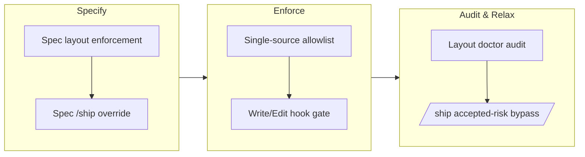

## 1. Overview

This branch enforces the canonical `.workaholic/` directory layout through a single-source allowlist and a guarded Write/Edit hook (warn-by-default, strict via opt-in), preventing layout sprawl. It adds a read-only layout doctor audit script that reports pre-existing violations against the same allowlist, and gives the `/ship` gate an explicit, recorded "accepted-risk bypass" so a context that cannot confirm production still has an audited forward exit.

**Highlights:**

1. Canonical `.workaholic/` layout enforcement via a single-source allowlist + guarded Write/Edit hook gate (warn-by-default, strict via opt-in)
2. Read-only layout doctor audit script that classifies pre-existing violations against the same allowlist and suggests remediations without mutating the tree
3. Explicit recorded `/ship` override (accepted-risk bypass) for cannot-confirm contexts, preserving the evidence-gated-merge contract
4. Polished `/ticket` command composition for stability and clarity

## 2. Motivation

The `.workaholic/` tree is documented as a "closed, fixed structure," but until now nothing machine-enforced it — the only structural guard reasoned about ticket-shaped files alone, so undesignated directories (`.trips/`, `tickets/done/`, `proposals/`, `research/`) could accrete silently in long-lived consumer repos. At the same time, the `/ship` confirmation gate — which deploys and confirms in production before merging — had no forward exit when no confirmation method existed and none could run, leaving a developer unable to land their work at all. This branch closes both gaps: it makes the layout a single machine-readable source of truth with opt-in strict enforcement, ships a doctor to surface drift that already exists, and adds a deliberate, audited escape hatch to `/ship` for the cannot-confirm case — without weakening the gate's default safe behavior.

## 3. Changes

The work began by specifying both the layout-enforcement and `/ship`-override features as tickets. Implementation then encoded the canonical layout as a single newline-delimited allowlist and extended the existing `validate-ticket.sh` hook into a top-level layout gate (warn by default, strict via opt-in). A read-only layout doctor was added to walk an existing tree and report drift against the same allowlist, and finally the `/ship` gate gained an explicit, recorded "merge without production confirmation" bypass for cannot-confirm contexts.

### 3-1. Enforce the canonical `.workaholic/` layout via a single-source allowlist + Write/Edit hook ([983c840](https://github.com/qmu/workaholic/commit/983c840))

Encoded the permitted top-level `.workaholic/` subdirectories as a single machine-readable allowlist (`hooks/workaholic-layout-allowlist.txt`) and extended `validate-ticket.sh` with a layout gate that rejects writes landing outside it. The gate warns by default and blocks only under explicit opt-in (`WORKAHOLIC_STRICT_LAYOUT` or a `.workaholic/.strict-layout` marker), so adopting the stricter version never bricks a repo mid-flight. Added the first 15 smoke assertions for the hook.

### 3-2. `.workaholic/` layout doctor — one-shot audit of an existing tree against the allowlist ([ff001d5](https://github.com/qmu/workaholic/commit/ff001d5))

Added a read-only doctor (`hooks/layout-doctor.sh`) that walks the top-level `.workaholic/` entries, classifies each against the same allowlist file the hook reads (`ok` / `undesignated` / `undesignated-root-file` / `misplaced-ticket-state`), and emits structured JSON findings, suggested remediations, and advisories with a human summary on stderr. It reports rather than mutates, leaving destructive choices to the repo owner. Added 10 hermetic smoke assertions.

### 3-3. Add an explicit, recorded "merge without production confirmation" override to the `/ship` gate ([9f6fce5](https://github.com/qmu/workaholic/commit/9f6fce5))

Added a fifth, deliberately-chosen option to the `/ship` §1-4 hard gate — "Merge without production confirmation (accepted-risk bypass)" — for the cannot-confirm cases (no method exists, or a declared method cannot run in this environment). It is never the default and never automatic; choosing it records the bypass as accepted-risk evidence before merging. A confirmation that ran and FAILED stays a hard stop. Documented the `bypassed` status in `record-evidence.sh` and regenerated the `outputs/` bundle.

## 4. Outcome

- **Layout enforcement system**: Machine-enforced canonical `.workaholic/` directory structure via single-source allowlist (data file read by both hook and auditor), with warn-by-default / strict-via-marker toggle to avoid breaking existing consumer repos.
- **Layout doctor audit**: Read-only audit tool that walks existing `.workaholic/` trees, classifies each top-level entry against the allowlist, and emits structured JSON findings + suggested remediations (without auto-mutation).
- **Ship confirmation bypass**: Explicit, recorded "merge without production confirmation" option added to the `/ship` gate for cannot-confirm scenarios (no method exists, or declared method cannot run in this environment); bypassed merge recorded as accepted-risk in evidence.
- **Test coverage**: 25+ hermetic smoke assertions across hook enforcement (15), layout doctor (10), and ship bypass (recorded status); all pass; `verify.mjs` confirmed no `outputs/` drift for the hook-only changes.

## 5. Historical Analysis

- **Incremental enforcement lineage**: Layout work started with ticket-shape prohibition (May 2026, `20260518...`), now generalized to a top-level allowlist; demonstrates evolution from a narrow guard to a broad structural one.
- **Architectural design already solved a problem**: Step 4 of the first ticket assumed `tickets/done/` was an unguarded gap; implementation discovered the existing ticket-location check (`^todo|^icebox|^archive`, else exit 2) already hard-blocks it regardless of filename. This highlights the value of careful code reading before proposing new rules — a regression test was added to pin the existing behavior.
- **Canonical structure foundation**: The `.workaholic/` closed-structure policy was established in prior work (June 2026, `20260617...`); this branch operationalizes it via machine enforcement.
- **Relief-valve precedent**: When the ticket-guard was judged over-aggressive, it was made non-blocking (commit `76b49fb`); this branch applies the same design judgment to `/ship`'s post-deploy halt — maintaining the gate while adding an explicit, recorded escape hatch.

## 6. Concerns

### Trip unification is unproven by a live /trip run (carried from PR #54)

- **Severity:** moderate
- **Description:** The entire `/trip`-unification protocol change is validated only by static checks (`build.mjs`, `verify.mjs`, `validate-metadata.mjs`, `test-workflow-scripts.mjs`) and prose review — the new Decomposition gate, per-ticket Coding loop, and context-aware queue-execute routing have not been exercised end-to-end by a real `/trip` run. A live run could surface gate-sequencing, archiving, or routing gaps the static checks cannot catch.
- **How to Fix:** Run a real end-to-end `/trip` — both a design-first trip (validate the Decomposition gate emits well-formed tickets and the per-ticket loop archives each) and a queue-execute trip (validate routing skips Planning/Decomposition and drives a pre-populated queue) — before relying on the new flow.

## 7. Successful Development Patterns

- **Single-source-of-truth coupling**: The allowlist data file (`hooks/workaholic-layout-allowlist.txt`) is read by both the enforcement hook and the audit doctor, preventing divergence. This worked well across multiple tools and avoids the "two divergent lists" failure mode.
- **Co-location for clarity**: The doctor script was placed in `hooks/` beside the allowlist (not in a workflow skill's `scripts/`) to maximize single-source coupling and avoid bloating the `drive` bundle's closure — `hooks/` is also excluded from `outputs/`, so it needs no rebuild.
- **Structured reporting over mutation**: The doctor reports violations and suggests remediations without auto-executing `git mv`, preserving decision authority with the repo owner and matching the `policy-conformance-audit` framing.
- **Hermetic smoke-test discipline**: Each ticket added focused, deterministic assertions (25+ total); the discipline caught a false premise (the `tickets/done/` rule already existed) and prevented regressing it.
- **Defensive degradation**: Gate checks degrade gracefully when supporting files are absent — the load-bearing `[[ -f "$allowlist_file" ]]` guard prevents wholesale rejection of legitimate writes when the allowlist is missing.
- **Reapplying architectural precedent**: When a prior guard was deemed over-aggressive and relaxed (`76b49fb`), that decision established a pattern; this branch recognized and reapplied the same relief-valve design to the `/ship` gate.

## 8. Release Preparation

**Verdict**: Ready for release

### 8-1. Concerns

- None - changes are safe for release. `verify.mjs`, `validate-metadata.mjs` (version-aligned at v1.0.64), and `test-workflow-scripts.mjs` (122/0) all pass; `doc-drift.sh` surfaced no confirmed drift (CLAUDE.md was updated in the same range).

### 8-2. Pre-release Instructions

- None - standard release process applies.

### 8-3. Post-release Instructions

- None - no special post-release actions needed.

## 9. Notes

The three changes share one design spine: make a documented-but-unenforced contract machine-checkable (the layout allowlist), give operators a read-only way to see existing drift (the doctor), and keep a strict gate strict while adding a single audited escape hatch (the `/ship` bypass). The lone `.workaholic/trips/` directory on this branch is the older March 2026 trip (already storied and squashed), not work from this branch — so no trip rationale link applies here.
