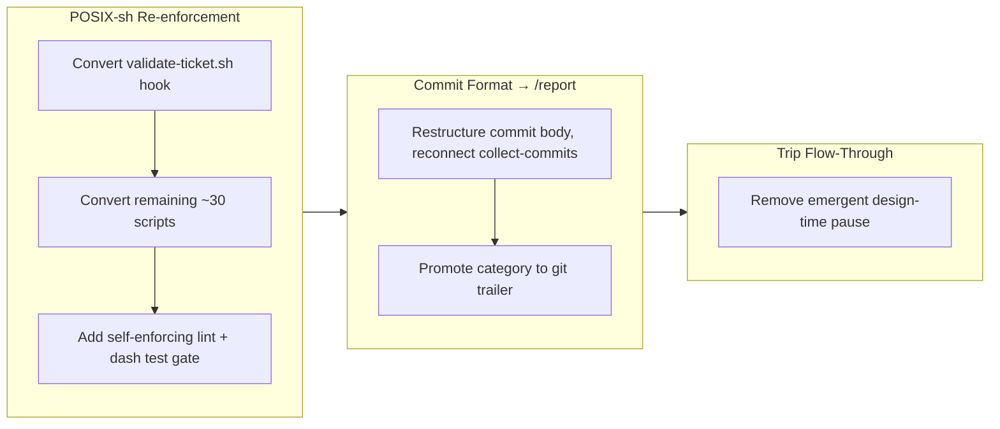

## 1. Overview

This branch hardened three of the plugin's internal contracts. It finished re-enforcing the POSIX-sh mandate across every bundled script — converting the last bash holdouts and adding a standing lint gate so a fourth regression cannot land silently — then re-aimed the commit message format at `/report`'s narrative so structured commit content (Concerns, Insights, change category) actually reaches the story generator and release notes. Finally, it removed the emergent design-time pause from a default `/trip`, so a design-first trip now flows from its committed design straight into the build for one continuous unattended run.

**Highlights:**

1. Converted the remaining ~31 bundled scripts (incl. the `validate-ticket.sh` hook) to `#!/bin/sh -eu`, eliminating every bashism so the plugin runs on Alpine containers that have no bash
2. Added a self-enforcing POSIX gate: a read-only `posix-lint.sh` auditor plus a dash/sh-based test runner, with a regression-lock test asserting the tree stays conforming
3. Restructured the commit body around `Why`/`Changes`/`Concerns`/`Insights`/`Verify` and reconnected `collect-commits.sh` (which had been silently dropping the body) so commit Concerns/Insights now feed story sections 6 and 7
4. Promoted the Added/Changed/Removed change category to a `Category:` git trailer so the grouping key survives in git log even when a ticket is pruned
5. Made a design-first `/trip` proceed from its fixed design through decomposition into the build with no developer green-light pause, restoring the overnight-run vision

## 2. Motivation

The POSIX-sh rule in `rules/shell.md` exists because the plugin's scripts run on Alpine containers where `/bin/sh` is not bash — a bash-only script there does not merely behave differently, it fails to execute at all. Yet the rule had regressed twice with no automated guard: the smoke harness ran scripts under bash, so bashisms passed, and nothing failed on a bash shebang. Converting the holdouts was only half the fix; the durable need was a standing gate so the rule defends itself.

In parallel, two narrower contracts had drifted from their consumers. The commit body carried two sections `/report` never read while the sections it works hardest to produce got nothing from git log — and `collect-commits.sh` had severed the pipe entirely by dropping the body. The change category lived only in ticket frontmatter, so a pruned ticket or a log-only backfill lost the grouping key release notes depend on. Both were fixed by tracing the data to its actual consumer.

The final thread addressed a behavioral regression in `/trip`: a design-first trip parked after planning and idled the team waiting for a human to green-light the build, defeating the overnight vision of one continuous unattended run reviewed in the morning.

## 3. Changes

The branch moved in three deliberate arcs. First it completed the POSIX-sh conversion begun with the `validate-ticket.sh` hook, sweeping the remaining bundled scripts to `#!/bin/sh -eu` and then locking the result behind a lint auditor and a dash/sh test runner so regressions self-report. Next it repaired the commit-to-`/report` pipeline — restructuring the message body around the keys the report consumes and surfacing the change category as a git trailer. Finally it removed the emergent pause that kept a default design-first `/trip` from flowing through to the build.

### 3-1. Convert validate-ticket.sh hook to POSIX sh ([b0e57c9](https://github.com/qmu/workaholic/commit/b0e57c9))

Rewrote the `validate-ticket.sh` PostToolUse hook from `#!/bin/bash` (~80 bashisms) to `#!/bin/sh -eu`, translating `[[ =~ ]]` to `grep -qE`/`case` and preserving the hard-block behavior the original here-string loops gave. Behavior is byte-identical to the bash original across the path and frontmatter test batteries.

### 3-2. Convert remaining plugin shell scripts to POSIX sh ([ae912c3](https://github.com/qmu/workaholic/commit/ae912c3))

Converted the remaining 30 scripts under `plugins/workaholic/` (branching, ship, report carry-over, system-safety, check-deps, trip-protocol, validate-writer, policy-lens) to POSIX sh — process substitution became here-docs, bash arrays became newline accumulators serialized with `jq`, and `outputs/` was regenerated so the 21 shipped copies flipped to POSIX too.

### 3-3. Add a self-enforcing POSIX-sh gate (lint + dash/sh test runner) ([c7c73d7](https://github.com/qmu/workaholic/commit/c7c73d7))

Added `hooks/posix-lint.sh`, a read-only auditor that flags non-`#!/bin/sh` shebangs and bash-only tokens across the plugin's scripts and exits non-zero on any violation, and switched the smoke harness to run every script through a resolved dash-preferred POSIX shell. A regression-lock test asserts the real tree stays conforming so a third regression cannot land silently.

### 3-4. Restructure commit body to feed /report ([24e5b37](https://github.com/qmu/workaholic/commit/24e5b37))

Re-aimed the commit body at the report's narrative: commits now carry `Why`/`Changes`/`Concerns`/`Insights`/`Verify` (empty keys omitted), `archive.sh` takes the matching arguments, and `collect-commits.sh` — which had been silently dropping the body — now emits it so commit Concerns/Insights feed story sections 6 and 7. A latent Alpine bug (`archive.sh` calling bash on POSIX sub-scripts) was fixed in passing.

### 3-5. Add a Category git trailer for release-note grouping ([6a1a4fc](https://github.com/qmu/workaholic/commit/6a1a4fc))

Promoted the Added/Changed/Removed change category from ticket-frontmatter-only to a `Category:` git trailer: `commit.sh` accepts `--category` and emits the trailer, and `collect-commits.sh` exposes a per-commit `category` field parsed from it, so `/report` and `write-release-note` can group changes straight from git log even when a ticket is pruned. `archive.sh` computes the category once and feeds both trailer and frontmatter.

### 3-6. Make design-first trip flow through to build by default ([1c8e87a](https://github.com/qmu/workaholic/commit/1c8e87a))

Made a design-first `/trip` proceed from a fixed design plus a completed Decomposition straight into the per-ticket build with no developer green-light pause — the design moderation is the gate, and the finished branch is reviewed afterward via `/report`. Night mode keeps only its genuine extras; queue-execute mode, the Decomposition gate, and all safety gates are unchanged. The change is prose-only across three files.

## 4. Outcome

The plugin's bundled scripts are now uniformly POSIX sh and protected by a gate that fails on any future bash drift — both a grep-based lint (shell-independent) and a dash/sh test runner. The commit-to-`/report` pipeline is reconnected end-to-end and guarded by a smoke test, so structured commit content (Concerns, Insights, change category) now reliably reaches the story generator and release notes — this very report is the first to read those keys from git log. And a default `/trip` no longer idles waiting for a human to start the build, restoring the continuous overnight run. All test gates are green (`test-workflow-scripts.mjs` 154/0; `verify.mjs`, `validate-metadata.mjs`, `posix-lint` conforming) and `outputs/` is regenerated in lockstep.

## 5. Historical Analysis

This branch is the third beat in a recurring theme of the repository: making implicit contracts machine-checkable. The POSIX-sh work directly continues the conversion begun in PR #56 (`validate-ticket.sh`), and its carry-over (`56-validate-ticket-sh-remains-bash-posix`) is resolved here. The "two enforcement layers encode one rule" carry-over from the same PR shows the same pattern at work — duplicated rules drift, so the lint gate and the single-source `archive.sh` category computation are both deliberate consolidations. The commit-format work extends the `/report` data plumbing that earlier branches built around archived tickets, now backfilling git-log as a second source that survives ticket pruning.

## 6. Concerns

### (carried from PR #54) Trip unification is unproven by a live `/trip` run

- **Severity:** moderate
- **Description:** The `/trip`-unification protocol — the Decomposition gate, per-ticket Coding loop, context-aware queue routing, and now the design-first flow-through added here ([1c8e87a](https://github.com/qmu/workaholic/commit/1c8e87a)) — is still validated only by static checks and prose review, never exercised end-to-end by a real `/trip`. This branch's flow-through change is prose-only and carries the same caveat.
- **How to Fix:** Run a real end-to-end `/trip` — both a design-first trip (confirm it flows through Decomposition into the per-ticket build with no pause) and a queue-execute trip (confirm routing skips Planning and drives a pre-populated queue) — before relying on the new flow.

### (carried from PR #56) Enforcement reaches consumer repos only after this release

- **Severity:** moderate
- **Description:** The ticket-structure enforcement hooks live in the workaholic plugin; a consumer repo gains them only once this version is published and the repo updates. Migrated consumers on `autoUpdate: true` pull them post-release, but in-flight branches there can still reintroduce non-canonical paths until then.
- **How to Fix:** Ship this branch via `/release`; autoUpdate propagates the enforcement to consumers automatically.

### (carried from PR #56) Two enforcement layers encode one rule (drift risk)

- **Severity:** low
- **Description:** The canonical-path rule lives in both `validate-ticket.sh` (PostToolUse) and `guard-ticket-structure.sh` (PreToolUse). Converting `validate-ticket.sh` to POSIX here did not consolidate them, so future edits must change both or they will disagree.
- **How to Fix:** Keep the path-shape rules equivalent; extract a shared helper if a third consumer appears.

### POSIX lint runner half is weak where /bin/sh is bash

- **Severity:** low
- **Description:** The dash/sh test runner only catches bashisms on an image where `/bin/sh` is dash/ash; on a host where `sh` is bash it is weak (see [c7c73d7](https://github.com/qmu/workaholic/commit/c7c73d7) in `scripts/test-workflow-scripts.mjs`). The grep-based `posix-lint.sh` is shell-independent and catches drift everywhere, so the gate is not blind, but the runner half should not be relied on alone.
- **How to Fix:** Prefer a dash/Alpine CI runner so both halves of the gate bite.

### collect-commits body emission is a load-bearing, easily-severed link

- **Severity:** moderate
- **Description:** The new commit Concerns/Insights → section-reviewer wiring assumes `collect-commits.sh` emits the body and that the report orchestrator passes the commit bodies to that worker (see [24e5b37](https://github.com/qmu/workaholic/commit/24e5b37) in `plugins/workaholic/skills/report/scripts/collect-commits.sh`). The script silently dropped the body once already; if it regresses, the new keys stop reaching `/report` with no error.
- **How to Fix:** Keep the `collect-commits` body-emission smoke test green, and keep the commit-bodies input wired to the section-reviewer when editing report Phase 2.

## 7. Successful Development Patterns

- Trace a "feed X more data" change to its actual consumer first. Here the producer (the commit body) was already fine and the pipe (`collect-commits.sh`) was severed, so restructuring the body alone would have been cosmetic — the real fix was reconnecting the pipe.
- Pair a one-time conversion with a standing self-enforcing gate. Converting scripts to POSIX fixes the present, but a lint auditor plus a regression-lock test is what stops the rule from regressing a fourth time — the gate defends the rule without human vigilance.
- Compute a derived value once and fan it out, rather than deriving it in two places. `archive.sh` computes the change category a single time and feeds both the git trailer and the ticket frontmatter, structurally preventing the two-sources-of-truth drift the duplicated-enforcement carry-over warns about.
- Relaxing a forced human stop is policy-defensible only when paired with an async recorded substitute (committed `designs/` plus a phase-transition event-log entry) and outside-observability for later review — the trip flow-through removed a pause without removing accountability.
- Fix emergent behavior at its root cause, not its symptom. The trip "pause" was never an encoded gate — it was inferred because flow-through was only granted in night mode; making the default explicit fixed it without deleting anything.

## 8. Release Preparation

**Verdict**: Ready for release

### 8-1. Concerns

- None that block release. All test gates are green (`test-workflow-scripts.mjs` 154/0, `verify.mjs`, `validate-metadata.mjs`, `posix-lint` conforming), the diff is free of TODO/FIXME markers and secrets, and `outputs/` is regenerated in lockstep. The Section 6 concerns are forward-looking (a live-trip validation, post-release propagation, and two low-severity drift notes), not release blockers.

### 8-2. Pre-release Instructions

- None - standard release process applies.

### 8-3. Post-release Instructions

- Releasing this version resolves the carried `(PR #56) Enforcement reaches consumer repos only after this release` concern by propagating the enforcement hooks to `autoUpdate` consumers.
- When convenient, run a live end-to-end `/trip` (design-first and queue-execute) to retire the long-standing carry-over #54 that this branch's flow-through change still does not exercise.

## 9. Notes

No trip rationale directory exists for this branch — these are drive-style tickets despite the trip-mode context detection, so there is no `designs/` artifact to link. The branch's three themes (POSIX-sh enforcement, commit-format-to-report plumbing, and trip flow-through) are independent and could be reviewed in any order.
