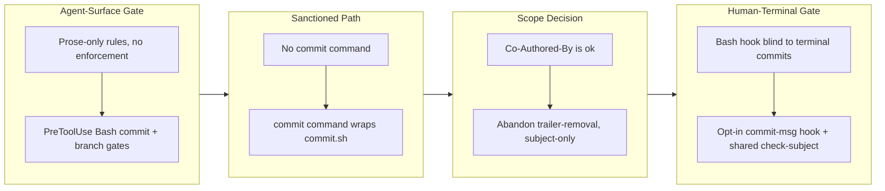

## 1. Overview

This branch added a two-layer policy-enforcement system that stops off-policy commit subjects and branch names from entering history, replacing what were previously prose-only rules with active gates. An always-on PreToolUse Bash hook guards the agent surface while an opt-in git commit-msg hook covers the human terminal, both reading a single shared rule source, and a new `/commit` slash command provides a sanctioned escape hatch for small non-ticketed changes.

**Highlights:**

1. Always-on `PreToolUse(Bash)` hooks that block direct `git commit`s with off-policy subjects (Conventional/bracket prefixes or >50 chars) and branch creations that break the `work-YYYYMMDD-HHMMSS` pattern, leaving script-wrapped flows and `Co-Authored-By` trailers untouched
2. Opt-in git-native `commit-msg` hook plus `install-git-hooks.sh` that wires it via `core.hooksPath` with no-clobber safety, extending the same subject policy to human-terminal and nested-script commits the Bash gate is blind to
3. A shared `lib/check-subject.sh` factored out as the single rule source both enforcement layers call, keeping agent-side and git-side gates in lockstep
4. New `/commit` command wrapping `commit.sh`: inspects the tree, stages tracked changes (never `git add -A`), derives a present-tense no-prefix title with a structured Why/Changes/Concerns/Insights/Verify body, and steers users to `/drive` for ticketed work
5. Deliberately abandoned the stop-emitting-`Co-Authored-By` ticket after the developer decided the trailer should stay, scoping both gates to subject-only enforcement that never strips co-author lines

## 2. Motivation

The commit-subject and branch-name conventions lived only as prose inside the skills, so nothing actually rejected a `feat:`/`[bracket]` subject or an off-pattern branch — any session committing outside the workflow scripts could mirror the noisy history the project was trying to leave behind. The work introduces a zero-opt-in enforcement layer for the surface Claude controls, then recognizes that a PreToolUse Bash hook is structurally blind to a developer's own terminal commit and to scripts that never pass through Claude's Bash tool, so it adds a git-native `commit-msg` hook for those paths. Because a plugin must not silently mutate a consumer repo, that second layer is strictly opt-in and installed deliberately. Along the way the scope was settled with the developer to keep the `Co-Authored-By` trailer, narrowing both layers to subject-policy enforcement only and retiring the trailer-removal ticket rather than implementing it.

## 3. Changes

Work began by turning prose-only commit and branch conventions into active PreToolUse Bash gates covering the agent surface, then added a `/commit` escape hatch wrapping `commit.sh` for non-ticketed changes. A scope conversation settled that the `Co-Authored-By` trailer should stay, so the trailer-removal ticket was abandoned and enforcement narrowed to subject-only. Finally, recognizing the Bash hook could not see human-terminal or nested-script commits, an opt-in git `commit-msg` hook was added, with both layers refactored to share a single `check-subject.sh` rule source.

### 3-1. Gate off-policy commits and branches via Bash hooks ([24a3096](https://github.com/qmu/workaholic/commit/24a3096))

Added two blocking `PreToolUse(Bash)` hooks: `guard-git-commit.sh` rejects a direct `git commit` whose inline subject carries a Conventional-Commit prefix, a `[bracket]` tag, or exceeds 50 characters, and `guard-git-branch.sh` rejects branch creation whose name is not `work-YYYYMMDD-HHMMSS`. Both route the caller to the sanctioned script, are registered in `hooks.json` beside the existing ticket guard, and `ensure-worktree.sh` was hardened to self-validate its branch-name argument. Scoped to off-policy subjects only (not block-all) so `/report`'s conformant story commit keeps working.

### 3-2. Add a /commit command wrapping commit.sh ([a62d99c](https://github.com/qmu/workaholic/commit/a62d99c))

Added the `/commit` slash command as thin orchestration over `workaholic:commit` and `commit.sh` — the sanctioned path for small non-ticketed changes that derives a no-prefix ≤50-char subject and the structured body without duplicating staging or message logic. Documented in the CLAUDE.md command table and the marketplace description.

### 3-3. Add opt-in git commit-msg subject gate ([e2fdcf0](https://github.com/qmu/workaholic/commit/e2fdcf0))

Added an opt-in git-native `commit-msg` hook and `install-git-hooks.sh` (via `core.hooksPath`, with no-clobber/`--force`/manual-merge handling) enforcing the same subject policy on human-terminal commits. Factored the subject rules into a shared `lib/check-subject.sh` that both the Bash gate and the git hook call, so the two layers cannot drift. Subject-only — it never rewrites the message.

## 4. Outcome

This branch closes the gap between the plugin's **prose** commit/branch conventions and **enforced** gates, landing a layered, zero-then-opt-in enforcement stack:

- **Two zero-opt-in `PreToolUse(Bash)` hooks** (commit [24a3096](https://github.com/qmu/workaholic/commit/24a3096)): `guard-git-commit.sh` blocks a direct `git commit` whose inline subject carries a Conventional-Commit prefix, a `[bracket]` tag, or exceeds 50 chars; `guard-git-branch.sh` blocks branch-creation whose name is not `work-YYYYMMDD-HHMMSS`. Both route the caller to the sanctioned path (`/commit` / `commit.sh` / `create.sh`) and are registered in `hooks.json` beside `guard-ticket-structure.sh`. Script-wrapped git stays immune by construction.
- **`ensure-worktree.sh` hardened** to self-validate its `branch_name` arg against the same `work-…` pattern, so the script surface is gated even if the hook is bypassed.
- **A real `/commit` slash command** (commit [a62d99c](https://github.com/qmu/workaholic/commit/a62d99c)): thin orchestration over `workaholic:commit` + `commit.sh` for small non-ticketed changes — derives a no-prefix ≤50-char subject and the structured Why/Changes/Concerns/Insights/Verify body, never duplicating staging or message logic. Documented in the CLAUDE.md command table and the marketplace description.
- **An opt-in git-native `commit-msg` hook + `install-git-hooks.sh`** (commit [e2fdcf0](https://github.com/qmu/workaholic/commit/e2fdcf0)): enforces the same subject policy on human-terminal commits via `core.hooksPath`, with safe no-clobber / `--force` / manual-merge handling. Subject rules were factored into a shared `lib/check-subject.sh` that **both** enforcement layers call, so they cannot drift.
- **Co-author-trailer removal abandoned** (ticket 2049, commit [6a55d2d](https://github.com/qmu/workaholic/commit/6a55d2d)): the developer settled "Co-Authored-By is ok" mid-drive, so `commit.sh` keeps emitting its trailer and every layer enforces **subject policy only** — never co-author stripping.
- **Test coverage** grew to 212 passing assertions (guard allow/block batteries, the shared validator, `commit-msg` allow/block/no-rewrite, and installer install/idempotent/refuse-clobber/refuse-shadow/force paths).

## 5. Historical Analysis

The dominant recurring theme is **"convention → automated rejection gate"**: a written rule is only as strong as the gate that rejects its violation. The two new git gates are deliberate copies of the proven `guard-ticket-structure.sh` shape (stdin-JSON parsing, conservative command matching, exit-2 block with an actionable route), and ticket 2047 cites both the prior `guard-ticket-structure` ticket (the `PreToolUse(Bash)` blocking hook it mirrors) and the `harden-posix-shell-gate` ticket (which established the lint + regression-lock test pattern this branch reuses). Extending a battle-tested gate rather than inventing a new enforcement mechanism kept the surface uniform and the smoke tests structurally identical.

Two other lineages shaped the work. The **thin-command / comprehensive-skill** split (from the skill-extraction ticket) governed `/commit`: orchestration in the command, all knowledge in `workaholic:commit`. And the **`commit.sh` arg contract** (`why/changes/concerns/insights/verify`) plus the machine-read `Category:` trailer (from the restructure-commit-body and promote-category-to-git-trailer tickets) constrained both the `/commit` command's call and the abandoned co-author ticket, which had to preserve `Category:` while touching trailers. Finally, the **propagation caveat** — plugin-shipped enforcement reaches consumers only after release + update — is a known property carried forward from the guard-ticket-structure history and re-surfaced unchanged here.

## 6. Concerns

### (carried from PR #54) Trip unification is unproven by a live `/trip` run

- **Severity:** moderate
- **Description:** The `/trip`-unification protocol change is validated only by `build.mjs`/`verify.mjs`/`validate-metadata.mjs`/`test-workflow-scripts.mjs` and prose review; the new Decomposition gate, per-ticket Coding loop, and context-aware queue-execute routing have not been exercised end-to-end by a real `/trip` (see [47acda9](https://github.com/qmu/workaholic/commit/47acda9) in `plugins/workaholic/skills/trip-protocol/SKILL.md`). A live run could surface gate-sequencing, archiving, or routing gaps the static checks cannot catch.
- **How to Fix:** Run a real end-to-end `/trip` — both a design-first trip (validate the Decomposition gate emits well-formed tickets and the per-ticket loop archives each) and a queue-execute trip (validate routing skips Planning/Decomposition and drives a pre-populated queue) — before relying on the new flow.

### (carried from PR #56) Enforcement reaches consumer repos only after this release

- **Severity:** moderate
- **Description:** The hooks live in the workaholic plugin; a consumer repo gains them only once this version is published and the repo updates (see [e78465d](https://github.com/qmu/workaholic/commit/e78465d)). Migrated consumers on `autoUpdate: true` pull them post-release, but until then in-flight branches there can still reintroduce non-canonical ticket paths.
- **How to Fix:** Ship this branch via `/release`; autoUpdate propagates the enforcement to consumers automatically.

### (carried from PR #56) Two enforcement layers encode one rule (drift risk)

- **Severity:** low
- **Description:** The canonical-path rule lives in both `validate-ticket.sh` (PostToolUse) and `guard-ticket-structure.sh` (PreToolUse) (see [e78465d](https://github.com/qmu/workaholic/commit/e78465d) in `plugins/workaholic/hooks/`). Future edits must change both or they will disagree.
- **How to Fix:** Keep the path-shape rules equivalent; consider extracting a shared helper if a third consumer appears.

### (carried from PR #58) (carried from PR #54) Trip unification is unproven by a live `/trip` run

- **Severity:** moderate
- **Description:** The `/trip`-unification protocol — the Decomposition gate, per-ticket Coding loop, context-aware queue routing, and the design-first flow-through — is still validated only by static checks and prose review, never exercised end-to-end by a real `/trip` (see [1c8e87a](https://github.com/qmu/workaholic/commit/1c8e87a) in `plugins/workaholic/skills/trip-protocol/SKILL.md`). The flow-through change is prose-only and carries the same caveat.
- **How to Fix:** Run a real end-to-end `/trip` — both a design-first trip (confirm it flows through Decomposition into the per-ticket build with no pause) and a queue-execute trip (confirm routing skips Planning and drives a pre-populated queue) — before relying on the new flow.

### (carried from PR #58) (carried from PR #56) Enforcement reaches consumer repos only after this release

- **Severity:** moderate
- **Description:** The ticket-structure enforcement hooks live in the workaholic plugin; a consumer repo gains them only once this version is published and the repo updates (see [32110a0](https://github.com/qmu/workaholic/commit/32110a0)). Migrated consumers on `autoUpdate: true` pull them post-release, but in-flight branches there can still reintroduce non-canonical paths until then.
- **How to Fix:** Ship this branch via `/release`; autoUpdate propagates the enforcement to consumers automatically.

### (carried from PR #58) (carried from PR #56) Two enforcement layers encode one rule (drift risk)

- **Severity:** low
- **Description:** The canonical-path rule lives in both `validate-ticket.sh` (PostToolUse) and `guard-ticket-structure.sh` (PreToolUse) (see [32110a0](https://github.com/qmu/workaholic/commit/32110a0) in `plugins/workaholic/hooks/`). Converting `validate-ticket.sh` to POSIX did not consolidate them, so future edits must change both or they will disagree.
- **How to Fix:** Keep the path-shape rules equivalent; extract a shared helper if a third consumer appears.

### (carried from PR #58) collect-commits body emission is a load-bearing, easily-severed link

- **Severity:** moderate
- **Description:** The commit Concerns/Insights → section-reviewer wiring assumes `collect-commits.sh` emits the commit body and that the report orchestrator passes those bodies to the section worker (see [24e5b37](https://github.com/qmu/workaholic/commit/24e5b37) in `plugins/workaholic/skills/report/scripts/collect-commits.sh`). The script silently dropped the body once already; if it regresses, the new keys stop reaching `/report` with no error.
- **How to Fix:** Keep the `collect-commits` body-emission smoke test green, and keep the commit-bodies input wired to the section-reviewer when editing report Phase 2.

### (carried from PR #58) POSIX lint runner half is weak where /bin/sh is bash

- **Severity:** low
- **Description:** The dash/sh test runner only catches bashisms on an image where `/bin/sh` is dash/ash; on a host where `sh` is bash it is weak (see [c7c73d7](https://github.com/qmu/workaholic/commit/c7c73d7) in `scripts/test-workflow-scripts.mjs`). The grep-based `posix-lint.sh` is shell-independent and catches drift everywhere, so the gate is not blind, but the runner half should not be relied on alone.
- **How to Fix:** Prefer a dash/Alpine CI runner so both halves of the gate bite.

### Bundled script hardened without rebuilding outputs/, leaving the public copy stale

- **Severity:** moderate
- **Description:** Ticket 2047 hardened `plugins/workaholic/skills/branching/scripts/ensure-worktree.sh`, which is a **bundled** branching-skill script in the drive/report/ship/create-ticket closure, but its archival commit ([24a3096](https://github.com/qmu/workaholic/commit/24a3096)) claimed "No outputs/ rebuild" — the `outputs/` copies were left stale and only regenerated later during the version bump ([1f7c620](https://github.com/qmu/workaholic/commit/1f7c620)), so source and artifact were out of lockstep in between (an `Outputs Freshness` CI failure waiting to happen).
- **How to Fix:** When editing any script under a bundled skill closure, always run `node scripts/build-plugins/build.mjs` and commit `outputs/` in lockstep within the same change; only pure `hooks/` changes may skip the rebuild. Treat "is this script in a shipped closure?" as a checklist item before claiming "No outputs/ rebuild."

### Gate coverage is the single-Bash-call agent surface only

- **Severity:** moderate
- **Description:** Per least-privilege the `PreToolUse(Bash)` commit gate blocks off-policy subjects only (not block-all), and structurally it sees only the agent's top-level Bash command (see [24a3096](https://github.com/qmu/workaholic/commit/24a3096) in `plugins/workaholic/hooks/guard-git-commit.sh`). A human's terminal `git commit`, `--no-verify`, GitHub-web/server merges, and any non-Bash agent path are all out of scope; the opt-in 2050 `commit-msg` hook closes only the local-human gap once installed.
- **How to Fix:** Treat the Bash gate as one belt in a stack, not a vault: install the `commit-msg` hook for local-human coverage, and add server-side branch protection / a required status check for the remote surface the local hooks cannot reach.

### Both local enforcement layers stay bypassable and arrive late

- **Severity:** moderate
- **Description:** The Bash gate plus the `commit-msg` hook are bypassable via `git commit --no-verify` and on server-side merges, and the git hook reaches a consumer only after release + update and *then* the owner must still run the installer (see [e2fdcf0](https://github.com/qmu/workaholic/commit/e2fdcf0) in `plugins/workaholic/hooks/install-git-hooks.sh`). They are a strong belt, not a vault.
- **How to Fix:** Pair the local layers with a repo-side control (branch protection / required status check) for true enforcement, and surface the one-line install command prominently in the release/rollout notes so consumers actually opt in.

### git commit-msg hook escapes the POSIX lint gate

- **Severity:** low
- **Description:** A git hook must be named exactly `commit-msg` (no extension), but `hooks/posix-lint.sh` only scans `*.sh`, so the new git hook is invisible to the POSIX gate (see [e2fdcf0](https://github.com/qmu/workaholic/commit/e2fdcf0) in `plugins/workaholic/hooks/git/commit-msg`). It is POSIX `#!/bin/sh -eu` by construction today, but a future bashism in it would not be caught by CI. The shared logic deliberately lives in `lib/check-subject.sh` (which `posix-lint` *does* scan) to keep the lintable surface maximal.
- **How to Fix:** If more git-native hooks are added under `hooks/git/`, either extend `posix-lint.sh` to scan that directory by name or keep the extensionless hooks trivially POSIX with all real logic in lintable `lib/*.sh` files.

### 50-char cap is byte-based outside a UTF-8 locale

- **Severity:** low
- **Description:** The subject-length check uses `wc -m`, which counts characters only under a UTF-8 locale and bytes under a C/POSIX locale (see [24a3096](https://github.com/qmu/workaholic/commit/24a3096) in `plugins/workaholic/hooks/lib/check-subject.sh`). Japanese subjects therefore enforce a character-accurate 50-char cap only when the runtime locale is UTF-8; in CI's default locale the cap is effectively byte-based and multibyte subjects can false-trip.
- **How to Fix:** Pin a UTF-8 locale (e.g. `LC_ALL=C.UTF-8`) wherever the gate/hook runs, or switch to a locale-independent character count if byte-vs-char accuracy on Japanese subjects becomes load-bearing.

### /commit is an escape hatch that can invite non-ticketed commits

- **Severity:** low
- **Description:** The new `/commit` command provides a sanctioned path for ad-hoc commits, but by existing it can normalize committing outside the ticketed `/drive` flow (see [a62d99c](https://github.com/qmu/workaholic/commit/a62d99c) in `plugins/workaholic/commands/commit.md`). It is still strictly better than free-handed `git commit` because both the command and the gate preserve the message policy.
- **How to Fix:** Keep the command copy steering users to `/drive` for ticketed work and framing `/commit` as for small/explicit non-ticketed changes; revisit if commit history shows `/commit` displacing ticketed development.

### commit.sh silently drops a --category placed after its positional args

- **Severity:** low
- **Description:** `commit.sh` parses option flags (`--category`, `--skip-staging`) only at the front of its argument list — the parse loop breaks on the first non-flag token, so a `--category` placed after the six positional args is silently consumed as a `[files...]` entry and the `Category:` trailer goes missing with no error (see [a62d99c](https://github.com/qmu/workaholic/commit/a62d99c) in `plugins/workaholic/skills/commit/scripts/commit.sh`). The missing trailer is invisible to `verify.mjs`; only a temp-repo dry-run surfaces it.
- **How to Fix:** Always pass flags before the positional `title why changes concerns insights verify` args (the `/commit` doc now states this), and consider making `commit.sh` error on an unrecognized trailing `--flag` instead of treating it as a file path.

## 7. Successful Development Patterns

- **Gate-by-construction beats maintaining a whitelist.** `PreToolUse(Bash)` hooks see only the agent's *top-level* command, so any git that runs inside `commit.sh`/`archive.sh`/`trip-commit.sh` is invisible to the gate — the sanctioned wrappers are immune with no whitelist to maintain. Tightening the raw-`git commit` path could therefore be strict without touching a single scripted workflow. Leaning on this structural property (rather than enumerating exceptions) kept both new gates small and drift-free.
- **One shared rule source for two enforcement layers.** Factoring the subject checks into `lib/check-subject.sh` and refactoring both the Bash gate and the `commit-msg` hook onto it satisfied `policy-conformance-audit` exactly: the two layers cannot drift because they call one validator. This is the constructive answer to the recurring "two layers encode one rule" drift concern.
- **Hermetic temp-repo dry-runs catch contract bugs that `verify.mjs` cannot.** The `commit.sh` `--category`-ordering footgun (a silently-dropped trailer) was invisible to static verification and only surfaced by actually rendering a commit in a throwaway repo. Dry-running the real script against sample inputs is the cheapest way to catch argument-contract regressions.
- **Grep the workflow markdown for the raw operation before tightening a gate.** A block-all commit gate would have silently broken `/report`'s deliberately bodyless story commit (`report/SKILL.md:148`). Searching the command/skill prose for every raw-`git commit`-via-Bash site *before* choosing the gate's policy turned a would-be breakage into the "off-policy subjects only" scope.
- **Settle ambiguous scope with the developer mid-drive, then record it.** The "block-all vs off-policy-subjects-only" question and the "Co-Authored-By is ok" decision were resolved with the developer during the drive and written into the tickets' Final Reports — the latter cleanly abandoning ticket 2049 rather than implementing against a reversed premise. Recording the decision (and its rationale, tied to `least-privilege-or-force`) keeps a later reader from re-litigating it.
- **Extend a proven gate shape instead of inventing one.** Both new git hooks were copied from `guard-ticket-structure.sh` (stdin-JSON parse, conservative matching, exit-2 block with an actionable route) and locked with the same lint + regression-test pattern from the harden-posix-shell-gate work. Reusing the established shape made the hooks reviewable at a glance and the tests structurally identical to existing ones.
- **`if reason=$(... | sh "$LIB"); then` is the correct way to call a fail-non-zero validator under `set -e`.** Because `set -e` aborts on `var=$(failing-cmd)`, both enforcement layers wrap the shared validator in an `if` to suppress `-e` for the one expected failure. Codifying this call form keeps any future caller of `check-subject.sh` from crashing on a normal policy violation.

## 8. Release Preparation

**Verdict**: Ready for release

### 8-1. Concerns

- None — changes are safe for release. All checks pass (`verify.mjs`, `validate-metadata.mjs`, `posix-lint.sh` clean; `test-workflow-scripts.mjs` 212 passed / 0 failed); no incomplete work, secrets, or doc-coverage gaps. The Section 6 concerns are forward-looking carry-overs and follow-ups, none release-blocking.

### 8-2. Pre-release Instructions

- None — standard release process applies.

### 8-3. Post-release Instructions

- None — no special post-release actions needed. (Optional: consumers who want human-terminal enforcement run `sh ${CLAUDE_PLUGIN_ROOT}/hooks/install-git-hooks.sh` once.)

## 9. Notes

- **One ticket was abandoned, not implemented.** `20260628002049-stop-emitting-claude-coauthor-trailer` (commit [6a55d2d](https://github.com/qmu/workaholic/commit/6a55d2d), now in `.workaholic/tickets/abandoned/`) was retired after the developer decided mid-drive that the `Co-Authored-By: Claude` trailer should stay. As a result, `commit.sh` is unchanged and every enforcement layer is subject-only — it never strips or blocks a co-author trailer.
- **This was a `/drive`**, not a trip; `detect-context` reported `trip` mode only because of an unrelated stale `.workaholic/trips/trip-20260319-040153/` directory with no design artifacts for this branch.
- **All 8 prior carry-over concerns remain `still_active`** — this branch's commit-subject work does not touch the ticket-path enforcement, trip-unification, or report-wiring areas those concerns target, so they are prepended in Section 6 for the next ship to re-judge.
