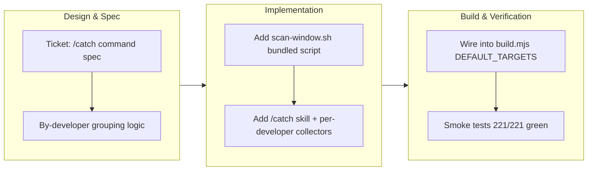

## 1. Overview

This branch introduces `/catch` — a read-only catch-up report for developers that scans recent repository activity (a two-week window by default), fans out one collector per active developer to summarize their work across commits, tickets, and stories, and synthesizes the overall development direction. The implementation is a portable Agent Skill shipped cross-agent via the build system, providing a sequential fallback alternative to the Agent-Teams-bound `/trip`.

**Highlights:**

1. New `/catch` read-only command for by-developer catch-up reports over a customizable time window
2. By-developer architecture that fans out one `haiku` collector per active contributor and synthesizes the cross-developer direction
3. Cross-agent portable Agent Skill shipped via `build.mjs` `DEFAULT_TARGETS`, extending workflow portability to non-Claude agents

## 2. Motivation

Developers face friction when onboarding or reviewing project direction — manually trawling tickets, stories, and git logs is time-consuming and error-prone. `/catch` lowers that friction by automating the synthesis: it scans a recent window, groups work by the developer axis (commit author email joined to ticket-author frontmatter), and produces a direction summary ready for follow-up questions. The portable Agent-Skill design — unlike `/trip`'s Agent Teams — keeps the workflow runnable on any agent (Claude Code, OpenCode, Codex, Pi, 40+) via the skills CLI, with an explicit sequential fallback when parallel fan-out is unavailable.

## 3. Changes

The `/catch` command was specced and implemented to address developer catch-up friction. A bundled `scan-window.sh` groups commits by author email and gathers ticket/story metadata; `haiku` collectors fan out one per developer, then the main agent synthesizes the findings into an overall-direction report. Integration into the build pipeline's `DEFAULT_TARGETS` ships it cross-agent, with nine new smoke-test assertions validating the scan logic.

### 3-1. Add `/catch` — a by-developer development catch-up report ([f7f89ef](https://github.com/qmu/workaholic/commit/f7f89ef))

Added the thin `commands/catch.md`, the comprehensive `skills/catch/SKILL.md`, and the POSIX `scan-window.sh` (groups commits by author email, tags tickets with frontmatter author/scope, lists branch stories). Wired the skill into the cross-agent build (`build.mjs` `DEFAULT_TARGETS`, `marketplace.json` `workflows.skills`), regenerated `outputs/`, added nine `scan-window.sh` smoke-test assertions, and documented the command in `CLAUDE.md`.

## 4. Outcome

- Added `/catch`, a new by-developer catch-up report command for tracking repository activity over a 2+ week window.
- Reads across tickets (todo/archive/icebox), branch stories, and commit messages to build an activity digest.
- Fans out one `general-purpose` collector subagent per active developer on the `haiku` model for fast, cost-effective parallel collection.
- Synthesizes a cross-developer narrative and stands ready for interactive follow-up questions without manual trawling.
- Fully portable Agent Skill shipped cross-agent via `build.mjs` `DEFAULT_TARGETS` (same pattern as `/report` / `/drive` / `/ship`).
- Test coverage: nine new assertions for `scan-window.sh`, total 221/221 smoke-test suite green; build, verify, validate-metadata, and posix-lint gates all pass.

## 5. Historical Analysis

Multiple prior branches established the building blocks `/catch` reuses:

- **Parallel fan-out pattern**: the command-level parallel `general-purpose` collector model (tickets 20260202135507, 20260129-parallel) and the leaf-collection pattern (20260129015817) provided the orchestration spine.
- **Model economics**: running fan-out workers on `haiku` for speed/cost (20260128211509) set the precedent for the per-developer collectors.
- **Commits/stories into a digest**: summarize-changes (20260210121628) and branch-story-generation (20260123161059) informed the aggregation strategy.
- **Thin-command + backing-skill pairing**: the `/commit` template (20260628002048) and `/report` established the command-delegates-to-skill pattern, reused here with an internal skill plus cross-agent build export.
- **Developer axis grouping**: the canonical user-slug rule and ticket-author frontmatter provided the join key; this branch found that commit author *email* (not the slug) is the more natural grouping axis across commits and tickets.

## 6. Concerns

### By-developer axis joins on commit email + ticket-author frontmatter

- **Severity:** moderate
- **Description:** `scan-window.sh` groups commits by author email and joins ticket frontmatter author to build the roster. This works uniformly across commits, todo, and archive, but the scope set (`todo`/`archive`/`icebox` for tickets, `stories/` for narrative) does not yet specially attribute icebox/abandoned work per developer (discovered during `/catch` implementation, `plugins/workaholic/skills/catch/scripts/scan-window.sh`).
- **How to Fix:** Document the current scope reach; extend the scope set if per-developer icebox/abandoned reporting becomes load-bearing.

### Collectors sample branch stories by title match; very large dirs may need indexing

- **Severity:** low
- **Description:** The per-developer collectors read branch stories by sampling on title/theme match rather than reading all of them (the live repo already has ~50). A very large `stories/` directory could exceed the practical sampling window and miss a relevant story (`plugins/workaholic/skills/catch/SKILL.md`, Collect Developer step 3).
- **How to Fix:** If `stories/` grows past ~100 files, add a per-developer story index or a `stories/<developer-slug>/` partition.

### (carried from PR #59) Trip unification is unproven by a live `/trip` run

- **Severity:** moderate
- **Description:** The `/trip`-unification protocol — the Decomposition gate, per-ticket Coding loop, context-aware queue routing, and design-first flow-through — is validated only by static checks and prose review, never end-to-end by a real `/trip` (`plugins/workaholic/skills/trip-protocol/SKILL.md`). This branch adds `/catch` and rebuilds `outputs/`; it does not touch this area.
- **How to Fix:** Run a real end-to-end `/trip` — both a design-first trip (confirm it flows through Decomposition into the per-ticket build with no pause) and a queue-execute trip (confirm routing skips Planning and drives a pre-populated queue) — before relying on the new flow.

### (carried from PR #59) Enforcement reaches consumer repos only after this release

- **Severity:** moderate
- **Description:** The ticket-structure enforcement hooks live in the workaholic plugin; a consumer repo gains them only once this version is published and the repo updates. Migrated consumers on `autoUpdate` pull them post-release, but in-flight branches can reintroduce non-canonical paths until then (`plugins/workaholic/hooks/guard-ticket-structure.sh`).
- **How to Fix:** Ship this branch via `/release`; autoUpdate propagates the enforcement to consumers automatically.

### (carried from PR #59) Two enforcement layers encode one rule (drift risk)

- **Severity:** low
- **Description:** The canonical-path rule lives in both `validate-ticket.sh` (PostToolUse) and `guard-ticket-structure.sh` (PreToolUse); future edits must change both or they will disagree.
- **How to Fix:** Keep the path-shape rules equivalent; extract a shared helper if a third consumer appears.

### (carried from PR #59) collect-commits body emission is a load-bearing, easily-severed link

- **Severity:** moderate
- **Description:** The commit `Concerns:`/`Insights:` → section-reviewer wiring assumes `collect-commits.sh` emits the commit body and that the report orchestrator passes those bodies to the section worker (`plugins/workaholic/skills/report/scripts/collect-commits.sh`). The script dropped the body once already; if it regresses, the keys stop reaching `/report` silently.
- **How to Fix:** Keep the `collect-commits` body-emission smoke test green and keep the commit-bodies input wired to the section-reviewer when editing report Phase 2.

### (carried from PR #59) POSIX lint runner half is weak where /bin/sh is bash

- **Severity:** low
- **Description:** The dash/sh test runner only catches bashisms where `/bin/sh` is dash/ash; on a host where `sh` is bash it is weak. The grep-based `posix-lint.sh` is shell-independent and catches drift everywhere, so the gate is not blind (`scripts/test-workflow-scripts.mjs`).
- **How to Fix:** Prefer a dash/Alpine CI runner so both halves of the gate bite.

### (carried from PR #59) 50-char subject cap is byte-based outside a UTF-8 locale

- **Severity:** low
- **Description:** The subject-length check uses `wc -m`, which counts characters only under a UTF-8 locale and bytes under C/POSIX (`plugins/workaholic/hooks/lib/check-subject.sh`); Japanese subjects enforce a character-accurate cap only when the runtime locale is UTF-8.
- **How to Fix:** Pin a UTF-8 locale (e.g. `LC_ALL=C.UTF-8`) where the gate runs, or switch to a locale-independent character count.

### (carried from PR #59) Both local enforcement layers stay bypassable and arrive late

- **Severity:** moderate
- **Description:** The Bash gate plus the `commit-msg` hook are bypassable via `git commit --no-verify` and on server-side merges, and the git hook reaches a consumer only after release + update and an explicit install (`plugins/workaholic/hooks/install-git-hooks.sh`).
- **How to Fix:** Pair the local layers with a repo-side control (branch protection / required status check), and surface the one-line install command prominently in rollout notes.

### (carried from PR #59) Bundled script hardened without rebuilding outputs/

- **Severity:** moderate
- **Description:** Bundled scripts in the drive/report/ship/create-ticket closure must be rebuilt into `outputs/` in lockstep or source and artifact diverge — a stale public copy can fail on non-Claude agents while local tests pass (`plugins/workaholic/skills/branching/scripts/ensure-worktree.sh`).
- **How to Fix:** When editing any script under a bundled skill closure, run `node scripts/build-plugins/build.mjs` and commit `outputs/` in the same change; treat "is this script in a shipped closure?" as a checklist item. (This branch followed that discipline.)

### (carried from PR #59) /commit is an escape hatch that can invite non-ticketed commits

- **Severity:** low
- **Description:** The `/commit` command provides a sanctioned ad-hoc commit path, but by existing it can normalize committing outside the ticketed `/drive` flow (`plugins/workaholic/commands/commit.md`). It is still strictly better than free-handed `git commit`.
- **How to Fix:** Keep the command copy steering users to `/drive` for ticketed work; revisit if history shows `/commit` displacing ticketed development.

### (carried from PR #59) commit.sh silently drops a --category placed after positional args

- **Severity:** low
- **Description:** `commit.sh` parses flags only at the front of its argument list; a `--category` after the six positional args is consumed as a file entry and the `Category:` trailer goes missing with no error (`plugins/workaholic/skills/commit/scripts/commit.sh`).
- **How to Fix:** Pass flags before the positional args, and consider erroring on an unrecognized trailing `--flag`.

### (carried from PR #59) Gate coverage is the single-Bash-call agent surface only

- **Severity:** moderate
- **Description:** The `PreToolUse(Bash)` commit gate blocks off-policy subjects only and sees only the agent's top-level Bash command (`plugins/workaholic/hooks/guard-git-commit.sh`); terminal `git commit`, `--no-verify`, web/server merges, and non-Bash agent paths are out of scope.
- **How to Fix:** Treat the Bash gate as one belt in a stack: install the `commit-msg` hook for local-human coverage and add server-side branch protection for the remote surface.

### (carried from PR #59) git commit-msg hook escapes the POSIX lint gate

- **Severity:** low
- **Description:** A git hook must be named exactly `commit-msg` (no extension), but `hooks/posix-lint.sh` only scans `*.sh`, so the hook is invisible to the gate (`plugins/workaholic/hooks/git/commit-msg`). It is POSIX by construction today, but a future bashism would not be caught.
- **How to Fix:** If more git-native hooks are added under `hooks/git/`, extend `posix-lint.sh` to scan that directory, or keep the extensionless hooks trivially POSIX with real logic in lintable `lib/*.sh`.

## 7. Successful Development Patterns

- **Script-bearing skills ship cross-agent via `DEFAULT_TARGETS` with automatic closure bundling.** Adding a skill name to `build.mjs` `DEFAULT_TARGETS` (not `EXTRA_SKILLS`) plus a `marketplace.json` `workflows.skills` entry makes it cross-agent-portable — the build computes the cross-skill closure from `${CLAUDE_PLUGIN_ROOT}/skills/<x>/scripts/` references in the SKILL.md and bundles them self-contained. `catch`'s reference to `gather/scripts/git-context.sh` pulled the whole `gather` scripts dir into the public copy with no manual wiring.
- **Group the developer axis on commit email, joined to ticket-author frontmatter.** Grouping on email directly (jq `group_by(.email)`) avoids re-implementing the `user-slug.sh` rule in the scan logic and still aligns with `todo/<user-slug>/` because the slug derives deterministically from the same email. Email is the only join key that spans commits + todo + archive uniformly (archived tickets are partitioned by branch, not developer).
- **Compute the fan-out roster before spawning leaves (one-level fan-out).** Phase 0 runs `scan-window.sh` to enumerate the active-developer roster, then Phase 1 spawns one collector per developer in a single message — the roster is known at the command level before any leaf, so leaves stay non-interactive and never nest Task or call AskUserQuestion.
- **Keep the skill an Agent Skill with an Agent Compatibility preamble.** Framing parallel fan-out and Q&A as Claude-Code enhancements with sequential/plain-chat fallbacks keeps `/catch` resolvable on non-Claude agents via the skills CLI without binding it to Agent Teams.
- **Per-developer `haiku` collectors keep fan-out cheap.** The `model:` annotation is a Claude-Code-only hint that `publicizeSkillMd` strips when generating the portable copy, so it never leaks into the cross-agent artifact.
- **Field/record separators (0x1f/0x1e) must be written via the Write tool, not a heredoc command.** Raw control bytes in a tool-call command string are rejected by the approval validator; the Write tool embeds them correctly. Verify bytes with `grep -P 'split\("' | cat -v` (shows `^^`=0x1e, `^_`=0x1f).

## 8. Release Preparation

**Verdict**: Ready for release

### 8-1. Concerns

- None — changes are safe for release.

### 8-2. Pre-release Instructions

- None — standard release process applies.

### 8-3. Post-release Instructions

- None — no special post-release actions needed.

## 9. Notes

`/catch` is read-only: it reads tickets, stories, docs, and commit messages and writes nothing, never mutating the ticket spine. The branch's diff is orthogonal to the 12 carried concerns above (all from PR #59's lineage) — none reference the `/catch` surface — so they remain active and carry forward for `/ship` to surface or `/release` to resolve.
