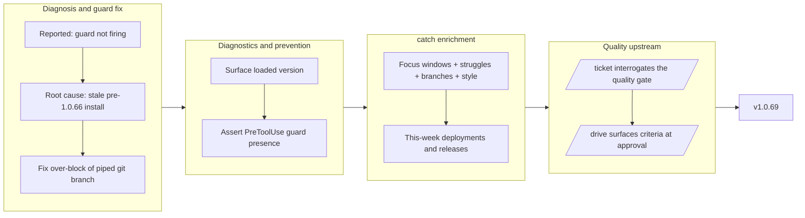

## 1. Overview

The branch diagnosed and closed a stale-install artifact (the branch guard reportedly "not firing") while fixing an incidental over-blocking bug, then made plugin staleness visible so the misdiagnosis cannot recur. In parallel it enriched `/catch` with per-developer focus windows and deployment tracking, and shifted quality assurance upstream by adding a mandatory quality-gate interrogation to `/ticket`. Released as v1.0.69.

**Highlights:**

1. Diagnosed the branch-guard "not firing" report as a stale pre-1.0.66 plugin install — not a code defect — and fixed the incidental over-blocking of piped `git branch` list forms.
2. Added loaded-version and PreToolUse-guard-presence diagnostics to `check-deps`, so a stale/partial install is visible instead of looking like a broken hook.
3. Enriched `/catch` with per-developer focus windows (yesterday+today / this week / last week), struggles, per-branch grouping, a guessed generation style, and this-week deployment history.
4. Added a mandatory quality-gate interrogation to `/ticket` so developers articulate acceptance criteria up front, which `/drive` then surfaces at the approval gate.

## 2. Motivation

The branch began as the diagnosis of a support incident: a developer reported the PreToolUse branch guard not firing, letting an off-convention branch through. The root cause was a stale pre-1.0.66 plugin install (which predates the guard entirely), not a code defect — but the diagnosis surfaced an incidental bug where the guard over-blocked piped list forms. Fixing those two immediate issues exposed a broader gap: a stale install presents an *absent* hook identically to a *broken* one, so the failure mode was invisible. The branch therefore also made the loaded plugin version and guard presence discoverable. Two independent developer-experience improvements rode along: `/catch` gained per-developer focus and deployment visibility, and `/ticket` gained an upstream quality gate so approvals rest on pre-agreed, checkable criteria rather than vague descriptions.

## 3. Changes

The branch began as diagnosis (guard not firing → stale plugin artifact, plus incidental over-blocking), fixed the guard bug, and added version diagnostics to surface loaded state. In parallel it enriched `/catch` so developers see their own focus, branches, and deployments, and shifted quality upstream by interrogating for acceptance criteria at `/ticket` time and surfacing them at the `/drive` approval. All three streams converged at v1.0.69.

### 3-1. Close the branch-guard "not firing" report as a misdiagnosis ([56cf7a0](https://github.com/qmu/workaholic/commit/56cf7a0))

Reproduced the guard live and proved it fires; traced the original incident to a stale pre-1.0.66 install whose `hooks.json` lacked the branch guard, and recorded the root cause instead of changing correct code.

### 3-2. Fix the branch guard over-blocking the piped `git branch` list form ([5ed322f](https://github.com/qmu/workaholic/commit/5ed322f))

`guard-git-branch.sh` wrongly rejected `git branch | grep …`; the fix resets parser state on shell operators so each pipeline/chain segment is inspected independently, while a chained real create (`git branch ; git checkout -b bad`) still blocks.

### 3-3. Surface the loaded plugin version so a stale install is detectable ([5059220](https://github.com/qmu/workaholic/commit/5059220))

`check-deps/check.sh` now additively reports `version`, `guards_present`, and `missing_guards` (degrading to `{"ok": true}` in the cross-agent bundle), and `/drive`/`/ticket` warn on a stale or partial install.

### 3-4. Enrich the `/catch` per-developer report with focus windows, branches, and style ([d9a695b](https://github.com/qmu/workaholic/commit/d9a695b))

`scan-window.sh` gained time-bucketed commits, epochs, and a per-developer `branches[]` axis; the collector and report render recent/weekly/last-week focus, evidence-based struggles, per-branch focus, and an explicit generation-style guess.

### 3-5. Surface this-week deployments and releases per developer in `/catch` ([5a5623c](https://github.com/qmu/workaholic/commit/5a5623c))

A `deployments[]` axis reads each branch story's `## Deployment Evidence` block and the matching release-note title, attributed by ship-commit author and filtered to this week, with a `/ship` fallback when no confirmation exists.

### 3-6. Interrogate the developer for a quality gate at `/ticket` time ([e27a450](https://github.com/qmu/workaholic/commit/e27a450))

`/ticket` now runs a mandatory, non-softenable quality-gate interrogation and records a `## Quality Gate` section; `/drive` reads it into the approval prompt and forwards it to the commit `Verify:` key, so approval rests on pre-agreed acceptance criteria.

## 4. Outcome

- **Branch-guard activation**: Diagnosed the reported hook failure as a stale install (pre-v1.0.66 lacking the guard), not a wiring defect; verified live that the guards fire in current releases.
- **Branch-guard over-block**: Fixed the guard falsely rejecting piped list forms via operator-state-reset in the tokenizer.
- **Plugin staleness detection**: Extended `check-deps` to surface the loaded version and assert guard presence, so future stale installs are visible rather than mistaken for code defects.
- **Quality gate**: Added the mandatory `## Quality Gate` section to the `/ticket` workflow, making `/drive` approval concrete and evidence-gated.
- **`/catch` enrichment**: Added six per-developer fields (recent/weekly focus, evidence-based struggles, per-branch grouping, generation-style guess) plus this-week deployments/releases.

Tests: 240 passed / 0 failed; build + verify + validate-metadata green; `outputs/` rebuilt (catch and create-ticket/drive are bundled).

## 5. Historical Analysis

- **Version/staleness feedback loop**: The branch-guard misdiagnosis (an absent guard in a pre-v1.0.66 install looked like a broken one) created the premise for `check-deps` version surfacing; this branch closes the loop by making staleness visible.
- **`/catch` trajectory**: The by-developer report was scaffolded in the immediately preceding work; this branch widens it from a flat focus list to a multi-dimensional view (time-windowed focus, struggles, branches, style, deployments).
- **Mandatory recorded-section pattern**: The `## Policies` section established the precedent of a structured, developer-authored ticket section consumed verbatim by `/drive` and `/trip`; `## Quality Gate` mirrors it exactly.
- **Evidence-gated approval ascending the workflow**: `/ship` gates merge on production confirmation; this branch pushes the same principle earlier, so `/drive` approval rests on pre-agreed acceptance criteria.

## 6. Concerns

### Stale plugin install is indistinguishable from a broken hook

- **Severity:** moderate
- **Description:** A stale plugin install presents an absent hook identically to a broken one (see [56cf7a0](https://github.com/qmu/workaholic/commit/56cf7a0)). Hook presence in `hooks.json` is checkable from a script, but activation is not — a PreToolUse hook fires on the Bash *tool* call, not nested `sh` (`plugins/workaholic/skills/check-deps/scripts/check.sh`).
- **How to Fix:** The `check-deps` version surfacing ([5059220](https://github.com/qmu/workaholic/commit/5059220)) is the durable mitigation; the in-session activation probe is documented in `check-deps/SKILL.md` so agents can distinguish presence from activation.

### Branch-guard tokenizer lacks shell-quoting awareness

- **Severity:** low
- **Description:** The guard scans the entire command string and cannot tell a real command from text inside an `echo`/quoted argument, so the literal phrase `git branch <word>` inside `echo "…"` still trips it (see [5ed322f](https://github.com/qmu/workaholic/commit/5ed322f) in `plugins/workaholic/hooks/guard-git-branch.sh`). This is inherent to the whitespace tokenizer, which deliberately avoids a full shell parser.
- **How to Fix:** Agents should avoid embedding `git branch <word>` in echo/log strings; this is guidance, not a code change.

### `/catch` generation-style is an explicit guess

- **Severity:** low
- **Description:** The generation-style field is inferred from commit-timestamp shape and is framed as a guess, not fact (see [d9a695b](https://github.com/qmu/workaholic/commit/d9a695b) in `plugins/workaholic/skills/catch/SKILL.md`). The "looks like…" framing must be preserved when rendering.
- **How to Fix:** Keep the explicit-guess wording in the report template so the field is never read as authoritative.

### `/catch` focus buckets are UTC-day based

- **Severity:** low
- **Description:** Time-bucket boundaries use `epoch - epoch % 86400` to avoid non-POSIX `date -d` arithmetic (see [d9a695b](https://github.com/qmu/workaholic/commit/d9a695b) in `plugins/workaholic/skills/catch/scripts/scan-window.sh`); precise for a focus narrative but shifted by the local-UTC offset.
- **How to Fix:** The UTC-day assumption is documented in the script; if local-timezone bucketing is ever required, compute boundaries with explicit offset math.

### `/catch` deployment attribution is approximate for shared branches

- **Severity:** low
- **Description:** Deployments are attributed by the git author of the ship commit that last touched the story/release-note, joined on branch (see [5a5623c](https://github.com/qmu/workaholic/commit/5a5623c) in `plugins/workaholic/skills/catch/scripts/scan-window.sh`); a branch shipped by someone other than its author attributes to the shipper.
- **How to Fix:** The report notes this join semantics; deeper attribution would require an author field on stories/release-notes.

### Quality Gate is prose-mandated, not hook-enforced

- **Severity:** low
- **Description:** The `## Quality Gate` section is mandatory in prose but not enforced by `validate-ticket.sh` (frontmatter+location only), matching the `## Policies` precedent (see [e27a450](https://github.com/qmu/workaholic/commit/e27a450)). A ticket can technically omit it.
- **How to Fix:** Deliberate design choice; if hard enforcement is wanted, add a body-section grep to `validate-ticket.sh` plus a smoke test.

_Carried-over backlog: 27 prior concerns (PRs #54–#60, all workaholic-internal — trip-unification proof, the two-layer enforcement encoding, POSIX-lint runner/commit-msg gaps, the byte-based subject cap, collect-commits body emission, and the `/catch` by-developer/story-index scope gaps) remain `still_active` in `.workaholic/concerns/`. They are orthogonal to this branch and are not re-filed here to avoid inflating the carry-over chain; the backlog itself is a tracked housekeeping concern._

## 7. Successful Development Patterns

- **Root-cause diagnosis via version archaeology**: The branch-guard "failure" was traced to a pre-v1.0.66 install (where the guard did not yet exist), not a code defect. Correlating the symptom with codebase history beat unit-testing the script in isolation — future "hook X not firing" reports can follow the same version-audit trail.
- **Operator-state-reset tokenizer**: Resetting parser state on shell operators at the top of the token loop lets each pipeline/chain segment be inspected independently while keeping the guard POSIX-simple (no full shell parser) — a reusable pattern for guards that must reason about command sequences.
- **Self-referential path derivation for portability**: `check-deps` derives the plugin root from `$0` rather than the plugin-root expansion, so the same bytes work identically in the plugin tree and the generated bundle (degrading cleanly where no manifest exists).
- **Byte-safe separator handling**: Rewriting `scan-window.sh` so separator code points are written as escape forms (materialized as the literal `0x1f`/`0x1e` bytes) removed the hazard of invisible separator bytes that could not be matched in targeted edits.
- **Evidence-gated approval ascending the workflow**: The quality-gate interrogation applies `/ship`'s produce-evidence-first principle earlier — elicit criteria, record them, gate approval on them — a skeleton reusable by any step that gates on developer commitment.
- **Mandatory recorded-section pattern**: `## Quality Gate` followed the `## Policies` template (developer-authored, mandatory prose, consumed verbatim downstream) — a lightweight way to add workflow structure without new enforcement hooks.

## 8. Release Preparation

**Verdict**: Ready for release

### 8-1. Concerns

- None — changes are safe for release. No TODO/FIXME or secrets in new code; all changed scripts are POSIX `#!/bin/sh -eu`; `doc-drift.sh` returned zero candidates (the new `/catch` fields and `## Quality Gate` are internal enrichments documented in their own SKILL.md, not in CLAUDE.md/README.md inventory entries).

### 8-2. Pre-release Instructions

- None — standard release process applies. Version already bumped to v1.0.69 and `outputs/` rebuilt.

### 8-3. Post-release Instructions

- None — no special post-release actions needed.

## 9. Notes

This branch carried both bug-fix and enhancement work: the guard fix and `check-deps` diagnostics close the misdiagnosis loop, while the `/catch` and `/ticket` work are independent developer-experience features. The section-reviewer's draft carry-over list was discarded during assembly because it confabulated concerns from unrelated repositories; the real `still_active` carry-overs (workaholic-internal) are summarized in §6 and persist in `.workaholic/concerns/`.

## Deployment Evidence

- **When:** 2026-07-01T01:10:20+09:00
- **Target:** Workaholic marketplace plugin
- **Method:** other (pre-merge build/verify/test proof)
- **Status:** pass
- **Observed:** outputs/ fresh (git status clean); verify.mjs self-contained; validate-metadata.mjs version-aligned; 240/240 smoke tests pass; version v1.0.69 consistent across all lockstep files
