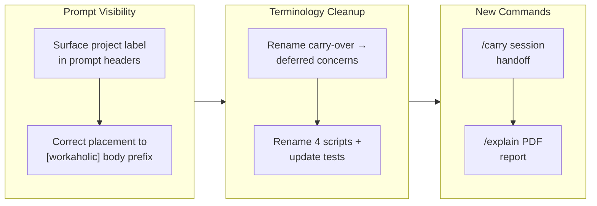

## 1. Overview

This branch delivered four Claude-only workflow improvements to workaholic: it surfaced the owning project's identity in every developer decision prompt, retired the ambiguous "carry-over" vocabulary in favor of "deferred concerns", and added two new commands — `/carry` for handing off in-progress work to a fresh session and `/explain` for answering a repo question and exporting a printer-ready PDF. The work spanned prompt UX, a terminology refactor across prose and scripts, and two greenfield command+skill+script builds, closing at v1.0.72 with no cross-agent `outputs/` footprint.

**Highlights:**

1. Surfaced the project label in `AskUserQuestion` prompts (via a new network-free `project-label.sh`), then corrected its placement to a `[workaholic]` prefix in the question body so a developer juggling tmux panes can see which repo is asking.
2. Renamed the "carry-over" concerns pipeline to "deferred concerns" across prose, four `*carryover*.sh` scripts, and their test fixtures — a pure terminology refactor with no behavior change.
3. Added `/carry`: a thin command plus internal skill and checkpoint script that persists in-progress drive or trip work to disk so a fresh session can resume it via `/drive`.
4. Added `/explain`: a command that answers a repository question and browser-prints the answer to a PDF, with Desktop→Home path resolution, a consent gate for Home writes, and a graceful halt when no browser MCP is present.

## 2. Motivation

The branch grew out of a developer-continuity and visibility itch. Running several Claude Code sessions across tmux panes, a developer could not tell which repository a waiting dialog belonged to, so project identity had to be pushed into the one surface workaholic controls — its prompt text. That same effort exposed a vocabulary collision: the established "carry-over" concerns pipeline squatted on the "carry" verb wanted for a new session-handoff command, so the term was retired to "deferred concerns" before `/carry` could be documented unambiguously. `/carry` itself answered the problem that in-session compaction loses fidelity, giving instead a durable checkpoint a fresh session resumes cleanly. `/explain` extended the same self-service spirit to knowledge export — turning a repo question into a shareable PDF — while deliberately treating the browser MCP as a session-provided dependency and the out-of-repo write as a consent-gated first.

## 3. Changes

Work began with prompt UX: a project label was added to decision prompts, then repositioned from the header chip to a `[workaholic]` prefix in the question body. A terminology refactor followed, renaming the carry-over concerns pipeline to deferred concerns across prose, four scripts, and test fixtures to free the "carry" verb. That unblocked two greenfield commands — `/carry` for durable session handoff and `/explain` for browser-printed PDF reports — each a thin command plus internal skill plus script. All four tickets landed Claude-only with no `outputs/` footprint, closing at v1.0.72.

### 3-1. Surface the project label in every workaholic AskUserQuestion prompt ([fc163bd](https://github.com/qmu/workaholic/commit/fc163bd))

Added a network-free `gather/scripts/project-label.sh` (repo-root basename) and threaded a project label into every workaholic interactive prompt so a developer running many sessions across tmux panes can tell which repository is asking. A follow-up correction ([6a5ea33](https://github.com/qmu/workaholic/commit/6a5ea33)) moved the label from the header chip — where a repeated "workaholic" read as noise — to a `[workaholic]` prefix at the start of the question body, restoring the header to its decision/topic label.

### 3-2. Rename the "carry-over" concerns pipeline to "deferred concerns" ([6a32c4d](https://github.com/qmu/workaholic/commit/6a32c4d))

Retired the "carry-over" term to "deferred concerns" to free the "carry" verb for the new `/carry` command, per the one-concept-one-word terminology policy. A full rename: prose across report/ship/review-sections/create-ticket/trip-protocol/catch skills, the four `extract`/`backfill`/`list-active`/`apply` scripts (and every reference), the emitted commit messages, and the smoke-test fixture. The `.workaholic/concerns/` directory and all frontmatter keys are unchanged (no data migration); the `carried-from-pr-` slug prefix is a deliberate machine-identifier exception.

### 3-3. Add /carry: hand off in-progress work to a fresh session ([386af5e](https://github.com/qmu/workaholic/commit/386af5e))

Added a capture-only `/carry` command (thin command + internal skill + `carry-checkpoint.sh`) that writes the remaining work and current position to a resumption ticket under `todo/<user>/` (drive case) or a `plan.md` amendment + event-log entry (trip case), so a fresh session continues via `/drive` instead of relying on compaction. User-invoked by design — no token-budget signal exists to auto-trigger.

### 3-4. Add /explain: answer a repo question and export a PDF report ([2e5ef4f](https://github.com/qmu/workaholic/commit/2e5ef4f))

Added `/explain` (thin command + internal skill + `resolve-export-path.sh`) that discovers the repo facts answering a question, renders a printer-ready HTML report, and browser-prints it to PDF (Playwright plugin or Chrome DevTools MCP, vendor-neutral). Exports to a given directory or the Desktop→Home default; the Home write is consent-gated; a session with no browser MCP halts with guidance and saves the HTML.

## 4. Outcome

Four Claude-only workflow features landed and were verified: the project-label surfacing (with a placement correction), the carry-over → deferred-concerns terminology refactor, and the new `/carry` and `/explain` commands. The full smoke suite is 260 passed / 0 failed, posix-lint is clean, and the generated `outputs/` bundle is in lockstep with source. `/carry` and `/explain` are deliberately Claude-only (like `/trip`) — their script-bearing skills carry `metadata.internal: true` and are excluded from the cross-agent build. The version closed at v1.0.72.

## 5. Historical Analysis

The branch builds on two established patterns: the ticket-based work-queue model of `/drive` and `/ticket` (which `/carry` extends by enabling mid-session checkpointing), and the concern-persistence pipeline (`/ship` writes, `/report` judges) from tickets 20260519110656 and 20260618003120 — whose vocabulary this branch renamed while preserving behavior. The project-label change mirrors ticket 20260212222003 (show-ticket-context-in-drive-approval-prompt), which embedded contextual identity structurally in `AskUserQuestion` fields; this branch applies the same principle repo-wide. `/explain`'s architecture (adaptive discovery → HTML render → browser print) adapts the `/catch` read-only-Q&A template to a new browser/PDF output surface.

## 6. Concerns

### Resumption tickets must list remaining-only steps

- **Severity:** urgent
- **Description:** `/carry` + `/drive` correctness depends on `/drive` implementing every `## Implementation Steps` entry with no "already done" concept; a resumption ticket that includes completed steps risks re-running them (see [386af5e](https://github.com/qmu/workaholic/commit/386af5e) in `plugins/workaholic/skills/carry/SKILL.md`).
- **How to Fix:** The rule is stated as the first carry Writing Guideline (completed work goes in the Overview as context). Consider enforcing it in a carry-ticket template or a lint that strips completed steps before writing the resumption ticket.

### Prompt phrasing is prose, not machine-checked

- **Severity:** moderate
- **Description:** The convention that every `AskUserQuestion` carries the `[project]` prefix lives only in per-skill "User interaction" prose; a future prompt could omit it with no static enforcement (see [fc163bd](https://github.com/qmu/workaholic/commit/fc163bd) in `plugins/workaholic/skills/drive/SKILL.md`).
- **How to Fix:** Add a coverage check to `scripts/build-plugins/verify.mjs` that scans skills for `AskUserQuestion` sites and validates the `[project]` prefix, or rely on code-review discipline anchored in the documented convention.

### /carry cannot auto-trigger on token exhaustion

- **Severity:** moderate
- **Description:** No programmatic token-budget signal is available to commands or hooks (a `PreCompact` hook has no model access), so `/carry` must be user-invoked (see [386af5e](https://github.com/qmu/workaholic/commit/386af5e) in `plugins/workaholic/commands/carry.md`).
- **How to Fix:** If Claude Code later exposes a context-budget signal or a model-capable pre-compaction hook, a non-blocking `PreCompact` nudge ("consider running /carry") becomes possible; until then it stays explicit.

### Browser MCP is session-provided and not guaranteed

- **Severity:** moderate
- **Description:** `/explain` depends on the Playwright plugin or Chrome DevTools MCP (the plugin declares no `.mcp.json`), which may be absent; the capability check is model-level (not shell-scriptable) and degradation saves the HTML but halts the PDF (see [2e5ef4f](https://github.com/qmu/workaholic/commit/2e5ef4f) in `plugins/workaholic/skills/explain/SKILL.md`).
- **How to Fix:** Keep the no-MCP halt message actionable, naming the two MCPs to enable; document them in `/explain` help.

### First out-of-repo artifact bypasses the layout hook

- **Severity:** moderate
- **Description:** `/explain`'s PDF lands outside `.workaholic/`, so it sits outside the layout-validation machinery (`validate-ticket.sh` matches only `*.workaholic/*`); the only guardrails are the Home consent gate and the resolver's writability check (see [2e5ef4f](https://github.com/qmu/workaholic/commit/2e5ef4f) in `plugins/workaholic/skills/explain/scripts/resolve-export-path.sh`).
- **How to Fix:** Keep the consent gate symmetric and the resolver's fail-safe writability check in place; ensure the resolver never touches config/profile paths or escalates privilege.

## 7. Successful Development Patterns

- **Reuse of existing artifact channels over new directories.** `/carry` writes resumption tickets to the sanctioned `tickets/todo/<user>/` and trips to existing `trips/` paths rather than inventing a `.workaholic/carry/` dir — keeping the artifact discoverable by `list-todo.sh` with no allowlist change.
- **Convention prose as the single source of truth per workflow.** The project-label rule is stated once per skill's "User interaction" anchor rather than at every prompt site — one auditable, updateable place (a DRY approach that also made the header→body correction a one-line-per-skill change).
- **Model-level checks for MCP-backed features.** Capability detection for the session-provided browser MCP is documented as inherently model-level (the agent inspects its own tool surface) rather than a fragile shell probe — a pattern for any future MCP-dependent feature.
- **Graceful degradation with a useful fallback.** `/explain` halts with actionable guidance and saves the generated HTML when no browser MCP is available, rather than failing silently or printing a broken PDF.
- **Terminology discipline enforced by tooling, not just prose.** The deferred-concerns rename renamed the four scripts and updated the smoke-test fixture, so the one-concept-one-word rule is upheld by the tests (a naive grep for `carry.?over` would have missed the `Carried-over` and `carried-from-pr-` derived forms — the participle sweep caught them).

## 8. Release Preparation

**Verdict**: Ready for release

### 8-1. Concerns

- The release-readiness pass flagged that top-level `README.md` still used the retired "carry-over" term at three sites while the rest of the branch said "deferred concerns" (the rename ticket's grep scope excluded the README). **This was fixed during report** — `README.md` now reads "deferred concerns" throughout, completing ticket 20260701104114's one-term goal.
- `/carry` (fresh-session resume) and `/explain` (browser-printed PDF) land with automated tests green but end-to-end behavior verified **manually only**, per the developer-accepted gate documented in each ticket's Final Report. This is a coverage note, not a defect — no automated regression guards those interactive paths.

### 8-2. Pre-release Instructions

- None — the README straggler was corrected during report; the branch is release-ready.

### 8-3. Post-release Instructions

- Run the manual end-to-end verifications on next use: `/carry` mid-work then resume in a fresh `/drive` (drive + trip cases); `/explain` producing a real Desktop PDF, the Home-consent prompt, and the no-MCP HTML halt.

## 9. Notes

- **Deferred-concerns backlog:** 33 prior deferred concerns (from PRs 54–63) were judged this report and all remain `still_active` — none touch the code areas this branch changed, so none were resolved here. They stay in `.workaholic/concerns/` for future judging.
- All four features are **Claude-Code-only** (like `/trip`): commands are not built to `outputs/`, and the `/carry` and `/explain` skills carry `metadata.internal: true`.

## Deployment Evidence

- **When:** 2026-07-01T13:33:01+09:00
- **Target:** Workaholic marketplace plugin
- **Method:** pre-merge build/verify/test proof (deploy-on-merge)
- **Status:** pass
- **Observed:** outputs fresh (porcelain clean after build); verify.mjs self-contained; validate-metadata version-aligned; test-workflow-scripts 260 passed 0 failed; posix-lint 0; all lockstep files at v1.0.72
