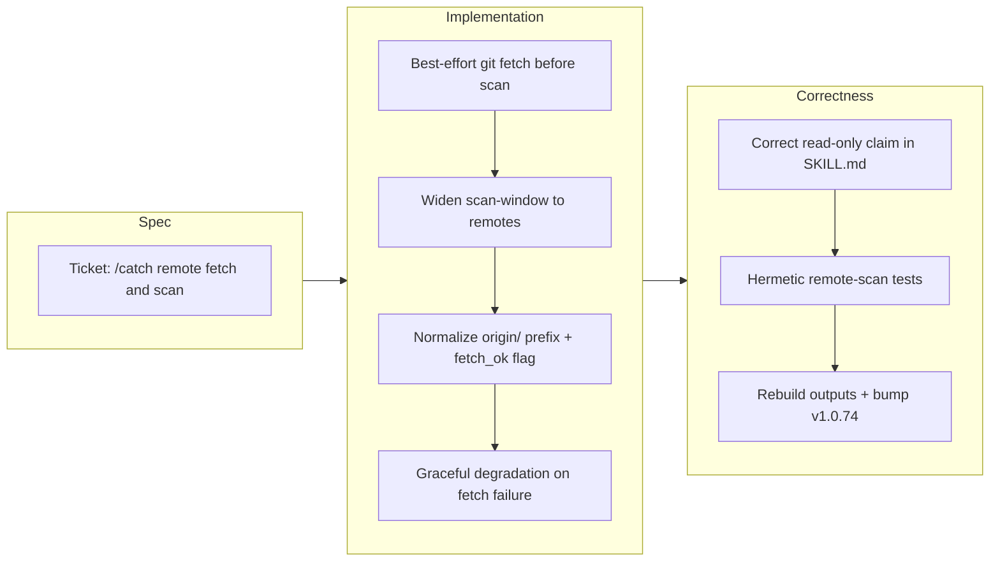

## 1. Overview

This branch taught `/catch` to see teammates' pushed-but-unpulled work. Before scanning, the workflow now best-effort-fetches remote-tracking refs and widens its scan window from local `--branches` to `--branches --remotes`, so branches that live only on the remote surface in the by-developer report. Remote branch names are normalized, fetch failures degrade gracefully with a stale-view note, the read-only claim in SKILL.md was corrected, and hermetic remote-scan tests lock the behavior in.

**Highlights:**

1. `/catch` now refreshes remote-tracking refs with a best-effort `git fetch` before scanning, so pushed-but-unpulled teammate work becomes visible
2. `scan-window.sh` widened from `--branches` to `--branches --remotes`, with a `fetch_ok` flag and graceful degradation (stale-view note) when the remote is unreachable
3. Remote branch names normalized by stripping the `origin/` prefix so remote-only branches attribute cleanly to their developer
4. Corrected the read-only claim in `catch/SKILL.md` since fetch writes `refs/remotes/*`, and added hermetic remote fetch+scan tests to the workflow suite
5. Version bump to v1.0.74

## 2. Motivation

`/catch` exists to surface cross-developer activity, yet it only read local `--branches` — so a teammate's work that had been pushed but not pulled into the local clone was invisible to the very report meant to expose it. Closing that blind spot meant refreshing remote-tracking refs before scanning and reading remotes alongside local branches. The fetch had to stay unobtrusive (quiet, best-effort, per-run) and safe: a network round-trip that must not break the report when the remote is unreachable, so failure degrades to a stale-view note rather than an error, and the previously-stated read-only guarantee was corrected to reflect that fetch writes ref state.

## 3. Changes

Work began with a ticket scoping the gap: `/catch` saw only local branches. The implementation added a best-effort `git fetch` ahead of scanning and widened `scan-window.sh` to `--branches --remotes`, threading a `fetch_ok` flag, normalizing the `origin/` prefix, and degrading gracefully to a stale-view note when the remote is unreachable. The read-only claim in SKILL.md was corrected since fetch writes ref state, hermetic remote fetch+scan tests were added, `outputs/` was rebuilt, and the version bumped to v1.0.74.

### 3-1. Fetch and scan remote branches in /catch so pushed work is visible ([ad4ea8d](https://github.com/qmu/workaholic/commit/ad4ea8d))

Made `/catch` reflect what the whole team has pushed: `scan-window.sh` now runs a best-effort `git fetch --all --prune` before scanning and reads `--branches --remotes`, so remote-only branches appear. A `strip_branch` jq helper normalizes ref forms (stripping `origin/`), a `fetch_ok` field surfaces the fetch outcome for a stale-view note, and the SKILL's read-only claim was corrected. Extended the hermetic `scan-window` tests with reachable- and unreachable-remote scenarios.

## 4. Outcome

**`/catch` now surfaces the whole team's pushed work, not just the local clone.** Previously `scan-window.sh` scanned only local heads (`git log --branches`, `refs/heads/*`) and never fetched, so a teammate's pushed-but-unpulled branch was invisible to a by-developer report whose entire purpose is to surface cross-developer activity.

Key deliverables:

- **Best-effort remote refresh** — `scan-window.sh` now runs a quiet, non-fatal `git fetch --all --prune` before scanning, refreshing remote-tracking refs so the report reflects what the team has pushed. A fetch failure (offline, no remote, auth) degrades gracefully: the scan proceeds from local refs and never aborts.
- **Widened scan to remote branches** — the developer scan changed from `--branches` to `--branches --remotes`, so commits that live only on `origin/*` now appear. `origin/HEAD` is excluded so no phantom developer branch named `HEAD` is emitted.
- **Branch-name normalization** — a `strip_branch` jq helper collapses `refs/heads/` and remote short-ref forms (`origin/<name>`) to a single canonical branch name, so a branch present both locally and on the remote does not fragment the per-branch grouping or double-count commits.
- **Fetch outcome surfaced, not swallowed** — a boolean `fetch_ok` field is emitted in the scanner JSON; the report adds a stale-view note when a configured remote genuinely could not be refreshed.
- **Honest read-only contract** — the SKILL intro's "writes nothing" claim was corrected to disclose the one exception: a best-effort fetch that only updates `refs/remotes/*`.
- **Hermetic test coverage** — the existing `scan-window` test blocks were extended with a bare-remote push scenario and a no-remote/unreachable-remote degradation case; full suite green at 268 passed, 0 failed, posix-lint conforming, `outputs/` rebuilt with `verify.mjs`/`validate-metadata.mjs` green.

## 5. Historical Analysis

This branch is a clean example of **extending existing machinery rather than introducing new machinery.** The `/catch` scanner was built recently and already carried two orthogonal axes — a per-branch axis (`--branches --source`) and a time-bucket axis — each backed by hermetic tests in `scripts/test-workflow-scripts.mjs`. Rather than adding a parallel remote-scanning path, this change widened the *same* ref selector (`--branches` → `--branches --remotes`) and extended the *same* test blocks with the new scenarios. The pre-existing `--source`/`%S` grouping infrastructure is exactly what made the normalization work possible: because `strip_branch` plugs into the axis that already existed, remote branches join the report through the established grouping rather than a bolt-on. The lesson to carry forward: the scanner's axis-based design absorbs new ref scopes cheaply, so future scope widenings (e.g. tags, notes) should follow the same pattern of teaching the existing selector and its `strip_branch`/`$remotes` normalization rather than forking a new scan.

## 6. Concerns

### (carried from PR #54) Trip unification is unproven by a live end-to-end run

- **Severity:** moderate
- **Description:** The unified `/trip` source+executor flow has not been exercised by a live end-to-end run; correctness rests on prose and structure alone (deferred concern `.workaholic/concerns/54-trip-unification-is-unproven-by-a.md`).
- **How to Fix:** Perform a real overnight `/trip` run over a non-trivial instruction and capture the trip artifacts as evidence the design→decompose→build flow holds.

### (carried from PR #56) Enforcement reaches consumer repos only after propagation

- **Severity:** moderate
- **Description:** Commit/branch enforcement takes effect in consumer repositories only once the new plugin version propagates to them, leaving a lag window where the rule is unenforced (deferred concern `.workaholic/concerns/56-enforcement-reaches-consumer-repos-only-after.md`).
- **How to Fix:** Document the propagation lag and consider a version/health check that warns a consumer repo when its installed enforcement layer is behind.

### (carried from PR #56) Two enforcement layers encode one rule

- **Severity:** moderate
- **Description:** The commit-subject/branch rule is encoded in two enforcement layers (agent-surface hooks and git-native hook), creating drift risk if one is updated without the other (deferred concern `.workaholic/concerns/56-two-enforcement-layers-encode-one-rule.md`).
- **How to Fix:** Keep both layers sourcing a single rule definition (`hooks/lib/check-subject.sh`) and add a test asserting the two layers agree on a shared corpus of subjects.

### (carried from PR #58) Trip unification is unproven by a live run

- **Severity:** moderate
- **Description:** Carried `/trip` live-run concern — still no end-to-end evidence for the unified trip flow (deferred concern `.workaholic/concerns/58-carried-from-pr-54-trip-unification.md`).
- **How to Fix:** Run a live `/trip` and archive the resulting trip/ticket artifacts as proof.

### (carried from PR #58) Enforcement reaches consumer repos only after propagation

- **Severity:** moderate
- **Description:** Carried enforcement-propagation concern — the consumer-repo lag window persists (deferred concern `.workaholic/concerns/58-carried-from-pr-56-enforcement-reaches.md`).
- **How to Fix:** Add a propagation/version health warning in consumer repos.

### (carried from PR #58) Two enforcement layers encode one rule

- **Severity:** moderate
- **Description:** Carried enforcement-drift concern — dual encoding of one rule remains a drift risk (deferred concern `.workaholic/concerns/58-carried-from-pr-56-two-enforcement.md`).
- **How to Fix:** Assert both layers share one rule source via a cross-layer agreement test.

### (carried from PR #58) collect-commits body emission is a fragile link

- **Severity:** moderate
- **Description:** The report flow depends on structured `Concerns:`/`Insights:` keys being emitted in commit bodies by `collect-commits`; if that emission link breaks, sections 6/7 silently lose their secondary source (deferred concern `.workaholic/concerns/58-collect-commits-body-emission-is-a.md`).
- **How to Fix:** Add a check that flags when expected structured keys are absent from collected commit bodies, so the degradation is visible rather than silent.

### (carried from PR #58) POSIX lint runner half is weak

- **Severity:** moderate
- **Description:** The POSIX lint runner's enforcement half is weak, so some bashisms could slip past the gate (deferred concern `.workaholic/concerns/58-posix-lint-runner-half-is-weak.md`).
- **How to Fix:** Strengthen the lint runner's shell-detection and expand its bashism corpus so the gate fails on the full known set.

### (carried from PR #59) 50-char commit-subject cap is byte-based

- **Severity:** moderate
- **Description:** The commit-subject 50-char cap counts bytes, so multibyte (non-ASCII) subjects are cut off earlier than 50 visible characters (deferred concern `.workaholic/concerns/59-50-char-cap-is-byte-based.md`).
- **How to Fix:** Count characters (code points), not bytes, in the subject-length check.

### (carried from PR #59) Both local enforcement layers stay bypassable

- **Severity:** moderate
- **Description:** Both local enforcement layers remain bypassable (`--no-verify`, unset hooksPath), so the rule is advisory at the human terminal (deferred concern `.workaholic/concerns/59-both-local-enforcement-layers-stay-bypassable.md`).
- **How to Fix:** Add a server-side/CI check that re-validates subjects on push so a bypassed local commit is still caught.

### (carried from PR #59) Bundled script hardened without rebuilding outputs

- **Severity:** moderate
- **Description:** A prior commit hardened a bundled script without rebuilding `outputs/`, a general drift-risk between source scripts and their committed cross-agent artifacts (deferred concern `.workaholic/concerns/59-bundled-script-hardened-without-rebuilding-outputs.md`).
- **How to Fix:** Rely on the Outputs Freshness CI gate for every script change and treat a green build as a required part of hardening.

### (carried from PR #59) Trip unification is unproven by a live run

- **Severity:** moderate
- **Description:** Carried `/trip` live-run concern — still no end-to-end evidence (deferred concern `.workaholic/concerns/59-carried-from-pr-58-carried-from.md`).
- **How to Fix:** Run and archive a live `/trip`.

### (carried from PR #59) collect-commits body emission is a fragile link

- **Severity:** moderate
- **Description:** Carried collect-commits emission concern — sections 6/7's secondary source can silently vanish (deferred concern `.workaholic/concerns/59-carried-from-pr-58-collect-commits.md`).
- **How to Fix:** Flag missing structured keys in collected commit bodies.

### (carried from PR #59) POSIX lint runner half is weak

- **Severity:** moderate
- **Description:** Carried POSIX-lint concern — bashisms could slip past the weak runner half (deferred concern `.workaholic/concerns/59-carried-from-pr-58-posix-lint.md`).
- **How to Fix:** Strengthen shell detection and the bashism corpus.

### (carried from PR #59) /commit is an escape hatch that bypasses drive

- **Severity:** moderate
- **Description:** `/commit` lets ticketed work be committed outside the `/drive` gate, an escape hatch that can skip the per-ticket approval discipline (deferred concern `.workaholic/concerns/59-commit-is-an-escape-hatch-that.md`).
- **How to Fix:** Reinforce in docs that `/commit` is for small non-ticketed changes and consider warning when it is used over a populated todo queue.

### (carried from PR #59) commit.sh silently drops a category argument

- **Severity:** moderate
- **Description:** `commit.sh` silently drops a category argument under some invocation, losing the intended commit categorization (deferred concern `.workaholic/concerns/59-commit-sh-silently-drops-a-category.md`).
- **How to Fix:** Validate and echo the parsed category in `commit.sh`, failing loudly on an unrecognized value.

### (carried from PR #59) Gate coverage is the single Bash surface

- **Severity:** moderate
- **Description:** Enforcement gate coverage is limited to the single `Bash` tool surface, so off-surface mutations are unguarded (deferred concern `.workaholic/concerns/59-gate-coverage-is-the-single-bash.md`).
- **How to Fix:** Enumerate the mutation surfaces the gates must cover and add coverage or explicit documentation for the gaps.

### (carried from PR #59) git commit-msg hook escapes the POSIX lint gate

- **Severity:** moderate
- **Description:** The `commit-msg` git-native hook is exempt from the POSIX-lint gate (git requires the extensionless name), so it is not lint-verified like the other scripts (deferred concern `.workaholic/concerns/59-git-commit-msg-hook-escapes-the.md`).
- **How to Fix:** Add a targeted lint pass for the extensionless `commit-msg` file so its POSIX conformance is still checked.

### (carried from PR #60) By-developer axis lacks icebox/abandoned attribution

- **Severity:** moderate
- **Description:** The by-developer axis in `scan-window.sh` joins on commits but has no icebox/abandoned attribution; this branch widened ref scope but did not add that attribution, so the gap remains (deferred concern `.workaholic/concerns/60-by-developer-axis-joins-on-commit.md`).
- **How to Fix:** Extend the by-developer join to attribute icebox/abandoned tickets alongside commits.

### (carried from PR #60) 50-char commit-subject cap is byte-based

- **Severity:** moderate
- **Description:** Carried byte-based subject-cap concern — multibyte subjects are truncated early (deferred concern `.workaholic/concerns/60-carried-from-pr-59-50-char.md`).
- **How to Fix:** Count code points, not bytes.

### (carried from PR #60) Both local enforcement layers stay bypassable

- **Severity:** moderate
- **Description:** Carried enforcement-bypass concern — both local layers remain bypassable (deferred concern `.workaholic/concerns/60-carried-from-pr-59-both-local.md`).
- **How to Fix:** Add a CI/server-side revalidation on push.

### (carried from PR #60) Bundled script hardened without rebuilding outputs

- **Severity:** moderate
- **Description:** Carried outputs-rebuild drift concern — source/artifact drift risk persists (deferred concern `.workaholic/concerns/60-carried-from-pr-59-bundled-script.md`).
- **How to Fix:** Treat a green Outputs Freshness build as mandatory for script changes.

### (carried from PR #60) /commit is an escape hatch that bypasses drive

- **Severity:** moderate
- **Description:** Carried `/commit` escape-hatch concern — ticketed work can skip the drive gate (deferred concern `.workaholic/concerns/60-carried-from-pr-59-commit-is.md`).
- **How to Fix:** Warn when `/commit` runs over a populated todo queue.

### (carried from PR #60) commit.sh silently drops a category argument

- **Severity:** moderate
- **Description:** Carried `commit.sh` category-drop concern — categorization can be silently lost (deferred concern `.workaholic/concerns/60-carried-from-pr-59-commit-sh.md`).
- **How to Fix:** Validate and echo the parsed category, failing on unknown values.

### (carried from PR #60) Gate coverage is the single Bash surface

- **Severity:** moderate
- **Description:** Carried gate-coverage concern — only the Bash surface is guarded (deferred concern `.workaholic/concerns/60-carried-from-pr-59-gate-coverage.md`).
- **How to Fix:** Enumerate and cover the remaining mutation surfaces.

### (carried from PR #60) git commit-msg hook escapes the POSIX lint gate

- **Severity:** moderate
- **Description:** Carried `commit-msg` lint-exemption concern — the git-native hook is not lint-verified (deferred concern `.workaholic/concerns/60-carried-from-pr-59-git-commit.md`).
- **How to Fix:** Add a targeted lint pass for the extensionless hook.

### (carried from PR #60) Collectors sample branch stories by title at scale

- **Severity:** moderate
- **Description:** `/catch` collectors sample branch stories by title, which does not scale cleanly as story counts grow; this branch changed ref scanning, not story sampling, so the indexing gap remains (deferred concern `.workaholic/concerns/60-collectors-sample-branch-stories-by-title.md`).
- **How to Fix:** Introduce a story index/identifier so sampling does not rely on title matching at scale.

### (carried from PR #63) Branch-guard tokenizer lacks shell quoting

- **Severity:** moderate
- **Description:** The branch-guard tokenizer does not handle shell quoting, so a quoted/escaped branch-creation command could evade or misparse the gate (deferred concern `.workaholic/concerns/63-branch-guard-tokenizer-lacks-shell-quoting.md`).
- **How to Fix:** Use a quoting-aware tokenizer (or a stricter parse) in the branch guard.

### (carried from PR #63) /catch deployment attribution is approximate

- **Severity:** moderate
- **Description:** `/catch` deployment attribution is approximate because the join keys on branch-story ship commits; this branch's fetch/remote-scan change did not touch that join, so the approximation remains (deferred concern `.workaholic/concerns/63-catch-deployment-attribution-is-approximate-for.md`).
- **How to Fix:** Tighten the deployment-attribution join to a more precise key than ship-commit matching.

### (carried from PR #63) /catch focus buckets are UTC-day based

- **Severity:** moderate
- **Description:** `/catch` focus buckets are computed on UTC days, so activity is bucketed against UTC rather than the developer's local day (deferred concern `.workaholic/concerns/63-catch-focus-buckets-are-utc-day.md`).
- **How to Fix:** Make the bucket boundary timezone-aware or document the UTC assumption in the report.

### (carried from PR #63) /catch generation-style is an explicit guess

- **Severity:** moderate
- **Description:** The `/catch` report's generation-style wording is an explicit guess rather than a derived fact (deferred concern `.workaholic/concerns/63-catch-generation-style-is-an-explicit.md`).
- **How to Fix:** Either ground the style descriptor in observable signals or drop the guessed wording.

### (carried from PR #63) Quality gate is prose-mandated, not hook-enforced

- **Severity:** moderate
- **Description:** The quality gate is mandated only in prose, not enforced by a hook, so it can be skipped without an automated failure (deferred concern `.workaholic/concerns/63-quality-gate-is-prose-mandated-not.md`).
- **How to Fix:** Back the quality gate with a machine check where feasible.

### (carried from PR #63) Stale plugin install is indistinguishable from a broken hook

- **Severity:** moderate
- **Description:** A stale plugin install presents the same symptoms as a genuinely broken hook, making diagnosis ambiguous (deferred concern `.workaholic/concerns/63-stale-plugin-install-is-indistinguishable-from.md`).
- **How to Fix:** Emit a version/identity signal from hooks so a stale install is distinguishable from a real failure.

### (carried from PR #67) Browser MCP is session-provided and optional

- **Severity:** moderate
- **Description:** `/explain`'s PDF export depends on a browser MCP that is session-provided and optional, so the export can be unavailable at runtime (deferred concern `.workaholic/concerns/67-browser-mcp-is-session-provided-and.md`).
- **How to Fix:** Detect the missing browser MCP and degrade with a clear message or fallback path.

### (carried from PR #67) /carry cannot auto-trigger on token exhaustion

- **Severity:** moderate
- **Description:** `/carry` cannot auto-trigger on token exhaustion, so a session may run out before handoff state is captured (deferred concern `.workaholic/concerns/67-carry-cannot-auto-trigger-on-token.md`).
- **How to Fix:** Explore a proactive checkpoint trigger as context nears exhaustion.

### (carried from PR #67) First out-of-repo artifact bypasses the layout hook

- **Severity:** moderate
- **Description:** The first out-of-repo artifact bypasses the artifact-layout hook, so its placement is unguarded (deferred concern `.workaholic/concerns/67-first-out-of-repo-artifact-bypasses.md`).
- **How to Fix:** Extend the layout guard to cover the first out-of-repo artifact case.

### (carried from PR #67) Prompt phrasing is prose, not machine-checked

- **Severity:** moderate
- **Description:** Key prompt phrasing is enforced only as prose, not machine-checked, so drift in the wording goes undetected (deferred concern `.workaholic/concerns/67-prompt-phrasing-is-prose-not-machine.md`).
- **How to Fix:** Add an assertion over the prompt text where the phrasing is load-bearing.

### (carried from PR #67) Resumption tickets must list remaining work only

- **Severity:** moderate
- **Description:** `/carry` resumption tickets must list only remaining work, but nothing enforces the scoping, risking re-listing completed work (deferred concern `.workaholic/concerns/67-resumption-tickets-must-list-remaining-only.md`).
- **How to Fix:** Add a scoping check or template that excludes already-done items from the resumption ticket.

### Best-effort fetch adds a per-run network round-trip to /catch

- **Severity:** moderate
- **Description:** `scan-window.sh` now runs `git fetch --all` on every `/catch` invocation, adding a network round-trip and measurable latency on large remotes; it is `--quiet` and best-effort, but the cost is paid on every report run (see [ad4ea8d](https://github.com/qmu/workaholic/commit/ad4ea8d) in `plugins/workaholic/skills/catch/scripts/scan-window.sh`; ticket Considerations "Performance").
- **How to Fix:** Consider a bounded fetch timeout or an opt-out flag for large remotes so a slow or unresponsive remote cannot stall the report.

### --prune mutates the user's remote-tracking refs on every /catch

- **Severity:** moderate
- **Description:** The fetch uses `--prune` to drop remote-tracking refs for upstream-deleted branches so the report shows no ghosts, but this means every `/catch` run silently mutates `refs/remotes/*` in the user's clone — a side effect a user of a nominally read-only report may not expect (see [ad4ea8d](https://github.com/qmu/workaholic/commit/ad4ea8d) in `plugins/workaholic/skills/catch/scripts/scan-window.sh`; ticket Considerations "--prune is a deliberate choice").
- **How to Fix:** Keep the corrected read-only wording in the SKILL intro prominent, and consider making `--prune` opt-in if the ghost-branch risk proves rare in practice.

## 7. Successful Development Patterns

### Prototype the git-log scenarios before writing the jq

The branch's two discovered insights both came from empirically probing `git log` behavior before committing to the normalization code, and both overturned an assumption baked into the ticket. First, `git fetch --all` in a repo with **no** remote exits 0 (a vacuous success), so `fetch_ok` is `true` there — not `false` as the acceptance criteria assumed; only an unreachable/failing remote yields `false`. Second, `%S` (`--source`) emits the **short** ref form (`origin/feature`), not the full `refs/remotes/origin/feature`, so stripping a `refs/remotes/<remote>/` regex alone leaves the `origin/` prefix and normalization must strip the actual remote names via a `$remotes` jq argument. Prototyping the real command output first meant the tests were written to true behavior (no-remote asserts `fetch_ok: true`; a separate unreachable-remote case asserts `false`) rather than to a wrong spec. Pattern: when shell/tooling semantics are load-bearing, verify them empirically before encoding them.

### Extend the existing hermetic scan-window tests rather than build new machinery

The new behavior was proven by extending the already-present `scan-window` test blocks with a bare-remote push scenario (remote-only commit surfaces with a normalized branch name) and a no-remote/unreachable-remote degradation case — using a local filesystem path as the bare remote, consistent with the harness's existing "no real remotes, no network" posture. Reusing the established hermetic pattern kept the suite fast and network-free (268 passed, 0 failed) while giving the risky new path (fetch, remote refs, normalization, graceful degradation) direct coverage. Pattern: grow the existing test harness's proven idioms instead of introducing a new test style for each feature.

### Surface the fetch outcome via `fetch_ok` rather than swallowing it

Rather than let a failed fetch silently produce a local-only scan dressed up as a fresh remote view, the scanner emits an explicit `fetch_ok` boolean that both the report and the tests can read. This satisfies the observability and objective-documentation policies at once: the report keys its stale-view note on `fetch_ok: false`, so it honestly discloses staleness only when a configured remote genuinely could not be refreshed, and the tests can assert the degradation path directly. Pattern: when a best-effort step can fail, promote its outcome into the data contract so failure is visible and testable, not hidden.

## 8. Release Preparation

**Verdict**: Ready for release

### 8-1. Concerns

- None - changes are safe for release

### 8-2. Pre-release Instructions

- None - standard release process applies

### 8-3. Post-release Instructions

- None - no special post-release actions needed

## 9. Notes

The branch was synced with `origin/main` (which had advanced to the already-released v1.0.73 via a standards-sync) before bumping to v1.0.74, so the merge into main is conflict-free and the ship produces a clean new release. This branch touches only the `/catch` scanner, its SKILL prose, the mirrored `outputs/workflows/` artifacts, and the workflow test suite.

## Deployment Evidence

- **When:** 2026-07-01T21:14:37+09:00
- **Target:** Workaholic marketplace plugin
- **Method:** other (pre-merge branch/staging proofs)
- **Status:** pass
- **Observed:** build.mjs fresh (outputs/ clean); verify.mjs pass; validate-metadata.mjs version-aligned; test-workflow-scripts.mjs 268 passed 0 failed; version 1.0.74 consistent across lockstep files. Post-merge check: gh release view v1.0.74.
