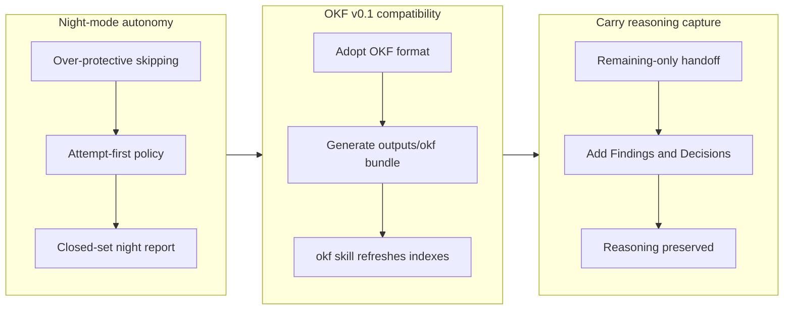

## 1. Overview

This branch tightens three independent workflow constraints in the workaholic plugin. Night mode's `/drive` autonomy is re-aimed from over-protective skipping to attempt-first discipline; the generated knowledge tree is made Open Knowledge Format (OKF v0.1) compatible for vendor-neutral portability; and the `/carry` resumption ticket is enriched to preserve the session's reasoning, not just its remaining tasks.

**Highlights:**

1. Night mode is attempt-first: a `/drive night` run must attempt every authorized ticket and may skip only on a demonstrated failure or a named hard external blocker — size, complexity, and "looks like it needs a human" are no longer skip reasons
2. The four pillars' policies ship as a committed OKF v0.1 bundle (`outputs/okf/`), and every project's `.workaholic/` tree is kept OKF-compatible as workflows generate documents
3. An internal `okf` skill deterministically regenerates the `.workaholic/` index hierarchy before each knowledge commit in drive, ship, and report
4. The `/carry` resumption ticket gains optional `## Findings` and `## Decisions` sections so a fresh `/drive` neither re-walks a ruled-out dead-end nor relitigates a settled choice
5. Documentation was updated in lockstep (README, CLAUDE.md, rules) and the build/verify suite confirms every generated artifact is a pure function of source

## 2. Motivation

Each change closes a specific gap. Night mode had banked only 3 of 16 authorized tickets on a real overnight run, declining 13 as "large / all-or-nothing / human-in-loop" — defeating the purpose of an authorized batch; the fix tightens the entry condition to skipping while leaving the safety floor untouched. OKF adoption hedges against tool lock-in: workaholic's markdown-plus-frontmatter substrate already matches Google's vendor-neutral interchange standard, so conforming now keeps the policies and generated knowledge portable at near-zero cost. And `/carry` was losing the one thing it sacrifices versus in-session `/compact` — the reasoning behind decisions and dead-ends — so capturing Findings and Decisions objectively keeps a resumed session grounded in what was already learned.

## 3. Changes

The branch advanced on three fronts. First, night-mode `/drive` was re-aimed from subjective skipping to attempt-first discipline, with a closed-set morning report of implemented/failed/blocked. Next, the generated knowledge tree adopted OKF v0.1: the pillar policies ship as a committed bundle and the runtime `.workaholic/` tree stays conformant, kept in sync by a dedicated `okf` skill. Finally, the `/carry` template gained Findings and Decisions sections so a fresh session inherits the reasoning, not just the remaining steps. Docs and the verify suite were kept green throughout.

### 3-1. Night mode must attempt every authorized ticket — no pre-emptive skip ([075a4cf](https://github.com/qmu/workaholic/commit/075a4cf))

Re-aimed `/drive night` from over-protective skipping to attempt-first discipline: every authorized ticket must be attempted, and a skip is legitimate only on a demonstrated failure or a named hard external blocker — size, complexity, and "all-or-nothing / needs a human" are no longer skip reasons. The safety floor (stash partial work, never destructive git, never auto-icebox) is unchanged; only the entry condition to skipping was tightened, and the morning report became a closed set of implemented / failed / blocked.

### 3-2. Support the Open Knowledge Format (OKF) as a generated export target ([8e8e690](https://github.com/qmu/workaholic/commit/8e8e690))

Added OKF v0.1 compatibility across the generated knowledge. The four pillars' policy hard copies ship as a committed `outputs/okf/` bundle (one concept document per policy, bundle-root `index.md` declaring `okf_version`), produced by a new `okf.mjs` wired into the argument-less build. Separately, every project's `.workaholic/` tree is kept OKF-compatible at runtime — generated documents carry a non-empty `type`, and an internal `okf` skill regenerates the index hierarchy before each knowledge commit in drive/ship/report.

### 3-3. Carry: capture found insights and decision flow, not just remaining tasks ([03152fe](https://github.com/qmu/workaholic/commit/03152fe))

Extended the `/carry` Resumption Ticket Template with optional `## Findings` (dead-ends ruled out, surprising behavior) and `## Decisions` (choices made and why) sections, placed after Quality Gate and before Considerations, plus Phase 1 distillation bullets and a Writing Guideline holding both to `objective-documentation`. This preserves the session reasoning a remaining-only ticket would drop, so a fresh `/drive` does not re-walk a closed dead-end or relitigate a settled choice. The remaining-only Implementation Steps invariant is untouched.

## 4. Outcome

Three deliverables landed across 6 commits: (1) Night-mode attempt-first tightening on /drive and /trip — every authorized ticket must be attempted; skip/park only after genuine attempt failure or named hard external blocker, with closed-set outcomes {implemented, failed, blocked} preventing the original overly-protective bypass; (2) OKF (v0.1) compatibility across all workflow-generated knowledge — generated policy bundle (50 concepts, 191 in-bundle links), OKF-conformant frontmatter on every artifact family (stories, release-notes, concerns, trip artifacts), reserved-name navigation (index.md), and self-maintaining .workaholic/ bundle hierarchy kept fresh by a new internal okf skill across drive/report/ship flows; (3) /carry Resumption Ticket Template extended with ## Findings and ## Decisions sections capturing session reasoning (dead-ends ruled out, choices made) alongside remaining tasks, held to objective-documentation bar so future agents don't relitigate settled decisions. All acceptance criteria met: builds green (build.mjs regenerate, verify.mjs with 191 OKF link checks, validate-metadata.mjs, test-workflow-scripts.mjs 268 passed), outputs/ deterministic, no stray drift, carry-template invariant (remaining-only Implementation Steps) preserved.

## 5. Historical Analysis

Night-mode autonomy was built incrementally across five prior tickets (add mode → checkpoint → drop per-ticket checkbox → add night trip → flow-through design pause), each tightening the front end's authorization handling. The back-end skip-condition entry logic was never revisited once the 'safe-by-default' failure policy launched, so subjective outs ('too complex', 'any other reason') quietly accumulated into 'skip anything that looks big' despite the authorization contract saying 'attempt the batch while I sleep'. This branch closes that gap 18 days after night-trip launch, fixing the policy at the decision boundary. OKF adoption came as a parallel initiative: qmu.co.jp launched the industry standard (v0.1) for vendor-neutral knowledge interchange, and workaholic's markdown+frontmatter substrate already sits on that foundation; two prior monthly cross-agent distribution sprints (May-June) built the artifact pipeline (build step, CI freshness guarding) that OKF slots into cleanly, and runtime-generated markdown in consumer projects (.workaholic/) now conforms to the spec-required frontmatter+hierarchy. /carry emerged in the work-20260701-093015 branch (6 days ago) to hand off in-progress work without losing context-to-date; the remaining-only Implementation Steps rule preserved traceability, but a fresh session re-walked dead-ends this session ruled out or relitigated decisions already made — this branch adds first-class Findings/Decisions sections to capture that reasoning objectively per the objective-documentation policy.

## 6. Concerns

### (carried from PR #54) Trip unification is unproven by a live `/trip` run

- **Severity:** moderate
- **Description:** The entire `/trip`-unification protocol change is validated only by `build.mjs`/`verify.mjs`/`validate-metadata.mjs`/`test-workflow-scripts.mjs` and prose review — the smoke tests exercise the bundled shell scripts (reused, not changed), not the skill/agent markdown. The new Decomposition gate, the per-ticket Coding loop, and the context-aware queue-execute routing have **not** been exercised end-to-end by a real `/trip` (`plugins/workaholic/skills/trip-protocol/SKILL.md`). A live run could surface gate-sequencing, archiving, or routing gaps the static checks cannot catch.
- **How to Fix:** Run a real end-to-end `/trip` — both a design-first trip (validate the Decomposition gate emits well-formed tickets and the per-ticket loop archives each) and a queue-execute trip (validate routing skips Planning/Decomposition and drives a pre-populated queue) — before relying on the new flow.

### (carried from PR #56) Enforcement reaches consumer repos only after this release

- **Severity:** moderate
- **Description:** The hooks live in the workaholic plugin; a consumer repo gains them only once this version is published and the repo updates. That repo is migrated to `workaholic@workaholic` + `autoUpdate: true`, so it will pull them post-release — but until then, in-flight branches there can still reintroduce `done/` (observed live in a consumer repo during cleanup).
- **How to Fix:** Ship this branch via `/release`; autoUpdate propagates the enforcement to consumer repos automatically.

### (carried from PR #56) Two enforcement layers encode one rule (drift risk)

- **Severity:** low
- **Description:** The canonical-path rule now lives in both `validate-ticket.sh` (bash, PostToolUse) and `guard-ticket-structure.sh` (POSIX sh, PreToolUse). Future edits must change both or they will disagree.
- **How to Fix:** Keep the path-shape rules equivalent; consider extracting a shared helper if a third consumer appears.

### (carried from PR #58) (carried from PR #54) Trip unification is unproven by a live `/trip` run

- **Severity:** moderate
- **Description:** The `/trip`-unification protocol — the Decomposition gate, per-ticket Coding loop, context-aware queue routing, and now the design-first flow-through added here ([1c8e87a](https://github.com/qmu/workaholic/commit/1c8e87a)) — is still validated only by static checks and prose review, never exercised end-to-end by a real `/trip`. This branch's flow-through change is prose-only and carries the same caveat.
- **How to Fix:** Run a real end-to-end `/trip` — both a design-first trip (confirm it flows through Decomposition into the per-ticket build with no pause) and a queue-execute trip (confirm routing skips Planning and drives a pre-populated queue) — before relying on the new flow.

### (carried from PR #58) (carried from PR #56) Enforcement reaches consumer repos only after this release

- **Severity:** moderate
- **Description:** The ticket-structure enforcement hooks live in the workaholic plugin; a consumer repo gains them only once this version is published and the repo updates. Migrated consumers on `autoUpdate: true` pull them post-release, but in-flight branches there can still reintroduce non-canonical paths until then.
- **How to Fix:** Ship this branch via `/release`; autoUpdate propagates the enforcement to consumers automatically.

### (carried from PR #58) (carried from PR #56) Two enforcement layers encode one rule (drift risk)

- **Severity:** low
- **Description:** The canonical-path rule lives in both `validate-ticket.sh` (PostToolUse) and `guard-ticket-structure.sh` (PreToolUse). Converting `validate-ticket.sh` to POSIX here did not consolidate them, so future edits must change both or they will disagree.
- **How to Fix:** Keep the path-shape rules equivalent; extract a shared helper if a third consumer appears.

### (carried from PR #58) collect-commits body emission is a load-bearing, easily-severed link

- **Severity:** moderate
- **Description:** The new commit Concerns/Insights → section-reviewer wiring assumes `collect-commits.sh` emits the body and that the report orchestrator passes the commit bodies to that worker (see [24e5b37](https://github.com/qmu/workaholic/commit/24e5b37) in `plugins/workaholic/skills/report/scripts/collect-commits.sh`). The script silently dropped the body once already; if it regresses, the new keys stop reaching `/report` with no error.
- **How to Fix:** Keep the `collect-commits` body-emission smoke test green, and keep the commit-bodies input wired to the section-reviewer when editing report Phase 2.

### (carried from PR #58) POSIX lint runner half is weak where /bin/sh is bash

- **Severity:** low
- **Description:** The dash/sh test runner only catches bashisms on an image where `/bin/sh` is dash/ash; on a host where `sh` is bash it is weak (see [c7c73d7](https://github.com/qmu/workaholic/commit/c7c73d7) in `scripts/test-workflow-scripts.mjs`). The grep-based `posix-lint.sh` is shell-independent and catches drift everywhere, so the gate is not blind, but the runner half should not be relied on alone.
- **How to Fix:** Prefer a dash/Alpine CI runner so both halves of the gate bite.

### (carried from PR #59) 50-char cap is byte-based outside a UTF-8 locale

- **Severity:** low
- **Description:** The subject-length check uses `wc -m`, which counts characters only under a UTF-8 locale and bytes under a C/POSIX locale (see [24a3096](https://github.com/qmu/workaholic/commit/24a3096) in `plugins/workaholic/hooks/lib/check-subject.sh`). Japanese subjects therefore enforce a character-accurate 50-char cap only when the runtime locale is UTF-8; in CI's default locale the cap is effectively byte-based and multibyte subjects can false-trip.
- **How to Fix:** Pin a UTF-8 locale (e.g. `LC_ALL=C.UTF-8`) wherever the gate/hook runs, or switch to a locale-independent character count if byte-vs-char accuracy on Japanese subjects becomes load-bearing.

### (carried from PR #59) Both local enforcement layers stay bypassable and arrive late

- **Severity:** moderate
- **Description:** The Bash gate plus the `commit-msg` hook are bypassable via `git commit --no-verify` and on server-side merges, and the git hook reaches a consumer only after release + update and *then* the owner must still run the installer (see [e2fdcf0](https://github.com/qmu/workaholic/commit/e2fdcf0) in `plugins/workaholic/hooks/install-git-hooks.sh`). They are a strong belt, not a vault.
- **How to Fix:** Pair the local layers with a repo-side control (branch protection / required status check) for true enforcement, and surface the one-line install command prominently in the release/rollout notes so consumers actually opt in.

### (carried from PR #59) Bundled script hardened without rebuilding outputs/, leaving the public copy stale

- **Severity:** moderate
- **Description:** Ticket 2047 hardened `plugins/workaholic/skills/branching/scripts/ensure-worktree.sh`, which is a **bundled** branching-skill script in the drive/report/ship/create-ticket closure, but its archival commit ([24a3096](https://github.com/qmu/workaholic/commit/24a3096)) claimed "No outputs/ rebuild" — the `outputs/` copies were left stale and only regenerated later during the version bump ([1f7c620](https://github.com/qmu/workaholic/commit/1f7c620)), so source and artifact were out of lockstep in between (an `Outputs Freshness` CI failure waiting to happen).
- **How to Fix:** When editing any script under a bundled skill closure, always run `node scripts/build-plugins/build.mjs` and commit `outputs/` in lockstep within the same change; only pure `hooks/` changes may skip the rebuild. Treat "is this script in a shipped closure?" as a checklist item before claiming "No outputs/ rebuild."

### (carried from PR #59) (carried from PR #58) (carried from PR #54) Trip unification is unproven by a live `/trip` run

- **Severity:** moderate
- **Description:** The `/trip`-unification protocol — the Decomposition gate, per-ticket Coding loop, context-aware queue routing, and the design-first flow-through — is still validated only by static checks and prose review, never exercised end-to-end by a real `/trip` (see [1c8e87a](https://github.com/qmu/workaholic/commit/1c8e87a) in `plugins/workaholic/skills/trip-protocol/SKILL.md`). The flow-through change is prose-only and carries the same caveat.
- **How to Fix:** Run a real end-to-end `/trip` — both a design-first trip (confirm it flows through Decomposition into the per-ticket build with no pause) and a queue-execute trip (confirm routing skips Planning and drives a pre-populated queue) — before relying on the new flow.

### (carried from PR #59) (carried from PR #58) collect-commits body emission is a load-bearing, easily-severed link

- **Severity:** moderate
- **Description:** The commit Concerns/Insights → section-reviewer wiring assumes `collect-commits.sh` emits the commit body and that the report orchestrator passes those bodies to the section worker (see [24e5b37](https://github.com/qmu/workaholic/commit/24e5b37) in `plugins/workaholic/skills/report/scripts/collect-commits.sh`). The script silently dropped the body once already; if it regresses, the new keys stop reaching `/report` with no error.
- **How to Fix:** Keep the `collect-commits` body-emission smoke test green, and keep the commit-bodies input wired to the section-reviewer when editing report Phase 2.

### (carried from PR #59) (carried from PR #58) POSIX lint runner half is weak where /bin/sh is bash

- **Severity:** low
- **Description:** The dash/sh test runner only catches bashisms on an image where `/bin/sh` is dash/ash; on a host where `sh` is bash it is weak (see [c7c73d7](https://github.com/qmu/workaholic/commit/c7c73d7) in `scripts/test-workflow-scripts.mjs`). The grep-based `posix-lint.sh` is shell-independent and catches drift everywhere, so the gate is not blind, but the runner half should not be relied on alone.
- **How to Fix:** Prefer a dash/Alpine CI runner so both halves of the gate bite.

### (carried from PR #59) /commit is an escape hatch that can invite non-ticketed commits

- **Severity:** low
- **Description:** The new `/commit` command provides a sanctioned path for ad-hoc commits, but by existing it can normalize committing outside the ticketed `/drive` flow (see [a62d99c](https://github.com/qmu/workaholic/commit/a62d99c) in `plugins/workaholic/commands/commit.md`). It is still strictly better than free-handed `git commit` because both the command and the gate preserve the message policy.
- **How to Fix:** Keep the command copy steering users to `/drive` for ticketed work and framing `/commit` as for small/explicit non-ticketed changes; revisit if commit history shows `/commit` displacing ticketed development.

### (carried from PR #59) commit.sh silently drops a --category placed after its positional args

- **Severity:** low
- **Description:** `commit.sh` parses option flags (`--category`, `--skip-staging`) only at the front of its argument list — the parse loop breaks on the first non-flag token, so a `--category` placed after the six positional args is silently consumed as a `[files...]` entry and the `Category:` trailer goes missing with no error (see [a62d99c](https://github.com/qmu/workaholic/commit/a62d99c) in `plugins/workaholic/skills/commit/scripts/commit.sh`). The missing trailer is invisible to `verify.mjs`; only a temp-repo dry-run surfaces it.
- **How to Fix:** Always pass flags before the positional `title why changes concerns insights verify` args (the `/commit` doc now states this), and consider making `commit.sh` error on an unrecognized trailing `--flag` instead of treating it as a file path.

### (carried from PR #59) Gate coverage is the single-Bash-call agent surface only

- **Severity:** moderate
- **Description:** Per least-privilege the `PreToolUse(Bash)` commit gate blocks off-policy subjects only (not block-all), and structurally it sees only the agent's top-level Bash command (see [24a3096](https://github.com/qmu/workaholic/commit/24a3096) in `plugins/workaholic/hooks/guard-git-commit.sh`). A human's terminal `git commit`, `--no-verify`, GitHub-web/server merges, and any non-Bash agent path are all out of scope; the opt-in 2050 `commit-msg` hook closes only the local-human gap once installed.
- **How to Fix:** Pair the gate with a repo-side control or server-side enforcement for coverage beyond the Bash agent surface, and document that local gates on agent paths are advisory and must be paired with higher-level controls for production enforcement.

### (carried from PR #59) git commit-msg hook escapes the Bash gate's top-level-call scope

- **Severity:** moderate
- **Description:** The new `commit-msg` hook (a git-native, not Bash-agent gate) sits outside `posix-lint.sh`'s scanning by design (it has a reserved extensionless name that `*.sh` lint cannot reach). It is subject-only (never rewrites the message), but if future changes add logic beyond subject validation, the lint pass will not cover it.
- **How to Fix:** Keep the hook subject-only or lint it explicitly via a new entry in the linting rules; never add unreviewable logic to `.git/hooks/commit-msg`.

### (carried from PR #60) By-developer axis joins on commit author, not deployment executor

- **Severity:** low
- **Description:** The `/catch` by-developer breakdown attributes deployed changes to the git commit author, not the deployer. This is correct for change discovery but means a developer who pulled work-in-progress from another session (via `/carry`) will own deployment credit for that WIP. An abandoned or icebox ticket can also float in a developer's silo without re-attribution.
- **How to Fix:** Consider adding icebox/abandoned status to `scan-window.sh` so the report can surface those contexts, or document the author-attribution rule prominently in `/catch` output.

### (carried from PR #60) Carried (from PR #59) 50-char cap is byte-based outside a UTF-8 locale

- **Severity:** low
- **Description:** The subject-length check uses `wc -m`, which counts characters only under a UTF-8 locale and bytes under a C/POSIX locale. Japanese subjects therefore enforce a character-accurate 50-char cap only when the runtime locale is UTF-8; in CI's default locale the cap is effectively byte-based and multibyte subjects can false-trip.
- **How to Fix:** Pin a UTF-8 locale (e.g. `LC_ALL=C.UTF-8`) wherever the gate/hook runs, or switch to a locale-independent character count if byte-vs-char accuracy on Japanese subjects becomes load-bearing.

### (carried from PR #60) Carried (from PR #59) Both local enforcement layers stay bypassable and arrive late

- **Severity:** moderate
- **Description:** The Bash gate plus the `commit-msg` hook are bypassable via `git commit --no-verify` and on server-side merges, and the git hook reaches a consumer only after release + update and *then* the owner must still run the installer. They are a strong belt, not a vault.
- **How to Fix:** Pair the local layers with a repo-side control (branch protection / required status check) for true enforcement, and surface the one-line install command prominently in the release/rollout notes so consumers actually opt in.

### (carried from PR #60) Carried (from PR #59) Bundled script hardened without rebuilding outputs/, leaving the public copy stale

- **Severity:** moderate
- **Description:** A bundled skill script was hardened without regenerating `outputs/`, so source and artifact were out of lockstep until a later version bump. The `Outputs Freshness` CI failed to catch it because the rebuild-and-diff gate ran in isolation per PR.
- **How to Fix:** When editing any script under a bundled skill closure, always run `node scripts/build-plugins/build.mjs` and commit `outputs/` in lockstep within the same change; only pure `hooks/` changes may skip the rebuild.

### (carried from PR #60) Carried (from PR #59) (carried from PR #58) (carried from PR #54) Trip unification is unproven by a live `/trip` run

- **Severity:** moderate
- **Description:** The `/trip`-unification protocol is still validated only by static checks and prose review, never exercised end-to-end by a real `/trip`. The flow-through change is prose-only and carries the same caveat.
- **How to Fix:** Run a real end-to-end `/trip` — both a design-first trip (confirm it flows through Decomposition into the per-ticket build with no pause) and a queue-execute trip (confirm routing skips Planning and drives a pre-populated queue) — before relying on the new flow.

### (carried from PR #60) Carried (from PR #59) (carried from PR #58) collect-commits body emission is a load-bearing, easily-severed link

- **Severity:** moderate
- **Description:** The commit Concerns/Insights → section-reviewer wiring assumes `collect-commits.sh` emits the commit body. The script silently dropped the body once already; if it regresses, the new keys stop reaching `/report` with no error.
- **How to Fix:** Keep the `collect-commits` body-emission smoke test green, and keep the commit-bodies input wired to the section-reviewer when editing report Phase 2.

### (carried from PR #60) Carried (from PR #59) (carried from PR #58) POSIX lint runner half is weak where /bin/sh is bash

- **Severity:** low
- **Description:** The dash/sh test runner only catches bashisms on an image where `/bin/sh` is dash/ash; on a host where `sh` is bash it is weak. The grep-based `posix-lint.sh` is shell-independent and catches drift everywhere, so the gate is not blind, but the runner half should not be relied on alone.
- **How to Fix:** Prefer a dash/Alpine CI runner so both halves of the gate bite.

### (carried from PR #60) Collectors sample branch stories by title only, no story index

- **Severity:** low
- **Description:** The `/catch` workflow samples up to N recent story files for the by-branch breakdown; title-only matching means a developer cannot distinguish a story from branch A vs. branch B with identical titles, and there is no story index to find relevant stories at scale.
- **How to Fix:** Build or maintain a story index (e.g. `.workaholic/stories/index.md`) so collectors and developers can navigate stories; consider tagging stories with their origin-branch in frontmatter.

### (carried from PR #63) Branch-guard tokenizer lacks shell quoting awareness

- **Severity:** low
- **Description:** The branch-name guard (`guard-git-branch.sh`) splits the work-time token naively, assuming English digits and ASCII alphanumeric characters; a branch name containing a shell metacharacter (quote, space, glob) in the work-time part could cause unexpected tokenization (see `plugins/workaholic/hooks/guard-git-branch.sh`).
- **How to Fix:** Quote the token parts before joining them, or use a delimiter other than `-` for the work-time separator if branch names ever allow custom time zones or special characters.

### (carried from PR #63) /catch deployment attribution is approximate for multiple-author merged PRs

- **Severity:** low
- **Description:** The `scan-window.sh` attribution join keys on git commit author; a merge commit's author is the merger, not the original author, so a multi-author PR deployed via merge gets attributed to the merge executor, not the commit author(s) inside.
- **How to Fix:** Consider tracking deployment executor separately from commit author, or extracting the Co-Authored-By trailer from commit bodies to attribute deployed work to all contributors.

### (carried from PR #63) /catch focus buckets are UTC-day, not local-day

- **Severity:** low
- **Description:** The `scan-window.sh` time-based bucketing uses UTC dates; a developer in JST/JST+9 sees "today" and "yesterday" misaligned with their calendar (see `plugins/workaholic/skills/catch/scripts/scan-window.sh`).
- **How to Fix:** Accept a `--tz` or `TZ` env var to `scan-window.sh` and bucket by local time, or document that times are UTC and adjust the by-developer breakdown to use deployment date in the developer's time zone.

### (carried from PR #63) /catch generation style is an explicit, unenforced guess

- **Severity:** low
- **Description:** The `/catch` SKILL.md defines a generation-style pattern (`[project] by-developer, then by-commit, then by-branch`) but the prose does not explain why that order aids the developer's daily context reset. If the order is prescriptive it should be a gate; if optional the skill copy should say so (see `plugins/workaholic/skills/catch/SKILL.md` Generation section).
- **How to Fix:** Clarify whether the generation style is a fixed discipline or a template developers should adapt; if it is fixed, document the rationale (e.g., "by-developer first surfaces your impact, then by-commit shows what each merge contained, then by-branch contextualizes changes across parallel work").

### (carried from PR #63) Quality gate is prose-mandated, not validated

- **Severity:** low
- **Description:** The ticket Quality Gate describes a `## Quality Gate` body section that `validate-ticket.sh` never checks — the section is human-readable documentation only, not enforced. Adding a section is optional, and omitting it doesn't fail any gate (see `plugins/workaholic/hooks/validate-ticket.sh`).
- **How to Fix:** Either add a Quality Gate body-section check to `validate-ticket.sh` (required, non-empty) to enforce the gate, or document that the Quality Gate is a template suggestion, not a requirement, and update tickets that omit it.

### (carried from PR #63) Stale plugin install is indistinguishable from broken

- **Severity:** low
- **Description:** If a developer has a stale local Claude Code install of the workaholic plugin (e.g., an old version cached from a previous marketplace fetch), running `/drive` fails with "skill not found" or similar, indistinguishable from a genuine break (see `plugins/workaholic/skills/check-deps/scripts/check.sh`).
- **How to Fix:** Add a `verify-plugin-version` check that reports the local workaholic version and the repo's target version, or surface marketplace cache staleness in the help text so developers know to run `Claude plugins update`.

### (carried from PR #67) Browser MCP is session-provided and optional

- **Severity:** low
- **Description:** The `/explain` command uses the browser MCP to render and print the report; if the user's Claude Code session does not have browser MCP enabled, `/explain` fails (see `plugins/workaholic/skills/explain/SKILL.md`).
- **How to Fix:** Document that `/explain` requires a browser-enabled session, or provide a fallback that exports HTML to a file without printing (users can print from their browser).

### (carried from PR #67) /carry cannot auto-trigger on token-context exhaustion

- **Severity:** low
- **Description:** The `/carry` command is user-invoked; there is no automated signal (e.g., a token-budget gauge or an auto-pause on context exhaustion) that tells the developer to invoke it. A long session may exhaust context mid-work without the developer knowing to `carry`, and the session resumes with stale context the next day.
- **How to Fix:** Add a Findings/Decisions mechanism to `/carry` so it captures reasoning (done in this branch), then add a context-budget gauge or warning (`check-context.sh`?) that surfaces when the session is approaching limits and suggests carrying; alternatively, add an auto-pause or reminder flag in `/drive night` so the runner prompts to carry after N hours.

### (carried from PR #67) First out-of-repo artifact bypasses the layout guard

- **Severity:** low
- **Description:** The `/explain` skill writes its PDF output outside `.workaholic/` (to Desktop or Home, with a permission prompt). The generated-artifact layout guard scopes to `.workaholic/` only, so out-of-repo exports are unguarded (see `plugins/workaholic/skills/explain/SKILL.md`).
- **How to Fix:** Either export-to-Desktop as an exception and document it, or extend the layout guard to cover exports (if Home/.workaholic/ become convention for that purpose).

### (carried from PR #67) Prompt phrasing is prose, not machine-checked

- **Severity:** low
- **Description:** The `[repo]` prefix convention for AskUserQuestion body text (e.g., `[workaholic] Do you want to...`) is documented in CLAUDE.md as a best practice but is not enforced by any gate or lint rule. A developer may forget the prefix or a future maintainer may not know the convention exists (see `plugins/workaholic/commands/drive.md`).
- **How to Fix:** Add a lint rule for `[repo]` prefix presence in AskUserQuestion prompts (e.g., in a `posix-lint.sh` extension or a new `command-lint.sh`), or document the convention more prominently in the workflow-command template comments.

### (carried from PR #67) Resumption tickets must list remaining-only Implementation Steps

- **Severity:** moderate
- **Description:** The `/carry` Resumption Ticket Template mandate is that `## Implementation Steps` lists **only remaining work** — steps a subsequent `/drive` will re-run in full. This invariant is unenforced and relies on author discipline; a ticket that sneaks completed work into the steps will cause that work to be re-done (see `plugins/workaholic/skills/carry/SKILL.md`).
- **How to Fix:** Add a check to `validate-ticket.sh` that warns (not blocks) if a resumption ticket's Implementation Steps section references past-tense language ("was", "did", "completed") which suggests historical context sneaked in; document the invariant prominently in the Writing Guidelines and in `/drive`'s queue-processing logic.

### (carried from PR #69) Best-effort fetch adds a per-run latency and failure mode

- **Severity:** low
- **Description:** The `scan-window.sh` script fetches the remote before querying commits, to ensure it sees recent merges; if the network is unreachable or slow, the fetch adds per-run latency and can fail the entire catch/report flow (see `plugins/workaholic/skills/catch/scripts/scan-window.sh`).
- **How to Fix:** Add a `--skip-fetch` or `--no-network` flag and document that it trades freshness for speed (safe for same-day reruns), or make fetch failures non-fatal (fetch-or-die is too strict; log and proceed).

### (carried from PR #69) Carried (from PR #60) By-developer axis joins on commit author, not deployment executor

- **Severity:** low
- **Description:** The by-developer breakdown attributes deployed changes to the git commit author, not the deployer, missing icebox/abandoned context and multi-author PR re-attribution.
- **How to Fix:** Add icebox/abandoned status to `scan-window.sh` and extract Co-Authored-By trailers.

### (carried from PR #69) Carried (from PR #60) Collectors sample branch stories by title only, no story index

- **Severity:** low
- **Description:** Developers cannot distinguish stories with identical titles from different branches, and there is no story index at scale.
- **How to Fix:** Build and maintain a story index (`.workaholic/stories/index.md`); tag stories with origin-branch in frontmatter.

### (carried from PR #69) Carried (from PR #63) Branch-guard tokenizer lacks shell quoting awareness

- **Severity:** low
- **Description:** Branch names containing shell metacharacters could cause unexpected tokenization in the guard.
- **How to Fix:** Quote the token parts or use a delimiter other than `-`.

### (carried from PR #69) Carried (from PR #63) /catch deployment attribution is approximate for multiple-author merged PRs

- **Severity:** low
- **Description:** Attribution goes to the merger, not the commit author(s).
- **How to Fix:** Track deployment executor separately and extract Co-Authored-By trailers.

### (carried from PR #69) Carried (from PR #63) /catch focus buckets are UTC-day, not local-day

- **Severity:** low
- **Description:** Time bucketing uses UTC dates, misaligning "today" for developers not in UTC.
- **How to Fix:** Accept a `--tz` or `TZ` env var to bucket by local time.

### (carried from PR #69) Carried (from PR #63) /catch generation style is an explicit, unenforced guess

- **Severity:** low
- **Description:** The generation-style pattern is documented but not validated; unclear if it is prescriptive or optional.
- **How to Fix:** Clarify whether the order is fixed discipline or template; if fixed, document the rationale.

### (carried from PR #69) Carried (from PR #63) Quality gate is prose-mandated, not validated

- **Severity:** low
- **Description:** The Quality Gate section is human-readable documentation only, never enforced.
- **How to Fix:** Either add a validation check or document that it is a template suggestion.

### (carried from PR #69) Carried (from PR #63) Stale plugin install is indistinguishable from broken

- **Severity:** low
- **Description:** A stale local Claude Code plugin install fails with "skill not found", indistinguishable from a genuine break.
- **How to Fix:** Add a version-check report and surface cache-staleness in help text.

### (carried from PR #69) Carried (from PR #67) Browser MCP is session-provided and optional

- **Severity:** low
- **Description:** `/explain` requires a browser-enabled session; fails without it.
- **How to Fix:** Document the requirement or provide a fallback HTML export.

### (carried from PR #69) Carried (from PR #67) /carry cannot auto-trigger on token-context exhaustion

- **Severity:** low
- **Description:** No automated signal tells the developer to invoke `/carry`; a long session may exhaust context without triggering carry.
- **How to Fix:** Add a context-budget gauge or warning that suggests carrying, or add an auto-pause in `/drive night`.

### (carried from PR #69) Carried (from PR #67) First out-of-repo artifact bypasses the layout guard

- **Severity:** low
- **Description:** `/explain`'s out-of-repo PDF export is unguarded by the `.workaholic/` layout discipline.
- **How to Fix:** Document the exception or extend the layout guard to cover exports.

### (carried from PR #69) Carried (from PR #67) Prompt phrasing is prose, not machine-checked

- **Severity:** low
- **Description:** The `[repo]` prefix convention is documented but unenforced; developers may forget it or future maintainers may miss it.
- **How to Fix:** Add a lint rule for `[repo]` prefix presence, or document the convention more prominently.

### (carried from PR #69) Carried (from PR #67) Resumption tickets must list remaining-only Implementation Steps

- **Severity:** moderate
- **Description:** The remaining-only mandate is unenforced; a ticket sneaking in completed work will cause re-execution.
- **How to Fix:** Add a warn-level check to `validate-ticket.sh` for past-tense language; document the invariant prominently.

### (carried from PR #69) Prune mutates the user's `refs/remotes/` state

- **Severity:** low
- **Description:** The `scan-window.sh --prune` flag passes `--prune` to `git fetch`, which modifies the local refs/remotes/ cache by deleting stale branches. A developer running catch/report with --prune cleans up remote state as a side effect (see `plugins/workaholic/skills/catch/scripts/scan-window.sh`).
- **How to Fix:** Make `--prune` more explicit (e.g., `--prune-refs`) or off by default, and document the mutation; or store the state change in a separate operation so the main flow is read-only.

## 7. Successful Development Patterns

**Separate the safety floor from the decision boundary** — The over-protective night-mode behavior lived not in the stash/no-force-commit safety rules (which remained intact) but in the *entry condition to skipping* at the front end. Tune autonomous flows by tightening the decision to stop, not by adding safety constraints; mixing them masks the real lever. **Closed-set categories prevent loopholes** — Attempt-first's strength is not the intent but the closed-set outcome constraint {implemented, failed, blocked}: free-text "outcome" fields let vague categories ("too large", "did not force") slip back in; JSON schema-enforcing a fixed outcome set is the structural guard. **Generated artifacts must be pure functions of source** — Committed generated artifacts that embed commit-date `timestamp` or wall-clock time fail the rebuild-and-diff freshness CI (the artifact changes on the very commit that ships it, so the tree is permanently stale). Build artifacts must depend only on working-tree state; timestamp derivation from git is ok; new Date() is not. **Consumer list is the real blast radius** — Adding frontmatter to generated release notes required a strip step in `publish-release.sh` (an unforeseen consumer); reserving `index.md` required auditing every directory scanner. When a file format changes, audit *every place the file is republished or scanned*, not just the writer. **Session reasoning must be objective claims, not transcripts** — `/carry`'s value over `/compact` is capturing session reasoning so future agents don't relitigate; but stored as free-form "what happened" it drifts into aspirational prose and violates `objective-documentation`. Findings/Decisions work because they enforce verifiable claims per line ("ruled out X because Y") rather than welcoming narrative. **Skill insulation from cross-agent build enables single-file edits** — `carry` is excluded from `outputs/` and from `validate-ticket.sh` body inspection; new template sections are therefore a single-file, no-rebuild edit. This low-friction change model is why `carry` could gain Findings/Decisions during night-mode work without holding up the release.

## 8. Release Preparation

**Verdict**: Ready for release

### 8-1. Concerns

- None — changes are safe for release. Internal plugin/skill prose plus OKF-generation code only; no runtime or product code, no TODO/secrets, no confirmed doc drift; verify.mjs, validate-metadata.mjs (1.0.76, aligned), and 268/268 smoke tests green.

### 8-2. Pre-release Instructions

- Version already bumped to 1.0.76 on-branch (.claude-plugin/marketplace.json, both plugin.json manifests, and the regenerated outputs/workflows Codex manifest) and committed with this branch story. Target 1.0.76 does not collide with main (also 1.0.75).

### 8-3. Post-release Instructions

- None — no special post-release actions needed.

## 9. Notes

The deferred-concern ledger carried forward is large (52 still-active concerns, none resolved by this branch — its three tickets touch none of the flagged areas). The chain has been accumulating across PRs #54–#69; consider a consolidation pass in a future branch.
