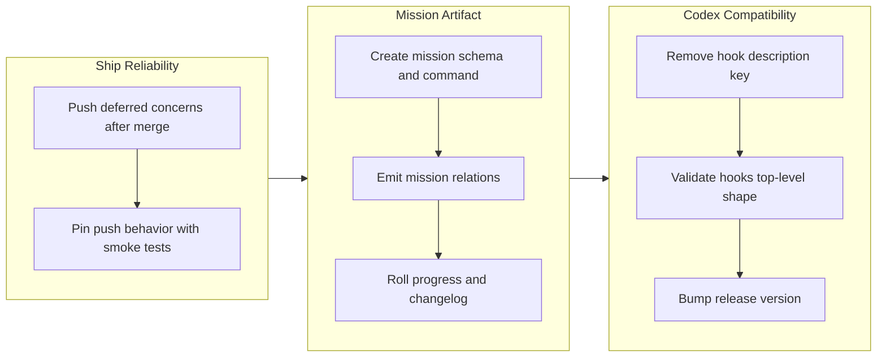

## 1. Overview

This branch adds missions as a first-class Workaholic knowledge artifact and wires them into tickets, stories, deferred concerns, and workflow seams so long-lived goals can be tracked from creation through shipment. It also fixes two delivery defects: deferred-concern extraction now pushes its post-merge commit, and Codex no longer rejects the raw workaholic plugin hook config because `hooks.json` is constrained to Codex-compatible top-level keys.

**Highlights:**

1. Added `/mission`, the `mission` skill, mission OKF indexing, and generated cross-agent workflow output.
2. Added machine-readable `mission:` and `tickets:` relations across tickets, stories, and extracted deferred concerns.
3. Centralized mission progress/changelog updates in idempotent mission scripts called from drive, report, and ship seams.
4. Fixed deferred-concern extraction so post-merge concern commits are pushed to `origin/main`.
5. Removed the Claude-only `description` key from `hooks/hooks.json` and guarded the Codex parser shape in metadata validation.

## 2. Motivation

Workaholic had durable tickets, stories, trips, release notes, and deferred concerns, but no artifact for a long-running goal that spans many of those records. The mission work gives that concept an explicit schema and computed progress model, then connects the existing workflows through machine-readable relations instead of relying on prose. The branch also closes two operational gaps discovered while exercising the workflow: knowledge written after merge must reach the remote, and Codex compatibility checks must cover raw plugin config files that Codex parses during install.

## 3. Changes

The branch started by correcting a ship-flow persistence defect, then introduced the mission artifact in three layers: foundation, relations, and automated roll-up. The final ticket addressed a Codex load failure in the same release window, and the report flow made the final release version explicit at `1.0.85`.

### 3-1. Push Deferred-Concern Commits in the Ship Flow ([b724380](https://github.com/qmu/workaholic/commit/b724380))

`extract-deferred-concerns.sh` now pushes after committing extracted concern files on post-merge `main`, matching the existing release-note commit path. The ship skill prose and generated workflow output were updated so `/ship` ends with local `main` level with `origin/main`, and smoke tests cover both successful push and no-remote graceful behavior.

### 3-2. Introduce the `mission` artifact type, skill, and `/mission` command (foundation) ([24e78fa](https://github.com/qmu/workaholic/commit/24e78fa))

This ticket added the mission domain artifact, its `.workaholic/missions/<slug>/mission.md` schema, `/mission` command, mission skill scripts, OKF indexing, and generated cross-agent workflow bundle. Progress is computed from the mission acceptance checklist rather than stored as an editable percentage.

### 3-3. Wire machine-readable mission relations across tickets, reports, and concerns ([ce2f436](https://github.com/qmu/workaholic/commit/ce2f436))

Tickets can now carry `mission:`, stories inherit a mission and list their archived ticket filenames, and deferred concerns extracted from a story inherit both `mission:` and `tickets:`. This gives later report/ship flows a mechanical relation graph instead of having to recover mission membership from prose.

### 3-4. Roll mission progress and append the historical changelog from the workflows ([b7a11ad](https://github.com/qmu/workaholic/commit/b7a11ad))

Mission mutation is centralized in two idempotent scripts, `append-changelog.sh` and `tick-acceptance.sh`. Drive, report, and ship call those scripts at their existing knowledge-writing seams so mission progress and historical stuck/unstuck events update as tickets archive, stories report, and concerns defer or resolve.

### 3-5. Fix Codex failing to load workaholic: drop the Claude-only `description` key from hooks.json ([6e69651](https://github.com/qmu/workaholic/commit/6e69651))

The source `hooks/hooks.json` now has `hooks` as its only top-level key, which matches Codex's stricter parser. `validate-metadata.mjs` now asserts that shape and fails if a sibling key such as `description` is reintroduced, while `CLAUDE.md` documents that hook documentation belongs outside `hooks.json`.

## 4. Outcome

- Missions are now a first-class Workaholic artifact with a command, skill, schema, OKF index entries, generated workflow output, and smoke coverage.
- The mission relation graph is machine-readable across tickets, stories, and deferred concerns, enabling workflow seams to roll progress and history without hand-editing.
- `/ship` no longer leaves extracted deferred concerns stranded on local `main`.
- Codex can parse the workaholic plugin hook config because the shared raw config now uses only the schema intersection Codex accepts.
- The branch is prepared as version `1.0.85`.

## 5. Historical Analysis

This branch extends the OKF-bundle direction established by the recent `.workaholic/` indexing work: new artifact areas are indexed from frontmatter and refreshed at workflow commit seams. It also follows the established Workaholic pattern of thin commands over comprehensive skills, with shell behavior moved into bundled POSIX scripts and pinned by `scripts/test-workflow-scripts.mjs`. The Codex fix continues the earlier Codex metadata validation work by broadening the checked surface from manifests to raw plugin config that Codex parses.

## 6. Concerns

### Archive script records the pre-amend commit hash

- **Severity:** moderate
- **Description:** `archive.sh` captures `COMMIT_HASH` before it amends the ticket with `commit_hash` and `category`, so the archived ticket can point at the pre-amend commit instead of the final commit (see [aab56a9](https://github.com/qmu/workaholic/commit/aab56a9) in `plugins/workaholic/skills/drive/scripts/archive.sh`).
- **How to Fix:** Move the final `git rev-parse --short HEAD` until after the amend, then update the printed output and any ticket frontmatter expectations with the post-amend hash.

### Codex hook runtime behavior remains unproven

- **Severity:** moderate
- **Description:** This branch fixes the Codex parse failure for `hooks/hooks.json`, but it does not prove what Codex will do with Claude-only hook entries that reference `${CLAUDE_PLUGIN_ROOT}` and Claude event names after parsing succeeds (see [6e69651](https://github.com/qmu/workaholic/commit/6e69651) in `plugins/workaholic/hooks/hooks.json`).
- **How to Fix:** During ship verification, re-add or refresh the workaholic Codex plugin cache and confirm Codex loads the plugin cleanly; if Codex then attempts to run Claude-only hooks, split or isolate Codex-visible hook config in a follow-up.

### Existing artifacts are not backfilled into missions

- **Severity:** low
- **Description:** Mission relations are emitted forward-only; existing tickets, stories, and concerns do not get a mission relation unless future work edits them (see [ce2f436](https://github.com/qmu/workaholic/commit/ce2f436) in `plugins/workaholic/skills/report/SKILL.md`).
- **How to Fix:** Leave historical artifacts unchanged unless a mission needs backfill, then write a targeted migration ticket that sets `mission:` and `tickets:` relations for a named mission from verifiable evidence.

## 7. Successful Development Patterns

- Building the mission feature as foundation, relations, then automation kept the domain model reviewable while still landing an end-to-end workflow in one branch.
- Centralizing mutation in mission-owned scripts kept idempotency and format rules in one place; drive, report, and ship only call the shared seam.
- The workflow-script smoke suite is doing useful architectural work: it caught POSIX lint edge cases, pins cross-agent generated closures, and now verifies post-merge push behavior, mission roll-ups, and Codex metadata compatibility.
- Treating `.claude-plugin/marketplace.json` as the source of truth for versioning and rebuilding generated outputs on each bump kept Claude and Codex plugin metadata aligned.

## 8. Release Preparation

**Verdict**: Ready for release

### 8-1. Concerns

- Manual Codex plugin reload is still needed at ship time to prove the parse failure is gone in a fresh Codex cache.
- The archived-ticket hash correction surfaced a follow-up defect in `archive.sh`; it does not block this release because this branch's archived ticket metadata has been corrected.

### 8-2. Pre-release Instructions

- Run the standard local verification set before merge: `node scripts/build-plugins/validate-metadata.mjs`, `node scripts/build-plugins/verify.mjs`, and `node scripts/test-workflow-scripts.mjs`.
- Refresh or re-add the workaholic plugin in Codex and confirm the previous `unknown field 'description'` hooks parse error no longer occurs.

### 8-3. Post-release Instructions

- Confirm `v1.0.85` is visible wherever plugin versions are consumed.
- If Codex loads the plugin but reports runtime hook execution errors, create a follow-up ticket to isolate Claude-only hooks from Codex-visible plugin config.

## 9. Notes

The active deferred-concern corpus was left untouched. This branch does not materially resolve the older carried concerns, and copying the whole backlog into this story would obscure the new release-specific risks above.
