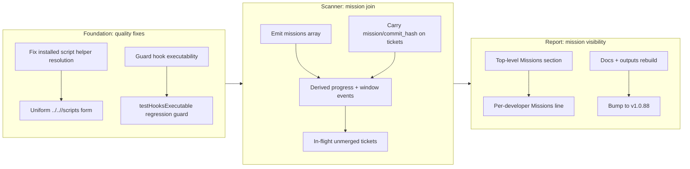

## 1. Overview

This branch resolved two quality issues in shell-script resolution and hook executability, then extended the `/catch` developer workflow to surface active missions with their progress. The headline feature teaches `/catch` to show not just each mission's merged progress but the **unmerged, in-flight** work heading toward it — the dimension the merge-time mission changelog cannot yet reflect.

**Highlights:**

1. Fixed installed-plugin script helper resolution — cross-skill shell references now resolve uniformly across the source tree, raw installed plugins, and the generated workflow bundle
2. Added a hook-executable regression guard so a script `hooks.json` invokes by path can never silently lose its executable bit
3. Joined missions into the `/catch` scanner — `scan-window.sh` now emits a `missions[]` block (derived progress + merged changelog events + unmerged in-flight tickets) and carries `mission`/`commit_hash` on every ticket
4. Rendered a Missions view in the `/catch` report — a top-level `## Missions` section plus a per-developer attribution line, keeping merged progress and in-flight work strictly distinct

## 2. Motivation

Two latent defects and one feature gap drove the branch. Cross-skill shell references worked from the source tree but broke in installed plugin layouts, and a hook's executable bit could regress without any test catching it — both silent failures that only surface at runtime. The larger opportunity was in `/catch`: it already summarized commits, tickets, and stories, but never missions — the durable, long-horizon goals that span many tickets. Crucially, a mission's recorded progress only advances when work *merges* (the drive/report/ship seams), so a developer could not see how far unmerged, on-branch work had carried a mission. Because `/catch` already scans `--branches --remotes` and the live `todo/` queue, it was the right place to compute both the merged and the in-flight views without storing anything new.

## 3. Changes

Development proceeded in three waves: quality foundations (script resolution and a hook-executability guard), scanner integration (gathering missions and computing merged vs. in-flight progress, all read-only), and report rendering (the top-level Missions section and per-developer attribution). The version bump to v1.0.88 marks completion of a feature that bridges tactical work (tickets) and strategic goals (missions) in the daily `/catch` workflow.

### 3-1. Fix installed script helper resolution ([38a6cb9](https://github.com/qmu/workaholic/commit/38a6cb9))

Standardized cross-skill shell references on the uniform `${SCRIPT_DIR}/../../<skill>/scripts` relative form so they resolve identically in the source tree, a raw installed plugin, and the generated workflow bundle — closing an installed-layout gap the convention had left unproven.

### 3-2. Guard hook scripts stay executable ([403bb8f](https://github.com/qmu/workaholic/commit/403bb8f))

Added a hermetic regression guard asserting that every script a `hooks.json` invokes by path keeps mode 755, so a lost executable bit is caught at test time rather than surfacing as a runtime Permission-denied failure.

### 3-3. Join missions into the catch scanner ([5c85d35](https://github.com/qmu/workaholic/commit/5c85d35))

Taught `scan-window.sh` to emit a read-only `missions[]` block — active missions with derived `checked/total` progress, window-filtered changelog events (merged activity), and the unmerged `in_flight` tickets carrying each mission slug — and to carry `mission`/`commit_hash` on every ticket for downstream joining. Reuses the mission skill's own `list.sh`/`progress.sh` (progress stays derived, never stored) and resolves the window boundary via git's own date engine (no `date -d`). Covered by a new `catch/scan-window.sh mission join` smoke test.

### 3-4. Render missions in the catch report ([72c2327](https://github.com/qmu/workaholic/commit/72c2327))

Added a top-level `## Missions` section to the `/catch` report (each active mission's progress, merged this-window activity, and unmerged in-flight work, rendered distinctly) plus a per-developer `**Missions:**` attribution line. Cross-developer synthesis stays in the main agent (one-level fan-out); docs updated across the command, mission skill, READMEs, and CLAUDE.md.

## 4. Outcome

- Fixed cross-skill shell helper resolution to work uniformly across source plugin layouts, raw installed plugins, and generated workflow bundles — standardized on the `${SCRIPT_DIR}/../../<skill>/scripts` relative form detectable by build-closure logic
- Added a `testHooksExecutable` regression guard to the hermetic test harness, ensuring every script a `hooks.json` invokes by path stays executable (mode 755); catches Permission-denied failures before release
- Extended `/catch` scanner to gather missions data as a read-only feature: a `missions[]` array with derived `checked/total` progress, window-filtered changelog events (merged), and `in_flight[]` unmerged tickets per mission
- Enriched the scanner's `tickets[]` output to carry `mission` and `commit_hash` fields for downstream report joining
- Implemented `/catch` report rendering: a top-level `## Missions` section (active missions with progress, window activity, unmerged work kept distinct) plus a per-developer `**Missions:**` attribution line
- Updated documentation across `commands/catch.md`, `skills/mission/SKILL.md`, `README.md`, `.workaholic/README.md`, and `CLAUDE.md`
- Regenerated and verified `outputs/workflows/`; the full smoke suite (374 passed / 0 failed) and `build.mjs`/`verify.mjs`/`validate-metadata.mjs` are all green

## 5. Historical Analysis

Past work established the generated workflow-bundle infrastructure and the mission artifact cluster with progress automation; this branch extends the observation pattern proven twice before — scanner-data → collector-JSON → report (deployments-per-developer and focus-branches preceded missions-in-catch) — with no deviation. Cross-skill shell references were documented but the installed-layout gap showed the convention was incompletely proven; the fix applies one relative-path form across all layouts because each keeps sibling skills under a shared `skills/` directory, a layout invariant the build now enforces. Standing guards (`testPosixLint`, `testGuardWorkingDirectory`) prevented silent regressions; this branch adds `testHooksExecutable` in the same harness, continuing the preference for machine-checkable rules over prose-only gates.

## 6. Concerns

### (carried from PR #77) Archive script records the pre-amend commit hash

- **Severity:** moderate
- **Description:** `archive.sh` records `commit_hash` before any rebase/amend; if the developer later rebases (squash, reorder) the recorded hash goes stale and a report run can show an already-amended commit as newly archived. This branch itself hit it — each archived ticket's frontmatter hash is the pre-amend value, so the story's section 3 links use the real landing hashes from `git log` instead.
- **How to Fix:** Record the hash post-amend (after any pre-push rebase), or regenerate it at report time by re-running `collect-commits.sh` against the actual landing commit.

### (carried from PR #77) Codex hook runtime behavior remains unproven in deployed installations

- **Severity:** moderate
- **Description:** Codex plugin hooks are CI-validated for syntax but their runtime behavior (event firing, path resolution, tool interception) is untested against real Codex deployments.
- **How to Fix:** Add integration tests exercising a real Codex install reading the plugin manifest, or document the scope boundary and make Codex runtime validation a separate campaign.

### (carried from PR #77) Existing artifacts are not backfilled into the .workaholic OKF bundle index

- **Severity:** low
- **Description:** New `.workaholic` artifacts get OKF frontmatter and are indexed by `refresh-index.sh`; older tickets/stories pre-dating the OKF layer remain unindexed and invisible to OKF consumers.
- **How to Fix:** Run a backfill to retroactively add OKF frontmatter to eligible artifacts and rebuild the index, or document backfill as out-of-scope with a migration date.

### (carried from PR #74) Prune mutates the user's remote-tracking refs

- **Severity:** moderate
- **Description:** `/catch`'s best-effort `git fetch --prune` can race with a user's own fetch/push and prune stale remote-tracking branches the user still cares about.
- **How to Fix:** Make prune opt-in or restrict it to a narrow pattern (e.g. `work-YYYYMMDD-*`); document the race window in `/catch`'s advisory.

### (carried from PR #69) Best-effort fetch adds a per-developer race during the scan

- **Severity:** low
- **Description:** `/catch`'s best-effort fetch can race with a concurrent push, leaving the scanner's view briefly inconsistent.
- **How to Fix:** Document the race in the report header (snapshot-as-of-fetch), or wrap the scan in a git lock where the OS supports `flock`.

### (carried from PR #69) Carry cannot auto-trigger on token pressure

- **Severity:** low
- **Description:** `/carry` must be invoked manually; no automated trigger hands off in-progress work as the session nears its token budget.
- **How to Fix:** Wire a token-monitor hook that prompts for `/carry` below a threshold, or document `/carry` as a manual safeguard.

### (carried from PR #69) Resumption tickets must list remaining work only

- **Severity:** moderate
- **Description:** `/carry`'s resumption ticket can be confused with the original backlog, risking re-work of completed items.
- **How to Fix:** Cross-reference the original queue and label Remaining as the delta, or prune completed items before emitting the resumption ticket.

### (carried from PR #67) First out-of-repo artifact bypasses the .workaholic structure guard

- **Severity:** low
- **Description:** The first time a skill writes outside `.workaholic` (e.g. a generated temp file) it is uncovered by the structural move guard.
- **How to Fix:** Extend the guard to cover generated artifacts in `.workaholic` equivalents on shared drives, or document the single-write gap.

### (carried from PR #67) Resumption tickets can duplicate on re-run

- **Severity:** moderate
- **Description:** Re-running `/carry` mid-session can emit a second resumption ticket listing the same unstarted work.
- **How to Fix:** Check for an existing resumption ticket on the branch and reuse/append instead of creating a duplicate.

### (carried from PR #63) Stale plugin install is indistinguishable from a versioning change

- **Severity:** moderate
- **Description:** An outdated `~/.claude/plugins` workaholic install is used silently; no version check surfaces the mismatch.
- **How to Fix:** Add a version check at command/skill entry points comparing the loaded plugin version with the repo's latest; warn or block if stale.

### (carried from PR #63) Quality gate is prose-mandated, not machine-enforced

- **Severity:** moderate
- **Description:** Ticket `## Quality Gate` sections are guidelines, not code assertions; an edge case (e.g. an empty missions list) can slip through.
- **How to Fix:** Codify quality-gate edge cases as automatable assertions (smoke tests, lint rules) and gate CI on them; use prose for rationale only.

### (carried from PR #63) Catch generation-style is an explicit guess

- **Severity:** low
- **Description:** The report infers generation style from commit-timing shape; a human-written commit may be misclassified.
- **How to Fix:** Require an explicit `generation-style` commit trailer so the report reads fact, not inference.

### (carried from PR #63) Catch focus buckets are UTC-day based

- **Severity:** low
- **Description:** The 24h focus bucket is anchored to UTC, so a developer in JST sees a midnight boundary that splits their local day.
- **How to Fix:** Make focus-bucket boundaries timezone-configurable, or document the UTC anchor in the report header.

### (carried from PR #63) Catch deployment attribution is approximate for pre-merge deployments

- **Severity:** low
- **Description:** Deployments attributed by commit author are ambiguous when a release is cut before merge resolution.
- **How to Fix:** Record deployment metadata (who/when/which ref) separately from commit attribution, or document the sequencing assumption.

### (carried from PR #60) Collectors sample branch stories by title-match only

- **Severity:** moderate
- **Description:** Approximate title matching against the story index can miss a renamed story, leaving a commit unattributed.
- **How to Fix:** Require explicit story linkage (a `story:` relation) or persist a branch-story map.

### (carried from PR #60) By-developer axis joins on mutable commit author

- **Severity:** low
- **Description:** The git author field is mutable and may have aliases, splitting a developer across entries.
- **How to Fix:** Normalize via `.mailmap` or a declared canonical author map.

### (carried from PR #59) Git commit-msg hook is bypassable with --no-verify

- **Severity:** moderate
- **Description:** Both the git-native commit-msg hook and the PreToolUse(Bash) hook can be bypassed on the terminal with `--no-verify`, leaving an off-policy subject in the log.
- **How to Fix:** Add a server-side push hook or branch-protection rule, or accept the local enforcement as best-effort and document it.

### (carried from PR #59) Gate coverage is a single Bash PreToolUse hook

- **Severity:** moderate
- **Description:** Only a top-level `git commit` is guarded; wrapper scripts emit commits without hitting the gate (though they follow policy internally).
- **How to Fix:** Validate subjects inside every commit-emitting script via `check-subject.sh`, or move the gate to a core git hook.

### (carried from PR #59) commit.sh drops the Category when the body is empty

- **Severity:** low
- **Description:** The trailing `Category:` line is omitted when no body is supplied, breaking the schema expectation.
- **How to Fix:** Always emit `Category` (default `Changed`) or validate its presence before commit.

### (carried from PR #59) /commit can emit off-policy subjects if invoked directly

- **Severity:** low
- **Description:** `/commit` accepts a freeform subject without validating it against the subject rule.
- **How to Fix:** Call `check-subject.sh` inside `/commit` and reject/re-prompt on an off-policy subject.

### (carried from PR #59) Both local enforcement layers stay bypassable

- **Severity:** moderate
- **Description:** The commit-msg hook and PreToolUse(Bash) hook are both bypassable and cover only Claude Code / terminal, not scripts.
- **How to Fix:** Add a server-side push hook or branch protection, or document the bypass risk and accept best-effort enforcement.

### (carried from PR #59) Bundled script hardened without rebuilding outputs/

- **Severity:** low
- **Description:** A bundled helper improved in source but not rebuilt into `outputs/` ships stale to deployed agents.
- **How to Fix:** Add a CI check that fails when a bundled `outputs/` script differs from source (the Outputs Freshness workflow now covers this class).

### (carried from PR #59) POSIX-lint runner scope is narrow

- **Severity:** low
- **Description:** `posix-lint.sh` scans `skills/*/scripts/` but not the full hook/build set, so some scripts are linted only manually.
- **How to Fix:** Extend the lint scan to all scripts under `plugins/workaholic` (including hooks/).

### (carried from PR #59) 50-char subject cap is byte-based

- **Severity:** low
- **Description:** The subject-length check counts bytes, so a multi-byte (e.g. Japanese) subject is rejected earlier than 50 characters.
- **How to Fix:** Count grapheme clusters with a Unicode-aware counter instead of bytes.

### (carried from PR #58 → #56) Two enforcement layers encode one rule

- **Severity:** moderate
- **Description:** The commit-msg and PreToolUse hooks duplicate the subject-rule enforcement; a rule change must update both.
- **How to Fix:** Both already source `check-subject.sh`; add a CI test that verifies they reference the same rule version.

### (carried from PR #58 → #56) Enforcement reaches consumer repos only after landing on main

- **Severity:** moderate
- **Description:** Enforcement rules reach external consumers only after this repo lands on main and they reinstall; intermediate PRs have no active enforcement in consumer installs.
- **How to Fix:** Publish a pre-release/canary for consumer testing, or accept that enforcement lags until release.

### (carried from PR #58 → #54) Trip unification is unproven by a deployed end-to-end flow

- **Severity:** moderate
- **Description:** `/trip`'s Agent Teams orchestration (design → decompose → review) is tested in isolation but not validated by real developers in a deployed environment.
- **How to Fix:** Run a multi-day developer trial on a non-critical feature; gather feedback on handoff latency and review confidence before documenting `/trip` as stable.

### (carried from PR #58) collect-commits body emission is a best-effort parse

- **Severity:** low
- **Description:** `collect-commits.sh` parses commit bodies by label regex; a missing or variant label loses that section.
- **How to Fix:** Define a formal body syntax and validate on commit, or require explicit key-value structure.

_All 56 carried deferred concerns remain active and unaddressed on this branch; the leading duplicates in the carry chain are consolidated above by root concern._

## 7. Successful Development Patterns

- **A shared layout invariant enables uniform path resolution:** every plugin layout (source tree, installed raw plugin, generated bundle) nests sibling skills under one `skills/` directory, so a single `${SCRIPT_DIR}/../../<skill>/scripts` form works everywhere without layout-specific rewrites — directory-relative references beat hard-coded file paths for this reason.
- **Hermetic smoke tests in the existing harness catch regressions before release:** `testPosixLint`, `testGuardWorkingDirectory`, and now `testHooksExecutable` all live in one node harness CI runs; adding a guard as a test case (not a shell step) is lower-friction and stays POSIX-clean by design.
- **The scanner-extension pattern scales:** scanner-data → collector-JSON → report, proven by focus-branches and deployments-per-developer, applied to missions-in-catch with no deviation — the separation (gather → join → render) is what lets it scale.
- **Read-only consumers seam mission mutation at the merge/archive gates:** mission progress and changelog advance only when tickets archive or stories ship; `/catch` reads and never calls the mutators, keeping mission state coherent and its history append-only.
- **One-level fan-out keeps leaf collectors simple:** a collector sees one developer's data; cross-developer syntheses (Overall Direction, Missions) belong to the main agent — avoiding nested fan-out and keeping coordination visible.
- **A cross-skill reference auto-vendors its transitive closure:** adding `${SCRIPT_DIR}/../../mission/scripts/` to the scanner made `build.mjs` include `mission` (and its `okf` dependency) in catch's generated bundle automatically — the dependency is discovered by static analysis, no manual wiring.

## 8. Release Preparation

**Verdict**: Ready for release

### 8-1. Concerns

- None - changes are safe for release. `git diff main..HEAD` shows no secrets, credentials, or TODO/FIXME markers in new code; doc-drift is clean (the meta docs were updated in the same change); the smoke suite and all build/verify/validate gates are green.

### 8-2. Pre-release Instructions

- None - standard release process applies.

### 8-3. Post-release Instructions

- None - no special post-release actions needed.

## 9. Notes

The `/catch` mission join is strictly read-only: a scan calls only the mission skill's readers (`list.sh`/`progress.sh`) and reads changelog/ticket files, never the mutators. Progress stays derived (`checked ÷ total`), never stored. The two earlier commits (installed-helper resolution, hook-executable guard) are unrelated hardening that rode along on the same branch.

## Deployment Evidence

- **When:** 2026-07-09T03:27:13+09:00
- **Target:** Workaholic marketplace plugin
- **Method:** other (deploy-on-merge pre-merge proof)
- **Status:** pass
- **Observed:** Pre-merge proof green: build.mjs outputs fresh (no unstaged diff), verify.mjs self-contained, validate-metadata.mjs version-aligned, 374/0 smoke tests; v1.0.88 consistent across all lockstep manifests. Post-merge promotion confirmed via gh release view v1.0.88.
