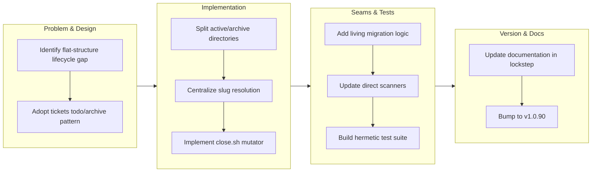

# work-20260713-102453

## 1. Overview

This branch implements complete lifecycle management for missions by splitting the flat missions directory into active/ and archive/ areas, mirroring the established tickets todo/archive pattern. The change introduces a new /mission close verb that transitions missions to end states (achieved or abandoned) and archives them, with a living migration system that automatically converts legacy layouts. All seams gain area awareness through centralized slug resolution, and comprehensive hermetic tests validate migration behavior and lifecycle operations.

**Highlights:**

1. Missions now have a complete lifecycle with active/archive structure mirroring the tickets todo/archive convention
2. New /mission close <slug> verb enables ending missions with automatic status transition and archival
3. Living migration system automatically converts legacy flat mission layouts to the new area-aware structure
4. All workflow seams updated with area awareness: slug resolution library, list.sh spanning both areas, /ticket filters showing only active missions
5. Hermetic test coverage for migration scenarios, slug resolution in both areas, and close.sh idempotency

## 2. Motivation

Missions carried status fields (active/achieved/abandoned) but had no actual lifecycle: nothing ever transitioned a mission to an end state, leaving completed missions sitting alongside active work in a flat, unordered tree, and the missions directory was not even recognized in the layout allowlist. Adopting the tickets todo/archive structural pattern gives the schema end states a sanctioned transition path through the close.sh mutator, making mission status immediately visible from directory placement rather than requiring schema inspection. The deliberate living migration during touch operations ensures legacy flat layouts upgrade gracefully without manual intervention.

## 3. Changes

The branch establishes mission lifecycle management by adopting the tickets todo/archive structural pattern. Active missions populate missions/active/, ended missions move to missions/archive/ via the new close.sh mutator and /mission close verb. A living migration handles legacy flat layouts transparently on any mission-script touch. All seams gain area awareness through centralized slug resolution; list.sh spans both areas, and /ticket offers only active missions. Hermetic tests validate migration scenarios, slug resolution, and close.sh idempotency across both areas.

### 3-1. Split missions into active and archive areas ([8ef33b0](https://github.com/qmu/workaholic/commit/8ef33b0))

Reorganized the runtime missions tree into an active/archive split mirroring the tickets convention: a shared POSIX-sh resolver (lib/resolve.sh) centralizes slug-to-path lookup and runs a living migration that relocates legacy flat mission dirs by their status, a new close.sh mutator (surfaced as /mission close) ends a mission by flipping status, appending a closing changelog line, and moving it to archive/, and the pre-existing layout-allowlist gap for missions/ was fixed with every affected doc updated in the same change.

## 4. Outcome

- Reorganized missions directory structure from flat layout into active/ and archive/ areas, mirroring the tickets todo/archive convention
- Implemented shared POSIX-sh slug→path resolver that centralizes mission location lookup across all scripts
- Added living migration that automatically relocates legacy flat mission directories based on status field (active, achieved, abandoned)
- Implemented end-mission mechanism (`close.sh`) to flip mission status, append changelog events, and archive completed missions
- Extended `/mission` command with new close verb for ending missions (achieved or abandoned)
- Fixed documentation gap: added missions to layout allowlist and rules table
- Ensured create-ticket association now offers only active missions, improving workflow clarity

## 5. Historical Analysis

The mission artifact was introduced in PR #77 with a flat layout and basic `create.sh` script. PR #77 also added mission-frontmatter linkage and progress/changelog automation via shared mutators. PR #80 extended missions with `/catch` integration to surface active/completed missions alongside other artifacts. This branch recognizes the status field existed in the schema since PR #77 but had no lifecycle mechanism — missions never transitioned to achieved or abandoned states. The active/archive split mirrors the established tickets working-vs-archive convention, making the layout's meaning readable from structure rather than requiring external documentation.

## 6. Concerns

### (carried from PR #54) Trip unification is unproven by a live `/trip` run

- **Severity:** moderate
- **Description:** The entire `/trip`-unification protocol change is validated only by `build.mjs`/`verify.mjs`/`validate-metadata.mjs`/`test-workflow-scripts.mjs` and prose review — the smoke tests exercise the bundled shell scripts (reused, not changed), not the skill/agent markdown. The new Decomposition gate, the per-ticket Coding loop, and the context-aware queue-execute routing have **not** been exercised end-to-end by a real `/trip` (`plugins/workaholic/skills/trip-protocol/SKILL.md`). A live run could surface gate-sequencing, archiving, or routing gaps the static checks cannot catch.
- **How to Fix:** Run a real end-to-end `/trip` — both a design-first trip (validate the Decomposition gate emits well-formed tickets and the per-ticket loop archives each) and a queue-execute trip (validate routing skips Planning/Decomposition and drives a pre-populated queue) — before relying on the new flow.

### (carried from PR #56) Enforcement reaches consumer repos only after this release

- **Severity:** moderate
- **Description:** The hooks live in the workaholic plugin; a consumer repo (e.g. data-platform) gains them only once this version is published and the repo updates. data-platform is migrated to `workaholic@workaholic` + `autoUpdate: true`, so it will pull them post-release — but until then, in-flight branches there can still reintroduce `done/` (observed live: data-platform PR #238 reintroduced 17 violations during cleanup).
- **How to Fix:** Ship this branch via `/release`; autoUpdate propagates the enforcement to data-platform automatically.

### (carried from PR #56) Two enforcement layers encode one rule (drift risk)

- **Severity:** low
- **Description:** The canonical-path rule now lives in both `validate-ticket.sh` (bash, PostToolUse) and `guard-ticket-structure.sh` (POSIX sh, PreToolUse). Future edits must change both or they will disagree.
- **How to Fix:** Keep the path-shape rules equivalent; consider extracting a shared helper if a third consumer appears.

### (carried from PR #58) (carried from PR #54) Trip unification is unproven by a live `/trip` run

- **Severity:** moderate
- **Description:** The `/trip`-unification protocol — the Decomposition gate, per-ticket Coding loop, context-aware queue routing, and now the design-first flow-through added here ([1c8e87a](https://github.com/qmu/workaholic/commit/1c8e87a)) — is still validated only by static checks and prose review, never exercised end-to-end by a real `/trip`. This branch's flow-through change is prose-only and carries the same caveat.
- **How to Fix:** Run a real end-to-end `/trip` — both a design-first trip (confirm it flows through Decomposition into the per-ticket build with no pause) and a queue-execute trip (confirm routing skips Planning and drives a pre-populated queue) — before relying on the new flow.

### (carried from PR #58) (carried from PR #56) Enforcement reaches consumer repos only after this release

- **Severity:** moderate
- **Description:** The ticket-structure enforcement hooks live in the workaholic plugin; a consumer repo gains them only once this version is published and the repo updates. Migrated consumers on `autoUpdate: true` pull them post-release, but in-flight branches there can still reintroduce non-canonical paths until then.
- **How to Fix:** Ship this branch via `/release`; autoUpdate propagates the enforcement to consumers automatically.

### (carried from PR #58) (carried from PR #56) Two enforcement layers encode one rule (drift risk)

- **Severity:** low
- **Description:** The canonical-path rule lives in both `validate-ticket.sh` (PostToolUse) and `guard-ticket-structure.sh` (PreToolUse). Converting `validate-ticket.sh` to POSIX here did not consolidate them, so future edits must change both or they will disagree.
- **How to Fix:** Keep the path-shape rules equivalent; extract a shared helper if a third consumer appears.

### (carried from PR #58) collect-commits body emission is a load-bearing, easily-severed link

- **Severity:** moderate
- **Description:** The new commit Concerns/Insights → section-reviewer wiring assumes `collect-commits.sh` emits the body and that the report orchestrator passes the commit bodies to that worker (see [24e5b37](https://github.com/qmu/workaholic/commit/24e5b37) in `plugins/workaholic/skills/report/scripts/collect-commits.sh`). The script silently dropped the body once already; if it regresses, the new keys stop reaching `/report` with no error.
- **How to Fix:** Keep the `collect-commits` body-emission smoke test green, and keep the commit-bodies input wired to the section-reviewer when editing report Phase 2.

### (carried from PR #58) POSIX lint runner half is weak where /bin/sh is bash

- **Severity:** low
- **Description:** The dash/sh test runner only catches bashisms on an image where `/bin/sh` is dash/ash; on a host where `sh` is bash it is weak (see [c7c73d7](https://github.com/qmu/workaholic/commit/c7c73d7) in `scripts/test-workflow-scripts.mjs`). The grep-based `posix-lint.sh` is shell-independent and catches drift everywhere, so the gate is not blind, but the runner half should not be relied on alone.
- **How to Fix:** Prefer a dash/Alpine CI runner so both halves of the gate bite.

### (carried from PR #59) 50-char cap is byte-based outside a UTF-8 locale

- **Severity:** low
- **Description:** The subject-length check uses `wc -m`, which counts characters only under a UTF-8 locale and bytes under a C/POSIX locale (see [24a3096](https://github.com/qmu/workaholic/commit/24a3096) in `plugins/workaholic/hooks/lib/check-subject.sh`). Japanese subjects therefore enforce a character-accurate 50-char cap only when the runtime locale is UTF-8; in CI's default locale the cap is effectively byte-based and multibyte subjects can false-trip.
- **How to Fix:** Pin a UTF-8 locale (e.g. `LC_ALL=C.UTF-8`) wherever the gate/hook runs, or switch to a locale-independent character count if byte-vs-char accuracy on Japanese subjects becomes load-bearing.

### (carried from PR #59) Both local enforcement layers stay bypassable and arrive late

- **Severity:** moderate
- **Description:** The Bash gate plus the `commit-msg` hook are bypassable via `git commit --no-verify` and on server-side merges, and the git hook reaches a consumer only after release + update and *then* the owner must still run the installer (see [e2fdcf0](https://github.com/qmu/workaholic/commit/e2fdcf0) in `plugins/workaholic/hooks/install-git-hooks.sh`). They are a strong belt, not a vault.
- **How to Fix:** Pair the local layers with a repo-side control (branch protection / required status check) for true enforcement, and surface the one-line install command prominently in the release/rollout notes so consumers actually opt in.

### (carried from PR #59) Bundled script hardened without rebuilding outputs/, leaving the public copy stale

- **Severity:** moderate
- **Description:** Ticket 2047 hardened `plugins/workaholic/skills/branching/scripts/ensure-worktree.sh`, which is a **bundled** branching-skill script in the drive/report/ship/create-ticket closure, but its archival commit ([24a3096](https://github.com/qmu/workaholic/commit/24a3096)) claimed "No outputs/ rebuild" — the `outputs/` copies were left stale and only regenerated later during the version bump ([1f7c620](https://github.com/qmu/workaholic/commit/1f7c620)), so source and artifact were out of lockstep in between (an `Outputs Freshness` CI failure waiting to happen).
- **How to Fix:** When editing any script under a bundled skill closure, always run `node scripts/build-plugins/build.mjs` and commit `outputs/` in lockstep within the same change; only pure `hooks/` changes may skip the rebuild. Treat "is this script in a shipped closure?" as a checklist item before claiming "No outputs/ rebuild."

### (carried from PR #59) (carried from PR #58) (carried from PR #54) Trip unification is unproven by a live `/trip` run

- **Severity:** moderate
- **Description:** The `/trip`-unification protocol — the Decomposition gate, per-ticket Coding loop, context-aware queue routing, and the design-first flow-through — is still validated only by static checks and prose review, never exercised end-to-end by a real `/trip` (see [1c8e87a](https://github.com/qmu/workaholic/commit/1c8e87a) in `plugins/workaholic/skills/trip-protocol/SKILL.md`). The flow-through change is prose-only and carries the same caveat.
- **How to Fix:** Run a real end-to-end `/trip` — both a design-first trip (confirm it flows through Decomposition into the per-ticket build with no pause) and a queue-execute trip (confirm routing skips Planning and drives a pre-populated queue) — before relying on the new flow.

### (carried from PR #59) (carried from PR #58) collect-commits body emission is a load-bearing, easily-severed link

- **Severity:** moderate
- **Description:** The commit Concerns/Insights → section-reviewer wiring assumes `collect-commits.sh` emits the commit body and that the report orchestrator passes those bodies to the section worker (see [24e5b37](https://github.com/qmu/workaholic/commit/24e5b37) in `plugins/workaholic/skills/report/scripts/collect-commits.sh`). The script silently dropped the body once already; if it regresses, the new keys stop reaching `/report` with no error.
- **How to Fix:** Keep the `collect-commits` body-emission smoke test green, and keep the commit-bodies input wired to the section-reviewer when editing report Phase 2.

### (carried from PR #59) (carried from PR #58) POSIX lint runner half is weak where /bin/sh is bash

- **Severity:** low
- **Description:** The dash/sh test runner only catches bashisms on an image where `/bin/sh` is dash/ash; on a host where `sh` is bash it is weak (see [c7c73d7](https://github.com/qmu/workaholic/commit/c7c73d7) in `scripts/test-workflow-scripts.mjs`). The grep-based `posix-lint.sh` is shell-independent and catches drift everywhere, so the gate is not blind, but the runner half should not be relied on alone.
- **How to Fix:** Prefer a dash/Alpine CI runner so both halves of the gate bite.

### (carried from PR #59) /commit is an escape hatch that can invite non-ticketed commits

- **Severity:** low
- **Description:** The new `/commit` command provides a sanctioned path for ad-hoc commits, but by existing it can normalize committing outside the ticketed `/drive` flow (see [a62d99c](https://github.com/qmu/workaholic/commit/a62d99c) in `plugins/workaholic/commands/commit.md`). It is still strictly better than free-handed `git commit` because both the command and the gate preserve the message policy.
- **How to Fix:** Keep the command copy steering users to `/drive` for ticketed work and framing `/commit` as for small/explicit non-ticketed changes; revisit if commit history shows `/commit` displacing ticketed development.

### (carried from PR #59) commit.sh silently drops a --category placed after its positional args

- **Severity:** low
- **Description:** `commit.sh` parses option flags (`--category`, `--skip-staging`) only at the front of its argument list — the parse loop breaks on the first non-flag token, so a `--category` placed after the six positional args is silently consumed as a `[files...]` entry and the `Category:` trailer goes missing with no error (see [a62d99c](https://github.com/qmu/workaholic/commit/a62d99c) in `plugins/workaholic/skills/commit/scripts/commit.sh`). The missing trailer is invisible to `verify.mjs`; only a temp-repo dry-run surfaces it.
- **How to Fix:** Always pass flags before the positional `title why changes concerns insights verify` args (the `/commit` doc now states this), and consider making `commit.sh` error on an unrecognized trailing `--flag` instead of treating it as a file path.

### (carried from PR #59) Gate coverage is the single-Bash-call agent surface only

- **Severity:** moderate
- **Description:** Per least-privilege the `PreToolUse(Bash)` commit gate blocks off-policy subjects only (not block-all), and structurally it sees only the agent's top-level Bash command (see [24a3096](https://github.com/qmu/workaholic/commit/24a3096) in `plugins/workaholic/hooks/guard-git-commit.sh`). A human's terminal `git commit`, `--no-verify`, GitHub-web/server merges, and any non-Bash agent path are all out of scope; the opt-in 2050 `commit-msg` hook closes only the local-human gap once installed.
- **How to Fix:** Treat the Bash gate as one belt in a stack, not a vault: install the `commit-msg` hook for local-human coverage, and add server-side branch protection / a required status check for the remote surface the local hooks cannot reach.

### (carried from PR #59) git commit-msg hook escapes the POSIX lint gate

- **Severity:** low
- **Description:** A git hook must be named exactly `commit-msg` (no extension), but `hooks/posix-lint.sh` only scans `*.sh`, so the new git hook is invisible to the POSIX gate (see [e2fdcf0](https://github.com/qmu/workaholic/commit/e2fdcf0) in `plugins/workaholic/hooks/git/commit-msg`). It is POSIX `#!/bin/sh -eu` by construction today, but a future bashism in it would not be caught by CI. The shared logic deliberately lives in `lib/check-subject.sh` (which `posix-lint` *does* scan) to keep the lintable surface maximal.
- **How to Fix:** If more git-native hooks are added under `hooks/git/`, either extend `posix-lint.sh` to scan that directory by name or keep the extensionless hooks trivially POSIX with all real logic in lintable `lib/*.sh` files.

### (carried from PR #60) By-developer axis joins on commit email + ticket-author frontmatter

- **Severity:** moderate
- **Description:** `scan-window.sh` groups commits by author email and joins ticket frontmatter author to build the roster. This works uniformly across commits, todo, and archive, but the scope set (`todo`/`archive`/`icebox` for tickets, `stories/` for narrative) does not yet specially attribute icebox/abandoned work per developer (discovered during `/catch` implementation, `plugins/workaholic/skills/catch/scripts/scan-window.sh`).
- **How to Fix:** Document the current scope reach; extend the scope set if per-developer icebox/abandoned reporting becomes load-bearing.

### (carried from PR #60) (carried from PR #59) 50-char subject cap is byte-based outside a UTF-8 locale

- **Severity:** low
- **Description:** The subject-length check uses `wc -m`, which counts characters only under a UTF-8 locale and bytes under C/POSIX (`plugins/workaholic/hooks/lib/check-subject.sh`); Japanese subjects enforce a character-accurate cap only when the runtime locale is UTF-8.
- **How to Fix:** Pin a UTF-8 locale (e.g. `LC_ALL=C.UTF-8`) where the gate runs, or switch to a locale-independent character count.

### (carried from PR #60) (carried from PR #59) Both local enforcement layers stay bypassable and arrive late

- **Severity:** moderate
- **Description:** The Bash gate plus the `commit-msg` hook are bypassable via `git commit --no-verify` and on server-side merges, and the git hook reaches a consumer only after release + update and an explicit install (`plugins/workaholic/hooks/install-git-hooks.sh`).
- **How to Fix:** Pair the local layers with a repo-side control (branch protection / required status check), and surface the one-line install command prominently in rollout notes.

### (carried from PR #60) (carried from PR #59) Bundled script hardened without rebuilding outputs/

- **Severity:** moderate
- **Description:** Bundled scripts in the drive/report/ship/create-ticket closure must be rebuilt into `outputs/` in lockstep or source and artifact diverge — a stale public copy can fail on non-Claude agents while local tests pass (`plugins/workaholic/skills/branching/scripts/ensure-worktree.sh`).
- **How to Fix:** When editing any script under a bundled skill closure, run `node scripts/build-plugins/build.mjs` and commit `outputs/` in the same change; treat "is this script in a shipped closure?" as a checklist item. (This branch followed that discipline.)

### (carried from PR #60) (carried from PR #59) /commit is an escape hatch that can invite non-ticketed commits

- **Severity:** low
- **Description:** The `/commit` command provides a sanctioned ad-hoc commit path, but by existing it can normalize committing outside the ticketed `/drive` flow (`plugins/workaholic/commands/commit.md`). It is still strictly better than free-handed `git commit`.
- **How to Fix:** Keep the command copy steering users to `/drive` for ticketed work; revisit if history shows `/commit` displacing ticketed development.

### (carried from PR #60) (carried from PR #59) commit.sh silently drops a --category placed after positional args

- **Severity:** low
- **Description:** `commit.sh` parses flags only at the front of its argument list; a `--category` after the six positional args is consumed as a file entry and the `Category:` trailer goes missing with no error (`plugins/workaholic/skills/commit/scripts/commit.sh`).
- **How to Fix:** Pass flags before the positional args, and consider erroring on an unrecognized trailing `--flag`.

### (carried from PR #60) (carried from PR #59) Gate coverage is the single-Bash-call agent surface only

- **Severity:** moderate
- **Description:** The `PreToolUse(Bash)` commit gate blocks off-policy subjects only and sees only the agent's top-level Bash command (`plugins/workaholic/hooks/guard-git-commit.sh`); terminal `git commit`, `--no-verify`, web/server merges, and non-Bash agent paths are out of scope.
- **How to Fix:** Treat the Bash gate as one belt in a stack: install the `commit-msg` hook for local-human coverage and add server-side branch protection for the remote surface.

### (carried from PR #60) (carried from PR #59) git commit-msg hook escapes the POSIX lint gate

- **Severity:** low
- **Description:** A git hook must be named exactly `commit-msg` (no extension), but `hooks/posix-lint.sh` only scans `*.sh`, so the hook is invisible to the gate (`plugins/workaholic/hooks/git/commit-msg`). It is POSIX by construction today, but a future bashism would not be caught.
- **How to Fix:** If more git-native hooks are added under `hooks/git/`, extend `posix-lint.sh` to scan that directory, or keep the extensionless hooks trivially POSIX with real logic in lintable `lib/*.sh`.

### (carried from PR #60) Collectors sample branch stories by title match; very large dirs may need indexing

- **Severity:** low
- **Description:** The per-developer collectors read branch stories by sampling on title/theme match rather than reading all of them (the live repo already has ~50). A very large `stories/` directory could exceed the practical sampling window and miss a relevant story (`plugins/workaholic/skills/catch/SKILL.md`, Collect Developer step 3).
- **How to Fix:** If `stories/` grows past ~100 files, add a per-developer story index or a `stories/<developer-slug>/` partition.

### (carried from PR #63) Branch-guard tokenizer lacks shell-quoting awareness

- **Severity:** low
- **Description:** The guard scans the entire command string and cannot tell a real command from text inside an `echo`/quoted argument, so the literal phrase `git branch <word>` inside `echo "…"` still trips it (see [5ed322f](https://github.com/qmu/workaholic/commit/5ed322f) in `plugins/workaholic/hooks/guard-git-branch.sh`). This is inherent to the whitespace tokenizer, which deliberately avoids a full shell parser.
- **How to Fix:** Agents should avoid embedding `git branch <word>` in echo/log strings; this is guidance, not a code change.

### (carried from PR #63) `/catch` deployment attribution is approximate for shared branches

- **Severity:** low
- **Description:** Deployments are attributed by the git author of the ship commit that last touched the story/release-note, joined on branch (see [5a5623c](https://github.com/qmu/workaholic/commit/5a5623c) in `plugins/workaholic/skills/catch/scripts/scan-window.sh`); a branch shipped by someone other than its author attributes to the shipper.
- **How to Fix:** The report notes this join semantics; deeper attribution would require an author field on stories/release-notes.

### (carried from PR #63) `/catch` focus buckets are UTC-day based

- **Severity:** low
- **Description:** Time-bucket boundaries use `epoch - epoch % 86400` to avoid non-POSIX `date -d` arithmetic (see [d9a695b](https://github.com/qmu/workaholic/commit/d9a695b) in `plugins/workaholic/skills/catch/scripts/scan-window.sh`); precise for a focus narrative but shifted by the local-UTC offset.
- **How to Fix:** The UTC-day assumption is documented in the script; if local-timezone bucketing is ever required, compute boundaries with explicit offset math.

### (carried from PR #63) `/catch` generation-style is an explicit guess

- **Severity:** low
- **Description:** The generation-style field is inferred from commit-timestamp shape and is framed as a guess, not fact (see [d9a695b](https://github.com/qmu/workaholic/commit/d9a695b) in `plugins/workaholic/skills/catch/SKILL.md`). The "looks like…" framing must be preserved when rendering.
- **How to Fix:** Keep the explicit-guess wording in the report template so the field is never read as authoritative.

### (carried from PR #63) Quality Gate is prose-mandated, not hook-enforced

- **Severity:** low
- **Description:** The `## Quality Gate` section is mandatory in prose but not enforced by `validate-ticket.sh` (frontmatter+location only), matching the `## Policies` precedent (see [e27a450](https://github.com/qmu/workaholic/commit/e27a450)). A ticket can technically omit it.
- **How to Fix:** Deliberate design choice; if hard enforcement is wanted, add a body-section grep to `validate-ticket.sh` plus a smoke test.

### (carried from PR #63) Stale plugin install is indistinguishable from a broken hook

- **Severity:** moderate
- **Description:** A stale plugin install presents an absent hook identically to a broken one (see [56cf7a0](https://github.com/qmu/workaholic/commit/56cf7a0)). Hook presence in `hooks.json` is checkable from a script, but activation is not — a PreToolUse hook fires on the Bash *tool* call, not nested `sh` (`plugins/workaholic/skills/check-deps/scripts/check.sh`).
- **How to Fix:** The `check-deps` version surfacing ([5059220](https://github.com/qmu/workaholic/commit/5059220)) is the durable mitigation; the in-session activation probe is documented in `check-deps/SKILL.md` so agents can distinguish presence from activation.

### (carried from PR #67) Browser MCP is session-provided and not guaranteed

- **Severity:** moderate
- **Description:** `/explain` depends on the Playwright plugin or Chrome DevTools MCP (the plugin declares no `.mcp.json`), which may be absent; the capability check is model-level (not shell-scriptable) and degradation saves the HTML but halts the PDF (see [2e5ef4f](https://github.com/qmu/workaholic/commit/2e5ef4f) in `plugins/workaholic/skills/explain/SKILL.md`).
- **How to Fix:** Keep the no-MCP halt message actionable, naming the two MCPs to enable; document them in `/explain` help.

### (carried from PR #67) /carry cannot auto-trigger on token exhaustion

- **Severity:** moderate
- **Description:** No programmatic token-budget signal is available to commands or hooks (a `PreCompact` hook has no model access), so `/carry` must be user-invoked (see [386af5e](https://github.com/qmu/workaholic/commit/386af5e) in `plugins/workaholic/commands/carry.md`).
- **How to Fix:** If Claude Code later exposes a context-budget signal or a model-capable pre-compaction hook, a non-blocking `PreCompact` nudge ("consider running /carry") becomes possible; until then it stays explicit.

### (carried from PR #67) First out-of-repo artifact bypasses the layout hook

- **Severity:** moderate
- **Description:** `/explain`'s PDF lands outside `.workaholic/`, so it sits outside the layout-validation machinery (`validate-ticket.sh` matches only `*.workaholic/*`); the only guardrails are the Home consent gate and the resolver's writability check (see [2e5ef4f](https://github.com/qmu/workaholic/commit/2e5ef4f) in `plugins/workaholic/skills/explain/scripts/resolve-export-path.sh`).
- **How to Fix:** Keep the consent gate symmetric and the resolver's fail-safe writability check in place; ensure the resolver never touches config/profile paths or escalates privilege.

### (carried from PR #67) Resumption tickets must list remaining-only steps

- **Severity:** urgent
- **Description:** `/carry` + `/drive` correctness depends on `/drive` implementing every `## Implementation Steps` entry with no "already done" concept; a resumption ticket that includes completed steps risks re-running them (see [386af5e](https://github.com/qmu/workaholic/commit/386af5e) in `plugins/workaholic/skills/carry/SKILL.md`).
- **How to Fix:** The rule is stated as the first carry Writing Guideline (completed work goes in the Overview as context). Consider enforcing it in a carry-ticket template or a lint that strips completed steps before writing the resumption ticket.

### (carried from PR #69) Best-effort fetch adds a per-run network round-trip to /catch

- **Severity:** moderate
- **Description:** `scan-window.sh` now runs `git fetch --all` on every `/catch` invocation, adding a network round-trip and measurable latency on large remotes; it is `--quiet` and best-effort, but the cost is paid on every report run (see [ad4ea8d](https://github.com/qmu/workaholic/commit/ad4ea8d) in `plugins/workaholic/skills/catch/scripts/scan-window.sh`; ticket Considerations "Performance").
- **How to Fix:** Consider a bounded fetch timeout or an opt-out flag for large remotes so a slow or unresponsive remote cannot stall the report.

### (carried from PR #69) (carried from PR #60) By-developer axis lacks icebox/abandoned attribution

- **Severity:** moderate
- **Description:** The by-developer axis in `scan-window.sh` joins on commits but has no icebox/abandoned attribution; this branch widened ref scope but did not add that attribution, so the gap remains (deferred concern `.workaholic/concerns/60-by-developer-axis-joins-on-commit.md`).
- **How to Fix:** Extend the by-developer join to attribute icebox/abandoned tickets alongside commits.

### (carried from PR #69) (carried from PR #60) Collectors sample branch stories by title at scale

- **Severity:** moderate
- **Description:** `/catch` collectors sample branch stories by title, which does not scale cleanly as story counts grow; this branch changed ref scanning, not story sampling, so the indexing gap remains (deferred concern `.workaholic/concerns/60-collectors-sample-branch-stories-by-title.md`).
- **How to Fix:** Introduce a story index/identifier so sampling does not rely on title matching at scale.

### (carried from PR #69) (carried from PR #63) Branch-guard tokenizer lacks shell quoting

- **Severity:** moderate
- **Description:** The branch-guard tokenizer does not handle shell quoting, so a quoted/escaped branch-creation command could evade or misparse the gate (deferred concern `.workaholic/concerns/63-branch-guard-tokenizer-lacks-shell-quoting.md`).
- **How to Fix:** Use a quoting-aware tokenizer (or a stricter parse) in the branch guard.

### (carried from PR #69) (carried from PR #63) /catch deployment attribution is approximate

- **Severity:** moderate
- **Description:** `/catch` deployment attribution is approximate because the join keys on branch-story ship commits; this branch's fetch/remote-scan change did not touch that join, so the approximation remains (deferred concern `.workaholic/concerns/63-catch-deployment-attribution-is-approximate-for.md`).
- **How to Fix:** Tighten the deployment-attribution join to a more precise key than ship-commit matching.

### (carried from PR #69) (carried from PR #63) /catch focus buckets are UTC-day based

- **Severity:** moderate
- **Description:** `/catch` focus buckets are computed on UTC days, so activity is bucketed against UTC rather than the developer's local day (deferred concern `.workaholic/concerns/63-catch-focus-buckets-are-utc-day.md`).
- **How to Fix:** Make the bucket boundary timezone-aware or document the UTC assumption in the report.

### (carried from PR #69) (carried from PR #63) /catch generation-style is an explicit guess

- **Severity:** moderate
- **Description:** The `/catch` report's generation-style wording is an explicit guess rather than a derived fact (deferred concern `.workaholic/concerns/63-catch-generation-style-is-an-explicit.md`).
- **How to Fix:** Either ground the style descriptor in observable signals or drop the guessed wording.

### (carried from PR #69) (carried from PR #63) Quality gate is prose-mandated, not hook-enforced

- **Severity:** moderate
- **Description:** The quality gate is mandated only in prose, not enforced by a hook, so it can be skipped without an automated failure (deferred concern `.workaholic/concerns/63-quality-gate-is-prose-mandated-not.md`).
- **How to Fix:** Back the quality gate with a machine check where feasible.

### (carried from PR #69) (carried from PR #63) Stale plugin install is indistinguishable from a broken hook

- **Severity:** moderate
- **Description:** A stale plugin install presents the same symptoms as a genuinely broken hook, making diagnosis ambiguous (deferred concern `.workaholic/concerns/63-stale-plugin-install-is-indistinguishable-from.md`).
- **How to Fix:** Emit a version/identity signal from hooks so a stale install is distinguishable from a real failure.

### (carried from PR #69) (carried from PR #67) Browser MCP is session-provided and optional

- **Severity:** moderate
- **Description:** `/explain`'s PDF export depends on a browser MCP that is session-provided and optional, so the export can be unavailable at runtime (deferred concern `.workaholic/concerns/67-browser-mcp-is-session-provided-and.md`).
- **How to Fix:** Detect the missing browser MCP and degrade with a clear message or fallback path.

### (carried from PR #69) (carried from PR #67) /carry cannot auto-trigger on token exhaustion

- **Severity:** moderate
- **Description:** `/carry` cannot auto-trigger on token exhaustion, so a session may run out before handoff state is captured (deferred concern `.workaholic/concerns/67-carry-cannot-auto-trigger-on-token.md`).
- **How to Fix:** Explore a proactive checkpoint trigger as context nears exhaustion.

### (carried from PR #69) (carried from PR #67) First out-of-repo artifact bypasses the layout hook

- **Severity:** moderate
- **Description:** The first out-of-repo artifact bypasses the artifact-layout hook, so its placement is unguarded (deferred concern `.workaholic/concerns/67-first-out-of-repo-artifact-bypasses.md`).
- **How to Fix:** Extend the layout guard to cover the first out-of-repo artifact case.

### (carried from PR #69) (carried from PR #67) Resumption tickets must list remaining work only

- **Severity:** moderate
- **Description:** `/carry` resumption tickets must list only remaining work, but nothing enforces the scoping, risking re-listing completed work (deferred concern `.workaholic/concerns/67-resumption-tickets-must-list-remaining-only.md`).
- **How to Fix:** Add a scoping check or template that excludes already-done items from the resumption ticket.

### (carried from PR #69) --prune mutates the user's remote-tracking refs on every /catch

- **Severity:** moderate
- **Description:** The fetch uses `--prune` to drop remote-tracking refs for upstream-deleted branches so the report shows no ghosts, but this means every `/catch` run silently mutates `refs/remotes/*` in the user's clone — a side effect a user of a nominally read-only report may not expect (see [ad4ea8d](https://github.com/qmu/workaholic/commit/ad4ea8d) in `plugins/workaholic/skills/catch/scripts/scan-window.sh`; ticket Considerations "--prune is a deliberate choice").
- **How to Fix:** Keep the corrected read-only wording in the SKILL intro prominent, and consider making `--prune` opt-in if the ghost-branch risk proves rare in practice.

### (carried from PR #74) (carried from PR #69) Best-effort fetch adds a per-run latency and failure mode

- **Severity:** low
- **Description:** The `scan-window.sh` script fetches the remote before querying commits, to ensure it sees recent merges; if the network is unreachable or slow, the fetch adds per-run latency and can fail the entire catch/report flow (see `plugins/workaholic/skills/catch/scripts/scan-window.sh`).
- **How to Fix:** Add a `--skip-fetch` or `--no-network` flag and document that it trades freshness for speed (safe for same-day reruns), or make fetch failures non-fatal (fetch-or-die is too strict; log and proceed).

### (carried from PR #74) (carried from PR #69) Prune mutates the user's `refs/remotes/` state

- **Severity:** low
- **Description:** The `scan-window.sh --prune` flag passes `--prune` to `git fetch`, which modifies the local refs/remotes/ cache by deleting stale branches. A developer running catch/report with --prune cleans up remote state as a side effect (see `plugins/workaholic/skills/catch/scripts/scan-window.sh`).
- **How to Fix:** Make `--prune` more explicit (e.g., `--prune-refs`) or off by default, and document the mutation; or store the state change in a separate operation so the main flow is read-only.

### (carried from PR #77) Archive script records the pre-amend commit hash

- **Severity:** moderate
- **Description:** `archive.sh` captures `COMMIT_HASH` before it amends the ticket with `commit_hash` and `category`, so the archived ticket can point at the pre-amend commit instead of the final commit (see [aab56a9](https://github.com/qmu/workaholic/commit/aab56a9) in `plugins/workaholic/skills/drive/scripts/archive.sh`).
- **How to Fix:** Move the final `git rev-parse --short HEAD` until after the amend, then update the printed output and any ticket frontmatter expectations with the post-amend hash.

### (carried from PR #77) Codex hook runtime behavior remains unproven

- **Severity:** moderate
- **Description:** This branch fixes the Codex parse failure for `hooks/hooks.json`, but it does not prove what Codex will do with Claude-only hook entries that reference `${CLAUDE_PLUGIN_ROOT}` and Claude event names after parsing succeeds (see [6e69651](https://github.com/qmu/workaholic/commit/6e69651) in `plugins/workaholic/hooks/hooks.json`).
- **How to Fix:** During ship verification, re-add or refresh the workaholic Codex plugin cache and confirm Codex loads the plugin cleanly; if Codex then attempts to run Claude-only hooks, split or isolate Codex-visible hook config in a follow-up.

### (carried from PR #77) Existing artifacts are not backfilled into missions

- **Severity:** low
- **Description:** Mission relations are emitted forward-only; existing tickets, stories, and concerns do not get a mission relation unless future work edits them (see [ce2f436](https://github.com/qmu/workaholic/commit/ce2f436) in `plugins/workaholic/skills/report/SKILL.md`).
- **How to Fix:** Leave historical artifacts unchanged unless a mission needs backfill, then write a targeted migration ticket that sets `mission:` and `tickets:` relations for a named mission from verifiable evidence.

### (carried from PR #80) (carried from PR #58 → #54) Trip unification is unproven by a deployed end-to-end flow

- **Severity:** moderate
- **Description:** `/trip`'s Agent Teams orchestration (design → decompose → review) is tested in isolation but not validated by real developers in a deployed environment.
- **How to Fix:** Run a multi-day developer trial on a non-critical feature; gather feedback on handoff latency and review confidence before documenting `/trip` as stable.

### (carried from PR #80) (carried from PR #58 → #56) Enforcement reaches consumer repos only after landing on main

- **Severity:** moderate
- **Description:** Enforcement rules reach external consumers only after this repo lands on main and they reinstall; intermediate PRs have no active enforcement in consumer installs.
- **How to Fix:** Publish a pre-release/canary for consumer testing, or accept that enforcement lags until release.

### (carried from PR #80) (carried from PR #58 → #56) Two enforcement layers encode one rule

- **Severity:** moderate
- **Description:** The commit-msg and PreToolUse hooks duplicate the subject-rule enforcement; a rule change must update both.
- **How to Fix:** Both already source `check-subject.sh`; add a CI test that verifies they reference the same rule version.

### (carried from PR #80) (carried from PR #59) /commit can emit off-policy subjects if invoked directly

- **Severity:** low
- **Description:** `/commit` accepts a freeform subject without validating it against the subject rule.
- **How to Fix:** Call `check-subject.sh` inside `/commit` and reject/re-prompt on an off-policy subject.

### (carried from PR #80) (carried from PR #77) Archive script records the pre-amend commit hash

- **Severity:** moderate
- **Description:** `archive.sh` records `commit_hash` before any rebase/amend; if the developer later rebases (squash, reorder) the recorded hash goes stale and a report run can show an already-amended commit as newly archived. This branch itself hit it — each archived ticket's frontmatter hash is the pre-amend value, so the story's section 3 links use the real landing hashes from `git log` instead.
- **How to Fix:** Record the hash post-amend (after any pre-push rebase), or regenerate it at report time by re-running `collect-commits.sh` against the actual landing commit.

### (carried from PR #80) (carried from PR #77) Codex hook runtime behavior remains unproven in deployed installations

- **Severity:** moderate
- **Description:** Codex plugin hooks are CI-validated for syntax but their runtime behavior (event firing, path resolution, tool interception) is untested against real Codex deployments.
- **How to Fix:** Add integration tests exercising a real Codex install reading the plugin manifest, or document the scope boundary and make Codex runtime validation a separate campaign.

### (carried from PR #80) (carried from PR #77) Existing artifacts are not backfilled into the .workaholic OKF bundle index

- **Severity:** low
- **Description:** New `.workaholic` artifacts get OKF frontmatter and are indexed by `refresh-index.sh`; older tickets/stories pre-dating the OKF layer remain unindexed and invisible to OKF consumers.
- **How to Fix:** Run a backfill to retroactively add OKF frontmatter to eligible artifacts and rebuild the index, or document backfill as out-of-scope with a migration date.

### Living migration departs from forward-only stance but is strictly scoped

- **Severity:** low
- **Description:** This branch implements automatic file migration (git mv) to relocate legacy flat missions — a deliberate departure from concern #77's recorded stance of 'write a targeted migration ticket.' The migration is scoped strictly to mission dirs holding mission.md directly under .workaholic/missions/ and is best-effort (failures don't block calling seams), but it does mean read-only paths like /catch can move files.
- **How to Fix:** Document the scoping carefully in mission/SKILL.md; monitor for unexpected tree mutations in deployments and be prepared to add opt-out flags (--skip-migration) if deployments report side effects.

### Hermetic tests prove migration, not local use (repo has no missions)

- **Severity:** moderate
- **Description:** The migration mechanism is validated only by hermetic test cases (test-workflow-scripts.mjs) that create throwaway repos with fake legacy missions. This repository has no actual missions of its own, so the migration logic cannot be proven by real usage before release.
- **How to Fix:** After release, run /catch and other mission scripts on a deployed consumer repo that did adopt the flat layout; verify no unexpected regressions. Consider adding a canary check to the release notes asking early adopters to report migration behavior.

## 7. Successful Development Patterns

**Verified: Single-writer slug resolution eliminated seam edits** — Centralizing slug→path resolution in one sourced helper (`lib/resolve.sh`) made all downstream seams (drive/archive, report, ship) area-aware with zero modifications to those seams themselves. This confirms the "single writer" architecture principle pays off when multiple consumers depend on a common lookup.

**Lesson: Bundled scripts should avoid ${SCRIPT_DIR} in comments** — The verify.mjs self-containment checker resolves ${SCRIPT_DIR}-relative paths even inside documentation comments. A usage example showing `${SCRIPT_DIR}/lib/resolve.sh` inside a comment in lib/ fails verification because it resolves to lib/lib/resolve.sh. Bundled scripts must avoid the literal ${SCRIPT_DIR} form in comments or use relative path forms that are correct from that file's location.

**Insight: Tree mutation during read-only paths is an acceptable trade** — The /catch scanner is documented as read-only over missions, but its call to list.sh now triggers the living migration (file moves without content changes). The documentation was reworded from "read-only" to "mutates no mission content," recognizing that structural migration is compatible with read-only semantics if content is preserved. Future contract-tightening on read-only must explicitly exempt or exclude the migration.

## 8. Release Preparation

**Verdict**: Ready for release

### 8-1. Concerns

- None - changes are safe for release

### 8-2. Pre-release Instructions

- None - standard release process applies

### 8-3. Post-release Instructions

- None - no special post-release actions needed

## 9. Notes

The version bump reconciled with origin/main mid-branch: main had already released v1.0.89 (standards-sync PR #81), so this branch merged origin/main and bumped to v1.0.90. The mission ticket itself carries no mission: relation (there are no missions in this repository yet), so no mission was rolled by this story.
