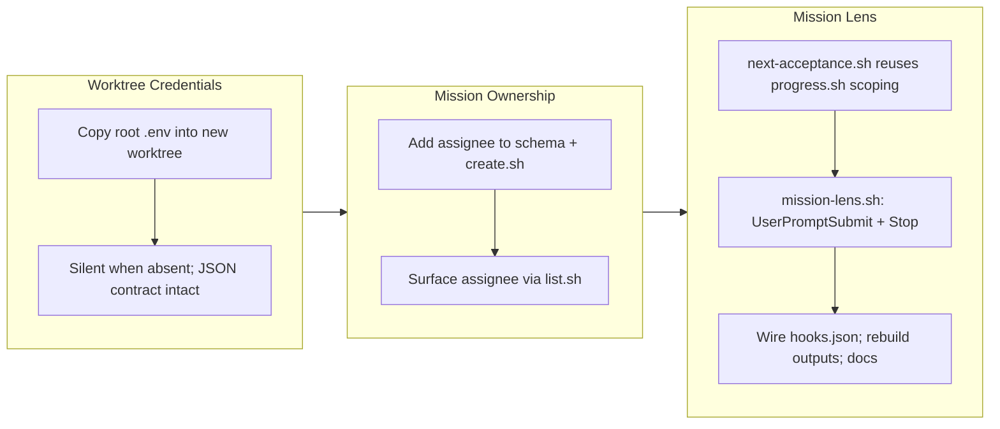

## 1. Overview

This branch makes missions actionable at the individual level and gives worktrees working credentials. It adds an `assignee` field to the mission schema and an always-on **mission lens** hook that re-surfaces each developer's assigned mission — its derived progress and next acceptance criterion — so the agent stays oriented to the roadmap without being forced to keep working. It also lands the worktree-creation protocol change that copies the root repository's git-ignored `.env` into every new worktree.

**Highlights:**

1. Missions gain a self-assigned `assignee` (git `user.email`), surfaced by `list.sh` and overridable at create time.
2. New `hooks/mission-lens.sh` re-anchors work on the roadmap on every `UserPromptSubmit` (model-visible) and `Stop` (user-visible), strictly gated to the assigned developer and non-forcing.
3. New `next-acceptance.sh` supplies the "next criterion" text by reusing `progress.sh`'s Acceptance-scoping convention.
4. `ensure-worktree.sh` copies the root `.env` into each new worktree so parallel worktrees start with working credentials.

## 2. Motivation

Missions already tracked *where a body of work was heading and how far it had come*, but nothing tied a mission to a person, and nothing kept an agent aware of the mission between turns — so a long session could drift off the roadmap. The goal was for a Claude Code session working a worktree to always know which mission it serves and how far it has come, and to navigate its developer toward completion. That requires two things: a machine-readable owner on the mission, and a hook that re-injects the mission's status at the moments the agent would otherwise lose the thread. The design deliberately chose *inform, not force* — the lens re-orients without hijacking the turn — and *strict ownership* — a session speaks only for the mission assigned to the developer driving that worktree. Separately, the credentials protocol needed worktrees to inherit the root `.env`, since `git worktree add` never carries an ignored file along.

## 3. Changes

The branch moves from the worktree-credentials protocol into the mission-ownership feature: first an `assignee` on the mission, then the read-only lens that consumes it. The lens splits across two hook events because a Stop hook cannot re-anchor the model without forcing continuation, so the model-facing half rides `UserPromptSubmit` and the Stop half is a user-facing nudge. Everything was verified hermetically and the generated `outputs/` tree was rebuilt to stay in lockstep with source.

### 3-1. ensure-worktree.sh copies the root repository's .env into new worktrees ([8fba48f](https://github.com/qmu/workaholic/commit/8fba48f))

After `git worktree add`, the protocol now copies `${repo_root}/.env` into the new worktree (a copy, not a symlink, so worktrees can diverge credentials independently), silently skipped when the root has no `.env`, with the JSON output contract untouched.

### 3-2. Mission assignee and always-on mission lens ([5141637](https://github.com/qmu/workaholic/commit/5141637))

Missions gain an `assignee` frontmatter field (self-assigned to the creator's git `user.email` by `create.sh`, overridable via a second argument, surfaced by `list.sh`). A new `hooks/mission-lens.sh` names each active mission whose `assignee` matches the current `git user.email`, with its derived `checked/total` and next unchecked acceptance item: model-visible `additionalContext` on `UserPromptSubmit`, user-visible `systemMessage` on `Stop`. It is strictly gated (unassigned or others' missions stay silent) and non-forcing (never blocks a stop). A new `next-acceptance.sh` supplies the next-step text, reusing `progress.sh`'s Acceptance-scoping convention. Docs updated in the mission `SKILL.md` and `CLAUDE.md`; `outputs/` regenerated, which also resynced the `ensure-worktree.sh` `.env`-copy block that commit `8fba48f` left stale in the generated tree.

## 4. Outcome

Missions are now individually actionable: a mission carries an owner, and any Claude Code session working a worktree is re-anchored to the missions assigned to that worktree's developer at every turn boundary, seeing the derived progress and the single next criterion to satisfy. The behavior is opt-in by data — silent unless an active mission is assigned to the current user — so it costs nothing in repos or turns where it does not apply. The worktree-credentials protocol is complete end to end: new worktrees inherit working credentials automatically. All verification passed: `build.mjs`, `verify.mjs`, `validate-metadata.mjs`, `posix-lint.sh`, and 396/396 workflow smoke tests, plus a hermetic throwaway-repo test exercising the hook across both events and the strict-gate negative case.

## 5. Historical Analysis

The mission lens follows the pattern established by `policy-lens.sh` (an always-on `UserPromptSubmit` context injector) and the family of `guard-*.sh` hooks, reusing the repo's existing convention of machine-checked behavior over prose. It also inherits the mission subsystem's established discipline — derived-never-stored progress (`progress.sh`), single-source layout resolution (`lib/resolve.sh`), and idempotent shared mutators — extending it with `next-acceptance.sh` rather than duplicating checklist logic. The worktree `.env` copy continues the credentials protocol whose root-file half shipped separately as the plgg `20260713144522` ticket.

## 6. Concerns

### Stop-hook nudge is user-visible only, so a purely autonomous stop is not re-anchored

- **Severity:** low
- **Description:** The mission lens splits across two events because a Stop hook cannot inject model-visible context without `decision: block` (see [5141637](https://github.com/qmu/workaholic/commit/5141637) in `plugins/workaholic/hooks/mission-lens.sh`). The model-facing re-anchor rides `UserPromptSubmit`; the `Stop` half is a user-visible `systemMessage` only. A session that stops and is never followed by another user prompt (a fully autonomous run that converges) is therefore not re-anchored to the mission at the model level.
- **How to Fix:** If model-level re-anchoring at stop is later required, use a `decision: block` Stop hook guarded by `stop_hook_active`, behind an explicit opt-in so it does not hijack interactive turns.

### The mission lens fires on every prompt with no sentinel gate

- **Severity:** low
- **Description:** Unlike `policy-lens.sh` (sentinel-gated to specific commands), `mission-lens.sh` runs on every `UserPromptSubmit` and `Stop` in every consuming repo (see [5141637](https://github.com/qmu/workaholic/commit/5141637) in `plugins/workaholic/hooks/hooks.json`). It is a cheap no-op when no active mission is assigned to the current user, but it adds two subprocess calls (`progress.sh`, `next-acceptance.sh`) per assigned mission per turn when one is.
- **How to Fix:** If the per-turn cost ever matters, fold progress + next-item into a single script invocation, or memoize the computed lens per session.

### Acceptance-scoping awk is duplicated across progress.sh and next-acceptance.sh

- **Severity:** low
- **Description:** `next-acceptance.sh` repeats the `## Acceptance`-scoped checklist awk convention that `progress.sh` owns (see [5141637](https://github.com/qmu/workaholic/commit/5141637) in `plugins/workaholic/skills/mission/scripts/next-acceptance.sh`). Two copies of the section-scoping rule can drift.
- **How to Fix:** Extract the Acceptance-section scanner into `skills/mission/scripts/lib/` and source it from both, as `lib/resolve.sh` already centralizes slug resolution.

### assignee match is an exact-string email compare

- **Severity:** low
- **Description:** The lens gate compares `assignee` to `git config user.email` by exact string (see [5141637](https://github.com/qmu/workaholic/commit/5141637) in `plugins/workaholic/hooks/mission-lens.sh`). A developer whose worktree git identity differs from the `assignee` value silently sees no mission, and one mission cannot be shared across several people.
- **How to Fix:** If multi-owner or alias matching is needed, make `assignee` a list and match membership, and document the identity expectation in the mission skill.

_Carried backlog: 65 previously-deferred concerns from PRs #54–#82 were judged against this branch and all remain `still_active` — none are remediated by this branch's scoped work. They persist as files under `.workaholic/concerns/` and are intentionally summarized here rather than re-pasted, to keep this section focused on concerns this branch introduced. Their continued accumulation is itself tracked by the existing `carried-from-*` and `collectors-sample` concerns._

## 7. Successful Development Patterns

- Verifying the platform contract before designing — confirming via the claude-code-guide agent that a Stop hook cannot inform without forcing — turned an apparent "Stop hook" task into the correct `UserPromptSubmit` mechanism, avoiding a feature built on the wrong event.
- Reusing `progress.sh` for counts and adding a thin `next-acceptance.sh` kept the hook DRY against the mission scripts instead of re-implementing checklist parsing inside the hook.
- Hermetic throwaway-repo testing across both hook events plus the strict-gate negative case (non-matching assignee → silent) proved the behavior before shipping, matching the repo's existing smoke-test discipline.
- Running `build.mjs` as part of the change surfaced and resynced a pre-existing `outputs/` staleness left by an earlier commit — building as part of the change keeps the generated tree honest rather than letting CI catch it later.

## 8. Release Preparation

**Verdict**: Ready for release

### 8-1. Concerns

- None blocking. The four concerns in section 6 are low-severity, forward-looking notes, not release blockers.

### 8-2. Pre-release Instructions

- None - standard release process applies.

### 8-3. Post-release Instructions

- None - no special post-release actions needed. Consuming repos pick up the new mission lens on their next plugin update; it is a silent no-op until a mission is created and assigned.

## 9. Notes

The mission lens is Claude-Code-only and has no `outputs/` footprint (it lives in `hooks/`, not the built workflows bundle). The mission skill itself *is* built into `outputs/workflows`, so the `assignee` / `next-acceptance.sh` changes there were regenerated. `mode` detected as `trip` because a March trip directory (`trip-20260319-040153`) predates this branch; it is unrelated to this work, so no trip rationale link applies.
