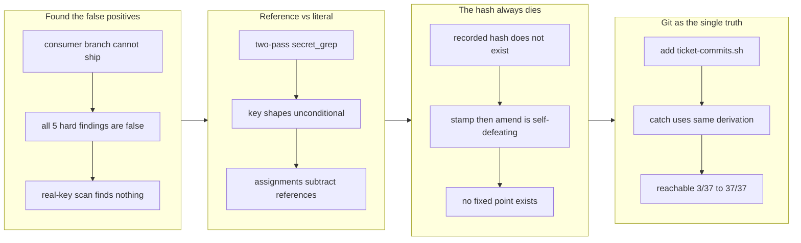

## 1. Overview

Two defects in the release path made it punish correct work. The branch-safety scan flagged reading a key from `process.env` as a credential and hard-blocked `/ship` (a `secret` finding is non-overridable by design), and every archived ticket recorded a `commit_hash` that could not exist, so `/report`'s commit links 404ed. Both were found and verified against the branch that actually got stuck — a consumer repository's release branch — not against fixtures.

**Highlights:**

1. **Separated a key's *reference* from a key's *literal*** — `secret_grep` became two passes: unmistakable key shapes match unconditionally, while the generic assignment rule (the password / token / api-key family) now fires only on a literal right-hand side. On the stuck branch, `secret/hard` went from 5 (all false) to 0, releasing `/ship` from a non-overridable block without loosening the gate.
2. **Made `commit_hash` derived, not stored** — a commit cannot carry its own hash, so stamping it was impossible in principle. `ticket-commits.sh` derives it from the commit that *added* the archived ticket. Reachable hashes went from **3/37 to 37/37**.
3. **Found a hidden consumer** — `catch`'s `scan-window.sh` also read `commit_hash` from frontmatter; removing the stamp made its test fail, which is how it surfaced. It now uses the same derivation.
4. **Proved the tests actually catch the regressions** — each new test was confirmed to fail against the old implementation before being accepted (516 → 538 passing, 0 failing).

## 2. Motivation

This started because a consumer repository's release branch could not ship. The scan returned five `secret/hard` findings and every one was false: they were `const apiKey = process.env.OPENAI_API_KEY;`, `apiKey: anthropicKey`, and a key *name* inside a string literal — that is, the recommended way to handle secrets. Because `secret` is non-overridable (`gate-decision.sh` returns `overridable:false`), false positives alone made a branch permanently unshippable. A non-overridable gate is coupled to its detector's precision: when the only escape from a false positive is to bypass the gate wholesale, strictness makes the system *less* safe. So a false positive here is a bug, not noise.

The second defect surfaced while verifying the first. Checking a ticket's recorded `commit_hash` showed the commit did not exist. The cause looked like ordering — stamp, then `git commit --amend` — but is actually a fixed-point problem: a commit cannot contain its own hash, so the amend that stores the value is what invalidates it. Re-stamping afterwards regresses forever. The recorded hash was an orphaned, never-pushed commit, which is why `/report`'s links 404ed (34 of 37 on that branch). Traceability is the whole point of that output, so it was fixed in the same branch.

## 3. Changes

Starting from the branch that was actually stuck, the false positives were resolved by separating references from literals. Verifying that fix exposed the dying `commit_hash`; pushing on it to the underlying principle (a commit cannot name itself) led to deriving the value at read time instead of storing it. Both were measured before and after on the originating branch.

### 3-1. Branch-safety scan flags `process.env` reads as credentials, hard-blocking /ship ([0de5c3b](https://github.com/qmu/workaholic/commit/0de5c3b))

The generic assignment rule (the password / token / api-key family) only checked that the right-hand side was "6+ non-space characters", so variable references, environment reads, and key names inside strings all read as literal keys. `secret_grep` now runs two passes: known key shapes (`AKIA`, `gh*_`, `github_pat_`, `xox*`, bearer/basic, PEM) still match unconditionally, and only the generic assignment form subtracts reference-shaped right-hand sides, with each exclusion bound to its own key. The gate's strictness (secret = non-overridable) is unchanged.

### 3-2. Archived tickets record a commit hash that never exists ([9d4b22c](https://github.com/qmu/workaholic/commit/9d4b22c))

`archive.sh` stamped `commit_hash` and then amended the ticket into that same commit, which changed the hash and left the recorded value naming an orphaned commit that is never pushed. The stamp is gone; `report/scripts/ticket-commits.sh` derives the hash via `git log --diff-filter=A` on the archived ticket's path. `catch/scripts/scan-window.sh` moved to the same derivation, and `archive.sh` now reads the hash it prints after the final amend so its own output cannot lie.

### 3-3. Bump version to 1.0.93 ([65f73f1](https://github.com/qmu/workaholic/commit/65f73f1))

Patch bump cutting the release. The three hand-maintained files (marketplace.json's root plus each `plugins[].version`, plugin.json, .codex-plugin/plugin.json) were updated and the generated manifest rebuilt, with all six surfaces confirmed aligned.

## 4. Outcome

Two self-defeating behaviors are gone from the `/report` → `/ship` path.

- **`/ship` is unblocked**: on the originating consumer branch, `gate-decision.sh` went from `decision:block, overridable:false, hard:5` to `decision:block, overridable:true, hard:0, total:1`. What remains is a size override — a call a developer is allowed to make. The gate itself was not loosened.
- **Commit links resolve**: reachable hashes on that branch went from **3/37 to 37/37**. Because the value is read from git, tickets still carrying a stale hash resolve correctly with no backfill migration.
- **Self-verifying**: this branch's own two tickets went through the path. The first was archived by the old script, so its frontmatter holds the dead `578683a` — derivation returns the live `0de5c3b`. The links in 3-1 and 3-2 above are `ticket-commits.sh`'s output.
- **Checks**: 516 → **538 passing, 0 failing**; `verify.mjs` (self-containment, policy index, OKF: 48 files, 213 links) and `validate-metadata.mjs` (version-aligned) green; `outputs/` rebuilt, matching the CI freshness condition.

## 5. Historical Analysis

`release-scan` was introduced only one PR earlier (#84, `work-20260714-000543`, ticket `20260714103349-release-scan-engine`), and its tiering decision — `secret` → `hard`, non-overridable — is sound; this branch keeps that and only sharpens the detector. `secret-patterns.sh` already carried an explicit anti-false-positive intent ("deliberately excludes bare hex/base64 so commit hashes, versions, and blob ids never false-positive"). This change extends exactly that intent from the shape of the value to the nature of the right-hand side.

The `commit_hash` defect was already on file as the deferred concern `archive-script-records-the-pre-amend` (from PR #84, moderate), and this branch **resolves** it. Notably its proposed fix — move `rev-parse` after the amend — would not have worked: wherever the stamp lands, the amend that stores it changes the hash again. Reaching the principle is what produced the actual solution (do not store it; derive it), which is more than closing the concern as written.

## 6. Concerns

### Stale `commit_hash` values remain in previously archived tickets

- **Severity:** low
- **Description:** The field still exists in `update.sh`, and every ticket archived before this change keeps a hash that names no commit (see [9d4b22c](https://github.com/qmu/workaholic/commit/9d4b22c) in `plugins/workaholic/skills/drive/scripts/archive.sh`). This is harmless to the tooling — `/report` and `catch` no longer read it — but a human opening the file sees a plausible-looking value that is false.
- **How to Fix:** If it ever misleads someone, strip the field from archived frontmatter in a dedicated migration. Functionally it is already resolved by not reading it, so there is no urgency.

### The derivation assumes archiving is a one-time add

- **Severity:** low
- **Description:** `ticket-commits.sh` relies on `git log --diff-filter=A`, i.e. that an archived ticket's path is added exactly once (see [9d4b22c](https://github.com/qmu/workaholic/commit/9d4b22c) in `plugins/workaholic/skills/report/scripts/ticket-commits.sh`). Un-archiving and re-archiving a ticket, or cherry-picking it across branches, could re-add the path and move the derived commit.
- **How to Fix:** No such workflow exists today. If one appears, pin the rule explicitly (e.g. take the earliest add). The `8j2` assertion "a later edit does not re-point the link" guards the common case.

### Separating references from literals depends on the terminator

- **Severity:** moderate
- **Description:** A real `.env` value and a variable reference such as `apiKey: anthropicKey` are indistinguishable by the value's spelling — both look like identifiers. They are separated by what follows: a real value ends the line, a reference is followed by a comma, semicolon, or closing bracket (see [0de5c3b](https://github.com/qmu/workaholic/commit/0de5c3b) in `plugins/workaholic/skills/release-scan/scripts/lib/secret-patterns.sh`). A literal that breaks that assumption — spaced, unquoted, and not ending the line — can slip through.
- **How to Fix:** Before loosening any rule here, check `8k2`'s true-positive table (.env literal, quoted literal, unquoted YAML literal, key shape beside a reference). If a real miss is found, add that case to `8k2` first, then extend the pattern.

### (carried from PR #67) Resumption tickets must list remaining-only steps

- **Severity:** urgent
- **Description:** `/carry` + `/drive` correctness depends on `/drive` implementing every `## Implementation Steps` entry with no "already done" concept; a resumption ticket that includes completed steps risks re-running them (see [386af5e](https://github.com/qmu/workaholic/commit/386af5e) in `plugins/workaholic/skills/carry/SKILL.md`).
- **How to Fix:** The rule is stated as the first carry Writing Guideline (completed work goes in the Overview as context). Consider enforcing it in a carry-ticket template or a lint that strips completed steps before writing the resumption ticket.

### (carried from PR #84) ensure-worktree.sh lacks the `.git/info/exclude` embedding guard

- **Severity:** moderate
- **Description:** The mission-worktree path adds `.worktrees/`/`.env` to `.git/info/exclude` to stop `git add -A` from embedding a linked worktree as a gitlink, but the pre-existing `ensure-worktree.sh` (trip/drive worktrees) still lacks the same guard.
- **How to Fix:** Apply the same `.git/info/exclude` guard in `ensure-worktree.sh` (a small parity follow-up).

### (carried from PR #83) list-active-deferred-concerns.sh can emit transiently-invalid JSON during the first large migration

- **Severity:** moderate
- **Description:** On the very first run that collapses a large legacy backlog, `list-active` emitted one malformed JSON record (an unescaped control character) while the migration was mutating ~200 files in the same call; subsequent runs were stable and valid (see [da318d7](https://github.com/qmu/workaholic/commit/da318d7) in `plugins/workaholic/skills/report/scripts/list-active-deferred-concerns.sh`). The root cause was not fully isolated. Because the deferred-concern judge parses this output, a first-collapse run in a fresh repo could feed the judge invalid JSON.
- **How to Fix:** Build the entire JSON array in a single Python pass (as `migrate`/`extract` already do) instead of shell string-assembly with per-field `escape_json`, or validate the assembled output and retry once; add a hermetic test that runs `list-active` on a large unmigrated fixture and asserts valid JSON.

### (carried from PR #82) Hermetic tests prove migration, not local use (repo has no missions)

- **Severity:** moderate
- **Description:** The migration mechanism is validated only by hermetic test cases (test-workflow-scripts.mjs) that create throwaway repos with fake legacy missions. This repository has no actual missions of its own, so the migration logic cannot be proven by real usage before release.
- **How to Fix:** After release, run /catch and other mission scripts on a deployed consumer repo that did adopt the flat layout; verify no unexpected regressions. Consider adding a canary check to the release notes asking early adopters to report migration behavior.

### (carried from PR #77) Codex hook runtime behavior remains unproven

- **Severity:** moderate
- **Description:** This branch fixes the Codex parse failure for `hooks/hooks.json`, but it does not prove what Codex will do with Claude-only hook entries that reference `${CLAUDE_PLUGIN_ROOT}` and Claude event names after parsing succeeds (see [6e69651](https://github.com/qmu/workaholic/commit/6e69651) in `plugins/workaholic/hooks/hooks.json`).
- **How to Fix:** During ship verification, re-add or refresh the workaholic Codex plugin cache and confirm Codex loads the plugin cleanly; if Codex then attempts to run Claude-only hooks, split or isolate Codex-visible hook config in a follow-up.

### (carried from PR #69) Best-effort fetch adds a per-run network round-trip to /catch

- **Severity:** moderate
- **Description:** `scan-window.sh` now runs `git fetch --all` on every `/catch` invocation, adding a network round-trip and measurable latency on large remotes; it is `--quiet` and best-effort, but the cost is paid on every report run (see [ad4ea8d](https://github.com/qmu/workaholic/commit/ad4ea8d) in `plugins/workaholic/skills/catch/scripts/scan-window.sh`; ticket Considerations "Performance").
- **How to Fix:** Consider a bounded fetch timeout or an opt-out flag for large remotes so a slow or unresponsive remote cannot stall the report.

### (carried from PR #69) (carried from PR #63) /catch deployment attribution is approximate

- **Severity:** moderate
- **Description:** `/catch` deployment attribution is approximate because the join keys on branch-story ship commits; this branch's fetch/remote-scan change did not touch that join, so the approximation remains (deferred concern `.workaholic/concerns/63-catch-deployment-attribution-is-approximate-for.md`).
- **How to Fix:** Tighten the deployment-attribution join to a more precise key than ship-commit matching.

### (carried from PR #69) --prune mutates the user's remote-tracking refs on every /catch

- **Severity:** moderate
- **Description:** The fetch uses `--prune` to drop remote-tracking refs for upstream-deleted branches so the report shows no ghosts, but this means every `/catch` run silently mutates `refs/remotes/*` in the user's clone — a side effect a user of a nominally read-only report may not expect (see [ad4ea8d](https://github.com/qmu/workaholic/commit/ad4ea8d) in `plugins/workaholic/skills/catch/scripts/scan-window.sh`; ticket Considerations "--prune is a deliberate choice").
- **How to Fix:** Keep the corrected read-only wording in the SKILL intro prominent, and consider making `--prune` opt-in if the ghost-branch risk proves rare in practice.

### (carried from PR #67) Browser MCP is session-provided and not guaranteed

- **Severity:** moderate
- **Description:** `/explain` depends on the Playwright plugin or Chrome DevTools MCP (the plugin declares no `.mcp.json`), which may be absent; the capability check is model-level (not shell-scriptable) and degradation saves the HTML but halts the PDF (see [2e5ef4f](https://github.com/qmu/workaholic/commit/2e5ef4f) in `plugins/workaholic/skills/explain/SKILL.md`).
- **How to Fix:** Keep the no-MCP halt message actionable, naming the two MCPs to enable; document them in `/explain` help.

### (carried from PR #67) /carry cannot auto-trigger on token exhaustion

- **Severity:** moderate
- **Description:** No programmatic token-budget signal is available to commands or hooks (a `PreCompact` hook has no model access), so `/carry` must be user-invoked (see [386af5e](https://github.com/qmu/workaholic/commit/386af5e) in `plugins/workaholic/commands/carry.md`).
- **How to Fix:** If Claude Code later exposes a context-budget signal or a model-capable pre-compaction hook, a non-blocking `PreCompact` nudge ("consider running /carry") becomes possible; until then it stays explicit.

### (carried from PR #67) First out-of-repo artifact bypasses the layout hook

- **Severity:** moderate
- **Description:** `/explain`'s PDF lands outside `.workaholic/`, so it sits outside the layout-validation machinery (`validate-ticket.sh` matches only `*.workaholic/*`); the only guardrails are the Home consent gate and the resolver's writability check (see [2e5ef4f](https://github.com/qmu/workaholic/commit/2e5ef4f) in `plugins/workaholic/skills/explain/scripts/resolve-export-path.sh`).
- **How to Fix:** Keep the consent gate symmetric and the resolver's fail-safe writability check in place; ensure the resolver never touches config/profile paths or escalates privilege.

### (carried from PR #63) Branch-guard tokenizer lacks shell-quoting awareness

- **Severity:** moderate
- **Description:** The guard scans the entire command string and cannot tell a real command from text inside an `echo`/quoted argument, so the literal phrase `git branch <word>` inside `echo "…"` still trips it (see [5ed322f](https://github.com/qmu/workaholic/commit/5ed322f) in `plugins/workaholic/hooks/guard-git-branch.sh`). This is inherent to the whitespace tokenizer, which deliberately avoids a full shell parser.
- **How to Fix:** Agents should avoid embedding `git branch <word>` in echo/log strings; this is guidance, not a code change.

### (carried from PR #63) `/catch` focus buckets are UTC-day based

- **Severity:** moderate
- **Description:** Time-bucket boundaries use `epoch - epoch % 86400` to avoid non-POSIX `date -d` arithmetic (see [d9a695b](https://github.com/qmu/workaholic/commit/d9a695b) in `plugins/workaholic/skills/catch/scripts/scan-window.sh`); precise for a focus narrative but shifted by the local-UTC offset.
- **How to Fix:** The UTC-day assumption is documented in the script; if local-timezone bucketing is ever required, compute boundaries with explicit offset math.

### (carried from PR #63) `/catch` generation-style is an explicit guess

- **Severity:** moderate
- **Description:** The generation-style field is inferred from commit-timestamp shape and is framed as a guess, not fact (see [d9a695b](https://github.com/qmu/workaholic/commit/d9a695b) in `plugins/workaholic/skills/catch/SKILL.md`). The "looks like…" framing must be preserved when rendering.
- **How to Fix:** Keep the explicit-guess wording in the report template so the field is never read as authoritative.

### (carried from PR #63) Quality Gate is prose-mandated, not hook-enforced

- **Severity:** moderate
- **Description:** The `## Quality Gate` section is mandatory in prose but not enforced by `validate-ticket.sh` (frontmatter+location only), matching the `## Policies` precedent (see [e27a450](https://github.com/qmu/workaholic/commit/e27a450)). A ticket can technically omit it.
- **How to Fix:** Deliberate design choice; if hard enforcement is wanted, add a body-section grep to `validate-ticket.sh` plus a smoke test.

### (carried from PR #63) Stale plugin install is indistinguishable from a broken hook

- **Severity:** moderate
- **Description:** A stale plugin install presents an absent hook identically to a broken one (see [56cf7a0](https://github.com/qmu/workaholic/commit/56cf7a0)). Hook presence in `hooks.json` is checkable from a script, but activation is not — a PreToolUse hook fires on the Bash *tool* call, not nested `sh` (`plugins/workaholic/skills/check-deps/scripts/check.sh`).
- **How to Fix:** The `check-deps` version surfacing ([5059220](https://github.com/qmu/workaholic/commit/5059220)) is the durable mitigation; the in-session activation probe is documented in `check-deps/SKILL.md` so agents can distinguish presence from activation.

### (carried from PR #60) By-developer axis joins on commit email + ticket-author frontmatter

- **Severity:** moderate
- **Description:** `scan-window.sh` groups commits by author email and joins ticket frontmatter author to build the roster. This works uniformly across commits, todo, and archive, but the scope set (`todo`/`archive`/`icebox` for tickets, `stories/` for narrative) does not yet specially attribute icebox/abandoned work per developer (discovered during `/catch` implementation, `plugins/workaholic/skills/catch/scripts/scan-window.sh`).
- **How to Fix:** Document the current scope reach; extend the scope set if per-developer icebox/abandoned reporting becomes load-bearing.

### (carried from PR #60) Collectors sample branch stories by title match; very large dirs may need indexing

- **Severity:** moderate
- **Description:** The per-developer collectors read branch stories by sampling on title/theme match rather than reading all of them (the live repo already has ~50). A very large `stories/` directory could exceed the practical sampling window and miss a relevant story (`plugins/workaholic/skills/catch/SKILL.md`, Collect Developer step 3).
- **How to Fix:** If `stories/` grows past ~100 files, add a per-developer story index or a `stories/<developer-slug>/` partition.

### (carried from PR #59) Bundled script hardened without rebuilding outputs/, leaving the public copy stale

- **Severity:** moderate
- **Description:** Ticket 2047 hardened `plugins/workaholic/skills/branching/scripts/ensure-worktree.sh`, which is a **bundled** branching-skill script in the drive/report/ship/create-ticket closure, but its archival commit ([24a3096](https://github.com/qmu/workaholic/commit/24a3096)) claimed "No outputs/ rebuild" — the `outputs/` copies were left stale and only regenerated later during the version bump ([1f7c620](https://github.com/qmu/workaholic/commit/1f7c620)), so source and artifact were out of lockstep in between (an `Outputs Freshness` CI failure waiting to happen).
- **How to Fix:** When editing any script under a bundled skill closure, always run `node scripts/build-plugins/build.mjs` and commit `outputs/` in lockstep within the same change; only pure `hooks/` changes may skip the rebuild. Treat "is this script in a shipped closure?" as a checklist item before claiming "No outputs/ rebuild."

### (carried from PR #58) collect-commits body emission is a load-bearing, easily-severed link

- **Severity:** moderate
- **Description:** The new commit Concerns/Insights → section-reviewer wiring assumes `collect-commits.sh` emits the body and that the report orchestrator passes the commit bodies to that worker (see [24e5b37](https://github.com/qmu/workaholic/commit/24e5b37) in `plugins/workaholic/skills/report/scripts/collect-commits.sh`). The script silently dropped the body once already; if it regresses, the new keys stop reaching `/report` with no error.
- **How to Fix:** Keep the `collect-commits` body-emission smoke test green, and keep the commit-bodies input wired to the section-reviewer when editing report Phase 2.

### (carried from PR #56) Enforcement reaches consumer repos only after this release

- **Severity:** moderate
- **Description:** The hooks live in the workaholic plugin; a consumer repo (e.g. the consumer repository) gains them only once this version is published and the repo updates. the consumer repository is migrated to `workaholic@workaholic` + `autoUpdate: true`, so it will pull them post-release — but until then, in-flight branches there can still reintroduce `done/` (observed live: the consumer repository PR #238 reintroduced 17 violations during cleanup).
- **How to Fix:** Ship this branch via `/release`; autoUpdate propagates the enforcement to the consumer repository automatically.

### (carried from PR #56) Two enforcement layers encode one rule (drift risk)

- **Severity:** moderate
- **Description:** The canonical-path rule now lives in both `validate-ticket.sh` (bash, PostToolUse) and `guard-ticket-structure.sh` (POSIX sh, PreToolUse). Future edits must change both or they will disagree.
- **How to Fix:** Keep the path-shape rules equivalent; consider extracting a shared helper if a third consumer appears.

### (carried from PR #54) Trip unification is unproven by a live `/trip` run

- **Severity:** moderate
- **Description:** The entire `/trip`-unification protocol change is validated only by `build.mjs`/`verify.mjs`/`validate-metadata.mjs`/`test-workflow-scripts.mjs` and prose review — the smoke tests exercise the bundled shell scripts (reused, not changed), not the skill/agent markdown. The new Decomposition gate, the per-ticket Coding loop, and the context-aware queue-execute routing have **not** been exercised end-to-end by a real `/trip` (`plugins/workaholic/skills/trip-protocol/SKILL.md`). A live run could surface gate-sequencing, archiving, or routing gaps the static checks cannot catch.
- **How to Fix:** Run a real end-to-end `/trip` — both a design-first trip (validate the Decomposition gate emits well-formed tickets and the per-ticket loop archives each) and a queue-execute trip (validate routing skips Planning/Decomposition and drives a pre-populated queue) — before relying on the new flow.

### (carried from PR #origin_pr_url:) Commit-subject rule has no unbypassable enforcement surface anywhere

- **Severity:** moderate
- **Description:** Compound concern superseding: both-local-enforcement-layers-stay-bypassable, gate-coverage-is-the-single-bash.
- **How to Fix:** Address the combined risk described above; the superseded parts are archived.

### (carried from PR #84) Branch-safety scan WARN (overridable): oversized change set

- **Severity:** low
- **Description:** The scan's only remaining finding on this branch is `size/too-many-files` (103 > 100) — legitimate, because `outputs/` was regenerated across many commits. It is `override`-tier and is recorded at `/ship`, not a block.
- **How to Fix:** None required; `/ship` records the override in deployment evidence.

### (carried from PR #84) Mission quality gate: server-start and live verification are not hermetic

- **Severity:** low
- **Description:** The per-mission gate declares the check and supplies the worktree port, but the server-start command is project-owned and the live Playwright verification is an in-session step, not covered by the hermetic suite (the schema round-trip is).
- **How to Fix:** If the run-side grows, split the declaration from the verification-run at drive time.

### (carried from PR #84) report step-1 wording predates the tiered scan severities

- **Severity:** low
- **Description:** `report/SKILL.md` step 1 says "force `releasable: false` on a block," but the scan now has an `override` tier that should warn-and-record rather than block. The release-readiness pass handled this correctly (it treated the override size finding as non-blocking), but the wording should distinguish `hard`/`confirm` (force not-releasable) from `override` (warn).
- **How to Fix:** Reconcile the step-1 wording to key off severity, not just "block."

### (carried from PR #83) The identity migration under-collapses title-drift near-duplicates

- **Severity:** low
- **Description:** `concern_id` is the slug of the title; when the same concern was re-worded across PRs (e.g. "50-char cap" vs "50-char subject cap"), the migration leaves two active files with different ids, so the mechanical collapse got 65→38 and the remaining ~6 duplicates needed the human triage merge (see [b33d64f](https://github.com/qmu/workaholic/commit/b33d64f) in `plugins/workaholic/skills/report/scripts/migrate-concern-identity.sh`).
- **How to Fix:** This is by design (semantic dedup is the triage's job), but a fuzzy-match hint (shared significant-word overlap) could pre-cluster likely duplicates and offer them as merge candidates in Phase 1b.

### (carried from PR #83) The living migration commits a large one-time churn inside a normal /report commit

- **Severity:** low
- **Description:** The first collapse renamed/moved ~200 concern files; those staged moves ride the Phase 4 story commit, producing a very large, hard-to-review diff bundled with the story (see [b33d64f](https://github.com/qmu/workaholic/commit/b33d64f)).
- **How to Fix:** Consider committing the migration collapse as its own dedicated commit (separate from the story), or gate it behind a one-time `migrate` invocation, so the healing diff is reviewable on its own.

### (carried from PR #83) Triage threshold and compound detection are prose-driven, not enforced

- **Severity:** low
- **Description:** The count threshold (20) and the "judge proposes compounds" step live in report SKILL prose, not a machine check (see [da318d7](https://github.com/qmu/workaholic/commit/da318d7) in `plugins/workaholic/skills/report/SKILL.md`) — matching the repo's existing prose-gate precedent, but skippable.
- **How to Fix:** If enforcement is wanted, have `list-active` emit the active count and a `should_triage` flag the command can branch on mechanically.

### (carried from PR #82) Living migration departs from forward-only stance but is strictly scoped

- **Severity:** low
- **Description:** This branch implements automatic file migration (git mv) to relocate legacy flat missions — a deliberate departure from concern #77's recorded stance of 'write a targeted migration ticket.' The migration is scoped strictly to mission dirs holding mission.md directly under .workaholic/missions/ and is best-effort (failures don't block calling seams), but it does mean read-only paths like /catch can move files.
- **How to Fix:** Document the scoping carefully in mission/SKILL.md; monitor for unexpected tree mutations in deployments and be prepared to add opt-out flags (--skip-migration) if deployments report side effects.

### (carried from PR #80) (carried from PR #59) /commit can emit off-policy subjects if invoked directly

- **Severity:** low
- **Description:** `/commit` accepts a freeform subject without validating it against the subject rule.
- **How to Fix:** Call `check-subject.sh` inside `/commit` and reject/re-prompt on an off-policy subject.

### (carried from PR #77) Existing artifacts are not backfilled into missions

- **Severity:** low
- **Description:** Mission relations are emitted forward-only; existing tickets, stories, and concerns do not get a mission relation unless future work edits them (see [ce2f436](https://github.com/qmu/workaholic/commit/ce2f436) in `plugins/workaholic/skills/report/SKILL.md`).
- **How to Fix:** Leave historical artifacts unchanged unless a mission needs backfill, then write a targeted migration ticket that sets `mission:` and `tickets:` relations for a named mission from verifiable evidence.

### (carried from PR #59) 50-char cap is byte-based outside a UTF-8 locale

- **Severity:** low
- **Description:** The subject-length check uses `wc -m`, which counts characters only under a UTF-8 locale and bytes under a C/POSIX locale (see [24a3096](https://github.com/qmu/workaholic/commit/24a3096) in `plugins/workaholic/hooks/lib/check-subject.sh`). Japanese subjects therefore enforce a character-accurate 50-char cap only when the runtime locale is UTF-8; in CI's default locale the cap is effectively byte-based and multibyte subjects can false-trip.
- **How to Fix:** Pin a UTF-8 locale (e.g. `LC_ALL=C.UTF-8`) wherever the gate/hook runs, or switch to a locale-independent character count if byte-vs-char accuracy on Japanese subjects becomes load-bearing.

### (carried from PR #59) /commit is an escape hatch that can invite non-ticketed commits

- **Severity:** low
- **Description:** The new `/commit` command provides a sanctioned path for ad-hoc commits, but by existing it can normalize committing outside the ticketed `/drive` flow (see [a62d99c](https://github.com/qmu/workaholic/commit/a62d99c) in `plugins/workaholic/commands/commit.md`). It is still strictly better than free-handed `git commit` because both the command and the gate preserve the message policy.
- **How to Fix:** Keep the command copy steering users to `/drive` for ticketed work and framing `/commit` as for small/explicit non-ticketed changes; revisit if commit history shows `/commit` displacing ticketed development.

### (carried from PR #59) commit.sh silently drops a --category placed after its positional args

- **Severity:** low
- **Description:** `commit.sh` parses option flags (`--category`, `--skip-staging`) only at the front of its argument list — the parse loop breaks on the first non-flag token, so a `--category` placed after the six positional args is silently consumed as a `[files...]` entry and the `Category:` trailer goes missing with no error (see [a62d99c](https://github.com/qmu/workaholic/commit/a62d99c) in `plugins/workaholic/skills/commit/scripts/commit.sh`). The missing trailer is invisible to `verify.mjs`; only a temp-repo dry-run surfaces it.
- **How to Fix:** Always pass flags before the positional `title why changes concerns insights verify` args (the `/commit` doc now states this), and consider making `commit.sh` error on an unrecognized trailing `--flag` instead of treating it as a file path.

### (carried from PR #59) git commit-msg hook escapes the POSIX lint gate

- **Severity:** low
- **Description:** A git hook must be named exactly `commit-msg` (no extension), but `hooks/posix-lint.sh` only scans `*.sh`, so the new git hook is invisible to the POSIX gate (see [e2fdcf0](https://github.com/qmu/workaholic/commit/e2fdcf0) in `plugins/workaholic/hooks/git/commit-msg`). It is POSIX `#!/bin/sh -eu` by construction today, but a future bashism in it would not be caught by CI. The shared logic deliberately lives in `lib/check-subject.sh` (which `posix-lint` *does* scan) to keep the lintable surface maximal.
- **How to Fix:** If more git-native hooks are added under `hooks/git/`, either extend `posix-lint.sh` to scan that directory by name or keep the extensionless hooks trivially POSIX with all real logic in lintable `lib/*.sh` files.

### (carried from PR #58) POSIX lint runner half is weak where /bin/sh is bash

- **Severity:** low
- **Description:** The dash/sh test runner only catches bashisms on an image where `/bin/sh` is dash/ash; on a host where `sh` is bash it is weak (see [c7c73d7](https://github.com/qmu/workaholic/commit/c7c73d7) in `scripts/test-workflow-scripts.mjs`). The grep-based `posix-lint.sh` is shell-independent and catches drift everywhere, so the gate is not blind, but the runner half should not be relied on alone.
- **How to Fix:** Prefer a dash/Alpine CI runner so both halves of the gate bite.

## 7. Successful Development Patterns

- **Measure before and after on the thing that actually broke** — both fixes were run against the branch that was genuinely stuck (a consumer repository's branch), yielding concrete deltas (5→0 findings; 3/37→37/37 reachable). Fixtures alone could not have established either, and the second bug was not findable from fixtures at all: it took resolving a real ticket's recorded hash to see it did not exist.
- **Prove a new test fails against the old code** — each test was checked by reverting to the previous implementation and confirming a failure (528/1 for the regex; the inverted archive assertion). A green suite alone cannot distinguish a real guard from one that asserts nothing.
- **When removing a field, audit the readers, not the writer** — dropping the `commit_hash` stamp broke `catch/scan-window.sh`, a consumer nobody would have thought to check; the test suite surfaced it. The writer is the obvious place to look and the wrong one.
- **Push "an ordering bug" down to its principle** — `commit_hash` looks like it needs `rev-parse` moved later. It doesn't; no fixed point exists. Reaching that turned a symptomatic patch into the correct design (derive, don't store) and revealed the existing concern's proposed fix as unworkable.
- **Bind an exclusion to its subject** — grep works per line, so an exclusion that does not include the key group will match an unrelated assignment elsewhere on the line and suppress a real key sitting beside it. Repeating the key group in all six exclusions is deliberate, not redundant.

## 8. Release Preparation

**Verdict**: Ready for release

### 8-1. Concerns

- This branch's own safety scan returns **pass**, but only after two `.workaholic/scan-allow` entries this branch had to add — and the reason is worth reading, because the scanner blocked *itself*:
  - **The generated mirror of the scanner's own source.** `plugins/workaholic/skills/release-scan/**` was already exempt ("the scanner's own source and docs literally contain the secret regexes it matches"), but `build.mjs` copies that source verbatim into `outputs/workflows/skills/{report,ship}/release-scan/`, which was not. The explanatory comments added here made the generated copy match the very denylist it defines — 10 hard findings. The old file was terse enough to escape by luck, not by design.
  - **The story documenting the fix.** Prose about the rule cannot avoid the rule: even plain English trips it (`secret = non-overridable` parses as an assignment). This file is exempt by exact path — not `stories/**`, since a story could legitimately carry a pasted credential and stays worth scanning.
  - Net: 13 hard findings → 0, none of them credentials. This is the same class of false positive the branch set out to fix, one level up: the code fix separates *reference from literal*; these are *description from instance*. A regex sees neither distinction, which is what the committed, reviewed allowlist is for.
- All checks green: 538 passing / 0 failing; `verify.mjs` (self-containment, policy index, OKF) and `validate-metadata.mjs` (version-aligned).
- `outputs/` was rebuilt with `build.mjs`, matching the `Outputs Freshness` CI condition (rebuild and fail on any diff).
- **Distributed behavior changes**: in every repo using this plugin, archiving stops writing `commit_hash`, and `/report` + `catch` switch to git derivation. Existing tickets are not broken — their stale values simply stop being read.

### 8-2. Pre-release Instructions

- None; the standard release process applies. Version is already at 1.0.93.

### 8-3. Post-release Instructions

- After merging, **retry `/ship` on a consumer repository's branch** — the branch this work came from. With the fix in place its `secret` hard count is 0, leaving only the `too-many-files` (138 > 100) override decision.

## 9. Notes

- The branch is verified by its own fix: section 3's links are `ticket-commits.sh`'s output, and the first ticket — archived by the old script, so its frontmatter holds the dead `578683a` — resolves to the live `0de5c3b`.
- The 38 carried concerns in section 6 come from other branches whose code this branch never touches, so `still_active` is the correct verdict; the judge proposed no compounds, and they were carried forward unchanged.
- `archive-script-records-the-pre-amend` (from PR #84, moderate) is **resolved** here ([9d4b22c](https://github.com/qmu/workaholic/commit/9d4b22c)).
- Context detection reports `mode: trip` only because an unrelated historical trip (`trip-20260319-040153`) still lives in the repo; this branch has no trip artifacts and was handled as a drive.
