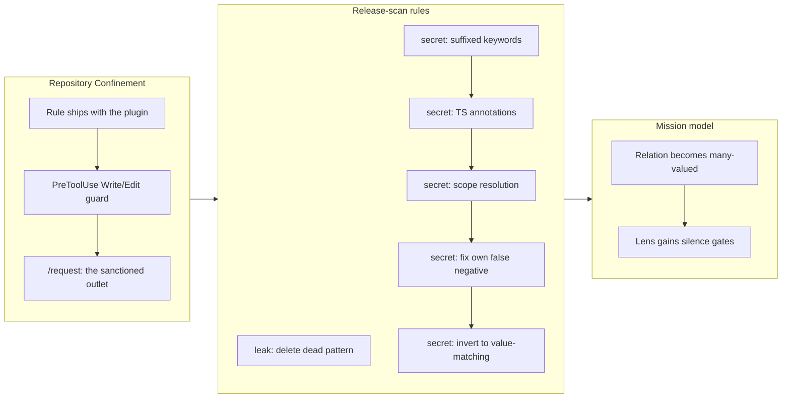

## 1. Overview

This branch confines every workflow's writes to the current repository, adds `/request` as the only sanctioned way to cross a repository boundary, and spends the rest of its length on the release-scan `secret` rule — ending by inverting that rule's generic-assignment pass so it judges the **value** on the right-hand side instead of the **key name** on the left. Along the way it deletes a `leak`-rule pattern that was measured to detect nothing, makes the artifact→mission relation many-valued, and quiets the mission lens where it has nothing to say.

The two security-adjacent changes pull in opposite directions on purpose, and the branch is largely an argument about where that line sits: a repository boundary is *syntax*, so a matcher enforces it well; a customer's vocabulary is *semantic*, so a matcher cannot, and the judgement belongs to a person.

**Highlights:**

1. Confine every write to the current repository or its own worktrees — the incident that motivated it happened at four sites where the rule had never been installed, so the rule now ships with the plugin instead of living in one repository's memory
2. Invert the `secret` rule's pass 2 to match on the value: six subtractions deleted, five of which needed no replacement, measured 15/15 flag and 25/25 subtract against a 40-row table
3. Delete the internal-hostname `leak` pattern — it detected **zero of five** real leaks while misfiring on `metadata.internal`, a field CLAUDE.md requires every script-bearing skill to carry

## 2. Motivation

Five sibling repositories accumulated another project's context over four weeks. The investigation found the cause was not a missing rule but a missing *installation*: the rule prohibiting cross-repository leakage existed only as this repository's agent memory, and four of the five incident sites never had the plugin enabled at all. No hook, rule, or scan ever fired there. So the fix is distribution — `rules/general.md` is `paths: '**/*'` and ships with the plugin — with a blocking `PreToolUse(Write|Edit)` hook as a syntactic backstop and `/request` as the one sanctioned outlet.

The `secret` rule's motivation is different and should not be confused with the above. It was never removed; it was hardened five times, because credential shapes **are** enumerable — which is exactly what makes a regex right for that rule and wrong for the `leak` rule's internal-hostname pattern, deleted on this same branch for detecting nothing. The `secret` rule's own defect was structural: pass 2 matched a credential key *name* and then subtracted innocent right-hand sides one at a time, so the default for an unseen shape was hard-block on the one tier with no bypass. Four subtractions were retrofitted only after real branches were blocked, and a fifth was queued behind `apiKey: keyOption()` — the most ordinary way to fetch a credential in TypeScript. A denylist of innocence cannot be completed, because innocence is unbounded. Inverting the burden of proof — asking whether the right-hand side *looks like a secret*, which is a bounded question — is what stops the accrual.

## 3. Changes

The branch runs from the incident response (confinement, `/request`) into the scan rules it depends on, and closes on the mission model. The `secret` sequence is the spine: four fixes in a row, each landing only after a real branch was blocked, the fourth repairing a false negative the second had itself introduced — and then the inversion that made the sequence stop.

### 3-1. Confine every workflow's writes to the current repository ([0bff85aa](https://github.com/qmu/workaholic/commit/0bff85aa))

Wrote the confinement rule into `rules/general.md` (`paths: '**/*'`, always loaded, shipped with the plugin) and added `hooks/guard-repo-confinement.sh`, a blocking `PreToolUse(Write|Edit)` gate resolving the target against the toplevel plus every worktree. It runs PreToolUse because refusing after the file exists in a foreign repo is not confinement.

### 3-2. Add /request: the only sanctioned path for filing a ticket in another repository ([a15e7db8](https://github.com/qmu/workaholic/commit/a15e7db8))

Gave the confinement an outlet: `resolve-target.sh` reports the target's public/private visibility, `file-request.sh` is the only sanctioned writer, and between them the developer confirms the exact body verbatim in a step that cannot be skipped. The script's checks are mechanics, not assurance — the human gate is the only control that reaches meaning.

### 3-3. Remove the internal-hostname pattern from release-scan ([5196c0dd](https://github.com/qmu/workaholic/commit/5196c0dd))

Deleted a `leak`-rule pattern that detected **zero of five** real leaked sentences while standing as a false positive against `metadata.internal`. Also corrected the claim in CLAUDE.md and `release-scan/SKILL.md` that the scan machine-enforces the keep-motivation-generic convention: a `pass` verdict means "no listed term was re-introduced", never "no client context here".

### 3-4. secret_grep misses any credential keyword that carries a suffix ([84d238d9](https://github.com/qmu/workaholic/commit/84d238d9))

`SECRET_KEY`, `secret_key`, `aws_secret_access_key`, `access_key_id` and `refresh_token_value` all walked through the only non-overridable tier — including Django's `SECRET_KEY` and the exact key name AWS's own config files use. Collapsed the keyword group, repeated in seven places, into one `_SP_KEY` definition with an optional suffix tail.

### 3-5. Resume: secret_grep flags TypeScript type annotations as credentials ([c245361e](https://github.com/qmu/workaholic/commit/c245361e))

`let nextToken: string | undefined;` was reported as a credential with no bypass, so the blast radius was every TypeScript repository using the plugin. Fixed — and, as [1fd4ef63](https://github.com/qmu/workaholic/commit/1fd4ef63) later established, this fix silently introduced a false negative of its own.

### 3-6. Let an artifact relate to more than one mission ([83b88ff6](https://github.com/qmu/workaholic/commit/83b88ff6))

The artifact→mission relation is now many-valued (`mission: [alpha, beta]`), with `read-relation.sh` replacing four hand-rolled frontmatter parsers and all five seams looping over slugs. Deleted `report/SKILL.md`'s disagreement prompt, which asked a human to discard a true relation. Data is plural; placement stays singular.

### 3-7. Mission Lens Stops Reporting What It Has Nothing to Say About ([87466e59](https://github.com/qmu/workaholic/commit/87466e59))

Gave the lens two more gates: silent inside a worktree that owns no mission, and silent for a mission whose `## Acceptance` is empty — `0/0` is a technical condition with nothing to act on, printed unasked above the agent's answer.

### 3-8. Resume: invert secret_grep's pass 2 to match on the value, not the key name ([e3366bfd](https://github.com/qmu/workaholic/commit/e3366bfd))

Pass 2 now flags only a quoted-alphanumeric value or a bare value-run ending the line; everything else — identifier, dotted path, call, template, annotation, `::` — is a reference needing no rule. Six subtractions deleted and five needed no replacement: `Token::Path` is skipped because `:Path` is not a literal, with no `::` rule in the file at all. Gate: 15/15 flag, 25/25 subtract, up from a measured 38/40 baseline.

## 4. Outcome

**Cross-repository confinement (the incident response).** The rule now has a body in `rules/general.md` and ships with the plugin; `guard-repo-confinement.sh` refuses any Write/Edit outside the repo and its worktrees, failing open outside a git repo; `/request` provides the sanctioned crossing with a non-skippable verbatim-body confirmation. Twenty-five hermetic tests across the two tickets.

**Release-scan `leak` rule.** The internal-hostname pattern is gone, and the documents that overclaimed the scan's reach are corrected. The denylist, `secret`, and `size` rules were kept.

**Release-scan `secret` rule, hardened across five commits.** Suffixed keywords detect ([84d238d9](https://github.com/qmu/workaholic/commit/84d238d9)); TypeScript annotations stop hard-blocking ([c245361e](https://github.com/qmu/workaholic/commit/c245361e)); scope resolution stops reading as an assignment ([1ffe09aa](https://github.com/qmu/workaholic/commit/1ffe09aa)); the false negative `c245361e` itself introduced is repaired ([1fd4ef63](https://github.com/qmu/workaholic/commit/1fd4ef63)); and pass 2 is inverted to judge the value ([e3366bfd](https://github.com/qmu/workaholic/commit/e3366bfd)).

**Mission model.** The relation is many-valued and read through one reader; the lens is silent where it has nothing to say.

**Housekeeping.** The deferred-concern corpus was triaged from 38 active to 22, every verdict measured against HEAD ([9d81dd3a](https://github.com/qmu/workaholic/commit/9d81dd3a)), with two members folded into one compound. `/explain`'s intermediate HTML now stages in-repo ([ef80cd64](https://github.com/qmu/workaholic/commit/ef80cd64)) after `guard-repo-confinement.sh` — added on this same branch — made its export dead on arrival.

Suite 538 → 648 passing, 0 failed. posix-lint conforming; build, verify and validate-metadata green.

## 5. Historical Analysis

**Distribution, not enforcement, was the root cause.** Three of the leaking repositories never had `workaholic` in `enabledPlugins` at all — hundreds of tickets between them, and not one hook, rule, or scan ever fired there ([0bff85aa](https://github.com/qmu/workaholic/commit/0bff85aa)). The rule reached one site in five, and four of the five incidents happened at the four sites it missed. The highest-leverage change was a config line, not code. Both the rule and the guard are correct, and both were inert where the leaks happened.

**Syntax yields to matchers; vocabulary does not.** The branch drew this line twice in one afternoon, in opposite directions. A repository boundary is syntax, so `guard-repo-confinement.sh` is the right shape. A customer's vocabulary is semantic and not enumerable before it leaks, which is why the internal-hostname pattern was deleted rather than improved ([5196c0dd](https://github.com/qmu/workaholic/commit/5196c0dd)) and why `/request`'s masking is a human confirmation ([a15e7db8](https://github.com/qmu/workaholic/commit/a15e7db8)). The `secret` rule sits on the syntax side — credential shapes *are* enumerable — which is why it was hardened five times rather than removed. Keeping those two rules distinct is the whole point.

**A denylist of innocence never finishes.** Four subtractions retrofitted after four incidents, with a fifth queued, is what an unbounded list looks like from inside. The inversion's claim was measurable rather than rhetorical: five of the six deleted subtractions needed no replacement, and the allowlist absorbed shapes it was never told about ([e3366bfd](https://github.com/qmu/workaholic/commit/e3366bfd)).

**Fixing a gate on its own branch trips the gate.** Three tickets about the `secret` rule hard-blocked their own branch, because an argument about which shapes are misread has to show them ([ef64d2f5](https://github.com/qmu/workaholic/commit/ef64d2f5)). `.workaholic/scan-allow` absorbs each by name; the file predicted this at four entries and the fifth came due the same day.

**A test that has not been watched to fail is not evidence.** This branch produced at least four tests that passed while measuring nothing. The traps repeat: `git stash` takes the tests away with the fix, so a "should fail" check passes vacuously; `execSync` runs its command through an outer shell that eats the argument before the inner `sh` sees it; `cp` aliased to `cp -i` silently declines to restore; zsh `noclobber` makes `cat > f` fail while the script runs on against a stale file. The discipline that stuck — revert one file, confirm red, restore — is what let [e3366bfd](https://github.com/qmu/workaholic/commit/e3366bfd) and [83b88ff6](https://github.com/qmu/workaholic/commit/83b88ff6) trust their suites.

**Documents inherit each other's unverified claims.** Three documents asserted that `ship/record-evidence.sh` sources `secret-patterns.sh` — the file's own header, a ticket's step 5, and CLAUDE.md. It never did ([e3366bfd](https://github.com/qmu/workaholic/commit/e3366bfd)). The same shape appears in CLAUDE.md's claim that the scan machine-enforces the client-context convention. In both cases the false confidence the sentence underwrote was worse than the gap it described.

**Two features can be individually correct and jointly broken.** `guard-repo-confinement.sh` landed on this branch and killed `/explain`'s export, whose destination is outside the repo by definition ([ef80cd64](https://github.com/qmu/workaholic/commit/ef80cd64)). Neither ticket mentioned the other. The gate could not carve an exception — a `PreToolUse` hook sees only `tool_input.file_path`, never which skill is asking — so the staging file moved instead of the rule bending.

## 6. Concerns

### (carried from PR #59) 50-char cap is byte-based outside a UTF-8 locale

- **Severity:** low
- **Description:** The subject-length check uses `wc -m`, which counts characters only under a UTF-8 locale and bytes under C/POSIX (see [24a3096](https://github.com/qmu/workaholic/commit/24a3096) in `plugins/workaholic/hooks/lib/check-subject.sh`). A Japanese subject can false-trip at up to 3x its true length.
- **How to Fix:** Pin `LC_ALL=C.UTF-8` wherever the gate runs, or switch to a locale-independent character count.

### (carried from PR #69) Best-effort fetch adds a per-run network round-trip to /catch

- **Severity:** moderate
- **Description:** `scan-window.sh` runs `git fetch --all --prune` on every `/catch`, with no timeout and no opt-out; the `if` neutralizes a non-zero exit but does not bound duration, so a slow remote stalls the whole report (see `plugins/workaholic/skills/catch/scripts/scan-window.sh`).
- **How to Fix:** Add a bounded fetch timeout and an opt-out flag.

### (carried from PR #63) Branch-guard tokenizer lacks shell-quoting awareness

- **Severity:** moderate
- **Description:** The guard tokenizes the whole command string and cannot tell a real command from text inside a quoted argument, so the literal phrase `git branch <word>` inside an `echo` still trips it (see `plugins/workaholic/hooks/guard-git-branch.sh`). Demonstrated during this branch's triage, when it blocked a subagent's probe for exactly this reason.
- **How to Fix:** Guidance, not a code change — a real shell parser is not worth it for a guard that fails closed.

### (carried from PR #67) Browser MCP is session-provided and not guaranteed

- **Severity:** moderate
- **Description:** `/explain` depends on the Playwright plugin or Chrome DevTools MCP (the plugin declares no `.mcp.json`), which may be absent; the capability check is model-level and cannot be scripted (see `plugins/workaholic/skills/explain/SKILL.md`).
- **How to Fix:** Keep the no-MCP halt actionable and name the two MCPs in `/explain` help, which it currently does not.

### (carried from PR #60) By-developer axis joins on commit email + ticket-author frontmatter

- **Severity:** moderate
- **Description:** `scan-window.sh` builds its per-developer roster from `todo`, `archive` and `icebox`, but not `abandoned` — which `/drive` actively writes to, and which holds two real tickets today, invisible to `/catch` and attributable to nobody (see `plugins/workaholic/skills/catch/scripts/scan-window.sh`).
- **How to Fix:** Add `abandoned` to the TDIRS loop plus the scope/case mapping.

### (carried from PR #69) /catch deployment attribution is approximate

- **Severity:** moderate
- **Description:** Stories and release notes carry no author, so a deployment is attributed to the git author of the commit that last touched the story (see `plugins/workaholic/skills/catch/scripts/scan-window.sh`).
- **How to Fix:** Have `/ship`'s `record-evidence.sh` stamp an explicit author into the Deployment Evidence block so the join reads a recorded author instead of inferring one.

### (carried from PR #77) Codex hook runtime behavior remains unproven

- **Severity:** moderate
- **Description:** `hooks/hooks.json` parses under Codex, but every one of its nine hook commands is a Claude-only `${CLAUDE_PLUGIN_ROOT}` path under Claude event names. Nothing proves what Codex does after parsing succeeds; the only check is static (see `plugins/workaholic/hooks/hooks.json`).
- **How to Fix:** Refresh the Codex plugin cache once and record the observed load behavior; split Codex-visible config only if Codex attempts to execute the entries.

### (carried from PR #58) collect-commits body emission is a load-bearing, easily-severed link

- **Severity:** moderate
- **Description:** The script-level regression is now test-covered, but the orchestrator wiring that carries those bodies to the section-reviewer is prose only (`report/SKILL.md`), so that half can still be severed silently — the same failure mode, relocated.
- **How to Fix:** Assert the section-reviewer receives the commit bodies, or accept the prose-only half explicitly.

### (carried from PR #60) Collectors sample branch stories by title match

- **Severity:** moderate
- **Description:** The per-developer collectors sample `stories/` by title/theme rather than reading all of them, with no index or partition. The trigger is approaching: 66 stories against the concern's own ~100 threshold (see `plugins/workaholic/skills/catch/SKILL.md`).
- **How to Fix:** Add a per-developer story index or a `stories/<developer-slug>/` partition when it crosses.

### (carried from PR #59) commit.sh silently drops a --category placed after its positional args

- **Severity:** low
- **Description:** The parse loop breaks on the first non-flag token, so a trailing `--category` is silently consumed as a file path and the `Category:` trailer goes missing with no error (see `plugins/workaholic/skills/commit/scripts/commit.sh`). Under `--skip-staging` the drop is entirely silent.
- **How to Fix:** Error on an unrecognized trailing `--flag` instead of treating it as a file path.

### The commit-subject rule binds on no path — including the sanctioned one

- **Severity:** moderate
- **Description:** Every bypass surface is open — `guard-git-commit.sh` allows `git commit -F file` (it only inspects an inline `-m`), the git-native `commit-msg` is opt-in via `core.hooksPath` and is not installed even in this repo, `--no-verify` waives it by design, and there is no server-side check. Read alone that is tolerable, since the sanctioned path is assumed correct-by-construction. That assumption is false: `commit.sh` — the script `/commit` and `/drive`'s `archive.sh` both route through — performs no subject validation and never calls `check-subject.sh`, and the guard deliberately exempts script-wrapped commits. The default path is the largest unguarded surface. Measured, not argued: commit [e3366bfd](https://github.com/qmu/workaholic/commit/e3366bfd) on this branch carries a 52-character subject that `commit.sh` accepted silently, and `check-subject.sh` rejects that same string when driven directly.
- **How to Fix:** Call `check-subject.sh` at the top of `commit.sh` and fail non-zero. One line; it closes the default path without touching either guard. The remaining bypasses are a deliberate belt-not-vault stance; an unbypassable surface needs a server-side required status check, which is a rollout decision, not a code fix.

### (carried from PR #84) ensure-worktree.sh lacks the `.git/info/exclude` embedding guard

- **Severity:** moderate
- **Description:** The mission-worktree path writes `.git/info/exclude` to stop `git add -A` embedding a linked worktree as a gitlink; `ensure-worktree.sh` (trip/drive worktrees) has the same latent risk and no guard (see `plugins/workaholic/skills/branching/scripts/ensure-worktree.sh`).
- **How to Fix:** Port the exclude block from `create-mission-worktree.sh`; rebuild `outputs/` since branching scripts are bundled.

### (carried from PR #82) Hermetic tests prove migration, not local use

- **Severity:** moderate
- **Description:** `.workaholic/missions/` does not exist in this repo, so the living layout migration is exercised only by throwaway fixtures — confirmed again this branch, where all eight tickets carry an empty `mission:` (see `scripts/test-workflow-scripts.mjs`).
- **How to Fix:** Close only once the mission scripts have run on a real consumer repo that adopted the flat layout.

### (carried from PR #83) list-active-deferred-concerns.sh can emit transiently-invalid JSON

- **Severity:** moderate
- **Description:** The local first-collapse trigger is spent (the migration landed in `f8203d0e`; the script emits valid JSON today), but the structural cause is unfixed: per-field shell string-assembly with an unescaped `origin_pr` interpolation, and it ships to consumer repos via `outputs/workflows/`, where a first collapse re-enters the same path.
- **How to Fix:** Build the array in a single Python pass; add a hermetic test over a large unmigrated fixture.

### (carried from PR #84) Mission quality gate: server-start and live verification are not hermetic

- **Severity:** low
- **Description:** `gate.sh` is declaration-and-ports only; the server start and the Playwright drive are in-session steps outside the suite (see `plugins/workaholic/skills/mission/scripts/gate.sh`).
- **How to Fix:** Split declaration from verification-run if the run side grows.

### (carried from PR #58) POSIX lint runner half is weak where /bin/sh is bash

- **Severity:** low
- **Description:** The runner resolves `dash` then falls back to `sh`; on a host without dash where `/bin/sh` is bash, the POSIX gate runs under bash — the exact weak case. CI bites only by Ubuntu's default, not by declaration (see `scripts/test-workflow-scripts.mjs`). The grep-based `posix-lint.sh` backstop is shell-independent and intact.
- **How to Fix:** Install or declare dash in the CI step, or use an Alpine container.

### (carried from PR #63) Quality Gate is prose-mandated, not hook-enforced

- **Severity:** moderate
- **Description:** `validate-ticket.sh` checks frontmatter and location only — it greps for no body section, neither `## Quality Gate` nor `## Policies` — while `create-ticket/SKILL.md` calls the gate "mandatory, not skippable". No document records the gap as accepted (see `plugins/workaholic/hooks/validate-ticket.sh`).
- **How to Fix:** Add the body-section grep plus a smoke test, or record the prose-only stance explicitly so it is a choice rather than an open concern.

### (carried from PR #84) report step-1 wording predates the tiered scan severities

- **Severity:** low
- **Description:** `report/SKILL.md` still says "if `verdict` is `block` … force `releasable: false`", keyed off the binary verdict, so a lone override-tier size finding forces not-releasable. `release-scan/SKILL.md` asserts the same un-tiered behavior, so a fix must reconcile both.
- **How to Fix:** Key the wording off severity: hard/confirm force `releasable: false`; override warns and records.

### (carried from PR #67) Resumption tickets must list remaining-only steps

- **Severity:** moderate
- **Description:** The remaining-only rule is prose in four places in `carry/SKILL.md`; `carry-checkpoint.sh` never inspects the ticket body and `validate-ticket.sh` checks frontmatter and location only, so nothing enforces it. Re-graded urgent → moderate during this branch's triage ([9d81dd3a](https://github.com/qmu/workaholic/commit/9d81dd3a)): the first real resumption ticket to reach a drive — `20260715181934-invert-secret-pass2-to-match-values.md` — follows the rule cleanly and even declared its own origin superseded, and `/drive`'s approval gate sits downstream.
- **How to Fix:** Add a body-section lint. Re-grade to urgent only if a resumption ticket is observed re-listing done steps.

### (carried from PR #83) Triage threshold and compound detection are prose-driven, not enforced

- **Severity:** low
- **Description:** The count threshold (20) and the compound trigger live in `report/SKILL.md` prose; `list-active-deferred-concerns.sh` emits neither an active count nor a `should_triage` flag, so the gate is skippable. It fired on this branch only because a human ran the triage.
- **How to Fix:** Emit an envelope with `active_count` and `should_triage` so `/report` branches mechanically.

### (carried from PR #54) Trip unification is unproven by a live `/trip` run

- **Severity:** moderate
- **Description:** The only trip that has ever existed is from March 2026, three months before the unification protocol landed. The Decomposition gate, the per-ticket Coding loop, and queue-execute routing remain exercised only by static checks (see `plugins/workaholic/skills/trip-protocol/SKILL.md`).
- **How to Fix:** Run one design-first `/trip` and one queue-execute `/trip` end-to-end before relying on the unified flow.

### (carried from PR #56) Two enforcement layers encode one rule (drift risk)

- **Severity:** moderate
- **Description:** The ticket canonical-path rule is encoded independently in `validate-ticket.sh` (bash, PostToolUse) and `guard-ticket-structure.sh` (POSIX sh, PreToolUse); `hooks/lib/` holds only `check-subject.sh`, so no shared helper was ever extracted and the two must be edited in lockstep by hand.
- **How to Fix:** Extract the path-shape rules into `hooks/lib/check-ticket-path.sh` and call it from both, mirroring what `check-subject.sh` did for the commit-subject layers.

### record-evidence.sh does not share secret-patterns.sh, contrary to three documents

- **Severity:** moderate
- **Description:** `ship/record-evidence.sh` keeps an inline copy of the credential regexes rather than sourcing `release-scan/scripts/lib/secret-patterns.sh` — despite that file's header, the inverting ticket's step 5, and CLAUDE.md all asserting a sharing relationship that never existed. Measured drift: the evidence guard misses all five suffixed-keyword shapes the scanner has caught since [84d238d9](https://github.com/qmu/workaholic/commit/84d238d9), and refuses 17 of the 25 reference shapes the scanner now subtracts (see [e3366bfd](https://github.com/qmu/workaholic/commit/e3366bfd) in `plugins/workaholic/skills/ship/scripts/record-evidence.sh`). All three documents are now corrected.
- **How to Fix:** Share the **key group and pass 1 only** — do not unify. The two guards read different material and want opposite bars: this file scans code, where a reference is ordinary and a false positive hard-blocks `/ship`; `record-evidence.sh` scans free-text deploy evidence entering a public story, where a false positive costs a rephrase and a false negative publishes a credential. Pass 2's value judgment is code-shaped and would weaken it — `token: abc123def,` is a reference in TypeScript and a pasted JSON fragment in prose.

### /request is a sanctioned egress path from private context toward public repos

- **Severity:** moderate
- **Description:** `/request` ([a15e7db8](https://github.com/qmu/workaholic/commit/a15e7db8)) carries content from private context toward potentially public repositories — the exact hazard the originating incident was made of. It is justified only by being narrow, explicit, and confirmed. The measured position is deliberate and stark: all four real leaked sentences file through `file-request.sh` **without complaint**, because none names this repo. The script's checks are mechanics, not assurance.
- **How to Fix:** Keep the verbatim-body confirmation non-skippable and treat any erosion as a design regression. The test asserting the four real leaks pass is a green-to-red tripwire: if it flips, the confirmation has been quietly demoted.

### Confinement's guarded surface is Write/Edit only; Bash and MCP cross freely

- **Severity:** moderate
- **Description:** `guard-repo-confinement.sh` is a `PreToolUse(Write|Edit)` hook, so a Bash redirect crosses a repository boundary freely (it is how `file-request.sh` itself writes), and MCP writes are likewise unseen — which is what keeps `/explain`'s browser-printed PDF working ([ef80cd64](https://github.com/qmu/workaholic/commit/ef80cd64)). The threat model is deliberate, but `rules/general.md` still reads "never target a path outside `git rev-parse --show-toplevel`", describing the Write surface as if it were universal.
- **How to Fix:** State the asymmetry in `rules/general.md` and the hook header — the guard covers Write/Edit, the rule covers intent, neither claims Bash or MCP. Do **not** grow the hook toward content matching.

### A PreToolUse hook cannot know its caller, so per-skill exceptions are unimplementable

- **Severity:** low
- **Description:** The confinement guard blocked `/explain`'s export the day it landed, and neither ticket mentioned the other ([ef80cd64](https://github.com/qmu/workaholic/commit/ef80cd64)). No exception was possible: a `PreToolUse` hook sees only `tool_input.file_path`, so an `.html` bound for Home is indistinguishable from any other write there. The staging file moved rather than the gate widening, because this hook is currently the only *hook* refusing a Write to `/etc` or `~/.claude` — system-safety is prose, not a gate.
- **How to Fix:** Remember the constraint: the choice is to move the write or widen the gate for everyone. The characterization test `confine blocks a non-repo path outside the repo (export dir)` pins it deliberately.

### scan-allow's predicted growth has come due

- **Severity:** moderate
- **Description:** Writing about the `secret` gate trips the gate, and `.workaholic/scan-allow` warned at four entries that the answer would be a filename convention. The fifth entry came due the same day, verified to be needed (the inversion ticket's 40-row table trips the scanner without it). The failure mode is quiet: a scanner ticket that forgets its line blocks its own merge later, on a tier with no bypass.
- **How to Fix:** Adopt the convention the file names — a fixed filename prefix for scanner tickets, exempted as a pattern. Keep it prefix-scoped rather than widening to `tickets/**`: a ticket can legitimately carry a pasted credential.

### secret exclusions are line-granular, so a real key can hide beside an excluded form

- **Severity:** low
- **Description:** Pass 2's subtractions drop the whole line (`grep -v`), so a real secret sharing a line with an excluded form is suppressed. Pre-existing and unchanged by the inversion. The file's header claims each exclusion binds to its own key so a neighbouring secret cannot be suppressed; that claim is aspirational and does not hold. Pass 1 is unaffected — it matches unconditionally, which is what keeps `k = process.env.X; // ghp_…` caught.
- **How to Fix:** Correct the header to describe line-granular behavior (honest today), or move pass 2 to match-granular scanning (the real fix, worth its own ticket).

### The `key: bareword` ambiguity is irreducible and its resolution has already flipped twice

- **Severity:** moderate
- **Description:** `apiKey: string` and `password: mysecret123` are the same shape and the line carries nothing separating them; matching on the value does not help, since both values are bare words, and `grep -Ei` closes off the uppercase heuristic. Not theoretical: [c245361e](https://github.com/qmu/workaholic/commit/c245361e) resolved it toward "type" and silently stopped flagging three real credential shapes; [1fd4ef63](https://github.com/qmu/workaholic/commit/1fd4ef63) resolved it back. A bounded primitive list therefore survives the inversion, contrary to the origin ticket's claim — and it is load-bearing, since `readonly apiKey: string` is real TypeScript that would otherwise hard-block.
- **How to Fix:** Keep erring toward flagging and keep the reasoning in the file so the list is not "simplified" away. Two open questions are cheaper together: whether `_SP_KEY` needs a left word boundary (`htmlToken` matches `token` today), and whether a case-sensitive stage is worth splitting out.

### Missions are born matching the lens's silence gate

- **Severity:** low
- **Description:** The `0/0` filter ([87466e59](https://github.com/qmu/workaholic/commit/87466e59)) treats a symptom whose cause is upstream: `create.sh` scaffolds `## Acceptance` empty, so every mission is born matching the gate while carrying no signal, and can stay unfilled indefinitely. Accepted knowingly and recorded in `mission/SKILL.md`; `/mission summary` and `/catch` keep the lower assignee-only bar.
- **How to Fix:** If unfilled missions accumulate, fix `create.sh` — require a first acceptance criterion at creation — not more lens rules.

### validate-ticket.sh never validates the mission relation

- **Severity:** low
- **Description:** `validate-ticket.sh` has zero `mission` references, so both a typo'd slug and a bare `mission:` pass. The relation now carries more weight: `/drive` reads every named mission's quality gate, so a mistyped slug silently drops a gate rather than erroring ([83b88ff6](https://github.com/qmu/workaholic/commit/83b88ff6)).
- **How to Fix:** Resolve each slug against `.workaholic/missions/active/<slug>/mission.md` and fail on an unresolvable one.

### Deferred-concern severity has no re-grade mutator

- **Severity:** low
- **Description:** `merge-concerns.sh` escalates severity only when forming a compound and `close-concern.sh` archives; nothing edits severity in place, so this branch's urgent → moderate re-grade had to be a hand edit against the README's never-hand-edit rule ([9d81dd3a](https://github.com/qmu/workaholic/commit/9d81dd3a)). The same triage found `commit-subject-rule-lacks-unbypassable-enforcement` carried no provenance at all — empty `origin_pr`/`branch`/`commit`, no `created_at` — a data defect from before identity collapse, since superseded by the compound.
- **How to Fix:** Add a `re-grade` mutator that rewrites `severity` in place and appends the rationale, so a re-grade is a scripted, staged change like every other concern mutation.

## 7. Successful Development Patterns

- **Watch the test fail, against a single reverted file.** `git stash` takes the *tests* away with the fix, so a "should fail" check passes vacuously; the discipline that works is `git checkout HEAD -- <single file>`, keeping the tests, confirming red, then restoring ([e3366bfd](https://github.com/qmu/workaholic/commit/e3366bfd)). It paid out repeatedly: reverting one parser turned both two-mission assertions red, the only proof they watch a seam that fails silently by design ([83b88ff6](https://github.com/qmu/workaholic/commit/83b88ff6)).
- **Assert a known-positive and a known-negative before trusting a probe.** [84d238d9](https://github.com/qmu/workaholic/commit/84d238d9)'s harness silently reported no-hit for every input, so ten positive assertions failed at once while the negatives passed vacuously. Guarding the harness first is what made the inversion's 40-row table and the confinement probe trustworthy rather than decorative.
- **Real incidents beat synthetic fixtures.** Five actually-leaked sentences with known-correct answers were the gate for deleting the internal-hostname pattern, and they answered what argument could not — the same replay also falsified an earlier draft of that ticket, which had overclaimed that the whole `leak` rule detects nothing ([5196c0dd](https://github.com/qmu/workaholic/commit/5196c0dd)).
- **A test that asserts a failure is a tripwire worth having.** `/request`'s most valuable output is the assertion that all four real leaked sentences file through *without complaint* ([a15e7db8](https://github.com/qmu/workaholic/commit/a15e7db8)). Fixing that would mean pretending a matcher sees semantics; asserting it pins the measured reason the human gate exists and turns a future green-to-red flip into a signal.
- **A gate written to falsify its own ticket earns its keep.** [5196c0dd](https://github.com/qmu/workaholic/commit/5196c0dd) was stopped twice by its own quality gate, both times on the author's error. The stance behind it: test-green is explicitly not the gate — 538 tests passed green throughout the four weeks in which five repositories were contaminated.
- **One rule, one source.** `_SP_KEY` was repeated in seven places and had to stay byte-identical ([84d238d9](https://github.com/qmu/workaholic/commit/84d238d9)); `read-relation.sh` replaced four hand-rolled parsers so the scalar→list migration happened once ([83b88ff6](https://github.com/qmu/workaholic/commit/83b88ff6)). The counter-example proves it: `record-evidence.sh` was *documented* as sharing `secret-patterns.sh`, never did, and drifted to five missed credential shapes before anyone measured.
- **Idempotent mutators make widening safe by construction.** Converting five seams to loop over multiple mission slugs needed no dedup logic, because both mutators were already idempotent ([83b88ff6](https://github.com/qmu/workaholic/commit/83b88ff6)).
- **Decide the degenerate state rather than letting it fall through.** Both mission-lens bugs were undecided states defaulting to the noisy branch ([87466e59](https://github.com/qmu/workaholic/commit/87466e59)). Naming all three gates in the hook header turned an accumulation of `if`s into a spec.
- **Fix the live false negative first, as its own commit.** A false negative on the non-overridable tier is live exposure, so [1fd4ef63](https://github.com/qmu/workaholic/commit/1fd4ef63) landed ahead of the large refactor rather than inside it.
- **Measure every verdict against HEAD, not against the artifact's own argument.** The triage judged all 38 concerns against the current tree, and it mattered: the premise that the two-layer commit-subject scheme closed the commit cluster was false. Judging from the docs would have archived five live risks ([9d81dd3a](https://github.com/qmu/workaholic/commit/9d81dd3a)).

## 8. Release Preparation

**Verdict**: Ready for release

### 8-1. Concerns

- None — changes are safe for release. Branch-safety scan returns `{"verdict": "pass", "findings": []}`; suite 648 passed / 0 failed; `verify.mjs`, `validate-metadata.mjs` and `posix-lint.sh` all clean; `outputs/` is clean after a rebuild, so the Outputs Freshness CI diff will pass. No version collision: main is at 1.0.93, the latest release is v1.0.93, and this branch bumps to 1.0.94.

### 8-2. Pre-release Instructions

- Re-run `sh plugins/workaholic/skills/release-scan/scripts/scan-branch-safety.sh main` **after this story is committed**. The story narrates the `secret` rules and quotes credential-shaped lines, and a `secret` finding is non-overridable at `/ship`. If it blocks, add this story's **exact path** to `.workaholic/scan-allow` — not `stories/**`, since a story can legitimately carry a pasted credential. Precedent: the existing `work-20260714-222630.md` entry, exempted for this same reason.

### 8-3. Post-release Instructions

- `.workaholic/scan-allow` gained a fifth scanner-ticket glob in a single day, and the file's own note says the fix is now due: adopt a fixed filename prefix for scanner tickets and collapse the five globs into one.

## 9. Notes

- **Context detection reports this branch as `trip` mode, incorrectly.** `detect-context.sh`'s `detect_mode()` tests whether *any* directory exists under `.workaholic/trips/`, repo-wide and never branch-scoped. One trip from March 2026 means every branch in this repository now detects as `trip` (or `hybrid` when a todo queue is non-empty). Impact here was nil — Drive, Trip and Hybrid run the identical Write Story orchestration, and the trip-only rationale-link step was skipped since no trip directory matches this branch — but the detector is wrong and a future trip-specific behavior would misfire on drive branches.
- **A stale `v1.1.0` tag exists** (2026-02-01, not an ancestor of main, no GitHub release), five months older than the continuous 1.0.9x train. It does not collide with 1.0.94, but it is a latent trap: a future bump to 1.1.0 would find the tag already present and the release would collide.
- **The inversion reduces the "writing about the gate trips the gate" problem, but does not dissolve it.** Measured against the previous revision of the rule: this story trips the old rule on 5 lines — including mermaid node labels like `s1["secret: suffixed keywords"]` — and the new rule on **zero**, so it needed no `scan-allow` entry. The same comparison over the scanner tickets is more sober: the inversion ticket goes 27 hits → 10, the type-annotation ticket 8 → 4, the origin ticket 12 → 2. The reduction is real because a *bare* value must now end the line and prose always continues past its example — but a **quoted** literal flags wherever it sits, by design, and the tickets quote full literals in their gate tables. So the five exemptions are still required, and the post-release convention above still stands; the pressure behind it is simply lower than it was this morning.
- The `secret` rule and the `leak` rule are distinct and are deliberately kept apart throughout this story. The "zero of five real leaks / misfires on `metadata.internal`" measurement belongs to the `leak` rule's internal-hostname pattern, which was **deleted** for it. The `secret` rule was **hardened** five times. An earlier draft of this story conflated the two.

## Deployment Evidence

- **When:** 2026-07-15T20:38:13+09:00
- **Target:** Workaholic marketplace plugin (production)
- **Method:** other — contract pre-merge proof (deploy-on-merge project)
- **Status:** pass
- **Observed:** All four contract checks green: outputs/ clean after rebuild (Outputs Freshness CI will pass); verify.mjs self-contained and validate-metadata.mjs version-aligned; 648 hermetic tests passed 0 failed; version 1.0.94 identical across all six lockstep sites. Branch-safety scan: pass, 0 findings.
