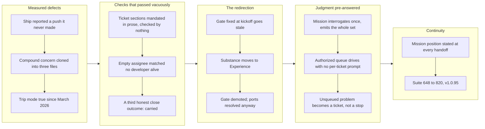

## 1. Overview

The branch opened as a batch of unrelated defect fixes and became a redirection of the mission model itself. It began by repairing four measured defects: /ship reported a successful push it could not back (the `2>&1` threw the diagnosis away), a triage-minted compound concern had no provenance and a caller-invented id that broke the round trip, trip-mode detection was a repo-wide find that made every branch since March report trip, and an unassigned mission was skipped for everybody because an equality test against an empty field matches no email alive. Mid-branch the developer ruled out the mission quality gate: a gate fixed at kickoff predicts work nobody has done yet and goes stale as the mission learns, while an agent keeps steering by it. The corpus agreed — every mission ever created left all three gate fields empty, and gate.sh could not resolve ports in the one layout the gate was meant to run in. The remainder implemented the new model: mission substance moved to `## Experience` with `gate_*` demoted to optional, /mission interrogates once and emits the whole drive-ready ticket set, a mission-authorized queue drives without the per-ticket prompt, an unqueued problem met mid-run becomes a ticket rather than a stop, and every handoff states where the mission stands. The suite grew from 648 to 820 passing, every script change watched failing first.

**Highlights:**

1. Reported whether the ship flow actually pushed — the push stays best-effort, but a push that never happened is no longer indistinguishable from one that succeeded
2. Derived a compound concern's id and provenance, closing the round trip that cloned one concern into three files
3. Scoped trip-mode detection to the branch, so a work-* branch stops reporting trip because a March 2026 trip dir exists
4. Enforced the mandatory ## Policies and ## Quality Gate sections at write time, against emptiness rather than only absence
5. Surfaced unassigned missions in /mission summary and the lens, marked [unclaimed -- yours to take]
6. Added `carried` as a third close outcome, so 'most of this landed, the rest is still worth doing' stops being recorded as a lie
7. Moved a mission's substance from gate_* to ## Experience — the demanded experience, behavior, or structure
8. Resolved mission gate ports from the main checkout via --git-common-dir, and split driveable/reason so an unaddressable gate stops looking fine
9. Made /mission interrogate direction, experience and the ticket plan, then emit the whole ordered drive-ready set
10. Skipped the per-ticket approval gate on a mission stamped drive_authorized: true, behind a script seam rather than prose
11. Made an unattended run mint a ticket for an unqueued problem instead of stopping or narrating it
12. Required a Mission Position Report at every handoff — /carry mentioned missions zero times before

## 2. Motivation

Two forces met on this branch. The first was a queue of measured defects, each of which had already bitten in production: a ship that reported a push it never made, a concern triage that cloned one concern into three, a mode detector that had been wrong on every branch for four months, a mission that was visible when listed and absent when summarized. What they shared was a failure mode this repo keeps paying for — a check that passes vacuously. The second force was the developer's redirection of the mission model. A quality gate declared at kickoff is a prediction about work nobody has done yet; it goes stale as the mission learns, but it stays in the file and an agent keeps steering by it. The evidence was already in the corpus and unread: the gate had been inert since it shipped, universally unfilled and structurally unrunnable, and nothing broke. What a mission should carry instead is the demanded experience plus a plan of tickets that reaches it — with the judgment pre-answered once, so the run does not stop through the night asking questions the developer already answered.

## 3. Changes

The branch started by fixing four defects that had each already bitten — a false push report, a cloned concern, a mode detector wrong since March, a mission invisible to summary — and found they shared one shape: a check that could pass without proving anything. Enforcing the ticket body sections and surfacing unassigned missions closed two more of that class. Then the developer redirected the model itself: the mission gate had been inert since it shipped, so a mission's substance moved to ## Experience and gate_* was demoted to optional. The rest followed from that redirection — /mission interrogates once and emits a complete drive-ready queue, that queue drives unattended without asking what was already answered, a problem met mid-run becomes a ticket rather than a stop, and every session boundary states where the mission stands. Each step moved a fact out of a session and into a structure that carries an obligation.

### 3-1. The ship flow's push can fail silently and still report success ([1fcce15d](https://github.com/qmu/workaholic/commit/1fcce15d))

Both pushing scripts ended in `git push >/dev/null 2>&1 || true` and printed `status:ok` whether or not the push ran — a failure indistinguishable from success, which bit on PR #86 where local `main` sat two commits ahead of the remote. The `|| true` is deliberate and stays; the defect was `2>&1` discarding the diagnosis, so the flow now reports `pushed` with a classified reason.

### 3-2. A triage-minted compound is not a first-class concern: no provenance, and the next ship clones it ([43c75292](https://github.com/qmu/workaholic/commit/43c75292))

A triage-minted compound was written with four empty `origin_*` keys and an id invented by the caller, so the next ship recomputed `slugify(title)`, missed, and cloned the compound alongside itself — one concern became three files. The id is now derived from the title by the same rule the extractor uses, and provenance is inherited from the earliest-seen member while `created_at`/`last_seen` record the triage act.

### 3-3. detect-context.sh calls every branch a trip once any trip has ever existed ([e81d561c](https://github.com/qmu/workaholic/commit/e81d561c))

`detect_mode()` decided `has_trips` with a repo-wide `find`, so a single March 2026 trip directory made every branch since report `trip` or `hybrid` — while the ticket half of the same function was already scoped per-user, with a comment explaining why. The predicate is now sourced from the only trip↔branch association the repo actually records, so a `work-*` branch reports `drive`.

### 3-4. Report unassigned active missions in the mission summary and lens ([b75b83c0](https://github.com/qmu/workaholic/commit/b75b83c0))

`summary.sh` gated on an exact `assignee == git config user.email` match, and an absent field yields `""`, which matches no email that could ever exist — so an unassigned mission was skipped for everybody, not just the caller, while `list.sh` showed it plainly. Both the summary and the lens now read "not somebody else's", surfacing unclaimed work as claimable after the developer's own.

### 3-5. /mission interrogates once, then emits the whole drive-ready ticket set ([3ead50ae](https://github.com/qmu/workaholic/commit/3ead50ae))

`/mission` produced an empty shell and asked nothing: all elicitation was one prose sentence with no question protocol and no stop condition, and the ticket set was whatever the developer happened to name. It now interrogates direction, the demanded experience, and the ticket plan in as many rounds as it takes, then emits the whole ordered set in one pass with each ticket's gate pre-answered.

### 3-6. Enforce the mandatory ## Quality Gate section in validate-ticket.sh ([e12448d4](https://github.com/qmu/workaholic/commit/e12448d4))

`create-ticket/SKILL.md` called `## Policies` and `## Quality Gate` mandatory and never-empty; `validate-ticket.sh` greped for no body section at all, and a ticket written that week reached the queue carrying neither. The hook now rejects a `todo/<user>/` ticket missing either section — or carrying either as an empty heading — while never retro-blocking history.

### 3-7. Drive a mission-authorized queue without the per-ticket approval prompt ([b9d893e6](https://github.com/qmu/workaholic/commit/b9d893e6))

With every judgement call answered at mission time, the per-ticket approval prompt asks a question the developer already answered about those exact tickets. A mission stamped `drive_authorized: true` now drives unprompted, decided by a resolver script rather than prose — which is what made the rule testable at all, and it is conservative: every mission a ticket claims must be stamped.

### 3-8. Close a mission by carrying its remainder into a successor mission ([a027cd1b](https://github.com/qmu/workaholic/commit/a027cd1b))

`achieved|abandoned` could not express the common verdict "most of this landed, the rest is still worth doing", forcing a record that contradicts a progress model whose whole claim is that progress is computed. `carried` archives the mission and hands its unmet criteria to a successor, with lineage recorded in both directions.

### 3-9. `gate.sh` can never resolve the ports of a mission living in its own worktree ([4899063d](https://github.com/qmu/workaholic/commit/4899063d))

`gate.sh` resolved the worktree ports with `--show-toplevel`, which inside a worktree returns the worktree — so the lookup became a path nothing creates and the ports came back empty for every mission in the prescribed layout, while `valid: true` still claimed the gate was fine. It now resolves from the main checkout and reports `driveable`/`reason`.

### 3-10. A mission describes the experience it demands, not a gate fixed at kickoff ([54e5ec65](https://github.com/qmu/workaholic/commit/54e5ec65))

A gate declared at kickoff predicts work nobody has done yet: it goes stale as the mission learns but stays in the file, and an agent keeps steering by it. A mission's substance moved to `## Experience` — the demanded behavior — and `gate_*` became optional and normally empty, which the record already supported: every mission ever created left all three fields blank.

### 3-11. A mission run takes the initiative: an unqueued problem becomes a ticket, not a stop ([2666cea9](https://github.com/qmu/workaholic/commit/2666cea9))

An unattended run that met a problem the queue did not cover could only stop or narrate it into a report — and a defect recorded in prose has, in practice, been discarded twice in this repo's history. Such a problem now becomes a ticket and the run continues, with fixing it opportunistically explicitly banned.

### 3-12. Every handoff states where the mission stands and what carries ([1d1bc5bb](https://github.com/qmu/workaholic/commit/1d1bc5bb))

`carry/SKILL.md` mentioned missions zero times, so the command whose purpose is answering "in another session, how much can we proceed?" handed over a task rather than a mission. Every handoff now states a Mission Position Report, and the resumption ticket carries the mission relation forward.

## 4. Outcome

This branch drove 12 tickets across two themes that converged: **making the ship and report flow tell the truth about what it did**, and **turning a mission from an empty shell into a durable, drive-ready unit of work**.

**Ship and report flow — three silent failures closed**

- **The ship flow now reports whether it actually pushed** ([1fcce15d](https://github.com/qmu/workaholic/commit/1fcce15d)). Both pushing scripts ended in `git push >/dev/null 2>&1 || true` and printed `status:ok` regardless; it bit on PR #86, where the push never ran and local `main` sat two commits ahead of `origin/main`. The `|| true` is deliberate and stays — the defect was the `2>&1` throwing the diagnosis away. `/ship` now surfaces `pushed:false` with a classified reason.
- **A triage-minted compound concern is now a first-class citizen** ([43c75292](https://github.com/qmu/workaholic/commit/43c75292)). `merge-concerns.sh` wrote four empty `origin_*` keys and no `created_at`/`first_seen`/`last_seen`, and its id was hand-invented by the caller — so the next `/ship` recomputed `slugify(title)`, missed, and cloned the compound alongside itself. A compound now derives its own id and inherits provenance from its earliest-seen member; `/report`'s triage passes `-` instead of inventing an id.
- **Trip mode detection is scoped to the branch** ([e81d561c](https://github.com/qmu/workaholic/commit/e81d561c)). `has_trips` was a repo-wide `find` for any trip directory, so this repo's single March 2026 trip dir made every branch since report `trip` or `hybrid`. A `work-*`/`drive-*` branch now reports `mode: drive`.
- **The mandatory ticket body sections are enforced** ([e12448d4](https://github.com/qmu/workaholic/commit/e12448d4)). `validate-ticket.sh` checked shape, location and frontmatter but greped for no body section at all, despite `create-ticket/SKILL.md` calling `## Policies` and `## Quality Gate` mandatory and never-empty. A `todo/<user>/` ticket missing either — or carrying either as an empty heading — is now rejected by name.

**Mission model — re-aimed from gates to experience, and made drive-ready**

- **`/mission` interrogates once, then emits the whole ordered ticket set** ([3ead50ae](https://github.com/qmu/workaholic/commit/3ead50ae)). Direction, demanded experience, and the ticket plan, in as many rounds as it takes — then every ticket, each carrying its pre-answered `## Policies` and `## Quality Gate`, stamped with the mission and ordered by `depends_on`.
- **A mission's substance moved from gate to experience** ([54e5ec65](https://github.com/qmu/workaholic/commit/54e5ec65)). `gate_type`/`gate_target`/`gate_assert` were declared at kickoff — a prediction about work nobody had done — and were measurably inert: every mission ever created left all three empty. Missions now carry `## Experience`; the gate fields are optional and normally empty.
- **An authorized queue drives without the per-ticket approval prompt** ([b9d893e6](https://github.com/qmu/workaholic/commit/b9d893e6)). A ticket belonging to a mission stamped `drive_authorized: true` is implemented, committed and archived unprompted; every other ticket asks exactly as before. The rule moved from prose in `drive/SKILL.md` into `drive-authorized.sh`, where a test can reach it.
- **A mission run mints a ticket for an unqueued problem instead of stopping** ([2666cea9](https://github.com/qmu/workaholic/commit/2666cea9)). The minted ticket lands in `todo/<user>/` with its own Policies and Quality Gate, inherits the provoking ticket's mission relation, and is named in the batch report.
- **`/mission close` gained a third outcome: `carried`** ([a027cd1b](https://github.com/qmu/workaholic/commit/a027cd1b)). `achieved|abandoned` could not express "most of this landed, the rest is still worth doing", so it forced a false record. `carried` archives the mission and creates (or folds into) a successor inheriting the unmet acceptance criteria verbatim, with `carried_from` lineage recorded both ways.
- **Unassigned active missions are visible again** ([b75b83c0](https://github.com/qmu/workaholic/commit/b75b83c0)). `summary.sh` gated on an exact `assignee == user.email` match, and an empty assignee matches no email that could ever exist — so an unassigned mission was skipped for *everybody*, in both `/mission summary` and the lens. They now surface marked `[unclaimed -- yours to take]`.
- **`gate.sh` resolves mission worktree ports correctly** ([4899063d](https://github.com/qmu/workaholic/commit/4899063d)). It used `--show-toplevel` ("where am I"), which inside a worktree is the worktree — so the lookup became a path nothing creates and ports came back empty for every mission in the prescribed layout, while still reporting `valid: true`. It now emits `driveable` and `reason`.
- **Every handoff states where the mission stands** ([1d1bc5bb](https://github.com/qmu/workaholic/commit/1d1bc5bb)). `carry/SKILL.md` mentioned missions zero times — the command whose purpose is answering "in another session, how much can we proceed with the mission?" had no mission dimension. `/carry` now emits a Mission Position Report for every mission the in-flight work advances.

**Metrics**

- Test suite: **648 → 820 passing, 0 failed** (+172 assertions across 11 substantive commits).
- Every script change was watched fail-first against the real script before the fix; `posix-lint`, `verify.mjs` and `validate-metadata.mjs` green throughout; `outputs/` rebuilt and reproducing byte-for-byte.
- One active deferred concern resolved: `quality-gate-is-prose-mandated-not`, whose How to Fix asked verbatim for "a body-section grep to `validate-ticket.sh` plus a smoke test" — delivered by [e12448d4](https://github.com/qmu/workaholic/commit/e12448d4).

## 5. Historical Analysis

None of this branch's tickets carried a `## Related History` section, but every one of them opened its `## Motivation` by citing the record — archived tickets, prior PRs, prior stories, and the concern corpus. The history is dense, and four patterns run through it.

**Every defect on this branch was already written down somewhere before it bit.** This is the branch's defining historical fact. `e81d561c`'s trip-detection defect "was recorded verbatim in story `work-20260713-144839.md` line 124 and shipped anyway, because a story observation carries no obligation — no ticket, no concern, so it resurfaced two days later." The mission gate's uselessness was "already in the corpus, unread: every mission ever created left all three fields empty" — and `4899063d` and `54e5ec65` had each independently recorded *half* of that finding without either drawing the conclusion. The `quality-gate-is-prose-mandated-not` gap sat as a moderate active concern while a section-less ticket passed every gate. The corpus was right and inert. Three tickets on this branch ([2666cea9](https://github.com/qmu/workaholic/commit/2666cea9), [d637091a](https://github.com/qmu/workaholic/commit/d637091a), [1d1bc5bb](https://github.com/qmu/workaholic/commit/1d1bc5bb)) are direct structural responses to that: move the fact into a structure that carries an obligation.

**A default on the sanctioned path never constrains the other paths.** This recurred verbatim across two independent tickets and is the branch's sharpest reusable finding. `create.sh`'s self-assignment default was a real fix that could not close the unassigned-mission gap, "because it is not the only writer — one real mission was hand-authored two days after that default shipped and still arrived unassigned" ([b75b83c0](https://github.com/qmu/workaholic/commit/b75b83c0)). `3ead50ae` hit the same shape and named it: the interrogation closes the 0/0 mission gap only *partially*, since "a hand-authored `mission.md` that bypasses `/mission` still arrives at 0/0" — "that residue is the same shape as the unassigned-mission gap fixed earlier today." The historical lesson: when a fix is a default on a writer, ask what the *other* writers do before calling the class closed.

**"Resolved" on a class-level concern has repeatedly meant "one member fixed."** `e81d561c` found that the archived concern `30-the-detect-context-sh-change-introduces` "flagged exactly this class and was marked resolved, but only the ticket half was ever fixed." The asymmetry then sat inside a single function for months: one predicate scoped to `USER_SLUG` with a comment explaining why, its neighbour repo-wide. This directly informs how the deferred-concern corpus should be closed — a class-level concern's closure deserves a check that every member was addressed, not just the one that provoked the ticket.

**The identity model for concerns has been rebuilt three times, and each rebuild left a door open.** PR #83 was built to kill the carried-from chain; PR #86 measured a compound re-entering that exact chain "through the triage door" ([43c75292](https://github.com/qmu/workaholic/commit/43c75292)). The `deferred-concern-severity-has-no-re` concern carries a `**Correction (2026-07-16)**` on its own record, where an earlier dismissal ("a data defect from before identity collapse") was falsified by `compound: true` — a field only `merge-concerns.sh` writes, proving the file *postdated* the collapse and was produced by the triage itself. The corpus is now good enough to falsify claims made about it, which is new.

**How this shaped the implementation.** Because the record kept being right and ignored, this branch consistently chose *structure over prose*: the approval rule moved into `drive-authorized.sh` because "a rule that decides whether to ask a human for permission belongs behind a script"; the mandatory sections moved into `validate-ticket.sh`; the compound id moved from the caller's invention into the script that mints it. Where a feature genuinely could not be scripted (the interrogation, the Mission Position Report, the mid-run minting threshold), the tickets pinned the prose by regex against the skill and *said so explicitly* rather than implying hermetic coverage — an honest ceiling that is itself a historical correction to earlier branches' overclaiming.

## 6. Concerns

### (carried from PR #84) A mission can carry no machine-checkable bar at all, and may now drive unattended

- **Severity:** moderate
- **Description:** A compound risk this branch's own composition created. Three scaffolds are empty-by-default at creation and nothing requires any of them to be filled before a mission drives itself: `create.sh` still writes `## Acceptance` as a bare HTML comment, so a mission is born 0/0 (`plugins/workaholic/skills/mission/scripts/create.sh:85`); [54e5ec65](https://github.com/qmu/workaholic/commit/54e5ec65) demoted `gate_type`/`gate_target`/`gate_assert` to optional-and-normally-empty, and `gate.sh` remains declaration-and-ports only with the server start and Playwright drive outside the hermetic suite; and `## Experience`, which 54e5ec65 made the mission's substance, is itself a comment-only scaffold. So a mission can legitimately exist with no gate, no Experience and no Acceptance: nothing to run, nothing to read, 0/0. [b9d893e6](https://github.com/qmu/workaholic/commit/b9d893e6) then lets exactly that mission be stamped `drive_authorized: true`, after which `drive/SKILL.md` does not issue the Step 2.2 prompt at all — while its own text concedes the gate "becomes the only bar the agent holds itself to" unattended. That is the bar which can be absent in all three places. The Creation Interrogation ([3ead50ae](https://github.com/qmu/workaholic/commit/3ead50ae)) is mandatory and is supposed to fill Experience and Acceptance, and `commands/mission.md` forbids stamping a partial interrogation — but both are **prose, not machine-checked**, so nothing detects a stamped-but-empty mission. Each piece is defensible on its own; the set has no floor.
- **How to Fix:** Give the authorization a machine-checked floor rather than a prose rule: have `mission/scripts/drive-authorized.sh` refuse to authorize a mission whose `## Acceptance` is empty (`progress.sh` already computes total; total==0 means the plan does not exist), and consider requiring a non-comment `## Experience`. That puts the check where the decision is made and where a test can reach it — the same argument that made the resolver a script rather than prose in the first place. Alternatively require `create.sh` to scaffold a first acceptance criterion, which is what `missions-are-born-matching-the-lens` asked for.

### (carried from PR #59) Closing the default commit path routes every commit through a byte-based length cap

- **Severity:** moderate
- **Description:** A sequencing trap: these two are safe only because they are currently disconnected, and the prescribed fix for the first is what connects them. `the-commit-subject-rule-binds-on` records that `commit.sh` — the script `/commit` and `archive.sh` both route through — never calls `check-subject.sh`, so the sanctioned path is unguarded; its fix is "call `check-subject.sh` at the top of `commit.sh` and fail non-zero. One line." `50-char-cap-is-byte-based` records that `check-subject.sh` measures with `wc -m`, which counts **bytes** under a C/POSIX locale, so a multibyte subject false-trips at up to 3x its true character length. Apply the one-liner exactly as written and every sanctioned commit — including every `/drive` archive — starts flowing through that cap: under a non-UTF-8 locale a Japanese subject over roughly 17 characters is rejected on the default path, in a repository whose developer writes Japanese. Today the byte bug is contained to the guard surface, which is why it has sat at low for weeks; the fix for its neighbour is what would make it bite. The dependency **is** the finding: the locale pin is a prerequisite of the `commit.sh` call, not an independent cleanup, and nothing in either file records that ordering.
- **How to Fix:** Pin the locale in `check-subject.sh` **first** (measure characters, not bytes — e.g. export `LC_ALL` to a UTF-8 locale for the measurement, or count with a tool that is not locale-dependent), with a multibyte-subject test that fails under C/POSIX before the fix. Only then add the one-line `check-subject.sh` call at the top of `commit.sh`. Record the ordering in both files so the "one line" fix is never applied on its own.

### (carried from PR #86) A PreToolUse hook cannot know its caller, so per-skill exceptions are unimplementable

- **Severity:** low
- **Description:** The confinement guard blocked `/explain`'s export the day it landed, and neither ticket mentioned the other ([ef80cd64](https://github.com/qmu/workaholic/commit/ef80cd64)). No exception was possible: a `PreToolUse` hook sees only `tool_input.file_path`, so an `.html` bound for Home is indistinguishable from any other write there. The staging file moved rather than the gate widening, because this hook is currently the only *hook* refusing a Write to `/etc` or `~/.claude` — system-safety is prose, not a gate.
- **How to Fix:** Remember the constraint: the choice is to move the write or widen the gate for everyone. The characterization test `confine blocks a non-repo path outside the repo (export dir)` pins it deliberately.

### (carried from PR #69) Best-effort fetch adds a per-run network round-trip to /catch

- **Severity:** moderate
- **Description:** `scan-window.sh` now runs `git fetch --all` on every `/catch` invocation, adding a network round-trip and measurable latency on large remotes; it is `--quiet` and best-effort, but the cost is paid on every report run (see [ad4ea8d](https://github.com/qmu/workaholic/commit/ad4ea8d) in `plugins/workaholic/skills/catch/scripts/scan-window.sh`; ticket Considerations "Performance").
- **How to Fix:** Consider a bounded fetch timeout or an opt-out flag for large remotes so a slow or unresponsive remote cannot stall the report.

### (carried from PR #63) Branch-guard tokenizer lacks shell-quoting awareness

- **Severity:** moderate
- **Description:** The guard scans the entire command string and cannot tell a real command from text inside an `echo`/quoted argument, so the literal phrase `git branch <word>` inside `echo "…"` still trips it (see [5ed322f](https://github.com/qmu/workaholic/commit/5ed322f) in `plugins/workaholic/hooks/guard-git-branch.sh`). This is inherent to the whitespace tokenizer, which deliberately avoids a full shell parser.
- **How to Fix:** Agents should avoid embedding `git branch <word>` in echo/log strings; this is guidance, not a code change.

### (carried from PR #67) Browser MCP is session-provided and not guaranteed

- **Severity:** moderate
- **Description:** `/explain` depends on the Playwright plugin or Chrome DevTools MCP (the plugin declares no `.mcp.json`), which may be absent; the capability check is model-level (not shell-scriptable) and degradation saves the HTML but halts the PDF (see [2e5ef4f](https://github.com/qmu/workaholic/commit/2e5ef4f) in `plugins/workaholic/skills/explain/SKILL.md`).
- **How to Fix:** Keep the no-MCP halt message actionable, naming the two MCPs to enable; document them in `/explain` help.

### (carried from PR #60) By-developer axis joins on commit email + ticket-author frontmatter

- **Severity:** moderate
- **Description:** `scan-window.sh` builds its per-developer roster from `todo`, `archive` and `icebox`, but not `abandoned` — which `/drive` actively writes to, and which holds two real tickets today, invisible to `/catch` and attributable to nobody (see `plugins/workaholic/skills/catch/scripts/scan-window.sh`).
- **How to Fix:** Add `abandoned` to the TDIRS loop plus the scope/case mapping.

### (carried from PR #69) /catch deployment attribution is approximate

- **Severity:** moderate
- **Description:** Stories and release notes carry no author, so a deployment is attributed to the git author of the commit that last touched the story (see `plugins/workaholic/skills/catch/scripts/scan-window.sh`).
- **How to Fix:** Have `/ship`'s `record-evidence.sh` stamp an explicit author into the Deployment Evidence block so the join reads a recorded author instead of inferring one.

### (carried from PR #77) Codex hook runtime behavior remains unproven

- **Severity:** moderate
- **Description:** PR #77 fixes the Codex parse failure for `hooks/hooks.json`, but it does not prove what Codex will do with Claude-only hook entries that reference `${CLAUDE_PLUGIN_ROOT}` and Claude event names after parsing succeeds (see [6e69651](https://github.com/qmu/workaholic/commit/6e69651) in `plugins/workaholic/hooks/hooks.json`).
- **How to Fix:** During ship verification, re-add or refresh the workaholic Codex plugin cache and confirm Codex loads the plugin cleanly; if Codex then attempts to run Claude-only hooks, split or isolate Codex-visible hook config in a follow-up.

### (carried from PR #58) collect-commits body emission is a load-bearing, easily-severed link

- **Severity:** moderate
- **Description:** The commit Concerns/Insights → section-reviewer wiring assumes `collect-commits.sh` emits the body and that the report orchestrator passes the commit bodies to that worker (see [24e5b37](https://github.com/qmu/workaholic/commit/24e5b37) in `plugins/workaholic/skills/report/scripts/collect-commits.sh`). The script silently dropped the body once already; if it regresses, the new keys stop reaching `/report` with no error.
- **How to Fix:** Keep the `collect-commits` body-emission smoke test green, and keep the commit-bodies input wired to the section-reviewer when editing report Phase 2.

### (carried from PR #60) Collectors sample branch stories by title match; very large dirs may need indexing

- **Severity:** moderate
- **Description:** The per-developer collectors read branch stories by sampling on title/theme match rather than reading all of them (the live repo already has ~50). A very large `stories/` directory could exceed the practical sampling window and miss a relevant story (`plugins/workaholic/skills/catch/SKILL.md`, Collect Developer step 3).
- **How to Fix:** If `stories/` grows past ~100 files, add a per-developer story index or a `stories/<developer-slug>/` partition.

### (carried from PR #59) commit.sh silently drops a --category placed after its positional args

- **Severity:** low
- **Description:** `commit.sh` parses option flags (`--category`, `--skip-staging`) only at the front of its argument list — the parse loop breaks on the first non-flag token, so a `--category` placed after the six positional args is silently consumed as a `[files...]` entry and the `Category:` trailer goes missing with no error (see [a62d99c](https://github.com/qmu/workaholic/commit/a62d99c) in `plugins/workaholic/skills/commit/scripts/commit.sh`). The missing trailer is invisible to `verify.mjs`; only a temp-repo dry-run surfaces it.
- **How to Fix:** Always pass flags before the positional `title why changes concerns insights verify` args (the `/commit` doc now states this), and consider making `commit.sh` error on an unrecognized trailing `--flag` instead of treating it as a file path.

### (carried from PR #86) Confinement's guarded surface is Write/Edit only; Bash and MCP cross freely

- **Severity:** moderate
- **Description:** `guard-repo-confinement.sh` is a `PreToolUse(Write|Edit)` hook, so a Bash redirect crosses a repository boundary freely (it is how `file-request.sh` itself writes), and MCP writes are likewise unseen — which is what keeps `/explain`'s browser-printed PDF working ([ef80cd64](https://github.com/qmu/workaholic/commit/ef80cd64)). The threat model is deliberate, but `rules/general.md` still reads "never target a path outside `git rev-parse --show-toplevel`", describing the Write surface as if it were universal. Re-observed while generating this very report: the guard refused a `Write` to the session scratchpad and a Bash heredoc to the identical path succeeded unremarked.
- **How to Fix:** State the asymmetry in `rules/general.md` and the hook header — the guard covers Write/Edit, the rule covers intent, neither claims Bash or MCP. Do **not** grow the hook toward content matching.

### (carried from PR #86) Deferred-concern severity has no re-grade mutator

- **Severity:** low
- **Description:** `merge-concerns.sh` escalates severity only when forming a compound and `close-concern.sh` archives; nothing edits severity in place, so PR #86's urgent → moderate re-grade had to be a hand edit against the README's never-hand-edit rule ([9d81dd3a](https://github.com/qmu/workaholic/commit/9d81dd3a)). This concern also carries a self-correction on its own record: an earlier dismissal of a provenance-less compound as "a data defect from before identity collapse" was falsified by `compound: true` — a field only `merge-concerns.sh` writes — proving the file postdated the collapse and was produced by the triage itself. Fixed at source on this branch by [43c75292](https://github.com/qmu/workaholic/commit/43c75292); the two archived files remain as historical evidence and are not back-filled.
- **How to Fix:** Add a `re-grade` mutator that rewrites `severity` in place and appends the rationale, so a re-grade is a scripted, staged change like every other concern mutation.

### (carried from PR #84) ensure-worktree.sh lacks the `.git/info/exclude` embedding guard

- **Severity:** moderate
- **Description:** The mission-worktree path writes `.git/info/exclude` to stop `git add -A` embedding a linked worktree as a gitlink; `ensure-worktree.sh` (trip/drive worktrees) has the same latent risk and no guard (see `plugins/workaholic/skills/branching/scripts/ensure-worktree.sh`).
- **How to Fix:** Port the exclude block from `create-mission-worktree.sh`; rebuild `outputs/` since branching scripts are bundled.

### (carried from PR #82) Hermetic tests prove migration, not local use (repo has no missions)

- **Severity:** moderate
- **Description:** `.workaholic/missions/` does not exist in this repo, so the living layout migration is exercised only by throwaway fixtures — confirmed again this branch, where all 12 tickets carry an empty `mission:` (see `scripts/test-workflow-scripts.mjs`). This bit directly on [b75b83c0](https://github.com/qmu/workaholic/commit/b75b83c0), whose gate step 4 asked for a real-repository check and could not run one.
- **How to Fix:** Close only once the mission scripts have run on a real consumer repo that adopted the flat layout.

### (carried from PR #83) list-active-deferred-concerns.sh can emit transiently-invalid JSON during the first large migration

- **Severity:** moderate
- **Description:** The local first-collapse trigger is spent (the migration landed in `f8203d0e`; the script emits valid JSON today), but the structural cause is unfixed: per-field shell string-assembly with an unescaped `origin_pr` interpolation, and it ships to consumer repos via `outputs/workflows/`, where a first collapse re-enters the same path.
- **How to Fix:** Build the array in a single Python pass; add a hermetic test over a large unmigrated fixture.

### (carried from PR #58) POSIX lint runner half is weak where /bin/sh is bash

- **Severity:** low
- **Description:** The dash/sh test runner only catches bashisms on an image where `/bin/sh` is dash/ash; on a host where `sh` is bash it is weak (see [c7c73d7](https://github.com/qmu/workaholic/commit/c7c73d7) in `scripts/test-workflow-scripts.mjs`). The grep-based `posix-lint.sh` is shell-independent and catches drift everywhere, so the gate is not blind, but the runner half should not be relied on alone.
- **How to Fix:** Prefer a dash/Alpine CI runner so both halves of the gate bite.

### (carried from PR #86) record-evidence.sh does not share secret-patterns.sh, contrary to three documents

- **Severity:** moderate
- **Description:** `ship/record-evidence.sh` keeps an inline copy of the credential regexes rather than sourcing `release-scan/scripts/lib/secret-patterns.sh` — despite that file's header, the inverting ticket's step 5, and CLAUDE.md all asserting a sharing relationship that never existed. Measured drift: the evidence guard misses all five suffixed-keyword shapes the scanner has caught since [84d238d9](https://github.com/qmu/workaholic/commit/84d238d9), and refuses 17 of the 25 reference shapes the scanner now subtracts (see [e3366bfd](https://github.com/qmu/workaholic/commit/e3366bfd) in `plugins/workaholic/skills/ship/scripts/record-evidence.sh`). All three documents are now corrected.
- **How to Fix:** Share the **key group and pass 1 only** — do not unify. The two guards read different material and want opposite bars: the scanner reads code, where a reference is ordinary and a false positive hard-blocks `/ship`; `record-evidence.sh` reads free-text deploy evidence entering a public story, where a false positive costs a rephrase and a false negative publishes a credential. Pass 2's value judgment is code-shaped and would weaken it.

### (carried from PR #84) report step-1 wording predates the tiered scan severities

- **Severity:** low
- **Description:** `report/SKILL.md` still says "if `verdict` is `block` … force `releasable: false`", keyed off the binary verdict, so a lone override-tier size finding forces not-releasable. `release-scan/SKILL.md` asserts the same un-tiered behavior, so a fix must reconcile both.
- **How to Fix:** Key the wording off severity: hard/confirm force `releasable: false`; override warns and records.

### (carried from PR #86) /request is a sanctioned egress path from private context toward public repos

- **Severity:** moderate
- **Description:** `/request` ([a15e7db8](https://github.com/qmu/workaholic/commit/a15e7db8)) carries content from private context toward potentially public repositories — the exact hazard the originating incident was made of. It is justified only by being narrow, explicit, and confirmed. The measured position is deliberate and stark: all four real leaked sentences file through `file-request.sh` **without complaint**, because none names this repo. The script's checks are mechanics, not assurance.
- **How to Fix:** Keep the verbatim-body confirmation non-skippable and treat any erosion as a design regression. The test asserting the four real leaks pass is a green-to-red tripwire: if it flips, the confirmation has been quietly demoted.

### (carried from PR #67) Resumption tickets must list remaining-only steps

- **Severity:** moderate
- **Description:** The remaining-only rule is prose in four places in `carry/SKILL.md`; `carry-checkpoint.sh` never inspects the ticket body and `validate-ticket.sh` checks frontmatter and location only, so nothing enforces it. Re-graded urgent → moderate during PR #86's triage ([9d81dd3a](https://github.com/qmu/workaholic/commit/9d81dd3a)): the first real resumption ticket to reach a drive — `20260715181934-invert-secret-pass2-to-match-values.md` — follows the rule cleanly and even declared its own origin superseded, and `/drive`'s approval gate sits downstream. Note that [b9d893e6](https://github.com/qmu/workaholic/commit/b9d893e6) has now removed that downstream gate for a mission-authorized queue, so the mitigation the re-grade leaned on no longer holds universally.
- **How to Fix:** Add a body-section lint. Re-grade to urgent only if a resumption ticket is observed re-listing done steps — and reconsider the re-grade's reasoning now that an authorized queue drives unprompted.

### (carried from PR #86) scan-allow's predicted growth has come due

- **Severity:** moderate
- **Description:** Writing about the `secret` gate trips the gate, and `.workaholic/scan-allow` warned at four entries that the answer would be a filename convention. The fifth entry came due the same day, verified to be needed (the inversion ticket's 40-row table trips the scanner without it). The failure mode is quiet: a scanner ticket that forgets its line blocks its own merge later, on a tier with no bypass.
- **How to Fix:** Adopt the convention the file names — a fixed filename prefix for scanner tickets, exempted as a pattern. Keep it prefix-scoped rather than widening to `tickets/**`: a ticket can legitimately carry a pasted credential.

### (carried from PR #86) secret exclusions are line-granular, so a real key can hide beside an excluded form

- **Severity:** low
- **Description:** Pass 2's subtractions drop the whole line (`grep -v`), so a real secret sharing a line with an excluded form is suppressed. Pre-existing and unchanged by the inversion. The file's header claims each exclusion binds to its own key so a neighbouring secret cannot be suppressed; that claim is aspirational and does not hold. Pass 1 is unaffected — it matches unconditionally, which is what keeps `k = process.env.X; // ghp_…` caught.
- **How to Fix:** Correct the header to describe line-granular behavior (honest today), or move pass 2 to match-granular scanning (the real fix, worth its own ticket).

### (carried from PR #86) The `key: bareword` ambiguity is irreducible and its resolution has already flipped twice

- **Severity:** moderate
- **Description:** `apiKey: string` and `password: mysecret123` are the same shape and the line carries nothing separating them; matching on the value does not help, since both values are bare words, and `grep -Ei` closes off the uppercase heuristic. Not theoretical: [c245361e](https://github.com/qmu/workaholic/commit/c245361e) resolved it toward "type" and silently stopped flagging three real credential shapes; [1fd4ef63](https://github.com/qmu/workaholic/commit/1fd4ef63) resolved it back. A bounded primitive list therefore survives the inversion, contrary to the origin ticket's claim — and it is load-bearing, since `readonly apiKey: string` is real TypeScript that would otherwise hard-block.
- **How to Fix:** Keep erring toward flagging and keep the reasoning in the file so the list is not "simplified" away. Two open questions are cheaper together: whether `_SP_KEY` needs a left word boundary (`htmlToken` matches `token` today), and whether a case-sensitive stage is worth splitting out.

### (carried from PR #83) Triage threshold and compound detection are prose-driven, not enforced

- **Severity:** low
- **Description:** The count threshold (20) and the compound trigger live in `report/SKILL.md` prose; `list-active-deferred-concerns.sh` emits neither an active count nor a `should_triage` flag, so the gate is skippable. It fired on PR #83's branch only because a human ran the triage — and it fired again on this branch the same way, with 29 active concerns well past the threshold.
- **How to Fix:** Emit an envelope with `active_count` and `should_triage` so `/report` branches mechanically.

### (carried from PR #54) Trip unification is unproven by a live `/trip` run

- **Severity:** moderate
- **Description:** The entire `/trip`-unification protocol change is validated only by `build.mjs`/`verify.mjs`/`validate-metadata.mjs`/`test-workflow-scripts.mjs` and prose review — the smoke tests exercise the bundled shell scripts (reused, not changed), not the skill/agent markdown. The new Decomposition gate, the per-ticket Coding loop, and the context-aware queue-execute routing have **not** been exercised end-to-end by a real `/trip` (`plugins/workaholic/skills/trip-protocol/SKILL.md`). A live run could surface gate-sequencing, archiving, or routing gaps the static checks cannot catch.
- **How to Fix:** Run a real end-to-end `/trip` — both a design-first trip (validate the Decomposition gate emits well-formed tickets and the per-ticket loop archives each) and a queue-execute trip (validate routing skips Planning/Decomposition and drives a pre-populated queue) — before relying on the new flow.

### (carried from PR #56) Two enforcement layers encode one rule (drift risk)

- **Severity:** moderate
- **Description:** The canonical-path rule now lives in both `validate-ticket.sh` (bash, PostToolUse) and `guard-ticket-structure.sh` (POSIX sh, PreToolUse). Future edits must change both or they will disagree.
- **How to Fix:** Keep the path-shape rules equivalent; consider extracting a shared helper if a third consumer appears.

### (carried from PR #86) validate-ticket.sh never validates the mission relation

- **Severity:** low
- **Description:** `validate-ticket.sh` has zero `mission` references, so both a typo'd slug and a bare `mission:` pass. The relation now carries more weight: `/drive` reads every named mission's quality gate, so a mistyped slug silently drops a gate rather than erroring ([83b88ff6](https://github.com/qmu/workaholic/commit/83b88ff6)). This branch raised the stakes further — [b9d893e6](https://github.com/qmu/workaholic/commit/b9d893e6) keys the approval-prompt skip off the same unvalidated relation, so a typo'd slug now reads as `mission_not_found` and the ticket falls back to prompting, but the inverse (a slug resolving to the wrong mission) would silently borrow that mission's authorization.
- **How to Fix:** Resolve each slug against `.workaholic/missions/active/<slug>/mission.md` and fail on an unresolvable one.

### The approval-free drive is unproven end-to-end and the suite structurally cannot prove it

- **Severity:** moderate
- **Description:** [b9d893e6](https://github.com/qmu/workaholic/commit/b9d893e6)'s criterion 7 — the live end-to-end run — was **not performed**, and its Final Report records this explicitly rather than glossing it. The gate asks for a real `/mission` followed by a `/drive` of its queue observing zero prompts, which needs a model-driven session against a real mission worktree; this drive ran under a different authorization (`/goal`), so a run here would demonstrate the goal's authorization rather than the stamp's. Criteria 1-6 are green and the script seam (`mission/scripts/drive-authorized.sh`) is well covered — authorized/no_mission/not_authorized/mission_not_found, the conservative two-mission row, bare-vs-list relation equivalence — but the suite never runs a model, so the thing that was actually shipped (a `/drive` that stops asking) has never been observed. The same hole applies to [2666cea9](https://github.com/qmu/workaholic/commit/2666cea9): no script decides "is this problem in scope?" — a model does, and its live row is likewise uncovered. These are the two most behavior-changing features on the branch and they share one unproven seam.
- **How to Fix:** Run a real `/mission` interrogation followed by a `/drive` of its queue in a mission worktree, observing zero Step 2.2 prompts and confirming a mid-run out-of-scope problem produces a ticket rather than a stop or a narrated paragraph. Do this before relying on either flow unattended, and record the run as the evidence criterion 7 asks for. Do not close either ticket's gate on the hermetic suite alone — its inability to run a model is structural, not a coverage gap to be filled.

### The mission gate is demoted, not deleted, and is now maintained-but-uncalled

- **Severity:** moderate
- **Description:** [54e5ec65](https://github.com/qmu/workaholic/commit/54e5ec65) made `gate_type`/`gate_target`/`gate_assert` optional and normally empty on the measured grounds that they were already universally unfilled and structurally unrunnable. But `gate.sh` and the carried-inheritance path still read them, and [4899063d](https://github.com/qmu/workaholic/commit/4899063d) — driven three hours earlier in the same queue — just *fixed* the worktree port resolution those fields feed. Its own Final Report names the trap: "this fixes a reader for fields 54e5ec65 just demoted to optional: if `gate_*` stays universally empty over the next few missions, the honest follow-up is to delete the fields and this script rather than maintain a working reader nobody calls." So the branch now carries a correct, tested reader for data that the same branch decided should normally not exist. `## Experience`, which replaced the gate as the mission's substance, is prose and loses the gate's one real virtue — objectivity — which survives only as a convention the SKILL states rather than checks.
- **How to Fix:** Set a review point (e.g. after the next three real missions) and check whether any filled `gate_*`. If none did, delete the fields, `gate.sh`, and the carried-inheritance read outright rather than maintaining them — a mechanism nobody uses is not free just because it works. If some did, the demotion was wrong and the fields deserve their objectivity back. Decide on measurement, which is exactly how the demotion itself was justified.

### The trip↔branch association does not exist, so a work-* branch can never report trip

- **Severity:** moderate
- **Description:** [e81d561c](https://github.com/qmu/workaholic/commit/e81d561c) fixed the mis-detection by narrowing `has_trips` to the legacy `trip/<name>` association only (`detect-context.sh:47-52`, via `branch_trip_dir`). That is correct for the defect it targeted, but it leaves the trip path **inoperative end-to-end for modern branches, not merely mis-detected**: `detect-context.sh` emits `trip_name` only for `trip/*` branches (`detect-context.sh:93`), so `report/SKILL.md`'s Trip Mode step 3 cannot resolve `<trip-name>` on a `work-*` branch either. The gate row "a branch with its own trip dir → trip" now holds only for legacy `trip/*` branches. Two candidate associations were costed and rejected as too big for a bugfix: a git-history test (untracked, or introduced by `main..HEAD`), and stamping `branch:` into `plan.md` (which breaks when a trip is resumed on another branch).
- **How to Fix:** Define the trip↔branch association as its own decision, and answer `has_trips` **and** `trip_name` together — fixing either alone leaves the other silently wrong, which is the precise failure this concern exists to prevent. Until then, treat `mode: trip` as reachable only from a `trip/*` branch and do not add trip-mode behavior that a `work-*` branch is expected to trigger.

### The compound-id slug collision is real, measured, and inherited

- **Severity:** moderate
- **Description:** [43c75292](https://github.com/qmu/workaholic/commit/43c75292) closed the compound round trip by deriving the id from `slugify(title)` instead of letting the caller invent one. The 6-word/60-char truncation collision this introduces was **measured, not argued**: two unrelated compounds sharing their first six words derive one id and the second silently folds into the first. This is a property of the shared slugify scheme that `extract-deferred-concerns.sh` already had — deriving the compound id inherits the risk rather than introducing it, trading an always-broken round trip for a rare title collision, which is the right trade. It is live on this very branch: `a-mission-can-carry-no-machine` and `closing-the-default-commit-path-routes` are both six-word truncations, and any future compound opening with the same six words would silently merge into them. Separately, `slugify` is now duplicated a **third** time by deliberate decision (the cross-skill closure cost was measured as real); the three copies are pinned to agree only by `testSlugifyWritersAgree`, making that test load-bearing.
- **How to Fix:** Give the collision its own ticket. The cheapest honest fix is a short hash suffix on the truncated slug (preserving readability while restoring uniqueness); the alternative is detecting a collision at mint time and refusing rather than folding. Do not "simplify" the three slugify copies into one without re-measuring the closure cost — and never delete `testSlugifyWritersAgree`, which is the only thing keeping them in agreement.

### commit-release-note.sh's push failure is the more expensive one and had no test at all

- **Severity:** moderate
- **Description:** [1fcce15d](https://github.com/qmu/workaholic/commit/1fcce15d) surfaced the push outcome for both pushing scripts, but the two failures are not equally costly and only one had ever been tested. If `commit-release-note.sh`'s push fails, its note is committed locally but is **not** on the branch the PR merges — so the release ships without its note, silently. `extract-deferred-concerns.sh`'s failure merely diverges local `main`. The mitigation added is prose: `ship/SKILL.md` now says to push before merging on `pushed:false`. That is a rule an agent must read and obey, on a path where the previous rule ("the push prevents a one-commit-ahead divergence", in the script's own header) was already being silently violated.
- **How to Fix:** Consider making `commit-release-note.sh`'s push failure a hard stop *before the merge* rather than a reported best-effort — unlike the post-merge case, nothing has landed yet, so aborting is cheap and the `|| true` reasoning (the merge already happened; do not abort) does not apply. At minimum, keep the five measured push cases green and add one asserting the release-note branch state after a failed push.

### validate-ticket.sh is a PostToolUse review, not a guard, and blocks mid-authoring

- **Severity:** moderate
- **Description:** [e12448d4](https://github.com/qmu/workaholic/commit/e12448d4) enforces `## Policies` and `## Quality Gate`, but the hook is **PostToolUse** — it rejects loudly, it cannot stop the file existing. It therefore also **blocks mid-authoring for any hand-authored ticket**, a real cost the developer accepted deliberately on the reasoning that `create-ticket` writes a complete ticket in one Write. That reasoning is demonstrably incomplete: the same session's verification rejected an untracked ticket stamped 02:10 that day, written outside the session, carrying the identical section-less shape — so the sanctioned path is provably not the only one. This is the same "a default on the sanctioned path does not constrain the other paths" shape that [b75b83c0](https://github.com/qmu/workaholic/commit/b75b83c0) and [3ead50ae](https://github.com/qmu/workaholic/commit/3ead50ae) each hit independently.
- **How to Fix:** Live with the PostToolUse position (a PreToolUse hook cannot see body content that Write is about to create any more usefully) but watch for hand-authoring friction; if it bites, the answer is a `--draft` location that is not retro-checked, not a weaker check. Critically, the check must **not** grow toward judging gate *quality* — that is semantic and belongs to the interrogation and the developer, a lesson this repo already paid for with the deleted internal-hostname leak pattern. The deferred question this raises: an unattended drive may want to check the gate *before starting*, rather than trusting that a write-time review was never bypassed.

### Mid-run ticket minting's failure mode is over-minting, and the threshold is prose

- **Severity:** moderate
- **Description:** [2666cea9](https://github.com/qmu/workaholic/commit/2666cea9) lets an unattended run write a ticket for an out-of-scope problem and continue. The failure mode is over-minting: a queue of auto-written tickets nobody asked for looks like a plan and is worse than a report paragraph. The threshold — mint only for a problem the run actually **hit**, never a speculative improvement — is prose pinned by a regex against the skill, not a check; no script can decide it, because the judgment is a model's. Accepted knowingly and worth watching: a minted ticket does **not** append an acceptance item, so a mission's ticket set can drift from its `## Acceptance` list (the queue reflects reality, the acceptance list reflects the agreement).
- **How to Fix:** Review the first real unattended run's minted tickets against what the run actually hit; if speculative tickets appear, tighten the rule at the point of minting rather than in the report. Do not "fix" the acceptance drift by auto-appending — progress is `checked ÷ total` computed from that list, so appending criteria mid-run grows the denominator and makes a mission visibly recede while being advanced, against criteria nobody agreed to.

### The successor mission loses its predecessor's worktree, in-flight state, and ports

- **Severity:** moderate
- **Description:** [a027cd1b](https://github.com/qmu/workaholic/commit/a027cd1b)'s `carried` close deliberately gives the successor **no** worktree, so in-flight state and the port allocation are lost and must be rebuilt through the normal `/mission` flow. The reason is measured, not incidental: `.worktrees/<slug>` is keyed 1:1 to the mission slug, and a successor living in the predecessor's directory silences the mission lens inside that very worktree — the mission being worked on becomes the one mission invisible. A rename primitive (`git worktree move`) would preserve both cleanly but none exists today and it widens an otherwise independent ticket. Separately: `carried` must not become a way to avoid saying `abandoned` — a successor nobody drives is an abandoned mission with a longer name, and the only guard is that `/mission summary` and the lens now surface an unclaimed successor.
- **How to Fix:** Add a worktree-rename primitive as a follow-up so a carry preserves in-flight state and the port allocation instead of discarding them. Independently, watch the archive for `carried` missions whose successors sit unclaimed and undriven; if the pattern appears, `carried` is being used to dodge `abandoned` and the close flow should say so.

### The 0/0 handoff rule deliberately inverts the mission lens's signal gate

- **Severity:** moderate
- **Description:** [1d1bc5bb](https://github.com/qmu/workaholic/commit/1d1bc5bb) makes `/carry` **announce** a 0/0 mission, while the mission lens deliberately **silences** one. Two readers of the same field with opposite thresholds is exactly the shape someone later "fixes" into consistency — and it is the **third** such deliberate divergence in the mission model, alongside `/mission summary`'s lower assignee bar (assignee alone, versus the lens's three gates). The divergence and its reason are stated in the skill and pinned by a test, which is the honest ceiling for a prose rule, but the branch's own Final Report names this as the most fragile thing it built. Related: `/report` and `/ship` deliberately do **not** state mission position, because the report exists for continuity across a session boundary and neither crosses one.
- **How to Fix:** Before "unifying" any two mission-model thresholds, read why they diverge — each divergence is decided, not drift: the lens is an unasked nudge (so a 0/0 mission has nothing to act on), the handoff is a requested report (so a 0/0 mission is exactly what a fresh session must be told). If the three divergences ever become hard to keep straight, document them in one place as a table of reader × threshold × reason rather than collapsing them. Revisit `/report`'s silence only if a PR reviewer has to ask which mission a story belongs to.

### Nothing stops a mission being written incomplete off the sanctioned path

- **Severity:** moderate
- **Description:** Two tickets hit this independently and neither could close it. [b75b83c0](https://github.com/qmu/workaholic/commit/b75b83c0) fixed the read path so an unassigned mission is no longer hidden, but notes "the read path no longer hides what exists, but nothing yet stops a mission being written incomplete" — the same hand-authored mission is also missing `gate_type`/`gate_target`/`gate_assert`. [3ead50ae](https://github.com/qmu/workaholic/commit/3ead50ae)'s interrogation is a **partial** closure of `missions-are-born-matching-the-lens` and the skill says so: `create.sh` is `allowed-tools: Bash` and still cannot interrogate, so a hand-authored `mission.md` bypassing `/mission` still arrives at 0/0 and stays invisible to the lens. There is no frontmatter validator for `mission.md` — the analogue of `validate-ticket.sh`, which tickets have had for months.
- **How to Fix:** Write a `mission.md` frontmatter/body validator on the same PostToolUse footing as `validate-ticket.sh`, checking `assignee`, the presence of a non-comment `## Experience`, and at least one `## Acceptance` item. This is the single fix that closes the residue of three separate tickets, and it is the machine-checked floor the carried compound `a-mission-can-carry-no-machine` asks for from the other direction.

### gate.sh's main-checkout half is deliberately unfixed, and mission_resolve is CWD-relative

- **Severity:** low
- **Description:** A recorded scope call from [4899063d](https://github.com/qmu/workaholic/commit/4899063d): `gate.sh <slug>` run from the main checkout for a mission created in a worktree still returns `not_found`, which is correct — the mission is genuinely not there, it lives on the worktree's branch — and `not_found` already names the reason. Resolving it would mean scanning every worktree for the mission, changing what `mission_resolve` means for every mission script. A related latent constraint was found while testing: `mission_resolve` reads a CWD-relative `.workaholic/`, so **no** mission script resolves a bare slug from a subdirectory. Harmless today because the workflows always run from a checkout root; invisible until someone invokes them by hand.
- **How to Fix:** Leave the main-checkout half alone unless a real caller needs it — `not_found` is honest. If `mission_resolve` is ever revisited, resolve `.workaholic/` from the repo root rather than CWD so hand invocation from a subdirectory stops silently failing, and note that this changes resolution semantics for every mission script at once.

## 7. Successful Development Patterns

This branch's Final Reports are unusually strong on method, and the patterns below are the genuinely transferable ones — each is stated with the evidence that produced it.

### Watch-it-fail-first, but only on committed work

Every script change on this branch was verified by reverting the real script and confirming the new assertions went **red**, then green on restore — not by reasoning that the test must cover it. This caught real things: [4899063d](https://github.com/qmu/workaholic/commit/4899063d)'s three port assertions and `driveable` assertion only went red against a **real git worktree**, because "a fixture that merely creates the directory resolves through `--show-toplevel` by accident and proves nothing."

The critical qualifier, learned the hard way in [43c75292](https://github.com/qmu/workaholic/commit/43c75292): **the gate's own `git checkout HEAD -- <file>` step is only safe once work is committed.** Run against uncommitted work it is pure destruction — which is exactly the hazard a `/drive` resuming a prior session's work walks into. It destroyed uncommitted work in this very session. The corrected procedure, used by every subsequent ticket on the branch: **back the file up first, revert, watch red, restore from the backup.** Note the reports say "backed up first, so the revert was reversible" from `e81d561c` onward — the fix propagated because it was written down.

### Assert a known-positive before trusting a probe

In [b75b83c0](https://github.com/qmu/workaholic/commit/b75b83c0), the ad-hoc probe used to verify the fix was **silently wrong at first**: `printf '%s'` does not expand `\n`, so the fixtures carried literal backslash-n and a mission's frontmatter was malformed. Nothing errored. It was caught only because a **known-positive went missing** — a case that was supposed to appear didn't. Without a control that must appear, the probe would have reported a clean run against garbage fixtures. Build a known-positive into any ad-hoc verification harness and check it fires before believing anything the harness says about the negative cases.

### Design against vacuous passing — it is this repo's recurring failure mode

Named explicitly in [e12448d4](https://github.com/qmu/workaholic/commit/e12448d4) and independently in [b75b83c0](https://github.com/qmu/workaholic/commit/b75b83c0): "a check that can pass vacuously is the recurring failure mode here." The evidence is a corpus: the leak rule that matched nothing, the round-trip assertion never written, the `printf` probe above, and the deleted internal-hostname pattern that detected none of five real leaks. The design consequence is concrete — **an empty heading is the interesting case, not a missing one**: a `## Quality Gate` with nothing under it satisfies any grep for the heading while promising nothing, and looks compliant to a reader skimming for it. Three of `e12448d4`'s seven assertions target *emptiness* rather than absence. Ask of every new check: what is the state where this passes and means nothing?

### A rule that decides whether to ask a human belongs behind a script

[b9d893e6](https://github.com/qmu/workaholic/commit/b9d893e6)'s central finding: the `/drive` approval gate "had existed for months as an untested paragraph" in `drive/SKILL.md`, which is why neither it nor night mode ever carried a single assertion — **there was nothing to call**. Moving it into `drive-authorized.sh` did not just add coverage; it created a seam that let the author **falsify their own implementation**: flipping the rule from "*every* claimed mission must be stamped" to "*any*" turns the conservative rows red on demand. A test you can deliberately break is a test you have evidence is real. This generalizes: a policy nobody can prove is in force is not a policy, and the alternative to a script is not "prose that works" but "prose nobody has ever checked."

### A ticket is a hypothesis with a timestamp

Stated in [3ead50ae](https://github.com/qmu/workaholic/commit/3ead50ae) and demonstrated **three times on one branch**. `3ead50ae` asserted a fully-interrogated mission is "gate-bearing" — and a ticket driven three hours later in the same queue demoted the mission gate to optional, so the gate round was **struck rather than implemented**. [a027cd1b](https://github.com/qmu/workaholic/commit/a027cd1b) found *two* of its own premises false: `close.sh` never managed worktrees at all, and the risk of reusing the worktree was not "breaking the 1:1 naming" but silencing the lens. [d637091a](https://github.com/qmu/workaholic/commit/d637091a) re-aimed two queued tickets whose model the developer had ruled out.

The reusable lesson from `a027cd1b`: **a ticket's most valuable content is not its proposed solution but its statement of what to do when that proposal turns out wrong** — both forks there were resolved by the Considerations' own escape hatch. And from `3ead50ae`: a concern's prescribed remedy can be unfollowable — "fix `create.sh`" correctly identified where the symptom appeared and misidentified what could act on it. Verify a ticket's premises against the code before implementing it; a queue is a set of hypotheses aging in place.

### An observation is not an obligation — only a ticket is

The branch's organizing insight, from [d637091a](https://github.com/qmu/workaholic/commit/d637091a) and [2666cea9](https://github.com/qmu/workaholic/commit/2666cea9), with two independent measurements one session apart: `e81d561c`'s defect was recorded verbatim in a story and shipped anyway two days later; `e12448d4` found a live section-less ticket whose only durable trace was a Final Report paragraph. Both were *known* and both persisted, because a story observation carries no obligation — no ticket, no concern. This is why `2666cea9`'s rule is to **write a ticket** rather than fix opportunistically or narrate.

Its dangerous half is worth quoting: **the risk is not the minting, it is the not-fixing.** The instinct on finding a small out-of-scope defect is to fix it because it is right there — and that fix then rides into a commit whose message describes something else, which is exactly the "unverified inferences pile up in the code" the policy names. Hence the explicit ban next to the rule.

### Asymmetry is the tell

[e81d561c](https://github.com/qmu/workaholic/commit/e81d561c) found a months-old defect visible in **three lines of one function**: one predicate scoped to `USER_SLUG` with a comment justifying why, its neighbour repo-wide with no comment. "A comment defending one predicate's scope is a standing invitation to ask about the other." Related and sharper: the archived concern that flagged this class was marked **resolved** when only the ticket half was fixed — so "**'resolved' on a class-level concern deserves a check that every member of the class was actually addressed**." When you find a justification, look at what sits next to it and lacks one.

### Before defending a mechanism on design grounds, check whether anyone ever used it

[54e5ec65](https://github.com/qmu/workaholic/commit/54e5ec65): "A feature that is universally unfilled **and** structurally unrunnable is telling you what it is worth: two independent tickets had each recorded half of that about the mission gate and neither drew the conclusion." Every mission ever created left all three gate fields empty, and `gate.sh` could not resolve ports in the one layout the gate is meant to run in. Nothing broke — which is the strongest available evidence of how little it was carrying. The measurement was in the corpus, unread. Query usage before arguing merit.

The companion insight is about *where* a claim lives: **the claim being demoted travels further than the field name.** "The mission-level is-the-outcome-good check" lived in `drive/SKILL.md` and `gate.sh`'s header, not just the schema — and `drive/SKILL.md` is the file an implementing session actually reads. Updating the schema alone would have changed nothing where it counts. Grep for the *claim*, not the identifier.

### When a failure mode is indistinguishable from a valid state, only a constructed test finds it

[4899063d](https://github.com/qmu/workaholic/commit/4899063d)'s bug "stayed invisible because the failure looked identical to the legitimate case: a mission with no worktree also reports empty ports, so the bug read as 'no worktree yet' — the right answer for the wrong reason." Looking at the output can never find this class. The only defence is **a test that constructs the state where the two must differ**, plus an API change so they stop looking alike at the boundary — which is why `gate.sh` gained `driveable` and `reason` (`no_worktree` vs `no_gate`) rather than just a fix. Related, from [b75b83c0](https://github.com/qmu/workaholic/commit/b75b83c0): **an equality test against a field that can be empty is not a filter, it is a disappearance** — `"" == $EMAIL` is false for every developer alive, so the mission was excluded *universally* rather than merely unmatched for one caller. Any predicate keyed on an optional field should answer "is this excluded from *someone*" and be tested with the field absent.

### Read the shape of the fail-first run, not just its color

[1fcce15d](https://github.com/qmu/workaholic/commit/1fcce15d) turned the fail-first run into evidence about the *change itself*: "of 11 assertions that went red against the old scripts, **none concerned exit status or extraction — only reporting**. That proves this is observability and not a behavior change, which is precisely what the ticket demanded." Which assertions fail tells you what you actually changed; it is a free check that the diff matches the ticket's claim about its own blast radius.

### A forensic tell beats an argument

Also [43c75292](https://github.com/qmu/workaholic/commit/43c75292): "`compound: true` is a forensic tell, not just a flag — only `merge-concerns.sh` writes it, so its presence **proves** a file postdates the identity collapse. That single field falsified the earlier 'historical residue' dismissal and turned a misdiagnosis into a reproducible defect." When a field has exactly one writer, it is a timestamp on provenance. Look for single-writer fields when dating an artifact.

### For prose features, assert the contract at its boundary and say which rows are not hermetic

Three tickets converged on the honest ceiling for prose. [3ead50ae](https://github.com/qmu/workaholic/commit/3ead50ae): "when behavior is prose and cannot be unit-tested, assert the contract at its boundary instead of pretending otherwise" — the row with teeth is that a ticket the interrogation emits must pass the **real** `validate-ticket.sh`, which is what stops "emit the whole set" degrading into emitting shells. [2666cea9](https://github.com/qmu/workaholic/commit/2666cea9) pairs a positive with a negative: a well-formed minted ticket passes the real hook **and a shell is rejected** — "the negative row is what stops 'write a ticket' degrading into 'write a heading'." [1d1bc5bb](https://github.com/qmu/workaholic/commit/1d1bc5bb) pins prose rules by regex against the skills so "a future edit that quietly deletes a rule turns a test red," because "prose that nobody asserts is prose that quietly disappears."

All three **explicitly state which rows are asserted and which are not**, rather than implying full hermetic coverage. That candor is itself the pattern.

### Order of operations is load-bearing, and derived numbers have hidden writers

[a027cd1b](https://github.com/qmu/workaholic/commit/a027cd1b): the successor is built **before** the predecessor is archived, so the acceptance list is read from a stable path and a failure never leaves a half-closed mission. [2666cea9](https://github.com/qmu/workaholic/commit/2666cea9): auto-appending to `## Acceptance` "looked obviously right and is a trap — progress is `checked ÷ total` **computed**, so appending criteria mid-run grows the denominator and makes a mission visibly recede while being advanced." The general rule: **when a number is derived from a list, anything that writes to that list is writing to the number.** Find every writer before adding one.

### Drive the real thing, not only the fixture

A consistent habit across the branch, and it repeatedly found what fixtures could not. `e81d561c` confirmed the real branch — still holding `.workaholic/trips/trip-20260319-040153/` — now reports `{"mode": "drive"}` where it reported `trip` that morning. `e12448d4` ran the new hook against **every tracked todo ticket** in the real queue, and that is how it found the live 02:10 offender written outside the session. `d637091a` ran the real `validate-ticket.sh` against each of the six queued tickets rather than trusting their shape.

Equally important is the discipline when this **cannot** be done: `b75b83c0`'s gate step 4 asked for a real-repository check and it was **recorded as approximated, not run** — this repo holds no missions, and the two real unassigned ones live in a consumer repo that repository-confinement forbids entering. Reproducing the exact shape in a throwaway repo is a faithful reproduction, not the literal repository the ticket observed, and the report says so. State the gap; do not let a reproduction be filed as the real run.

## 8. Release Preparation

**Verdict**: Ready for release

### 8-1. Concerns

- **The approval-free drive on a mission-authorized queue has no live end-to-end run** (low). Ticket `20260716012847`'s criterion 7 is explicitly not performed, and the suite structurally cannot assert it — it never runs a model. Not blocking: `drive-authorized.sh` is fail-closed at every branch (missing ticket, no mission relation, unresolvable mission, any unstamped mission all return `authorized: false`), authorization requires **every** claimed mission to be stamped, and `create.sh` leaves `drive_authorized:` empty by default — so no existing drive changes behavior unless someone opts in by stamping.
- **Mid-run ticket minting has no live end-to-end run** (low). No script decides "is this in scope?" — a model does. Not blocking: the change is additive (worst case is surplus tickets), and the minted ticket is asserted against the real `validate-ticket.sh` with a bare shell rejected.

### 8-2. Pre-release Instructions

- None — the branch-safety scan is clean, all four verification suites pass (820/820, `verify.mjs`, `validate-metadata.mjs`, `posix-lint`), the argument-less rebuild reproduces `outputs/` and `policy-index.md` byte-for-byte, `doc-drift.sh` returns zero candidates, and the version is bumped to 1.0.95 against main's 1.0.94 with no collision.

### 8-3. Post-release Instructions

- Run a real `/mission` followed by a `/drive` of its authorized queue against a live mission worktree, observing zero approval prompts and a reconciling three-outcome report. This is the outstanding criterion 7 evidence and can only be obtained by exercising the feature.
- During an ordinary drive, confirm that an out-of-scope problem met mid-run mints a ticket rather than being silently fixed — the not-fixing half is the risky one.
- Leave the two untracked tickets in `.workaholic/tickets/todo/a-qmu-jp/` (`mission-quality-gate-design`, `check-worktrees-drops-the-last-worktree`) uncommitted; they are another session's future work, correctly excluded from this branch.

## 9. Notes

**The mission gate is demoted, not deleted.** `gate.sh`, the `carried` inheritance path, and `20260716021000`'s port fix all still read fields that are now normally empty. If `gate_*` stays universally blank over the next few missions, the honest follow-up is deleting the fields and their reader outright rather than maintaining a working reader nobody calls.

**Two of this branch's own tickets had premises that were false about the code they described** (`close.sh` never managed worktrees; no trip↔branch association exists for `work-*` branches), and a third was invalidated mid-queue by the developer's redirection. Each was still drivable because its Considerations said what to do when the proposal turned out wrong — that escape-hatch clause did more work on this branch than the proposals did.

**One error worth recording against the process itself.** The Quality Gate's prescribed `git checkout HEAD -- <file>` fail-first step is only safe once the work is committed; run against a prior session's uncommitted implementation it is pure destruction. It happened here and was recovered losslessly from the generated `outputs/` copy (proven byte-identical), but the ticket template should say: back the file up first, revert, watch red, restore from the backup.
