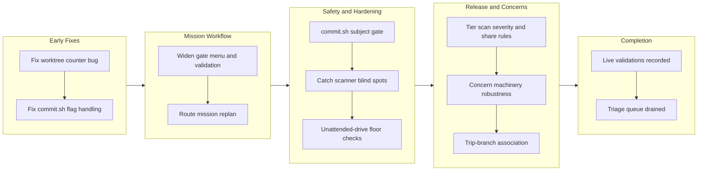

# Story: work-20260716-152211

## 1. Overview

This branch triaged the deferred-concern corpus (41 items) to zero and executed the seven hardening tickets that triage produced, alongside four fixes that preceded it. The work improved mission workflow design (replan capability, gate validation), strengthened critical safety boundaries (commit subject rules, unattended-drive floor checks, release/deploy verification), and made the concern machinery itself production-ready (re-grade, collision safety, triage automation). Version bumped to v1.0.96.

**Highlights:**

1. Enabled mission replanning via free-form instructions, allowing in-flight mission scopes to grow and carried successors to inherit a plan without re-creation
2. Hardened the unattended-drive floor with machine-checked gates: a stamped mission with no plan authorizes nothing, mission.md gets a write-time validator, and ticket mission relations must resolve
3. Tiered release-scan severity (hard/confirm/override) so override-only findings no longer block releases, and shared the secret-rule source between the deploy-evidence guard and the branch scanner
4. Closed the catch scanner's blind spots: abandoned tickets now visible with failure analysis, deployment attribution from recorded evidence, and a bounded fetch that cannot stall
5. Made the concern corpus self-maintaining: a re-grade mutator, collision-safe compound minting, a script-owned triage threshold, and PR-body size protection via story links

## 2. Motivation

The workaholic plugin had grown a corpus of 41 deferred concerns reflecting gaps in workflows that ship code daily: missing validations, blind spots in monitoring, incomplete checks in unattended drives, and safety machinery without enforcement at the right boundaries. Rather than address each in isolation, the developer triaged the corpus end-to-end against current source (2 resolved, 15 accepted as deliberate trade-offs, 24 promoted), grouping the promoted concerns into seven themed tickets with defined closure goals. This branch executes that plan, making the tool chain reliable enough for teams to use autonomously (overnight mission drives, morning reviews) while keeping each decision auditable.

## 3. Changes

The branch executed a systematic hardening of the workaholic workflow engine: two early bugs fixed (worktree counting, commit flag handling), the mission workflow redesigned to support replanning with machine-validated gates, critical safety boundaries hardened (commit subjects, drive authorization, release-scan severity tiers), monitoring blind spots closed (catch scanner, deployment evidence), the deferred-concern machinery made production-ready (re-grading, collision safety), the trip-branch association recorded, and live validations captured for two runtime environments (Codex hooks, mission layout migration). The corpus triage (2 resolved / 15 accepted / 24 promoted) landed as its own commit ([f128266a](https://github.com/qmu/workaholic/commit/f128266a)) and the session ended with an empty queue.

### 3-1. The mission quality gate does not survive contact with a mission ([fea159ba](https://github.com/qmu/workaholic/commit/fea159ba))

Widened the mission gate menu with a `check` gate type (the project's own verification command, driveable when the worktree exists), made the gate optional at creation, and established the "unchecked acceptance items are headings" convention so pre-source specifications are read as plans, not contracts.

### 3-2. check-worktrees.sh always drops the last worktree ([ac6dcc96](https://github.com/qmu/workaholic/commit/ac6dcc96))

Fixed a porcelain-parsing class bug that made all three worktree counters (`check-worktrees.sh`, `list-worktrees.sh`, `list-all-worktrees.sh`) silently drop the final block — with a single worktree the guards never fired at all. Pinned by a regression test.

### 3-3. commit.sh --help commits, and a stale memory cannot be corrected ([2a11934c](https://github.com/qmu/workaholic/commit/2a11934c))

`commit.sh` now handles `-h`/`--help` and refuses unknown leading flags instead of committing them as titles, and the repo-confinement guard exempts the agent's per-project memory store so a stale memory's only correction path (a write) is no longer blocked.

### 3-4. /mission routes a natural-language instruction to a replan flow ([096d63f1](https://github.com/qmu/workaholic/commit/096d63f1))

Added the content-routed replan mode: a free-form instruction referencing an existing mission re-enters the interrogation scoped to what changed, applies the delta, and emits delta tickets — also the path by which a carried successor or thin hand-authored mission gets fleshed out.

### 3-5. commit.sh never runs the subject gate it ships next to ([1c4d8e98](https://github.com/qmu/workaholic/commit/1c4d8e98))

Moved the canonical subject validator into the commit skill (hooks delegate to it), pinned a UTF-8 locale so multibyte subjects measure by characters on every host, made `commit.sh` run the gate before staging anything, and closed the trailing-flag / valueless-flag / under-supplied-argument boundary holes. The generated cross-agent bundle now carries the gate too.

### 3-6. /catch's scanner has three blind spots ([1fa6e1d2](https://github.com/qmu/workaholic/commit/1fa6e1d2))

The scanner now sees `abandoned/` tickets (attributed to their authors and feeding the Struggles narrative), reports the recorded `By:` deployer instead of inferring one from the last story-toucher, and bounds its startup fetch (`CATCH_FETCH_TIMEOUT`, default 20s; `0` skips) so an unresponsive remote degrades to a stale-view report instead of a stall.

### 3-7. The concern corpus's own machinery has five structural gaps ([328981db](https://github.com/qmu/workaholic/commit/328981db))

Added the `re-grade.sh` severity mutator with an auditable rationale trail, rebuilt `list-active` as a single python3 pass emitting a `{active_count, should_triage, concerns}` envelope (script-owned triage threshold), bounded the PR body under GitHub's 65,536-character limit via a story-file link, and made compound-slug collisions a named refusal instead of a silent fold.

### 3-8. The unattended-drive floor is prose ([46c67777](https://github.com/qmu/workaholic/commit/46c67777))

Four floors became machine checks: `drive-authorized.sh` refuses a stamped mission with an empty Acceptance (`no_plan`), a new `validate-mission.sh` hook rejects finished-but-empty authorized missions at write time while letting scaffolds pass, a todo ticket's `mission:` slugs must resolve, and `resume-*` tickets are linted to remaining-only Implementation Steps.

### 3-9. Release-scan and ship carry four known gaps ([057f08ed](https://github.com/qmu/workaholic/commit/057f08ed))

Releasability is now keyed off finding severity (hard/confirm block; override-only warns), the deploy-evidence guard shares the branch scanner's key group and pass-1 rules so they cannot drift, scanner-rule tickets follow one `scan-rule-` naming convention covered by a single allowlist glob, and a failed release-note push is a pre-merge hard stop.

### 3-10. ensure-worktree.sh lacks the exclude guard; the trip↔branch association is undefined ([cd797934](https://github.com/qmu/workaholic/commit/cd797934))

Both worktree creators now source one shared `.git/info/exclude` library (a stray `git add -A` can no longer stage a worktree gitlink or `.env`), and the trip↔branch association is a recorded decision: `init-trip.sh` stamps the driving branch into `plan.md`, and `detect-context.sh` resolves `work-*` branches to their trips end-to-end, making report's Trip Mode reachable from the branches the flow actually creates.

### 3-11. Four flows are proven only hermetically: run and record the live validations ([75b9ee65](https://github.com/qmu/workaholic/commit/75b9ee65))

Recorded live evidence for two of four validations: the Codex runtime executes (not merely parses) the plugin's hooks — a real `codex exec` turn ran `UserPromptSubmit` to completion after a clean 1.0.95 install — and the mission layout migration is proven by two consumer repositories' own histories (history-preserving renames). The two remaining validations name their venues: the first real mission replan session and the next `/trip` run.

### 3-12. Resume: drive the seven triage tickets to empty on this branch ([b1a7df0b](https://github.com/qmu/workaholic/commit/b1a7df0b))

The session-handoff coordinator: carried the queue order, done-work inventory, and the developer's directives into a fresh session, which drove all seven themed tickets to archive in the specified order and closed with the suite at 946 assertions (from 853 at handoff).

## 4. Outcome

- **Mission quality gate redesign**: Replaced the web-app-only gate menu with a command-shaped `check` type (drivable when the worktree exists), made the gate optional at creation, and documented the acceptance-items-are-headings rule to stop specification inventory from decaying
- **Worktree counter fixes**: Fixed the silent undercount in all three porcelain parsers that made worktree guards never fire for single-worktree repositories
- **Mission replan flow**: Content-routed `/mission <instruction>` re-enters and updates existing missions, with scoped re-interrogation, delta tickets, and worktree creation for carried successors
- **commit.sh boundary hardening**: Subject gate rejection before staging, flag-position validation, and pinned UTF-8 locale so no input is silently reinterpreted
- **/catch scanner blind spots**: Abandoned-ticket visibility, recorded deployer attribution, and a bounded fetch (default 20s) that cannot stall
- **Release-scan severity tiering**: Releasability keyed off finding severity rather than the binary verdict; the evidence guard shares the scanner's rules; scanner-ticket allowlist collapsed to one naming convention; release-note push failure is a pre-merge hard stop
- **Worktree and trip association**: The `.git/info/exclude` guard extracted into a shared library for all worktree creators; the trip↔branch association recorded in `plan.md` so Trip Mode is reachable from `work-*` branches
- **Concern machinery robustness**: Severity re-grade mutator, python3 JSON assembly with proper escaping, PR-body limit protection, slug-collision refusal, and a machine-owned triage threshold
- **Mission floor machine checks**: Drive authorization rejects empty-Acceptance missions, mission.md gets a write-time validator, ticket mission relations must resolve, and resumption tickets are linted to remaining-only steps
- **Deferred-concern corpus triaged to zero**: All 41 active concerns judged against current source (2 resolved, 15 accepted as deliberate trade-offs, 24 promoted into the seven themed tickets this branch implemented), with an auditable trail
- **Live validations recorded**: Codex runtime confirmed (plugin installs cleanly, hooks execute), mission layout migration verified in consumer repos' own histories

## 5. Historical Analysis

This branch builds on the mission worktree model implemented over the preceding days (active/archive split, close.sh, many-valued relations). The replan flow adds the missing lifecycle verb — reopening an existing mission's plan mid-flight or enriching a thin carried successor. The worktree counter bug represents a broader pattern already identified on this repo: silent misreporting of confident wrong answers (the guard never fires, counts stay at zero, the developer sees nothing amiss). The concern machinery's evolution (three-writer slug agreement, the JSON envelope, threshold ownership) shows the recurring tension between shell-native and structured data representations, resolved here by moving JSON assembly into python3 while keeping the mutators POSIX. The trip↔branch association was a documented gap — named but never defined — now closed by recording the relation at creation time (`branch:` in `plan.md`) rather than deriving it from git topology, which a previous defect had shown to be fragile.

## 6. Concerns

### Acceptance items as specification inventory decay in use

- **Severity:** moderate
- **Description:** The mission-gate design ticket measured three of its seven up-front acceptance items as wrong against source (one completed pre-ticket, one falsely describing a subsystem, one whose reuse approach broke fixtures). Specification written before source-reading is unverified inventory that decays; the tickets' own Quality Gates, written with the code open, provided the real verification (see [fea159ba](https://github.com/qmu/workaholic/commit/fea159ba) in `.workaholic/tickets/archive/work-20260716-152211/20260716103000-mission-quality-gate-design.md`)
- **How to Fix:** The "unchecked acceptance items are headings until checked against source" convention is now documented in `mission/SKILL.md`; hold future mission interrogations to it rather than treating acceptance lists as tight specifications

### Two live validations remain pending

- **Severity:** low
- **Description:** The approval-free mission-authorized `/drive` and the end-to-end `/trip` flows are verified only hermetically (the suite grew 853 → 946 assertions); end-to-end evidence is pending, with venues recorded (see [75b9ee65](https://github.com/qmu/workaholic/commit/75b9ee65) in `.workaholic/tickets/archive/work-20260716-152211/20260716163007-live-validation-session.md`)
- **How to Fix:** Record the evidence as a side effect of the developer's first real `/mission` replan session and the next `/trip` run — no dedicated session needed

## 7. Successful Development Patterns

- **Verify scope against source before implementing**: Half the mission-gate design ticket's scope was already done; discovering that early and crediting the work kept the change small and prevented re-implementation waste
- **Each extension point chooses its own predicate, never inherits silently**: The `check` gate type keyed driveability on worktree existence (correct for commands) rather than inheriting the port test from `live-app` (a silent failure for a day)
- **Test fixtures must honor single-source derivation rules**: A mission fixture whose directory did not equal `slug.sh(title)` produced a false test verdict; hand-built fixtures must follow the same derivation as production
- **Shared shell logic is extracted, not copied**: The porcelain-parser bug existed identically in two more places; extraction plus a regression test pinned all three consumers at once, and the same pattern later shared the exclude guard and the secret rules
- **Tier validator strictness on the dangerous claim, not on heuristics**: The mission validator requires the assignee key always but a non-empty owner only under `drive_authorized: true` — the claim is what changes the blast radius
- **Record relations in the artifact at creation time**: The trip↔branch link lives in `plan.md`'s `branch:` field, stable across merges and queryable without repo-wide searches — deriving it from git topology is where the previous defect came from
- **A hardening gate shipped early protects the rest of its own batch**: The commit-subject gate (ticket 163001, driven first) rejected an over-long title during ticket 163006's archive later the same session
- **Script decisions live at boundaries where tests reach them; prose stays as rationale**: The no-plan floor landed in `drive-authorized.sh`, the remaining-only rule in `validate-ticket.sh`, the triage threshold in `list-active` — each now has assertions where before there was only prose
- **The sourced-POSIX-library pattern (canonical in a skill, delegator in hooks)**: keeps the self-contained cross-agent bundle working (the build copies skill scripts, never `hooks/`) while both hook layers keep a stable entry point
- **A blocked correction path turns a stale memory into a permanent regression loop**: The confinement guard exempts the agent's memory store because a write is the only mechanism that can repair a wrong memory

## 8. Release Preparation

**Verdict**: Ready for release

### 8-1. Concerns

- The branch-safety scan found a confirm-tier leak in this session's own artifact: the live-validation ticket's Final Report named consumer repositories, one matching the leak denylist. The file was corrected in-flight (generic phrasing, commit hashes kept) and the fix rides the story commit, clearing the finding. One unpushed commit message (75b9ee65) retains the names; the developer reviewed this and explicitly chose to keep history as-is rather than rewrite.
- Size override: 160 changed files > 100 (override tier). Legitimate for a 12-ticket triage-and-hardening branch; `/ship` will ask for a conscious override acceptance.

### 8-2. Pre-release Instructions

- At `/ship`, accept the too-many-files size override when prompted (expected for this branch), and confirm the leak finding is cleared by the story commit (re-run `scan-branch-safety.sh` — only the size finding should remain).

### 8-3. Post-release Instructions

- None - no special post-release actions needed

## 9. Notes

The verification base for this branch: `test-workflow-scripts.mjs` 946 passed (853 at session handoff), `build.mjs`/`verify.mjs`/`validate-metadata.mjs` clean, versions aligned at 1.0.96. The section-reviewer's draft raised two documentation-drift concerns that were verified false against the tree (CLAUDE.md and `.workaholic/README.md` already document the replan flow; the releasability wording was retiered inside ticket 163005 itself) and were dropped from section 6 rather than shipped stale.
