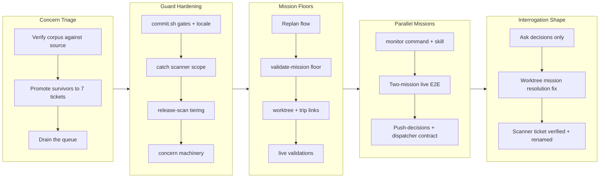

# Story: work-20260716-152211

## 1. Overview

This branch first triaged the deferred-concern corpus (41 items: 2 resolved, 15 accepted, 24 promoted) to zero and executed the seven hardening tickets that triage produced — commit gates, scanner blind spots, tiered release safety, mission floors — then built on that hardened floor to add `/monitor`, the parallel-missions executor for the overnight-ai workflow. Along the way it revised the quality-gate interrogation to ask only genuine developer decisions, fixed the validate-ticket hook's worktree mission resolution, and closed the last iceboxed scanner ticket by measured verification. The test suite grew to 979 assertions, all green, with live end-to-end validations recorded. Version bumped to v1.0.96.

**Highlights:**

1. Added `/monitor`: a developer-confirmed pre-flight, then one autonomous drive leaf per mission worktree in parallel, looping until every mission completes or only explicitly deferred escalations remain — validated live with two real missions driven concurrently
2. Refined `/monitor`'s contract on first-use feedback: blockers are pushed as one-at-a-time decisions (never just reported), the orchestrator is a non-blocking dispatcher, and dev environments boot per worktree at dispatch
3. Triaged the deferred-concern corpus to zero and drove the seven themed hardening tickets it produced (commit.sh gates, catch scanner, release-scan tiering, concern machinery, mission floors, worktree guards, live validations)
4. Sharpened the quality-gate interrogation: derivable acceptance criteria are drafted into the ticket; only developer-owned decisions are asked
5. Made validate-ticket resolve a ticket's mission in the ticket's own checkout, unblocking missioned tickets written into mission worktrees

## 2. Motivation

The branch began as follow-through: 41 deferred concerns had been verified against source and collapsed to a triage queue (2 resolved, 15 accepted as deliberate trade-offs, 24 promoted into seven themed tickets), and the rules protecting unattended execution existed mostly as prose — commit.sh accepted stray flags, the catch scanner saw a partial queue, release-scan had no severity tiers, and an empty or mistyped mission could still authorize work. Draining that queue turned each prose rule into a machine check. That hardened floor is precisely what a parallel, unattended mission executor needs to stand on, so the branch's second act built `/monitor` on top of it: the overnight-ai policy operationalized at the mission level, with judgment pre-answered at a confirmed pre-flight and every remaining judgment call collected — or, after first-use feedback, actively pushed to the developer one decision at a time. Two interrogation-shape corrections from live use (ask decisions, not derivable checklists; push decisions, don't report blockers) fed back into the specs in the same branch.

## 3. Changes

The branch drained the triage queue first — seven tickets hardening commit, catch, release-scan, concern, mission, and worktree machinery, plus recorded live validations (the corpus triage itself landed as [f128266a](https://github.com/qmu/workaholic/commit/f128266a)) — then added the `/monitor` parallel-missions executor and validated it end-to-end with two real missions. First-use feedback reshaped both the monitor contract (push decisions, never block) and the ticket interrogation (ask decisions, derive the rest), and the last iceboxed scanner ticket closed by measurement.

### 3-1. The mission quality gate does not survive contact with a mission ([fea159ba](https://github.com/qmu/workaholic/commit/fea159ba))

Widened the mission gate menu (`documentation`/`live-app`/`check`), demoted kickoff-time gates to optional (Experience is the substance), and demoted acceptance items to headings re-checked against source before driving.

### 3-2. check-worktrees.sh always drops the last worktree ([ac6dcc96](https://github.com/qmu/workaholic/commit/ac6dcc96))

Fixed the porcelain-parsing class bug (command substitution strips the trailing separator) across all three worktree counters, so the single-worktree case — the common case — finally fires the drive/ticket guards.

### 3-3. commit.sh --help commits, and a stale memory cannot be corrected ([2a11934c](https://github.com/qmu/workaholic/commit/2a11934c))

Made `commit.sh` flag-aware (`-h`/`--help` print usage instead of committing) and exempted the agent's own memory store from the repo-confinement hook, restoring the only correction path a stale memory has.

### 3-4. /mission routes a natural-language instruction to a replan flow ([096d63f1](https://github.com/qmu/workaholic/commit/096d63f1))

An instruction referencing an existing active mission now re-enters a scoped interrogation (delta model, delta tickets, changelog trail) instead of minting a duplicate — also the sanctioned path that fleshes out carried successors and thin missions.

### 3-5. commit.sh never runs the subject gate it ships next to ([1c4d8e98](https://github.com/qmu/workaholic/commit/1c4d8e98))

Wired the canonical `check-subject.sh` validator into `commit.sh` itself (closing the script-wrapped bypass), pinned a UTF-8 locale so multibyte subjects measure identically on every host, and hardened argument handling against swallowed flags.

### 3-6. /catch's scanner has three blind spots ([1fa6e1d2](https://github.com/qmu/workaholic/commit/1fa6e1d2))

Added abandoned tickets to the scan roster, recorded deployer attribution explicitly instead of inferring it, and bounded the startup `git fetch` so an unresponsive remote degrades to a stale-view report instead of hanging `/catch`.

### 3-7. The concern corpus's own machinery has five structural gaps ([328981db](https://github.com/qmu/workaholic/commit/328981db))

Added the `re-grade.sh` mutator, proper JSON escaping, a PR-body size limit with section-6 linking, compound-id collision refusal at mint time, and identity-migration robustness — the corpus stays auditable as it grows.

### 3-8. The unattended-drive floor is prose ([46c67777](https://github.com/qmu/workaholic/commit/46c67777))

Added `validate-mission.sh` (assignee key always; owner/Experience/Acceptance floor once `drive_authorized: true`) and the validate-ticket mission-relation resolution check, so an empty or mistyped mission can no longer authorize unattended work.

### 3-9. Release-scan and ship carry four known gaps ([057f08ed](https://github.com/qmu/workaholic/commit/057f08ed))

Tiered releasability (hard/confirm block; override-tier warns), unified the evidence guard onto the shared secret rule source, collapsed the allowlist's per-ticket globs into the `scan-rule-` prefix convention, and made the ship push loud.

### 3-10. ensure-worktree.sh lacks the exclude guard; trip↔branch association undefined ([cd797934](https://github.com/qmu/workaholic/commit/cd797934))

Shared the gitlink-exclude guard across both worktree creators and stamped the trip→branch association into `plan.md` at init time, making `/report`'s Trip Mode reachable from modern `work-*` branches.

### 3-11. Four flows are proven only hermetically ([75b9ee65](https://github.com/qmu/workaholic/commit/75b9ee65))

Ran and recorded the live validations: the Codex hook runtime (UserPromptSubmit fired and completed) and the mission living-layout migration across six consumer repos; the remaining two flows were recorded with their preconditions.

### 3-12. Resume: drive the seven triage tickets to empty ([b1a7df0b](https://github.com/qmu/workaholic/commit/b1a7df0b))

The resumption ticket that carried the triage handoff across sessions — closed when the queue reached empty, with the handoff's remaining-only convention machine-checked.

### 3-13. Add /monitor — parallel mission driver command and skill ([2a03af0c](https://github.com/qmu/workaholic/commit/2a03af0c))

New Claude-Code-only executor: a developer-confirmed pre-flight (mission set with derived progress, per-worktree position, unattended-drive eligibility, interference assessment), then one autonomous drive leaf per mission `.worktrees/<slug>/` worktree in parallel, looping bounded waves to a deterministic `ok`/`pending` terminal line for caller-side loops (`/goal /monitor ok`). Only `drive_authorized` missions run unattended. Validated live: two real missions driven concurrently to completion with mutually clean worktrees, then torn down.

### 3-14. Quality Gate interrogation asks decisions, not derivable checklists ([dea5c331](https://github.com/qmu/workaholic/commit/dea5c331))

First-use feedback: the Step 4b interrogation had offered agent-derived acceptance criteria as a multi-select. The spec now splits content into developer-owned decisions (asked, thoroughly) and derivable criteria (drafted straight into the ticket), with the multi-select shape recorded as an anti-pattern and the do-not-soften clause retained.

### 3-15. validate-ticket resolves the mission in the ticket's own checkout ([2ecd065e](https://github.com/qmu/workaholic/commit/2ecd065e))

Found during the monitor E2E: the hook resolved `mission:` against the session cwd, false-flagging every missioned ticket written into a mission worktree from a main-tree session. It now derives the ticket's own repo root and resolves there — the seam `/monitor`'s deferred-ticket minting crosses.

### 3-16. /monitor pushes decisions one by one instead of reporting blockers ([edf246a4](https://github.com/qmu/workaholic/commit/edf246a4))

Three feedback rounds from first use, absorbed in one revision: blockers become sequential one-at-a-time decisions (`escalation-blocked` strictly means asked-and-explicitly-deferred; `ok` is never emitted over an unasked decision); the orchestrator is a non-blocking dispatcher (background leaves, collect-as-they-arrive, no inline implementation); and each driven mission's declared dev environment boots at dispatch inside its own worktree on its allocated ports.

### 3-17. The secret rule reads a function call as a literal ([981a36ab](https://github.com/qmu/workaholic/commit/981a36ab))

Closed by measured verification, no code change: the value-rule inversion this ticket argued for had already shipped, the drift it reported was already unified, and the full 12-shape regression bar held. Renamed to the `scan-rule-` prefix on archive per the allowlist convention.

## 4. Outcome

The workflow machinery this repo runs on is now machine-checked where it was prose: commit subjects and flags, the catch scanner's roster and bounds, release-scan's severity tiers and shared secret rules, the unattended-drive floor (assignee/Experience/Acceptance, resolvable mission relations — in the ticket's own checkout), and worktree creation. On that floor sits `/monitor`, the third executor beside `/drive` and `/trip`: parallel per-mission drives with a confirmed pre-flight, a push-decisions contract, a non-blocking dispatcher, and per-worktree dev environments — validated end-to-end with two live missions. The interrogation shape corrected twice from real use: ask the developer's decisions, derive everything else, and never stop at reporting what is blocked on them. Suite: 979 assertions, green; live validations recorded for the Codex runtime and the mission layout migration.

## 5. Historical Analysis

- Porcelain parsers are a class liability: three worktree counters shared the same trailing-block truncation because they copied the trick, not the fix — the class fix (flush after the loop) landed once, in a shared library
- Rules that decide whether to ask a human must be scripts, not prose: `drive-authorized.sh` made the approval gate testable, and this branch extended the same move to mission floors (`validate-mission.sh`) and monitor's terminal contract (prose sentinels)
- CWD-sensitive checks in hooks recur: `gate.sh`'s port resolution and now `validate-ticket.sh`'s mission resolution both broke on the worktree layout — the pattern fix is "derive the file's own root, decide outside the subshell"
- Inventory decays: mission acceptance items written at kickoff were measurably wrong when checked against source; the branch demoted them to headings and moved the bar to ticket gates written with the code open
- The tool-asks-too-much / tool-says-too-little pair: the same session produced both corrections — don't poll derivable checklists, and don't report blockers you should be converting into questions

## 6. Concerns

### Monitor's dev-environment lifecycle has no test coverage

- **Severity:** moderate
- **Description:** `/monitor` now boots each driven mission's declared dev environment at dispatch and stops what it started at the terminal state (see [edf246a4](https://github.com/qmu/workaholic/commit/edf246a4) in `plugins/workaholic/skills/monitor/SKILL.md` §2), but boot failure, port-in-use, and teardown paths have no smoke assertions and no live validation — the E2E ran on a project with no declared dev command.
- **How to Fix:** Add hermetic fixtures for boot-with-conflict, no-declaration (skip), and stop-only-what-we-started; exercise once against a real project with a declared dev command.

### Monitor's decision loop has no cross-run deferral memory

- **Severity:** moderate
- **Description:** The push-decisions contract asks blockers one at a time until answered or explicitly deferred (see [edf246a4](https://github.com/qmu/workaholic/commit/edf246a4) in `plugins/workaholic/skills/monitor/SKILL.md` §1/§3). The wave cap bounds driving, but nothing makes a deferral sticky across invocations — a caller-side loop would re-ask the same deferred decisions every cycle.
- **How to Fix:** Record deferred decisions in the run report and have the next invocation re-ask only when the underlying state changed (or after N runs), so deferral is remembered rather than re-litigated every loop.

### Compound concern IDs are only collision-checked at mint time

- **Severity:** low
- **Description:** `merge-concerns.sh` refuses a compound-id collision when minting (see [328981db](https://github.com/qmu/workaholic/commit/328981db) in `plugins/workaholic/skills/report/scripts/`), but hand-authored or hand-edited concern files are never re-checked, so a manually created duplicate id would go unnoticed until it misroutes an update.
- **How to Fix:** Add a duplicate-id warning to `list-active-deferred-concerns.sh`'s identity migration pass, where every file is already read.

### Monitor's contract lives in prose pinned only by sentinels

- **Severity:** low
- **Description:** The monitor behavioral contract (push-decisions, dispatcher, env lifecycle) is orchestration prose pinned by fifteen sentence-level assertions (see [edf246a4](https://github.com/qmu/workaholic/commit/edf246a4) in `scripts/test-workflow-scripts.mjs`); a rewording that keeps the meaning but drops a sentinel fails the suite, while one that keeps the sentinel but drifts the meaning passes it.
- **How to Fix:** When editing monitor prose, update the sentinels deliberately in the same change; if the contract grows, promote stable parts into scripts (the `drive-authorized.sh` move) rather than more sentences.

## 7. Successful Development Patterns

- Class fixes beat instance patches: the worktree porcelain bug was fixed once (flush after loop, shared library) instead of three times — search for siblings whenever a copied idiom breaks
- Verify scope against source before implementing: two tickets shrank on contact (half the mission-gate design already existed; the scanner ticket closed on measurement alone) — reading the live code first kept both changes minimal
- Prose sentinels pin orchestration contracts: monitor's behavior is asserted at the sentence level, the same technique that keeps drive's night mode and the mission interrogation from silently regressing
- Derive and draft, don't poll: the interrogation revision moved derivable acceptance criteria into the ticket author's hands and reserved questions for genuine decisions — less ceremony, no softer gate
- Push decisions, don't report blockers: when the missing input is the developer's decision, the tool brings each decision to them one at a time and proceeds with what each answer unlocks
- Fixture-driven live E2E: the monitor validation created two real missions in real worktrees, drove them with real leaves, verified isolation by inspecting every tree, then tore down through the sanctioned close/cleanup scripts — the whole loop cost minutes and caught a real hook bug
- An observation is not an obligation — only a ticket is: the validate-ticket defect found mid-E2E became a queued ticket in the same breath and shipped in the same branch

## 8. Release Preparation

**Verdict**: Ready for release

### 8-1. Concerns

- The branch-safety scan's only remaining finding is override-tier size (175 files > 100) — legitimate for a 17-ticket branch; `/ship` will ask for a conscious size override
- Two hard secret findings surfaced during this report (documentation placeholders in the promoted scanner ticket) and were resolved by the sanctioned `scan-rule-` rename ([981a36ab](https://github.com/qmu/workaholic/commit/981a36ab)); the scan is now secret-clean

### 8-2. Pre-release Instructions

- At `/ship`, consciously accept the size override (175 files; multi-ticket branch)
- Version: branch bumps to v1.0.96; main is at v1.0.95 — no collision (checked 2026-07-18)

### 8-3. Post-release Instructions

- None - no special post-release actions needed

## 9. Notes

The `/monitor` E2E fixtures (missions `monitor-e2e-alpha`/`monitor-e2e-beta`, their worktrees and branches) were created, driven, closed as achieved, and fully torn down within the session — they are deliberately absent from this branch. `/monitor` is Claude-Code-only like `/trip`: its skill carries `metadata.internal: true` and is deliberately excluded from the generated `outputs/workflows` bundle (`build.mjs` `DEFAULT_TARGETS` unchanged; the Outputs Freshness CI stays green with no monitor entry).

## Deployment Evidence

- **When:** 2026-07-18T20:44:03+09:00
- **By:** a@qmu.jp
- **Target:** release-scan
- **Method:** override
- **Status:** bypassed
- **Observed:** size override accepted: too-many-files rule, 175 files > 100 in diff (legitimate 17-ticket branch); hard=0, no secret/leak findings

## Deployment Evidence

- **When:** 2026-07-18T20:44:42+09:00
- **By:** a@qmu.jp
- **Target:** Workaholic marketplace plugin
- **Method:** other (pre-merge proof)
- **Status:** pass
- **Observed:** build.mjs regenerated outputs cleanly (git status outputs/ empty); verify.mjs pass (48 OKF files fresh, 213 links resolve, skills self-contained); validate-metadata.mjs pass (version-aligned v1.0.96); test-workflow-scripts.mjs 979 passed 0 failed; version 1.0.96 consistent across all lockstep files and greater than main 1.0.95
