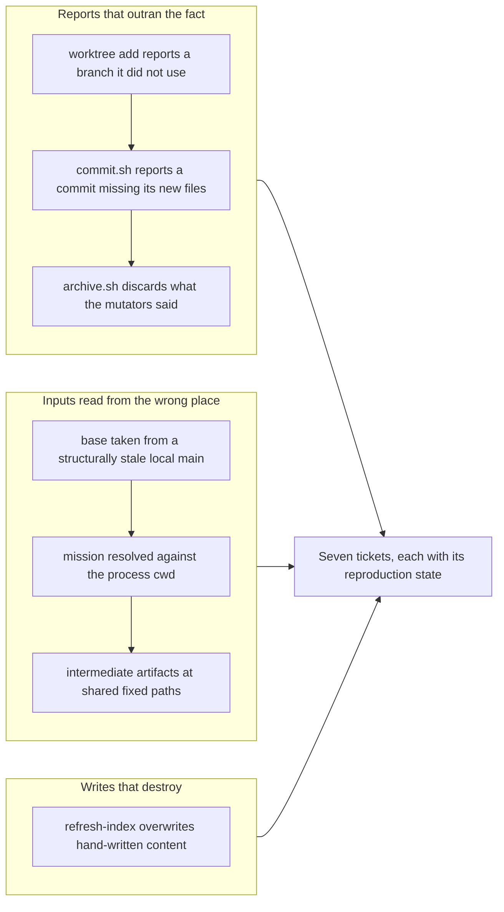

## 1. Overview

This branch writes no fix. It files seven, each one measured while the tooling was carrying a heavy day's work rather than while anyone was auditing it. A headquarters session drove six repositories through mission placement, ticket triage, reports and ships; the defects surfaced because that traffic ran the scripts through states their tests never construct. All seven are `bugfix`, all seven are reproduced, and all seven share one shape: **the tool reports something it did not do.** None of them crash. Each returns exit 0 and a report that reads correct.

`create-mission-worktree.sh` prints `"branch": "work-*"` from a variable it computed before the fact, while git's DWIM quietly discarded the `-b` and put the worktree on `main`. `commit.sh` reports a commit as done while `git add -u` silently drops the new files it was never handed. `archive.sh` runs the mission mutators and throws away what they said. `refresh-index.sh` rewrites hand-written index content away and indexes files a clone will not have. `/report` and `release-scan` take their base from a local `main` that a desk cannot update, so their findings describe a tree nobody has. `/report`'s intermediate artifacts sit at fixed paths, so one run publishes another's story. And mission resolution reads whichever tree the process cwd happens to select.

The family is the one this repository keeps paying for: a check that passes vacuously, and a report that cannot be distinguished from a true one.

**Highlights:**

1. `create-mission-worktree.sh` puts the worktree on the branch it reports — today it reports `work-*` and delivers `main`
2. `commit.sh` never silently omits a file from the commit it reports as done
3. `archive.sh` reports what the mission mutators did, instead of discarding it
4. `refresh-index.sh` stops destroying hand-written index content, and stops indexing what a clone will not have
5. `/report` and `release-scan` stop taking their base from a ref that is structurally stale
6. `/report`'s intermediate artifacts stop sharing fixed paths, and stop trusting whatever is at them
7. Mission resolution follows the ticket, not the process cwd

## 2. Motivation

These seven were not found by looking for them. They were found by a headquarters session using this tooling all day across six repositories, which put the scripts into states the suite does not build.

That distinction is the motivation. Take the worktree defect: `git worktree add -b "${branch}" "${path}" "${base}"` is correct whenever a local `main` exists, and wrong only when it does not — git's DWIM then reads the positional `main` as a remote-tracking name, drops the `-b`, and creates the local branch itself. A fresh clone or a headquarters desk whose only checkout is a `work-*` branch is exactly that state, and it is the state real work runs in. The suite never sees it: `test-workflow-scripts.mjs:132`'s `makeRepo(initialBranch = "main")` hands every fixture a local `main`, so all ten call sites exercise only the dormant case. The bug is also self-concealing — its own path creates the local `main` whose absence triggers it, so the second run in a repository looks correct.

The same holds for the rest. `commit.sh`'s omission needs a new file; the stale base needs a checkout that has been pinned for weeks; the fixed artifact paths need two runs at once; the cwd-dependent resolver needs a mission inside a worktree. Each precondition is ordinary in use and absent in test. Filing them is worth a branch of its own because the reproduction conditions are the perishable part — the line numbers can be re-derived, but "this only fires when no local `main` exists, and never in a primary checkout" is knowledge that evaporates when the session ends, and without it a maintainer's reproduction fails and the report is closed invalid.

## 3. Changes

Seven tickets land in `.workaholic/tickets/todo/a-qmu-jp/`. No script changes.

Each ticket carries the reproduction condition, the observed behavior against the expected one, the root-cause line reference, a fix direction, and a requested regression test written against the state that actually fires the bug rather than the state the suite currently builds.

## 4. Outcome

Seven defects are filed with reproductions. Nothing is fixed yet; the fixes are the reader's to schedule.

Two findings constrain that scheduling and are recorded in the tickets rather than left to be rediscovered:

**Order matters between the mission tickets.** The open concern for mission validation (PR #86) prescribes resolving each slug against `.workaholic/missions/active/<slug>/mission.md` — a cwd-relative path. Implemented on today's resolver, that would build a *blocking* hook on a cwd-dependent foundation and manufacture exactly the false rejection this branch reports. `20260717152506` lands first, or the concern's fix makes things worse.

**The mission resolver has a failure worse than the false negative.** With a same-slug mission in two trees, one ticket resolves to whichever the cwd selects — `authorized: true` or `not_authorized` — and the resolver returns byte-identical relative paths in both cases, so the caller cannot tell which file it read even in principle. `missions_migrate_layout():23` shares the defect and moves directories on it.

## 5. Historical Analysis

The report that cannot be distinguished from a true one is this repository's recurring defect, not a new one. `work-20260715-213222` fixed `/ship` reporting a push it could not back, after `2>&1` threw the diagnosis away. The branch story for that work named the shape directly: "a check that passes vacuously." Every ticket here is another instance — the worktree JSON printing a precomputed variable instead of reading HEAD is the same move as `/ship` printing success without reading the push.

That branch also established the precedent these tickets follow: it demanded the regression test watch the failure first. The requested tests here are written against the firing state (no local `main`; a mission inside a worktree), because the existing suite's green is itself an instance of the family — `makeRepo(initialBranch = "main")` makes ten call sites pass without ever testing the case that breaks.

## 6. Concerns

**The line references in these tickets are dated.** They were verified against this branch's tree on 2026-07-17 and will drift. Two were already stale when first drafted from a prior session's notes — a reported `create-mission-worktree.sh:64` was actually `:73`, and a reported trigger at `hooks/validate-ticket.sh:370-387` does not exist at all (that file is 364 lines and contains no occurrence of `mission`; the real emitter is `drive-authorized.sh:56-59`). Both were corrected against the files before filing. A reader should re-derive rather than trust.

**Filing without fixing is a bet.** Seven tickets in `todo/` are worth less than one merged fix, and a queue that only grows is its own failure mode. The bet is that the reproduction conditions are the expensive half and they perish with the session; the fixes are cheap once the condition is written down.

## 7. Successful Development Patterns

**Dogfooding found what the suite structurally cannot.** All seven came from using the tooling to do unrelated work across six repositories. None would have been found by reading the scripts, because each needs a precondition the fixtures never build.

**A pristine fixture beat a plausible inference.** While verifying the worktree defect, a probe run in an already-affected repository showed `main` resolving fine and suggested the proposed `rev-parse --verify` guard was unsound. It was not — the earlier firing had created the very `main` that made the probe look green. A scratch repository built from nothing showed `rev-parse --verify main` returning 1 as expected. The self-concealing bug had nearly concealed its own fix.

**Checking the report against the source, rather than copying it forward.** The prior session's notes carried a confident trigger location that does not exist. Re-deriving every line number against the tree before writing caught it. Had these gone out as drafted, a maintainer would have found the cited code absent and closed them invalid.
