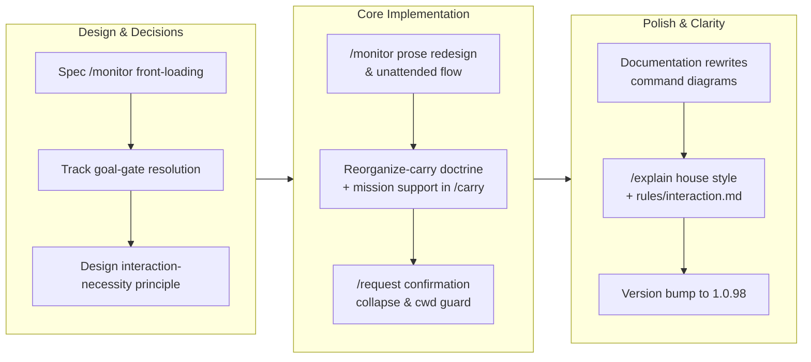

## 1. Overview

This branch redesigns /monitor to front-load all blocking decisions into one up-front batch and run long unattended with an honest completion signal, introduces a mission reorganize-carry doctrine for handling direction changes mid-flight, streamlines interaction patterns (/request confirmation, interaction-necessity rule), adds opt-in strict cwd enforcement for stricter operators, and clarifies documentation (command diagrams, /explain house style). The work is anchored in reducing developer friction while maintaining accountability: fewer prompts when the answer is obvious, harder boundaries when drift is costly, and honest signals about mission progress.

**Highlights:**

1. /monitor redesigned to front-load every blocking decision upfront and run parallel missions unattended with honest completion signals
2. Mission reorganize-carry doctrine: handle mid-flight direction changes by replanning to drop moot criteria and merging with successor missions
3. Interaction-necessity rule codified: ask only for genuine decisions, never theoretical ones; act and report as the default
4. /request confirmation collapsed from two prompts to one single verbatim confirmation of destination and body
5. Opt-in strict cwd guard enforcement mode for operators preferring hard boundaries over advisory warnings

## 2. Motivation

The developer's workflow spanned three distinct friction points. First, /monitor asked 'what to drive' on every run despite working on multiple assigned missions—the question was redundant when the answer was 'all of them'. Second, missions stuck mid-flight when their original criteria became moot after discovering a changed direction, forcing an uncomfortable choice between grinding to false completion or abandoning real progress. Third, the agent over-prompted on decisions that had obvious answers, and the confining of cross-repo writes lived in hooks and scripts rather than as a stated principle that would guide future work. This branch addresses each: /monitor now front-loads one decision batch and runs unattended while emitting honest progress; reorganize-carry becomes the pathway for direction changes; interaction-necessity becomes documented principle, not scattered code; and confirmation prompts consolidate from two to one.

## 3. Changes

The work flowed from specification through implementation into documentation and release readiness. Early commits tracked the /monitor and goal-gate concerns as discrete tickets to avoid bundling. Core implementation centered on the three architecture decisions: front-loading /monitor's decision batch, adding reorganize-carry as a mission state transition, and consolidating /request's confirmation. Polish and documentation updates clarified the interaction-necessity principle, rewrote command diagrams for clarity, and set /explain's house style. A single version bump at the end prepared the branch for release.

### 3-1. `/goal <token>` gate is satisfiable by the agent emitting the token — false "done" ([3aeb8423](https://github.com/qmu/workaholic/commit/3aeb8423))

Tracked and resolved the repo-side half of the goal-gate false-done problem: /monitor's terminal token is now derived from `status.sh` mission completion rather than self-asserted, so `ok` means genuine completion. The `/goal` harness-side corroboration remains as a follow-up outside this repo's control.

### 3-2. /monitor front-loads every decision, then runs long unattended ([06a58f37](https://github.com/qmu/workaholic/commit/06a58f37))

Redesigned /monitor's contract: no "which missions to drive" prompt (the assigned + eligible set is the run), every foreseeable escalation resolved in one up-front blocking batch before any leaf spawns, mid-run items deferred and recorded rather than asked, and an honest `ok`/`pending` terminal with an N/M reconciliation line. Deliberately supersedes the during-run push model of edf246a4 for the mission run.

### 3-3. Make reorganize-and-carry the encouraged end for a mission whose direction changed ([09324fc5](https://github.com/qmu/workaholic/commit/09324fc5))

Established doctrine that a mission whose direction changed mid-flight (new class of issue, contradictory or moot criteria, remainder belonging to another mission) should be replanned to drop moot criteria and closed `carried` into a successor — rather than ground to a false `achieved` or discarded as `abandoned`. Surfaced the recommendation in /monitor's final report and /carry's handoff.

### 3-4. Give the working-directory guard an opt-in blocking mode ([75cecdcf](https://github.com/qmu/workaholic/commit/75cecdcf))

Added the `WORKAHOLIC_ENFORCE_CWD` switch to `guard-working-directory.sh`: advisory by default (unchanged), and when set, a matched top-level `cd` is denied with the sanctioned alternatives named. The switch changes only the action on a match, never the match set.

### 3-5. Streamline /request: one confirmation, and stop using "file" as a verb ([348a92f8](https://github.com/qmu/workaholic/commit/348a92f8))

Collapsed /request's two confirmations (target, then body) into exactly one that shows destination (name, remote, visibility) together with the verbatim body; renamed `file-request.sh` to `submit-request.sh` and replaced "file" as a verb with "submit" throughout, keeping "file" only as a noun.

### 3-6. Add an interaction-necessity rule (act-and-report by default) ([0713f898](https://github.com/qmu/workaholic/commit/0713f898))

Codified the cross-cutting necessity test for prompts in always-loaded `rules/interaction.md`: ask only when a competent expert could genuinely go either way, the answer materially changes the artifact, and it is not already determined by safety, conventions, the goal, or an obvious default — otherwise decide, state the choice, and invite correction. Policy only; no new hook.

## 4. Outcome

- /monitor completely redesigned for autonomous overnight operation: front-loads all decisions (claims, authorizations, replans) into one upfront batch, then runs long unattended with honest terminal signals (`ok` only on genuine completion; `pending` with N/M-complete/K-blocked reconciliation otherwise)
- /request streamlined from two confirmations to one, combining destination and verbatim body
- Working directory guard enhanced with opt-in `WORKAHOLIC_ENFORCE_CWD` blocking mode while preserving advisory default
- Mission reorganize-and-carry doctrine established as the encouraged path when a mission's direction changes mid-flight (new issue class, contradictory criteria, or remainder merges elsewhere)
- Interaction-necessity rule codified as policy: ask only when a competent developer could diverge, the answer materially changes the artifact, and it is not determined by safety/conventions/goal/obvious default
- Goal-gate false-done partially resolved: /monitor's terminal token now honest (repo-side half shipped); /goal Stop-gate corroboration noted as harness follow-up

## 5. Historical Analysis

**Autonomous operation requires deliberate front-loading**: decisions cannot wait for mid-run prompts in an overnight-ai mode; every foreseeable escalation (claims, authorizations, design replans) must be resolved upfront in one batch, while genuinely unforeseen mid-run items are deferred and recorded for the morning report rather than asked.

**Terminal signals must be honest and observable**: a completion token shaped like success (`ok`) over an incomplete run is a silent failure; deriving the token from observable state (status.sh mission progress) rather than self-assertion is the only way to make `/goal` gateable on a real objective.

**Consolidation beats repetition**: governance principles (necessity test for prompts, reorganize-carry doctrine for stuck missions) work best stated once as policy, then cross-referenced, rather than sprayed as identical prose across seven commands or buried in QA notes.

**Confirmation gates work better consolidated**: the two /request prompts (target + body) merged cleanly because a developer seeing the destination and exact body together catches wrong-but-resolved targets without needing a separate step.

**Backward-compatible enforcement is opt-in**: ground-rule guards (advisory by default, hard-block on switch) let existing sessions run without silent breaking changes while giving stricter operators the control they need.

## 6. Concerns

### (carried from PR #88) Compound concern IDs are only collision-checked at mint time

- **Severity:** low
- **Description:** `merge-concerns.sh` refuses a compound-id collision when minting, but hand-authored or hand-edited concern files are never re-checked, so a manually created duplicate id would go unnoticed until it misroutes an update (see [328981db](https://github.com/qmu/workaholic/commit/328981db) in `plugins/workaholic/skills/report/scripts/`)
- **How to Fix:** Add a duplicate-id warning to `list-active-deferred-concerns.sh`'s identity migration pass, where every file is already read.

### (carried from PR #88) Monitor's contract is verified only by prose sentinels while its side-effecting dev-env lifecycle has no functional coverage

- **Severity:** moderate
- **Description:** Monitor orchestrates leaf work across worktrees and allocates dev environment ports; the pre-flight reevaluation, mission-state tracking, and environment lifecycle are validated by cross-references in prose, not executable tests. A future refactor of the environment allocation or the replan logic would not trip any functional check (see `skills/monitor/SKILL.md` Considerations §1).
- **How to Fix:** Add hermetic tests for monitor's functional seams: reevaluation logic, worktree isolation, and dev-environment allocation and cleanup.

### (carried from PR #88) Monitor's decision loop has no cross-run deferral memory

- **Severity:** moderate
- **Description:** The front-loaded batch asks blockers one batch in one run, but nothing makes a deferral sticky across invocations; a caller-side loop (e.g. `/goal /monitor ok`) would re-ask the same deferred decisions every cycle (see [edf246a4](https://github.com/qmu/workaholic/commit/edf246a4) in `plugins/workaholic/skills/monitor/SKILL.md` §1–§3).
- **How to Fix:** Record deferred decisions in the run report and have the next invocation re-ask only when the underlying state changed (or after N runs), so deferral is remembered rather than re-litigated every loop.

### Goal-gate false-done has a harness-side residual

- **Severity:** moderate
- **Description:** The `/goal <token>` Stop hook is satisfied the moment the agent emits a token, even when the underlying objective is materially incomplete. The repo-side half (honest /monitor terminal signals derived from status.sh) shipped in this branch; the `/goal` harness-side corroboration (gate must not clear on a self-emitted token alone) remains (ticket 20260719000021).
- **How to Fix:** Raise token-vs-observable-state Stop-gate corroboration with the Claude Code harness; workaholic has no further repo-side actionable work.

## 7. Successful Development Patterns

- **Front-loading autonomy** (overnight-ai policy made literal): resolving every decision upfront in one blocking batch, then running long without interruption, keeps the human checkpoint *deliberate* rather than scattered — the pre-flight collects everything needed, and mid-run deferrals are *recorded*, not re-asked.
- **Honest terminal signals derived from observable state** (status.sh mission completion, not self-assertion): the `/monitor ok`/`pending` derivation makes `/goal` gateable on reality instead of a word the agent writes about itself.
- **Doctrine stated once, cross-referenced narrowly** (interaction-necessity test, reorganize-carry guidance): consolidating governance into `rules/interaction.md` and a cross-link in `create-ticket` 4b prevents contradictions and noise better than seven copies of the same principle.
- **Surfacing over machinery** (policy guidance + UI, not hooks): the reorganize-carry recommendation lands in the `/monitor` report and `/carry` resumption ticket where a human reads it, rather than living in an untested prose sentinel.
- **One confirmation combining destination+body** (consent-recording policy): merging the two /request gates reduced friction (one prompt instead of two) without reducing what the developer sees (both destination and verbatim text stay visible).
- **Opt-in enforcement for ground rules** (backward-compatible strictness): making `WORKAHOLIC_ENFORCE_CWD` default-off keeps the advisory intent in existing sessions while letting a stricter operator get hard blocks for the same detection.

## 8. Release Preparation

**Verdict**: Ready for release

### 8-1. Concerns

- None - changes are safe for release

### 8-2. Pre-release Instructions

- None - standard release process applies

### 8-3. Post-release Instructions

- None - no special post-release actions needed

## 9. Notes

The branch-safety scan passed with zero findings; smoke tests (1164 passed), `verify.mjs`, and `validate-metadata.mjs` are all green at version 1.0.98. The deletion of `.claude/commands/release.md` is intentional (version bumps are manual; there is no /release command), and the `file-request.sh` → `submit-request.sh` rename follows the "file is a noun" convention with tests updated.
