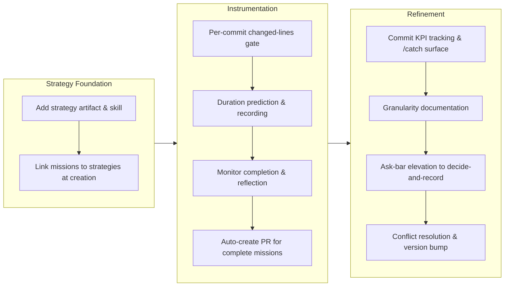

## 1. Overview

This branch reorganizes the mission framework to introduce strategies as a first-class abstraction above missions, splitting the dual-role design into distinct artifacts: strategies (long-lived direction, no completion conditions) and missions (execution plans with tickets and acceptance criteria). Concurrently, it instruments the overnight development workflow with completion reporting, duration tracking, auto-PR generation, and enhanced throughput controls.

**Highlights:**

1. Introduced strategy layer above missions, moving longevity to direction while missions focus on execution planning
2. Added automatic PR creation for completed missions in /monitor, eliminating the morning PR-creation loop
3. Implemented per-commit size gating in release-scan to normalize commit throughput, enabling commit count as a meaningful KPI
4. Built duration prediction and actual-hours recording to make planning data-driven instead of guessed
5. Elevated the ask bar to decide-and-record, removing prompts with recommendable defaults to reduce developer cognitive load

## 2. Motivation

The original mission design carried two conflicting responsibilities: serving as an executable unit (tickets, acceptance criteria) and as a long-lived goal container (spanning many tickets, carrying direction). This separation of concerns reorganizes missions into execution plans anchored to strategies—a new layer that holds direction and roadmap continuity without execution machinery. This also completes the overnight development model: explicit per-mission completion reporting, reflection that feeds back into the next morning's planning, automatic PR generation so deploy-and-ship begins where planning ended, and normalized commit sizes so throughput metrics become actionable. The ask-bar elevation removes decision fatigue by eliminating prompts whose first option is already recommended.

## 3. Changes

The work progressed through three coherent phases. First, the strategy artifact was introduced with its creation/list/retire mechanics, and missions were linked to strategies at creation time via an interrogation step. Second, the overnight workflow was instrumented with per-commit size gating, duration prediction and recording, monitor completion reporting with reflection entries, and automatic PR generation for completed missions. Finally, the four-layer granularity model was documented across CLAUDE.md and README, the decision-prompting threshold was raised to eliminate low-stakes questions, and the branch was prepared for release with version and conflict resolution.

### 3-1. Add a per-commit changed-lines gate to release-scan ([e2d0182b](https://github.com/qmu/workaholic/commit/e2d0182b))

Added a per-commit size gate so non-generated commit sizes stay normalized, making commit count usable as an orchestration-throughput KPI rather than a noise metric.

### 3-2. Add the strategy artifact and skill ([c14ebdd1](https://github.com/qmu/workaholic/commit/c14ebdd1))

Introduced the strategy artifact (`type: Strategy`, active/archive areas, create/list/read-relation/retire scripts, OKF-indexed) as the long-lived direction layer above missions — no completion conditions, no execution machinery.

### 3-3. Link missions to strategies at creation ([4224ac3f](https://github.com/qmu/workaholic/commit/4224ac3f))

Mission creation and replan now resolve the strategy a mission executes (infer / create-on-the-spot / ask only when genuinely ambiguous) and stamp `strategy:` on `mission.md`; per-strategy rollups stay computed from the mission side.

### 3-4. Record predicted and actual mission duration ([80d64df3](https://github.com/qmu/workaholic/commit/80d64df3))

Missions carry a predicted duration derived from archived-mission medians, and /monitor accumulates each mission's actual agent-hours idempotently per run, so planning estimates can be judged against reality.

### 3-5. Add monitor completion report and reflection ([e1e7a164](https://github.com/qmu/workaholic/commit/e1e7a164))

The /monitor final report now states, per driven mission, completed-as-planned or a categorized reason (fixed vocabulary), and writes a dated `## Reflection` (blocked / leaked questions / front-load next) that the next mission interrogation reads back.

### 3-6. Auto-create PR for completed missions in monitor ([55478801](https://github.com/qmu/workaholic/commit/55478801))

For each genuinely complete mission, the /monitor dispatcher opens the PR itself (reusing /report's story + create-or-update seam, sequentially per worktree); merge stays /ship, and a PR failure never alters completion counts or the terminal token.

### 3-7. Add commit-count KPI script and catch surface ([2801fb24](https://github.com/qmu/workaholic/commit/2801fb24))

Added `gather/scripts/commit-kpi.sh` (agent-commit count/share, median/p90 changed lines, oversize count) and surfaced it in /catch as an Orchestration Throughput block — measuring how well the agent fleet is orchestrated.

### 3-8. Document granularity discipline across artifacts ([73fd5749](https://github.com/qmu/workaholic/commit/73fd5749))

Documented the four-layer model (strategy → mission → ticket → commit) with its both-ways balance test across CLAUDE.md, README.md, and the mission/strategy skills — each layer describes change at its own granularity, never restating a lower level.

### 3-9. Raise the ask bar to decide-and-record ([decde17f](https://github.com/qmu/workaholic/commit/decde17f))

Added the Recommended-label test once in full to `rules/interaction.md` — a question whose best option could honestly be labeled "(Recommended)" is decided and recorded, not asked — with create-ticket §4b, the mission interrogation/replan, and monitor §1 referencing it through named record seams.

## 4. Outcome

- Split mission artifact into two layers: **strategy** (long-lived direction, no completion conditions) sits above **missions** (overnight-executable execution plans), resolving the longevity/granularity split and eliminating the contradiction where missions tried to be both durable containers and bounded batches.
- Added **per-commit changed-lines gate** to release-scan, normalizing non-generated commit size so commit count becomes a stable orchestration-throughput KPI.
- Implemented **strategy machinery** (create/list/read-strategy-relation/retire scripts) with automatic cross-agent distribution to outputs/workflows and OKF indexing; mission Creation Interrogation now resolves the strategy link via infer/create/ask tri-state.
- Added **mission duration prediction** (median actual-per-item across archived missions times planned count) and **actual-hours accumulation** via /monitor, feeding trend data for the next planning cycle.
- Implemented **/monitor completion report and reflection** (per-mission categorized reasons: complete/escalation-blocked/deferred/gate-failed/wave-exhausted; dated ## Reflection with blocked/leaked-questions/front-load bullets) and wired the next Creation Interrogation to read recent reflections back.
- **Auto-create PR for completed missions** in /monitor's dispatcher (sequential per-worktree, reusing /report's story+PR seam; PR failures are reported separately and never alter the terminal token).
- Added **commit-count KPI** (gather/scripts/commit-kpi.sh) to measure orchestration throughput; /catch surfaces it in a new Orchestration Throughput block.
- **Raised ask bar to decide-and-record** across interrogation surfaces: if you could honestly mark an option "(Recommended)", decide it and record the decision in the artifact instead of asking.
- Unified documentation across CLAUDE.md, README.md, and .workaholic/README.md with the four-layer granularity table, both-ways balance test, and the daytime-planning/after-hours-execution workflow.

## 5. Historical Analysis

The branch's commits show two dominant patterns: (1) **architectural redefinition** — splitting mission into strategy+mission, adding structured completion/reflection reporting — and (2) **decision-and-record doctrine** hardening, from general interaction-necessity rule to the Recommended-label test that sharpens "ask only genuine decisions." Both trace to the overnight-AI execution model: planning quality is measured by how few judgment calls leaked into autonomous runtime, and reflection records those leaks for the next planning to front-load. The repeated emphasis on idempotency (run-id keys, predictability over trending noise, single-source-of-truth for policy constants) reflects the model's need for reproducibility across runs and across agents. The test-driven implementation (hermetic test cases before features land) and the two-layer documentation pattern (canonical statement in one skill, references from consumers) are evidence of a maturing workflow — correctness is being encoded into the tools rather than narrated as prose-only rules.

## 6. Concerns

### (carried from PR #88) Compound concern IDs are only collision-checked at mint time

- **Severity:** low
- **Description:** `merge-concerns.sh` refuses a compound-id collision when minting, but hand-authored or hand-edited concern files are never re-checked, so a manually created duplicate id would go unnoticed until it misroutes an update.
- **How to Fix:** Add a duplicate-id warning to `list-active-deferred-concerns.sh`'s identity migration pass, where every file is already read.

### (carried from PR #91) Goal-gate false-done has a harness-side residual

- **Severity:** moderate
- **Description:** The `/goal <token>` Stop hook is satisfied the moment the agent emits a token, even when the underlying objective is materially incomplete. The repo-side half (honest /monitor terminal signals derived from status.sh) has shipped; the `/goal` harness-side corroboration (gate must not clear on a self-emitted token alone) remains.
- **How to Fix:** Raise token-vs-observable-state Stop-gate corroboration with the Claude Code harness; workaholic has no further repo-side actionable work.

### (carried from PR #88) Monitor's contract is verified only by prose sentinels while its side-effecting dev-env lifecycle has no functional coverage

- **Severity:** moderate
- **Description:** Monitor orchestrates leaf work across worktrees and allocates dev environment ports; the pre-flight reevaluation, mission-state tracking, and environment lifecycle are validated by cross-references in prose, not executable tests. This branch added new side-effecting monitor/mission scripts (record-run-hours.sh, append-reflection.sh, predict-duration.sh, list-reflections.sh) but no hermetic tests for monitor's dev-env allocation/cleanup, reevaluation, or worktree isolation seams; the new scripts widen the untested surface.
- **How to Fix:** Add hermetic tests for monitor's functional seams: reevaluation logic, worktree isolation, and dev-environment allocation and cleanup.

### (carried from PR #88) Monitor's decision loop has no cross-run deferral memory

- **Severity:** moderate
- **Description:** The front-loaded batch asks blockers one batch in one run, but nothing makes a deferral sticky across invocations; a caller-side loop (e.g. `/goal /monitor ok`) would re-ask the same deferred decisions every cycle. Re-judged on this mission (2026-07-21): the new reflection mechanism records causes but deliberately does not make a deferred decision sticky — cross-run deferral memory for escalations remains unaddressed.
- **How to Fix:** Record deferred decisions in the run report and have the next invocation re-ask only when the underlying state changed (or after N runs), so deferral is remembered rather than re-litigated every loop.

## 7. Successful Development Patterns

- **Hermetic test-driven implementation:** every ticket's acceptance included green `test-workflow-scripts.mjs` fixtures before scripts landed; tests create throwaway repos, assert JSON schemas and filesystem state, and never touch the live tree — reproducibility and a clean audit surface.
- **Single-source-of-truth discipline:** slug generation, changelog appending, and the size threshold are each defined once and reused across mission/strategy/KPI consumers by reference, never copied.
- **Cross-agent distribution via closure:** build.mjs's reference-following closure pulled the new strategy scripts into outputs/workflows automatically — no build-system hand-editing when a new skill landed.
- **Section-scoping for isolation:** `## Reflection` sits outside `progress.sh`'s `## Acceptance` scope by heading boundary alone, with tests pinning that a checklist-shaped reflection line never counts toward progress.
- **Idempotency-key design:** `record-run-hours.sh` and `append-reflection.sh` key on (mission, run-id), so crash-recovery re-runs add nothing; each writer names the key in its changelog phrase so history reconstructs the sum.
- **Two-layer documentation:** the Recommended-label test is stated once in `rules/interaction.md` and referenced (never restated) by each consumer, with a named record seam at each surface.
- **Reuse over forking:** monitor's PR phase reuses /report's story+PR seam inside the worktree; strategy/retire.sh calls mission's append-changelog.sh — consistency by reference dependency.

## 8. Release Preparation

**Verdict**: Ready for release

### 8-1. Concerns

- Branch-safety scan reports an override-tier size finding only (133 files changed > 100 threshold) — a large but legitimate change spanning 9 archived tickets plus regenerated outputs/. No secret or leak findings.

### 8-2. Pre-release Instructions

- /ship will ask to consciously accept the size override (133 files > 100); expected for a change of this scope, not a blocker.

### 8-3. Post-release Instructions

- None - no special post-release actions needed

## 9. Notes

The branch merged main (v1.0.98, the /monitor front-loading and interaction-necessity release) mid-flight with a union conflict resolution preserving both sides' intent, then completed its final ticket on the reconciled tree. Full suite green at 1235 tests; version bumped to 1.0.99 with no collision.
