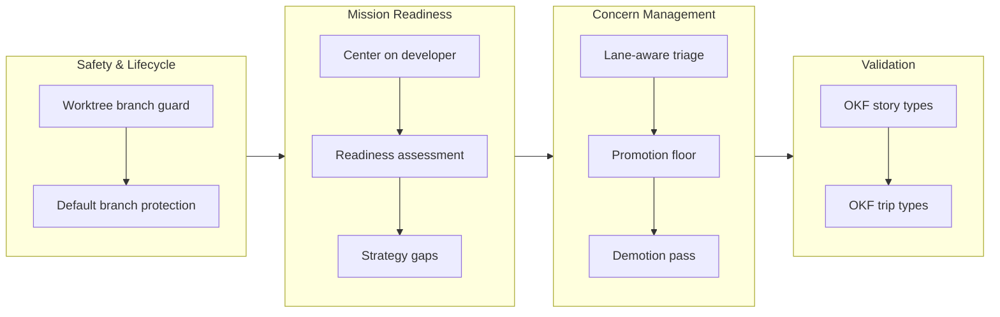

## 1. Overview

This branch hardens the mission lifecycle and concern-management system with lifecycle guards, developer-centric views, and intelligent triage. Five interconnected improvements: worktree cleanup now protects the default branch; bare `/mission` opens a working planning session centered on the developer with replan loops and strategy-gap discussion; concern triage is now lane-aware so teammates don't fire prompts on each other; a promotion floor prevents corpus growth while a reversible demotion pass shrinks already-bloated corpora; and stories/trips gain OKF type validators to enforce conformance across repo installs.

**Highlights:**

1. Guard the default branch during worktree teardown — prevents accidental `main` deletion while still removing ephemeral work branches
2. Recenter bare `/mission` as a developer readiness session — status → replan every assigned mission to drive-ready → strategy-gap discussion → hand off to overnight `/goal /monitor ok`
3. Lane-aware concern triage — the prompt fires on the actor's own mission lane, not the global total, so teammates' concerns don't interrupt each other
4. Concern promotion floor (moderate+) — the story keeps every concern, but only ones clearing the bar enter the tracked corpus, stopping append-only growth
5. Reversible, developer-confirmed demotion pass — shrinks an already-bloated corpus toward the curated set without losing audit history, plus OKF `type` validators for stories and trips

## 2. Motivation

The concern corpus and mission workflows grew organically from `/drive` and `/report` use, but at scale revealed friction: worktree cleanup was dangerous (it deleted whatever branch a torn-down worktree sat on, which for a `/ship`-parked mission worktree was `main`), developers had no single session to assess readiness and plan the roadmap, concern triage fired across teams causing unnecessary interrupts, and the corpus grew append-only with no rebalancing mechanism. This branch tackles each seam: safety guards on destructive operations; reshaping `/mission` from a report into a grounded planning session; making triage lane-aware and collaborative; and a dual-gate model where the promotion floor prevents future growth while the demotion pass (developer-confirmed, reversible) shrinks existing bloat. OKF validators complete the picture by catching conformance gaps at write time across all installs. The through-line: prevention at the creation seam beats disposal heroics after the fact.

## 3. Changes

Work progressed through four focused phases: lifecycle safety (protecting branch integrity during worktree cleanup), mission readiness (reshaping `/mission` into a planning session with replan loops and strategy discussion), concern management (lane-scoped triage plus dual gates at the promotion and demotion seams), and OKF validation (type enforcement at write time). Each phase built on prior work to address scale friction in the mission and concern workflows, with the hermetic test suite tracking correctness across the decomposition (1289 passing).

### 3-1. Worktree cleanup must never delete the default branch ([ee02ee8a](https://github.com/qmu/workaholic/commit/ee02ee8a))

`cleanup-mission-worktree.sh` now deletes a branch only when it matches the ephemeral `work-YYYYMMDD-HHMMSS` pattern; `main` or any hand-made branch is kept and reported via a new `branch_kept_reason`. Fixes the local-`main` deletion that occurred when a `/ship`-parked mission worktree was torn down.

### 3-2. Center bare `/mission` on the current developer; retire `summary` ([187631e7](https://github.com/qmu/workaholic/commit/187631e7))

Bare `/mission` renders a two-tier view from `list.sh`'s computed `relation` field — full treatment (progress, next step, changelog movement) for the caller's and unclaimed active missions, one-liners for others' and archived. The near-duplicate `summary` mode is retired into this view; `summary.sh` survives as the shared assignee-gate reference.

### 3-3. Reduce deferred-concern pile-up (lane scoping shipped; four mechanisms decomposed) ([d0406e0b](https://github.com/qmu/workaholic/commit/d0406e0b))

This mission-sized ticket's safe, high-value mechanism — lane/owner scoping — shipped: concerns carry an `owner` (inherited from the story's mission assignee at extraction), and `list-active` is lane-aware (`my_lane_count`/`owner_counts`, lane-scoped `should_triage`) so one developer's concerns don't fire the triage prompt on another. The other four mechanisms (corpus-wide judge, executable `verify_command`, aggregate hygiene, staleness decay) were decomposed into follow-up tickets — later all abandoned in favor of the promotion-floor prevention approach; `verify_command` was flagged as a code-execution surface not to be built.

### 3-4. Bare `/mission` becomes a readiness session ([f84d69bb](https://github.com/qmu/workaholic/commit/f84d69bb))

Bare `/mission` opens a four-step planning session: status explanation → replan loop (each not-ready assigned mission through its existing replan flow) → an honest `N/M assigned missions drive-ready` reconciliation → hand off to `/goal /monitor ok` (never `/drive`, which is ambiguous from the root worktree). `list.sh` gains computed `ready`/`ready_reason` so the session drives its loop with no inline logic.

### 3-5. `/mission` closes with a strategy gap discussion ([27a7bde5](https://github.com/qmu/workaholic/commit/27a7bde5))

After readiness, the session turns upward: `strategy/list.sh` gains a computed `active_missions` field, and an active strategy with no active mission surfaces as a gap for a grounded discussion (from the strategy's Direction and recent reflections) that flows into mission creation — discussion always, automation never.

### 3-6. Add story and trip OKF `type` validators ([9c6c4a1f](https://github.com/qmu/workaholic/commit/9c6c4a1f))

`validate-story.sh` and `validate-trip.sh` (PostToolUse Write|Edit) enforce the OKF `type` floor on new writes while grandfathering git-tracked history (an already-tracked file is exempt; only a fresh write is held to the floor). Registered in `hooks.json`; the release-note and concern writers already emit their `type`.

### 3-7. Concern promotion floor: the story keeps everything, the corpus promotes only what clears the bar ([856bf9e1](https://github.com/qmu/workaholic/commit/856bf9e1))

`extract-deferred-concerns.sh` promotes a new concern to the tracked corpus only at `moderate`+ severity or with an explicit `Keep: true`; `low` concerns stay in the story (counted `story_only`). `CONCERN_PROMOTE_MIN` knob (default `moderate`). The section-6 authoring guidance reframes severity as the balance dial. This is the prevention half — stopping the pile from growing — with nothing lost, since the story records everything.

### 3-8. Developer-confirmed concern demotion pass ([3e904b30](https://github.com/qmu/workaholic/commit/3e904b30))

`propose-demotions.sh` (read-only) lists active concerns at or below a severity floor; `demote-concern.sh` moves a confirmed concern to `concerns/archive/` as `status: demoted` — reversible, distinct from `resolved`/`accepted`. Wired into `/report` Phase 1b as a developer-confirmed bucket; demoted concerns are excluded from `list-active` and never resurrected by extraction. This shrinks an already-bloated corpus without losing history.

## 4. Outcome

- **Mission workflow redesigned for developer clarity**: bare `/mission` shifted from list-all to a planning session (status → per-mission replan → drive-readiness reconciliation) with strategy-gap discussion and a `/goal /monitor ok` hand-off, centering output on the caller's own missions and next actions.
- **Concern corpus lifecycle made sustainable**: the immutable story (keeps all concerns) is separated from the tracked corpus (promotes only `moderate`+ or explicitly-kept); lane-aware triage scopes concerns to their owner's lane; a reversible demotion pass rebalances existing bloat.
- **Worktree safety hardened**: branch deletion is guarded to ephemeral `work-*` branches only; shared refs like `main` are preserved with the reason reported.
- **Artifact format enforcement closed**: new validators for stories and trips, git-tracked-ness grandfathering for history, OKF `type` now enforced at write time.
- **Readiness derived, not stored**: readiness facts computed on demand from existing readers; concern owner denormalized at extraction for fast lane filtering.

## 5. Historical Analysis

- **Mission model maturation** (work-20260714 era): mission-worktree binding and cleanup scripts introduced; `/ship` parking worktrees on `main` created the downstream hazard this branch's branch-deletion guard closes.
- **Strategy layer foundation** (v1.0.99): strategy artifacts, the mission `strategy:` relation, and the reflection mechanism are the machinery the `/mission` readiness session now reads to examine sufficiency gaps.
- **Deferred-concern audit (this session)**: a cross-repo adoption audit revealed conformance gaps at repos on older/un-updated plugins; this branch imports the findings (format enforcement, lane scoping, promotion floor) to prevent pile-up by design instead of by cleanup heroics.
- **Concern disposition patterns**: the `accepted`/`resolved`/`superseded` lifecycle was append-only; this branch adds the reversible `demoted` status and the story/corpus split to rebalance tracking without data loss.

## 6. Concerns

### (carried from PR #88) Compound concern IDs are only collision-checked at mint time

- **Severity:** low
- **Description:** `merge-concerns.sh` refuses a compound-id collision when minting, but hand-authored or hand-edited concern files are never re-checked, so a manually created duplicate id would go unnoticed until it misroutes an update.
- **How to Fix:** Add a duplicate-id warning to `list-active-deferred-concerns.sh`'s identity migration pass, where every file is already read.

### (carried from PR #91) Goal-gate false-done has a harness-side residual

- **Severity:** moderate
- **Description:** The `/goal <token>` Stop hook is satisfied the moment the agent emits a token, even when the underlying objective is materially incomplete. The repo-side half (honest /monitor terminal signals derived from status.sh) has shipped; the `/goal` harness-side corroboration (gate must not clear on a self-emitted token alone) remains.
- **How to Fix:** Raise token-vs-observable-state Stop-gate corroboration with the Claude Code harness; workaholic has no further repo-side actionable work.

### (carried from PR #88) Monitor's contract is verified only by prose sentinels while its side-effecting dev-env lifecycle has no functional coverage

- **Severity:** moderate
- **Description:** Monitor orchestrates leaf work across worktrees and allocates dev environment ports; the pre-flight reevaluation, mission-state tracking, and environment lifecycle are validated by cross-references in prose, not executable tests. Recent branches added new side-effecting monitor/mission scripts but no hermetic tests for monitor's dev-env allocation/cleanup, reevaluation, or worktree-isolation seams; that functional surface stays uncovered.
- **How to Fix:** Add hermetic tests for monitor's functional seams: reevaluation logic, worktree isolation, and dev-environment allocation and cleanup.

### (carried from PR #88) Monitor's decision loop has no cross-run deferral memory

- **Severity:** moderate
- **Description:** The front-loaded batch asks blockers one batch in one run, but nothing makes a deferral sticky across invocations; a caller-side loop (e.g. `/goal /monitor ok`) would re-ask the same deferred decisions every cycle. The reflection mechanism records causes but deliberately does not make a deferred decision sticky — cross-run deferral memory for escalations remains unaddressed.
- **How to Fix:** Record deferred decisions in the run report and have the next invocation re-ask only when the underlying state changed (or after N runs), so deferral is remembered rather than re-litigated every loop.

### Summary's engine survives as a single-source gate

- **Severity:** low
- **Description:** The `summary` subcommand was retired (20260721161212) but `summary.sh` survived because monitor's Scope section and the mission lens both cite it as the canonical "not somebody else's" gate. Removing the script would leave two dangling references — the pattern outlives the surface.
- **How to Fix:** Grep for *script* consumers before removing an engine; a folded-away command mode can leave its script alive as a single-source gate other subsystems depend on.

## 7. Successful Development Patterns

- **Readiness is fully derivable from signals, not stored state**: readiness (`ready`/`ready_reason`) lives in `list.sh`, derived from status + total + `drive_authorized`. Pushing the boolean into the reader keeps the command pure orchestration — a clean application of the Shell Script Principle.
- **Denormalize at write time, compare at read time**: the mission lens reads `assignee` rather than re-deriving ownership; lane scoping denormalized concern `owner` at extraction so the hot listing path never resolves a mission per concern.
- **The story/corpus split prevents data loss while rebalancing**: keeping every concern in the immutable story while promoting only `moderate`+ to the tracked corpus lets the bar move without losing anything — a general pattern for "keep everything, track only what clears a bar".
- **Git-tracked-ness is a clean stateless grandfathering primitive**: for artifacts with no todo/archive split (stories, trips), reading whether a file is tracked cleanly grandfathers history — tracked = published, exempt; untracked = fresh write, held to the floor.
- **Prevention at the creation/promotion seam beats disposal heroics**: when a corpus grows without bound, look for the missing gate at creation/promotion rather than building auto-close machinery. The promotion floor stops growth; demotion handles existing piles — but prevention is cheaper than cleanup, which is why the four disposal mechanisms were abandoned.
- **Reversibility is the safety property for re-shelving**: demotion reuses the `archive/` sink but with a distinct `status: demoted`, so reversible re-shelving stays separate from resolution (which asserts a won't-fix). Keeping the two dispositions distinct keeps the archive honest.

## 8. Release Preparation

**Verdict**: Ready for release

### 8-1. Concerns

- The branch-safety scan returns `block` on a single override-tier finding: too-large-commit on the `main` merge commit `b97c7c66` (benign incoming history, not oversized new work). No secret or leak findings.

### 8-2. Pre-release Instructions

- On `/ship`, consciously accept the size override for the oversized merge commit `b97c7c66` (it is a legitimate merge of `main`, not new bulk work).

### 8-3. Post-release Instructions

- None - no special post-release actions needed

## 9. Notes

All 8 archived tickets are complete; suite green (1289 passed, 0 failed); `outputs/` in lockstep; `verify.mjs` and `validate-metadata.mjs` pass. Version bumped to 1.0.100. The concern-lifecycle work reframed mid-branch from disposal to prevention: the promotion floor (prevent growth) plus the demotion pass (shrink existing) replaced the four disposal mechanisms, which were abandoned — the `verify_command` one because running a command read from a repo file is a code-execution surface.

## Deployment Evidence

- **When:** 2026-07-22T17:08:43+09:00
- **By:** a@qmu.jp
- **Target:** release-scan
- **Method:** override
- **Status:** bypassed
- **Observed:** findings overridden: too-large-commit on b97c7c66 (2722 lines > 500) — the merge of origin/main into this branch, benign incoming history; no secret or leak findings

## Deployment Evidence

- **When:** 2026-07-22T17:14:15+09:00
- **By:** a@qmu.jp
- **Target:** Workaholic marketplace plugin
- **Method:** other (deploy-on-merge pre-merge proof)
- **Status:** pass
- **Observed:** outputs/ fresh after rebuild; verify.mjs pass; validate-metadata.mjs pass; test-workflow-scripts.mjs 1289 passed 0 failed; version 1.0.100 consistent across lockstep files, no collision with main (1.0.99), tag v1.0.100 free; scan: size override recorded (merge commit), no secret/leak findings
