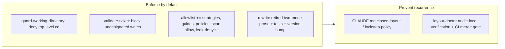

## 1. Overview

This branch closes the gap between "a guard exists" and "a guard is active": the working-directory guard and the `.workaholic/` layout gate stop being advisory-by-default with an environment-variable escalation and become blocking by construction whenever the plugin is installed. It then adds the change-author policy — closed-layout, lockstep registration — plus a merge-gating audit that keeps the two layout sources of truth from drifting again, the drift that let `strategies/` ship unregistered in the first place.

**Highlights:**

1. Both guards now block **unconditionally** — enforcement is built into the plugin code, so "plugin installed = guard active", with no `WORKAHOLIC_ENFORCE_CWD` / `WORKAHOLIC_STRICT_LAYOUT` / `.strict-layout` opt-out that fails open exactly when it is not set
2. The layout allowlist is reconciled against a real `layout-doctor` run: `strategies`, `guides`, `policies`, and the release-scan root files (`scan-allow`, `leak-denylist`) are registered, so legitimate writes still pass
3. A verifiable CLAUDE.md policy makes a new `.workaholic/` artifact directory a lockstep amendment to **both** sources of truth in the same change
4. `layout-doctor.sh` is wired into local verification **and** a `Validate Plugins` CI gate that fails the merge on a drifted allowlist — drift is caught before it surfaces as a guard block

## 2. Motivation

An environment-variable toggle is the wrong shape for a guard: it is a per-machine, per-shell prerequisite that is absent — and therefore fails open — exactly when the guard is needed (a fresh clone, another machine, a differently-launched session, a forgotten export), and advisory text is something an LLM agent simply ignores. The prior opt-in-blocking work had already recorded that the advisory was "insufficient to hold an agent to the ground rule." Meanwhile the concrete cost of an unenforced layout source of truth had already been paid: `strategies/` shipped live — its own skill and `create.sh` writing `.workaholic/strategies/active/` — while both the allowlist and the `rules/workaholic.md` table stayed stale, because no policy elevated lockstep registration to a change-author rule and no gate failed a merge on the drift.

## 3. Changes

The branch runs in two moves: first make the guards actually enforce (and reconcile the allowlist so nothing legitimate is caught by the flip), then encode the rule that keeps the layout source of truth honest and back it with a merge gate.

### 3-1. Enforce the working-directory and layout guards by default, removing the env-var opt-outs ([b78b4d84](https://github.com/qmu/workaholic/commit/b78b4d84))

`guard-working-directory.sh` now denies a top-level cwd-moving `cd` unconditionally, and `validate-ticket.sh` now blocks a write into an undesignated `.workaholic/` subdirectory unconditionally — the `WORKAHOLIC_ENFORCE_CWD`, `WORKAHOLIC_STRICT_LAYOUT`, and `.strict-layout` opt-outs are removed and grep-clean across `plugins/`. Match sets are unchanged (subshell / absolute path / `--prefix` still pass), the allowlist gains `strategies`/`guides`/`policies` plus the `scan-allow`/`leak-denylist` root files so `layout-doctor` reports the tree conforming, and the retired two-mode design is rewritten out of every doc that described it, with the hermetic suite (1293 tests) and the version bump to 1.0.101 riding along.

### 3-2. Add a CLAUDE.md policy: a new .workaholic/ artifact directory is a lockstep amendment ([cfa98e5d](https://github.com/qmu/workaholic/commit/cfa98e5d))

A new `### Closed .workaholic/ layout (lockstep registration)` policy states, as a rule an auditor can check, that introducing a new top-level artifact directory must register it in both `hooks/workaholic-layout-allowlist.txt` and the `rules/workaholic.md` table in the same commit, that the guards are load-bearing (enforced-by-default, so a stale allowlist is a correctness bug), and that `layout-doctor.sh` is the named anti-drift audit — now wired into the Local Verification commands and a `Validate Plugins` CI step that fails the merge on `conforming: false`.

## 4. Outcome

The two guards that back the workaholify ground rules are now enforced identically on every machine and fresh clone, with no injectable opt-out to fall open. The `.workaholic/` layout has a change-author policy and a merge gate that together make the `strategies/`-style drift a caught error rather than a latent correctness bug, and the allowlist is reconciled with the repo's actual tree. This is a deliberate hard behavioral change: sessions that relied on advisory `cd` reminders will now be blocked on a top-level `cd` and must use a `( cd … )` subshell, an absolute path, or a `--prefix` command.

## 5. Historical Analysis

This branch is the third step in a lineage: `20260626124305-enforce-workaholic-layout-allowlist` introduced the allowlist and the layout gate in warn mode; `20260720153729-guard-working-directory-opt-in-blocking` added the opt-in blocking mode and recorded that advisory text alone cannot hold an agent to the ground rule. This branch acts on that recorded finding — removing the opt-in seam entirely — and adds the policy-plus-gate layer that the earlier allowlist work lacked, so the source of truth it introduced is now enforced rather than decorative.

## 6. Concerns

### (carried from PR #88) Monitor's contract is verified only by prose sentinels while its side-effecting dev-env lifecycle has no functional coverage

- **Severity:** moderate
- **Description:** Monitor orchestrates leaf work across worktrees and allocates dev-environment ports; the pre-flight reevaluation, mission-state tracking, and environment lifecycle are validated by cross-references in prose, not executable tests. This branch is guards/layout only and adds no coverage for that surface.
- **How to Fix:** Add hermetic tests for monitor's functional seams: reevaluation logic, worktree isolation, and dev-environment allocation and cleanup.

### (carried from PR #88) Monitor's decision loop has no cross-run deferral memory

- **Severity:** moderate
- **Description:** The front-loaded batch asks blockers once per run, but nothing makes a deferral sticky across invocations, so a caller-side loop (e.g. `/goal /monitor ok`) would re-ask the same deferred decisions every cycle. Untouched by this branch.
- **How to Fix:** Record deferred decisions in the run report and have the next invocation re-ask only when the underlying state changed (or after N runs).

### (carried from PR #88) Compound concern IDs are only collision-checked at mint time

- **Severity:** low
- **Description:** `merge-concerns.sh` refuses a compound-id collision when minting, but hand-authored or hand-edited concern files are never re-checked, so a manually created duplicate id would go unnoticed until it misroutes an update. Untouched by this branch.
- **How to Fix:** Add a duplicate-id warning to `list-active-deferred-concerns.sh`'s identity migration pass, where every file is already read.

### (carried from PR #91) Goal-gate false-done has a harness-side residual

- **Severity:** moderate
- **Description:** The `/goal <token>` Stop hook is satisfied the moment the agent emits a token, even when the underlying objective is materially incomplete. The repo-side half has shipped; the harness-side corroboration remains and is outside workaholic's repo-side reach.
- **How to Fix:** Raise token-vs-observable-state Stop-gate corroboration with the Claude Code harness; workaholic has no further repo-side actionable work.

### guides/ and policies/ enter the shipped canonical allowlist despite not being plugin-generated

- **Severity:** low
- **Description:** To make `layout-doctor` report this repo's tree conforming, `guides` and `policies` were added to the shipped `hooks/workaholic-layout-allowlist.txt` (see [b78b4d84](https://github.com/qmu/workaholic/commit/b78b4d84)), which permits those directories in **every** consuming repo even though they are this repo's project-local docs, not plugin artifacts — a documented exception to the allowlist's "grounded in code" invariant. The allowlist is permissive (it permits, it does not require), so the blast radius is small, but the invariant is now weaker.
- **How to Fix:** If cross-repo purity matters more than this repo's `layout-doctor` cleanliness, keep `guides`/`policies` out of the shipped allowlist and instead relocate this repo's `.workaholic/guides` and `.workaholic/policies` content under an already-canonical area (e.g. `specs/`).

## 7. Successful Development Patterns

- Reconciling the allowlist against a **real** `layout-doctor` run before flipping the gate to blocking surfaced four unregistered items (`guides`, `policies`, `scan-allow`, `leak-denylist`) beyond the one the ticket named — auditing the actual tree, not the assumed one, is what kept the flip from hard-blocking legitimate writes.
- Pairing the behavioral change (enforce by default) with a policy-plus-gate in a separate ticket kept the two concerns cleanly separated: one commit makes the guard load-bearing, the next makes the source of truth it enforces impossible to drift silently.
- Letting the guard take effect on the running session was an unplanned but useful smoke test — a subsequent top-level `cd` in the same drive was denied, confirming the enforcement path end-to-end before any test ran.

## 8. Release Preparation

**Verdict**: Ready for release

### 8-1. Concerns

- None that block release. The release-safety scan passes (`{"verdict": "pass"}`); the carried concerns are unrelated to this branch, and the one new concern is a documented `low` trade-off.

### 8-2. Pre-release Instructions

- None — version is already bumped to 1.0.101 across all manifests and `outputs/` is regenerated in-lockstep.

### 8-3. Post-release Instructions

- This is a hard behavioral change: after release, existing sessions/agents that relied on advisory `cd` reminders will be blocked on a top-level `cd`. No action required, but expect the enforced path and use `( cd … )` subshells / absolute paths.

## 9. Notes

The version bump to 1.0.101 rode inside ticket 1's commit ([b78b4d84](https://github.com/qmu/workaholic/commit/b78b4d84)) rather than a standalone "Bump version" commit, so `/report` did not add a second bump.

## Deployment Evidence

- **When:** 2026-07-22T19:48:23+09:00
- **By:** a@qmu.jp
- **Target:** Workaholic marketplace plugin
- **Method:** other (deploy-on-merge pre-merge proof)
- **Status:** pass
- **Observed:** Pre-merge proof green: build fresh with outputs/ clean, verify.mjs + validate-metadata.mjs pass, 1293 hermetic tests pass, v1.0.101 consistent across all five lockstep files
