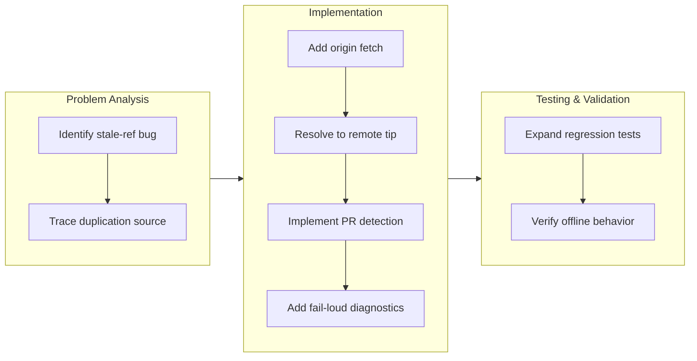

## 1. Overview

The branch resolved a synchronization gap in mission-worktree creation where local refs could drift from remote state, causing duplicate work by masking already-merged PRs. The fix ensures worktrees are always created from the latest merged state by fetching origin and resolving the base to the remote tip, while gracefully falling back for offline-only repos. Sibling-PR detection was added to surface related in-flight work during mission replanning.

**Highlights:**

1. Mission-worktree base resolution now fetches origin and prefers `origin/<base>`, preventing silent work duplication from stale local branches
2. Added `list-related-prs.sh` to surface open PRs already touching the same mission slug during `/mission` replan
3. A configured-but-unreachable origin now fails loud with a clear diagnostic instead of silently using a stale ref
4. Offline and local-only repos remain functional, detected and surfaced separately
5. Regression suite expanded with `testMissionWorktreeFetchFirst` covering the fetch-first behavior

## 2. Motivation

Mission-worktree creation relied on local git state — a dangerous assumption in distributed development where different desks may sit at different merge points. When a developer's local `main` trailed `origin/main`, the worktree was seeded from a stale base, blind to PRs already merged upstream and to the rulings already recorded in origin's `mission.md`. This produced duplicate implementation that later needed a unification merge. The work prioritizes correctness — fail loud on misconfiguration — over convenience, so every worktree starts from the actual merged tip rather than a desk's snapshot of local history.

## 3. Changes

The developer diagnosed a synchronization issue where mission-worktree creation used stale local refs, causing work to be duplicated when changes had already merged upstream. The fix adds an origin fetch step and resolves the worktree base to the remote branch tip, with diagnostics for unreachable remotes. Sibling-PR surfacing was added to help detect related in-flight work during mission replanning. Regression tests validate both the fetch-first path and the fallback behavior for offline repos.

### 3-1. Fetch origin before resolving the mission-worktree base commit ([dd5335a1](https://github.com/qmu/workaholic/commit/dd5335a1))

`create-mission-worktree.sh` now fetches origin (when configured) and resolves the base to `origin/<base>` — the merged tip — instead of preferring a possibly-stale local ref; a configured-but-unreachable origin fails loud rather than seeding from stale state, and a no-origin local repo still works from its local ref, surfaced on stderr. A new `list-related-prs.sh` is wired into the `/mission` replan flow so a session sees open PRs already touching the same mission slug before emitting duplicate delta tickets, and `testMissionWorktreeFetchFirst` locks in the fresh-from-origin, unreachable-fails-loud, and no-origin-fallback behaviors.

## 4. Outcome

- Fetch origin before resolving the mission-worktree base: `create-mission-worktree.sh` now fetches the base branch from origin and prefers `origin/<base>` as the source of truth, preventing mission worktrees from being cut from stale local refs.
- Fail loud on unreachable origin: when origin is configured but unreachable, the script exits with a JSON error rather than silently falling back to a stale local ref.
- Added `list-related-prs.sh` for sibling-PR surfacing: `/mission` replan now surfaces open PRs touching the same mission slug, so a session notices a sibling implementation before duplicating effort.
- Regression coverage: `testMissionWorktreeFetchFirst` forces a local `main` several commits behind `origin/main` and asserts the worktree base contains the origin-only commits, plus the unreachable-origin and no-origin rows.
- All verification gates green: `build.mjs` + `verify.mjs` + `validate-metadata.mjs` + `test-workflow-scripts.mjs` (1301 passed / 0 failed) + `layout-doctor.sh` conforming.

## 5. Historical Analysis

The prior behavior of silently using a stale local ref when origin was not fetched reflects an implicit-over-explicit default that has produced silent staleness elsewhere in the repo (the same class the report/scan pipeline's `base-ref.sh` addressed by preferring `origin/<default>`). This fix reinforces the fail-loud-over-silent-stale principle, using two probes to distinguish a recoverable failure (missing base ref) from a critical one (unreachable origin). The sibling-PR surfacing continues the pattern of exposing hidden state at a decision point rather than only reporting after duplication has already occurred.

## 6. Concerns

### (carried from PR #88) Compound concern IDs are only collision-checked at mint time

- **Severity:** low
- **Description:** `merge-concerns.sh` refuses a compound-id collision when minting, but hand-authored or hand-edited concern files are never re-checked, so a manually created duplicate id would go unnoticed until it misroutes an update. (See PR #88)
- **How to Fix:** Add a duplicate-id warning to `list-active-deferred-concerns.sh`'s identity migration pass, where every file is already read.

### (carried from PR #91) Goal-gate false-done has a harness-side residual

- **Severity:** moderate
- **Description:** The `/goal <token>` Stop hook is satisfied the moment the agent emits a token, even when the underlying objective is materially incomplete. The repo-side half has shipped; the harness-side corroboration remains and is outside workaholic's repo-side reach. (See PR #91)
- **How to Fix:** Raise token-vs-observable-state Stop-gate corroboration with the Claude Code harness; workaholic has no further repo-side actionable work.

### (carried from PR #88) Monitor's contract is verified only by prose sentinels while its side-effecting dev-env lifecycle has no functional coverage

- **Severity:** moderate
- **Description:** Monitor orchestrates leaf work across worktrees and allocates dev-environment ports; the pre-flight reevaluation, mission-state tracking, and environment lifecycle are validated by cross-references in prose, not executable tests. This branch adds no coverage for that surface. (See PR #88)
- **How to Fix:** Add hermetic tests for monitor's functional seams: reevaluation logic, worktree isolation, and dev-environment allocation and cleanup.

### (carried from PR #88) Monitor's decision loop has no cross-run deferral memory

- **Severity:** moderate
- **Description:** The front-loaded batch asks blockers once per run, but nothing makes a deferral sticky across invocations, so a caller-side loop (e.g. `/goal /monitor ok`) would re-ask the same deferred decisions every cycle. Untouched by this branch. (See PR #88)
- **How to Fix:** Record deferred decisions in the run report and have the next invocation re-ask only when the underlying state changed (or after N runs).

### Unreachable configured origin now hard-fails mission-worktree creation

- **Severity:** moderate
- **Description:** When origin is configured but unreachable, `create-mission-worktree.sh` hard-fails with a JSON error, giving no offline escape hatch for a developer working offline with a remote configured (see [dd5335a1](https://github.com/qmu/workaholic/commit/dd5335a1) in `plugins/workaholic/skills/branching/scripts/create-mission-worktree.sh`). The ticket explicitly mandates fail-loud over silent-stale, but this is a real usability trade-off.
- **How to Fix:** If this bites in practice, relax to a loud local fallback (stderr note + proceed) rather than a hard failure, which still satisfies the quality gate's "without loudly reporting why" clause.

### Sibling-PR detection depends on the mission slug appearing in a PR title or body

- **Severity:** moderate
- **Description:** `list-related-prs.sh` surfaces open PRs whose title or body contains the mission slug (see [dd5335a1](https://github.com/qmu/workaholic/commit/dd5335a1) in `plugins/workaholic/skills/mission/scripts/list-related-prs.sh`), but a PR that implements the mission without naming the slug is not surfaced — and `available: false` (no `gh`/auth/remote) is *unknown*, not *no siblings*. Duplicate effort could still be discovered only after both merge.
- **How to Fix:** Cross-reference the mission's ticket filenames (from each PR's story `tickets:` relation) in addition to slug-name matching, and treat `available: false` as an explicit "check did not run" signal in the replan prompt.

## 7. Successful Development Patterns

- **Two-axis probe distinguishes actionable from transient failures:** separating `git ls-remote` (reachability) from a targeted `git fetch origin <base>` (base-ref existence) distinguishes "origin unreachable" (fail loud) from "origin reachable but missing base ref" (surfaced local fallback) without collapsing one into the other.
- **Prefer-first ordering is load-bearing:** adding a fetch alone without reordering to prefer `origin/<base>` first would still cut from a stale local ref whenever one existed. Both the fetch and the reordering are essential; the regression test pins this by forcing exactly the stale-local scenario and asserting the worktree parents off `origin/main`.
- **Offline-with-remote is a deliberate, recorded trade-off:** accepting that a genuinely offline developer with a configured remote cannot cut a mission worktree until origin is reachable honors the fail-loud principle and makes the trade-off explicit in the ticket's Final Report rather than silent in the code.

## 8. Release Preparation

**Verdict**: Ready for release

### 8-1. Concerns

- None — changes are safe for release. Branch-safety scan passes (no secret/size/leak findings), all verification is green, and doc-drift reports no unaddressed candidates (the mission `SKILL.md` and `commands/mission.md` were updated in the same change).

### 8-2. Pre-release Instructions

- None — standard release process applies.

### 8-3. Post-release Instructions

- None — no special post-release actions needed.

## 9. Notes

The version was bumped to 1.0.102 in this branch; `outputs/` was regenerated so the Codex manifest matches. The two carried monitor concerns (#88) and the goal-gate residual (#91) remain out of this branch's scope and were re-judged `still_active`.

## Deployment Evidence

- **When:** 2026-07-23T02:25:25+09:00
- **By:** a@qmu.jp
- **Target:** Workaholic marketplace plugin
- **Method:** other (pre-merge branch proof)
- **Status:** pass
- **Observed:** outputs fresh (porcelain empty); verify.mjs + validate-metadata.mjs pass; test-workflow-scripts.mjs 1301 passed/0 failed; version 1.0.102 consistent across all lockstep files; v1.0.102 not yet published (correct pre-merge)
