## 1. Overview

Phase 1 of the loop-engineering reorganization (decision record: `docs/loop-engineering-workflow.md`): workaholic's artifact substrate moves from the developer-interrogated strategy→mission hierarchy to a feedback-driven model. The branch introduces `feedbacks/` as a first-class immutable artifact stream, returns mission ownership to the mission's own plural `assignees`, and retires the strategy layer with a living migration that preserves every strategy document as feedback. It also carries the full decision record of the reorganization (four decision rounds) and the sibling ownership-model branch it supersedes.

**Highlights:**

1. `feedbacks/` is live: one immutable record per entry (`kind` + `source` axes, `supersedes` instead of status flips), with an internal skill, a `/feedback` command, a PostToolUse validator, OKF indexing, and same-commit closed-layout registration
2. Mission ownership is carried on the mission itself (`assignees`, creator-seeded, co-ownable), resolved through the unchanged single oracle — no consumer needed any change
3. The strategy layer is retired end to end: living migration (strategy → verbatim feedback record, assignees folded down), validator floor and `/mission` flows updated, skill deleted, allowlist/rules in lockstep, docs swept (−4,100 lines)

## 2. Motivation

workaholic is evolving from a per-developer plugin into a team development engine: humans continuously supply feedback — design conclusions, chat instructions, development-born concerns, customer material — and the AI turns that stream into proposed missions, discusses them in Slack, and implements approved ones through an autonomous `/drive` loop (decision record, decided 2026-07-28). Everything later (the proposal batch, the draft/approval flow, the Drive-Every-5-Minutes routine) reads the feedback corpus, so the corpus had to exist first; direction accreting in feedback made a second direction artifact above missions a drift risk, so the strategy layer — shipped only a week earlier — was deliberately inverted out; and with that layer going, ownership needed its home back on the mission.

## 3. Changes

```mermaid
flowchart LR
  subgraph S1[Feedback stream]
    direction TB
    a1[feedback skill: create.sh / list.sh]
    a2[/feedback command/]
    a3[validate-feedback.sh floor]
    a4[allowlist + rules lockstep]
  end
  subgraph S2[Ownership returns]
    direction TB
    b1[mission-owners.sh: own assignees first]
    b2[create.sh seeds the creator]
    b3[consumers unchanged via the oracle]
  end
  subgraph S3[Strategy retirement]
    direction TB
    c1[migrate-strategies.sh living migration]
    c2[strategy -> verbatim feedback record]
    c3[skill deleted, floors + docs swept]
  end
  S1 --> S2 --> S3
```

The work landed in strict dependency order: the feedback artifact first (the migration target must exist), then the ownership move (the oracle must resolve without strategies before they go), then the retirement itself. The branch also merges the previously unmerged ownership-to-strategy branch (`work-20260724-092537`) so the retirement operates on — and supersedes — the current doctrine rather than a stale base.

### 3-1. Add the feedback artifact and capture skill ([ef988253](https://github.com/qmu/workaholic/commit/ef988253))

Introduces `feedbacks/` as the unified inbound stream of project context: one immutable file per record with `type: Feedback`, a `kind` axis (insight/instruction/concern/material/answer), a `source` axis (meeting/slack/discussion), and an optional `supersedes` reference replacing any status mutation. Ships the internal `feedback` skill (`create.sh`/`list.sh`), a thin `/feedback` command, the `validate-feedback.sh` write-time floor, OKF area indexing, and the closed-layout registration — and registers the 2026-07-28 reorganization conclusion as the repo's first real feedback entry.

### 3-2. Carry mission ownership on assignees ([5f7843d1](https://github.com/qmu/workaholic/commit/5f7843d1))

Returns ownership to the mission as a plural, co-ownable `assignees` list (creator-seeded — the approver is the default owner), reordering the single oracle `mission-owners.sh` to read the mission's own field first with the strategy hop demoted to a transition fallback. Because every consumer (mission lens, `/monitor` scope, `summary.sh`, `list.sh`, validator floor, ship's concern lane) reads through the oracle, no consumer changed.

### 3-3. Retire the strategy layer ([25baa71c](https://github.com/qmu/workaholic/commit/25baa71c))

Removes strategy as an artifact layer: a living migration (`missions_migrate_strategies` in `lib/resolve.sh`, riding the seam every mission script already runs, plus a direct `migrate-strategies.sh` entry) preserves each strategy document verbatim as a feedback record and folds its `assignees` down into linked missions before removing the directory. The `/mission` create/replan flows lose their strategy-resolution steps, the validator floor drops the strategy-link requirement (legacy keys tolerated, never retro-blocked), `read-assignees.sh` relocates into the mission skill, the strategy skill is deleted, and allowlist/rules/docs move in the same commit. This repo's own strategy was migrated live.

## 4. Outcome

The loop-engineering foundation is complete: mission `loop-engineering-foundation` reports 3/3 acceptance. Any session can register feedback through a sanctioned writer with a machine-checked floor; ownership resolves mission-locally under both old and new data shapes; and the planning hierarchy is the three-layer commit → ticket → mission ladder with direction accreting in the feedback stream. 1,325 hermetic tests pass, build/verify/metadata gates are green, and `layout-doctor` reports a conforming tree with `strategies/` gone from structure but not from knowledge.

## 5. Historical Analysis

This branch deliberately inverts PR-era work only one week old: mission `reorganize-missions-under-strategies` (2026-07-21) introduced the strategy layer, and `work-20260724-092537` (merged into this branch) moved ownership onto it. The inversion is recorded forward — the mission skill's redefinition record now carries all three meanings of "mission" with dates and reasons — rather than by editing history, following the same pattern the 2026-07-21 redefinition itself established. The single-ownership-oracle design absorbed its second reversal at near-zero consumer cost, which is the strongest evidence yet for the "one reader per relation" convention this repo enforces.

## 6. Concerns

### (carried from PR #91) Goal-gate false-done has a harness-side residual

- **Severity:** moderate
- **Description:** The `/goal <token>` Stop hook is satisfied the moment the agent emits a token, even when the objective is materially incomplete. The repo-side half has shipped; the harness-side corroboration remains outside workaholic's reach. (See PR #91)
- **How to Fix:** Raise token-vs-observable-state Stop-gate corroboration with the Claude Code harness; no further repo-side actionable work.

### (carried from PR #88) Monitor's contract is verified only by prose sentinels while its side-effecting dev-env lifecycle has no functional coverage

- **Severity:** moderate
- **Description:** Monitor's pre-flight reevaluation, mission-state tracking, and dev-environment lifecycle are validated by cross-references in prose, not executable tests. Untouched by this branch — note the fourth-round decision (I1/G1) slates `/monitor` for retirement into the unified `/drive`, which will resolve or relocate this surface. (See PR #88)
- **How to Fix:** Add hermetic tests for the functional seams — or fold the requirement into the phase-3 `/drive` unification that absorbs them.

### (carried from PR #88) Monitor's decision loop has no cross-run deferral memory

- **Severity:** moderate
- **Description:** The front-loaded batch asks blockers once per run, but nothing makes a deferral sticky across invocations, so a caller-side loop would re-ask the same deferred decisions every cycle. Untouched by this branch; the `/drive` unification (phase 3) supersedes this loop. (See PR #88)
- **How to Fix:** Record deferred decisions in the run report and re-ask only when the underlying state changed — or resolve via the claim-branch protocol that replaces the loop.

### (carried from PR #95) Sibling-PR detection depends on the mission slug appearing in a PR title or body

- **Severity:** moderate
- **Description:** `list-related-prs.sh` surfaces open PRs by slug-name matching only, and `available: false` (no `gh`/auth/remote) is *unknown*, not *no siblings* — duplicate effort could be discovered only after both merge. (See PR #95)
- **How to Fix:** Cross-reference the mission's ticket filenames via each PR's story `tickets:` relation, and treat `available: false` as an explicit "check did not run" signal.

### (carried from PR #95) Unreachable configured origin now hard-fails mission-worktree creation

- **Severity:** moderate
- **Description:** `create-mission-worktree.sh` hard-fails when origin is configured but unreachable, leaving no offline escape hatch. Fail-loud was the mandated trade-off. (See PR #95)
- **How to Fix:** If this bites in practice, relax to a loud local fallback (stderr note + proceed) rather than a hard failure.

### (carried from PR #88) Compound concern IDs are only collision-checked at mint time

- **Severity:** low
- **Description:** Hand-authored concern files are never re-checked for duplicate ids, so a manual duplicate would go unnoticed until it misroutes an update. (See PR #88)
- **How to Fix:** Add a duplicate-id warning to `list-active-deferred-concerns.sh`'s identity-migration pass, where every file is already read.

### Installed-plugin lag makes new validators inert until this branch merges

- **Severity:** moderate
- **Description:** `validate-feedback.sh` and the updated `validate-ticket.sh`/`validate-mission.sh` only enforce once the installed plugin updates to this branch's code — until merge (and plugin refresh), a Write-tool feedback write is judged by the *old* hook set, and in repos that never update the plugin the feedback floor never fires at all (see [ef988253](https://github.com/qmu/workaholic/commit/ef988253) in `plugins/workaholic/hooks/validate-feedback.sh`). The same distribution gap previously left leak rules inert in uninstalled repos.
- **How to Fix:** Ship promptly and rely on marketplace auto-update; for the loop-engineering phases, make the 5-minute routine run from a checkout that tracks main so hooks are always current.

### Legacy strategy hop is gone before every repo has migrated

- **Severity:** low
- **Description:** `mission-owners.sh` no longer reads strategy `assignees`; a repo that installed the 2026-07-24 ownership model and has not yet touched a mission script would briefly show its strategy-owned missions as unowned/claimable until the living migration folds the assignees down (see [25baa71c](https://github.com/qmu/workaholic/commit/25baa71c) in `plugins/workaholic/skills/mission/scripts/mission-owners.sh`). No known repo besides this one ever created a strategy, so the practical exposure is near zero.
- **How to Fix:** None needed proactively; if a repo surfaces the symptom, any mission-script touch (e.g. `list.sh`) heals it.

## 7. Successful Development Patterns

- The single-oracle convention paid for itself twice: reordering `mission-owners.sh`'s tiers (ticket 2) and then deleting a tier (ticket 3) required zero consumer changes because every reader goes through one script — "one reader per relation" is worth enforcing even when it feels ceremonial
- "Nothing is deleted from knowledge, only from structure" made the layer removal safe to automate: converting each strategy document verbatim into a feedback record (deterministic filename from `created_at`, so the migration is idempotent) let the destructive step ride the existing living-migration seam without a human checkpoint
- Deciding the feedback schema's `kind` axis *before* the concern merger lands (H2) meant ticket 1 could ship a stable file shape — staged inversions stay cheap when the earlier ticket writes the later ticket's contract into frontmatter from day one
- Driving the elicitation as recorded decision rounds (`docs/loop-engineering-workflow.md`, rounds 1–4 with superseded rows struck through, never rewritten) gave every ticket a citable requirement source and made mid-flight reversals (B5, I8) auditable instead of silent

## 8. Release Preparation

**Verdict**: Needs attention before release

### 8-1. Concerns

- The branch-safety scan reports **size findings only** (all override-tier, no secrets): 179 files changed (> 100) and four commits over the 500 non-generated-changed-lines gate — `c2221021` (1,781; the merge of the sibling `work-20260724-092537` branch), `25baa71c` (1,351; the strategy-layer retirement sweep), `871b941f` (527; inherited from the merged sibling), `ef988253` (529; the feedback artifact). The oversized commits are structural (a branch merge, a layer removal, a new artifact type with tests and docs) rather than unreviewed bulk; `/ship` will require an explicit size override.
- This branch **contains** `work-20260724-092537` — merging it supersedes any separate ship of that branch; its PR (if any) should be closed as absorbed.

### 8-2. Pre-release Instructions

- None — standard release process applies (version already bumped to v1.0.105; no collision with main, which is at v1.0.104).

### 8-3. Post-release Instructions

- Refresh the installed plugin in active sessions so the new/updated hooks (`validate-feedback.sh`, feedbacks-aware `validate-ticket.sh`, strategy-free `validate-mission.sh`) take effect.
- Close mission `loop-engineering-foundation` (`/mission close` — achieved) after the merge, and start phase 2 (proposal loop + concern merger) from the decision record's roadmap.

## 9. Notes

The full reorganization rationale — four decision rounds, superseded defaults struck through in place, and the phased roadmap this branch is phase 1 of — is in `docs/loop-engineering-workflow.md`. The retired strategy's direction statement survives verbatim at `.workaholic/feedbacks/20260721033556-strategy-agent-orchestrated-development.md`, and the reorganization conclusion itself is the first feedback entry (`20260728202017-loop-engineering-reorganization-decided.md`) — the corpus this model runs on begins with its own founding decision.
