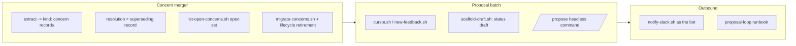

## 1. Overview

Phase 2 of the loop-engineering reorganization (decision record: `docs/loop-engineering-workflow.md`; phase 1 shipped as v1.0.105): the feedback stream becomes *productive*. The concern corpus merges into it as `kind: concern` records with superseding-record resolution (decisions H2/H3), and a headless proposal batch — the `/propose` command and `propose` skill — starts reading the stream, turning feedback newly merged to main into unowned **draft missions** with full `feedback:` traceability, announced to Slack as the bot, on a cursor that only advances after a successful push.

**Highlights:**

1. Concerns are feedback now: ship-time extraction appends `kind: concern` records (every severity, id-keyed, append-only), `/report` resolves by superseding record, the open set is computed as "not superseded", and the triage/demote/merge/re-grade machinery is deleted — with a living migration that folded this repo's real corpus in place
2. `/propose` exists and is headless by contract: runner-local cursor with a safe cold start, an exact added-records window, mission→feedback dedup, an unowned/unauthorized `status: draft` scaffold, and a written conservative judgment bar ("silence over noise")
3. The outbound half is wired: an env-driven Slack bot notifier that is never load-bearing (every failure a recorded no-op, token provably absent from output) plus the one-page 15-minute cron runbook

## 2. Motivation

Phase 1 built the stream; phase 2 makes it the system's working memory and its trigger. Two direction-of-truth corpora would drift, so the concern corpus had to fold into the stream before the proposal batch started reading it (H2), with resolution recast as append-only superseding records at the carry-over seams (H3). And the vision's central loop — humans talk, feedback lands on main, the AI proposes draft missions for humans to approve — needed its first executable: a batch that can run on a cron where nobody can answer a prompt, err toward silence, and leave an auditable trail from every draft back to the human words that caused it.

## 3. Changes

The order is the dependency: the batch reads the unified stream, and the notifier announces what the batch drafts.

### 3-1. Merge the concern corpus into the feedback stream ([f8967270](https://github.com/qmu/workaholic/commit/f8967270))

Executes decision H2/H3: ship-time extraction now appends `kind: concern` feedback records (all severities — the promotion floor retired; append-only, keyed on `concern_id`), `/report`'s judge seam writes superseding records instead of archive moves, and `feedback/scripts/list-open-concerns.sh` becomes the single, envelope-compatible reader of the computed open set. A living migration (`migrate-concerns.sh`, wired into both seams) converted this repo's live corpus — open concerns became open records, the archive became `closed:`-stamped history — and `concerns/` left the tree, allowlist, and rules table in the same commit. Seven lifecycle scripts (triage, merge, re-grade, close, demote ×2, identity migration) were deleted with their tests.

### 3-2. Add the proposal batch command and skill ([70bea0a4](https://github.com/qmu/workaholic/commit/70bea0a4))

The AI half of "humans supply feedback, the AI proposes": the internal `propose` skill (cursor with safe cold start and self-ignoring runner-local state, added-records window, `feedback:` single reader, cross-area dedup set, and a draft scaffold that is deliberately not `create.sh` — a draft predates approval and has no owner) plus the headless `/propose` command whose cursor advances only after a successful push. `status: draft` joins the mission schema as a first-class in-flight state (`ready_reason: "draft"`, invisible to executors), and `proposal-cursor` is registered as an allowed `.workaholic/` root file in the validator, the doctor, and the rules table in the same change.

### 3-3. Add the Slack notifier and proposal runbook ([6c22e6b3](https://github.com/qmu/workaholic/commit/6c22e6b3))

The outbound half: `notify-slack.sh` posts each pushed draft as the bot (decision E2), driven entirely by environment (`SLACK_BOT_TOKEN`/`WORKAHOLIC_SLACK_CHANNEL`, stub-able endpoint for tests) and never load-bearing — missing config and every API failure are recorded no-ops that cannot fail a proposal that already pushed, with the token asserted absent from all output. `docs/proposal-loop-runbook.md` is the developer's one page for the 15-minute cron: provisioning, env wiring, the cron entry (application deliberately left to the developer), cursor bootstrap/replay, observability, and a failure-mode table that shares its vocabulary with the notifier's error reasons.

## 4. Outcome

Mission `loop-engineering-proposal-loop` reports 3/3 acceptance. The feedback stream is now the single durable memory — this repo's seven open concerns read from `.workaholic/feedbacks/` through the new single reader, and nothing under `.workaholic/concerns/` exists to drift against it. The proposal loop is executable end to end on this server: seed feedback, run `/propose`, get an unowned draft on main and (with a token) a bot post in Slack. 1,273 hermetic tests pass; build/verify/metadata, posix-lint, and layout-doctor are green. What remains for phase 3 is the approval flip and the unified `/drive`.

## 5. Historical Analysis

The concern corpus being merged was itself heavily engineered only weeks ago (identity-keyed update-in-place, lane-aware triage, the promotion floor — PRs #86–#95); this branch retires that machinery deliberately, recording the inversion in the decision record rather than treating it as waste — the H2 insight is that curation belongs to the *reader* of an immutable stream, not to writers mutating a corpus. The draft-mission design reuses the lesson from the strategy retirement (phase 1): new states should ride existing gates (status-first checks, the lens's signal gate, executors' authorization gate) instead of adding parallel machinery, which is why `status: draft` landed with a four-line `list.sh` change and no consumer edits.

## 6. Concerns

### The proposal judgment bar is unproven against live feedback

- **Severity:** moderate
- **Description:** `/propose`'s propose-or-stay-silent judgment is written policy but has never run against real accumulated feedback; the first cron cycles could over-propose (spamming the channel) or stay silent on direction a human expected to be picked up (see [70bea0a4](https://github.com/qmu/workaholic/commit/70bea0a4) in `plugins/workaholic/skills/propose/SKILL.md`)
- **How to Fix:** Observe the first live cycles against the runbook's ledger (`Propose mission` commits vs the feedback that arrived); tune the bar's wording in the skill from real misses, and treat every miss as a feedback entry of its own.

### The feedback stream has no reader-side scale valve yet

- **Severity:** low
- **Description:** With the promotion floor retired, every concern of every severity accumulates in `feedbacks/`, and `list-open-concerns.sh` reads the whole directory per invocation; the stream's growth is by design, but no consumer yet summarizes or windows it for the judge/planning readers when it reaches hundreds of open records (see [f8967270](https://github.com/qmu/workaholic/commit/f8967270) in `plugins/workaholic/skills/feedback/scripts/list-open-concerns.sh`)
- **How to Fix:** If judge tool-budgets start straining, add a windowing/summary mode to the single reader (e.g. group by origin branch, cap bodies) rather than reintroducing write-side curation.

### Draft Acceptance sketches could be mistaken for plans

- **Severity:** low
- **Description:** A draft mission's `## Acceptance` is a proposal sketch, marked provisional only by scaffold comments and the `draft` status; a hasty human could authorize a draft as-is, skipping the replan that approval is supposed to trigger (see [70bea0a4](https://github.com/qmu/workaholic/commit/70bea0a4) in `plugins/workaholic/skills/propose/scripts/scaffold-draft.sh`)
- **How to Fix:** Phase 3's approval flip should make replan-to-drive-ready a structural step of approval (draft → interrogated → authorized), not an honor-system convention.

## 7. Successful Development Patterns

- Envelope-compatible rewires beat schema changes: keeping the retired lister's JSON keys on `list-open-concerns.sh` let `/report`'s prose and the fail-loud expected-count contract survive the merger with only path edits
- New states should ride existing gates: `status: draft` needed a four-line `ready_reason` branch because status was already every consumer's first check — the lens's signal gate, the relation partition, and executor authorization all held without modification
- Living migrations at read seams make destructive merges safe to ship: both `migrate-strategies.sh` (phase 1) and `migrate-concerns.sh` (this branch) fold legacy trees on the next natural touch, so no repo ever needs a manual migration step
- Writing the ops runbook and the script against one shared error vocabulary (the notifier's `reason` strings are the runbook's failure-mode rows) keeps logs self-explaining

## 8. Release Preparation

**Verdict**: Needs attention before release

### 8-1. Concerns

- The branch-safety scan reports **size findings only** (no secrets): three commits over the 500 non-generated-changed-lines gate — `f8967270` (the concern merger: corpus migration + machinery deletion), `70bea0a4` (the propose skill + command + tests), and the branch's file count driven by the corpus rename into `feedbacks/`. Structural, like phase 1; `/ship` will need an explicit size override.
- The deferred-concern judge confirmed all 7 open concerns `still_active` for this branch (nothing here resolves them; the `installed-plugin-lag` one is resolved by merging + plugin refresh, not by branch content).

### 8-2. Pre-release Instructions

- None — standard release process applies (version bumped to v1.0.106; main is at v1.0.105, no collision).

### 8-3. Post-release Instructions

- Refresh the installed plugin so the new `/propose`/`/feedback`-era hooks and the concern-merger seams take effect in live sessions.
- Wire the 15-minute cron per `docs/proposal-loop-runbook.md` (developer act: env file + crontab) once a bot token is provisioned.
- Close mission `loop-engineering-proposal-loop` (achieved) and start phase 3 (approval flip + unified `/drive` + claim protocol) from the decision record's roadmap.

## 9. Notes

The decision record (`docs/loop-engineering-workflow.md`) remains the single rationale source; this branch implements its phase-2 row plus the H2/H3 third-round decisions. The first real entries of the unified stream are already meaningful: the retired strategy's direction statement, the reorganization's founding decision, and now the whole migrated concern corpus — the memory the phase-3 loop will run on.

## Deployment Evidence

- **When:** 2026-07-28T21:55:03+09:00
- **By:** a@qmu.jp
- **Target:** release-scan
- **Method:** override
- **Status:** bypassed
- **Observed:** size findings overridden: too-many-files (346>100, dominated by the concern-corpus rename into feedbacks/); too-large-commit f8967270 7788, 70bea0a4 540 non-generated lines (structural: H2 merger + lifecycle deletion + corpus migration; propose skill). No secret findings after the runbook placeholder fix.
