## 1. Overview

This branch carried out phase 3 of the loop-engineering reorganization decided on 2026-07-28, collapsing three overlapping executors and a hand-off command into a single autonomous `/drive`. It unified the mission lifecycle onto one status axis with a per-artifact merge policy, introduced a claim protocol that coordinates concurrent runners through pushed git branches instead of a lock, and retired `/monitor`, `/trip`, and `/carry` once their ideas were absorbed into `/drive`'s Unified Run.

**Highlights:**

1. Collapsed the mission lifecycle to one status axis (`draft|approved|achieved|abandoned|carried`), retiring the `drive_authorized` stamp into `status: approved` and adding a per-artifact `merge_policy` (`auto|review`) recorded at ticket creation or mission approval
2. Built the claim protocol (`claim.sh`, `list-claims.sh`, `release-claim.sh`): a runner claims a PR-unit on a pushed branch before driving it, and every runner reads in-flight claims from unmerged remote branches, so concurrent runners or a 5-minute cron tick never double-pick work with no lock file or server involved
3. Rewrote `/drive` as the sole executor running a survey → partition → claim → drive → route → account pipeline, identical whether invoked interactively or by a cron, issuing no confirmation prompts and never overriding a gate (secrets hard-stop, size demotes an auto unit to the PR path)
4. Retired `/monitor`, `/trip`, and `/carry` completely (commands, skills, and the three-agent Agent Teams surface), relocating their surviving ideas — parallel worktrees, the honest terminal token, PR auto-creation, agent-hour accounting, and hand-off state — into `/drive`'s Unified Run, and documented the 5-minute drive-loop runbook
5. Released as v1.0.107 with the full test/build/verify/metadata suite green and docs (CLAUDE.md, README.md, rules) swept in the same change

## 2. Motivation

Workaholic had grown three separate executors that each partially solved the same problem: `/drive` worked a queue interactively, `/trip` ran a three-agent design-then-build session, and `/monitor` drove approved missions unattended in parallel worktrees, with `/carry` patching over the gaps between sessions by writing hand-off tickets. Each carried its own notion of approval, its own concurrency story, and its own terminal contract, so extending the model toward a genuinely unattended, cron-driven loop meant reasoning about all four at once. The design-elicitation sessions recorded in `docs/loop-engineering-workflow.md` concluded that none of this specialization was load-bearing: mission approval, execution, and hand-off could all be expressed as properties of the artifacts themselves rather than as separate commands. This branch executed that conclusion. It gave missions and tickets a single, orthogonal pair of axes — a lifecycle status and a merge policy — decided once at approval or creation time rather than re-litigated at drive time. It replaced the run-lock `/monitor` depended on with a claim protocol where the coordination medium is the repository itself: a claim is nothing more than a pushed branch, readable by any runner, on any machine, at any time. And it let `/drive` absorb every surviving capability of its siblings — parallel per-unit worktrees, honest completion reporting, PR creation, agent-hour accounting — so that one command, run identically by a developer's terminal or a 5-minute cron tick, became the entire executable half of the team-development-engine vision.

## 3. Changes

```mermaid
flowchart LR
  subgraph before["Before: Three Executors"]
    direction TB
    A1["/drive: solo ticket queue"]
    A2["/trip: Agent Teams design and build"]
    A3["/monitor: parallel mission runner"]
    A4["/carry: session hand-off tickets"]
  end

  subgraph foundation["Unify the Mission Lifecycle"]
    direction TB
    B1["Collapse status plus drive_authorized into one axis"]
    B2["Add merge_policy: auto or review per artifact"]
    B3["approve.sh becomes the sole approval flip"]
  end

  subgraph coordination["Claim Protocol"]
    direction TB
    C1["claim.sh stamps a pushed branch"]
    C2["list-claims.sh reads unmerged remote branches"]
    C3["release-claim.sh discards; merge releases by definition"]
  end

  subgraph unification["Unify the Executor"]
    direction TB
    D1["drive surveys claims, missions, and backlog"]
    D2["Partitions work into PR-units"]
    D3["Routes each unit by its effective merge policy"]
  end

  subgraph cleanup["Retire and Release"]
    direction TB
    E1["Remove monitor, trip, carry, and the agent files"]
    E2["Document the 5-minute drive-loop runbook"]
    E3["Ship v1.0.107"]
  end

  before --> foundation --> coordination --> unification --> cleanup
```

The branch moved from three separate executors sharing overlapping responsibilities to one. It first gave missions and tickets a single status axis and an explicit merge policy, then built a claim protocol so concurrent runners coordinate through pushed branches instead of a lock. With that foundation, `/drive` was rewritten to survey, partition, claim, drive, and route all work autonomously. Finally `/monitor`, `/trip`, and `/carry` were removed, their ideas folded into `/drive`, and the result released as v1.0.107 with a 5-minute cron runbook.

### 3-1. Unify mission status and add merge policy ([a7bf5856](https://github.com/qmu/workaholic/commit/a7bf5856))

Collapsed the mission lifecycle onto one `status` axis and retired the `drive_authorized` stamp into `status: approved` through a living migration, so a legacy file normalizes on its next script touch rather than needing a hand edit. Added `approve.sh` as the sole approval flip — it checks the owner/Experience/Acceptance floor, records the `merge_policy` ruling, and seeds the approver as owner — and extended the same `auto|review` choice to tickets, where an absent field conservatively reads as `review`.

### 3-2. Add claim protocol scripts for drive coordination ([1079af03](https://github.com/qmu/workaholic/commit/1079af03))

Made the repository itself the coordination medium: `claim.sh` creates a unit's worktree, stamps `claim: <branch>` into the claimed artifacts, and pushes a `Claim <unit-id>` commit, while `list-claims.sh` reads every in-flight claim from unmerged remote branches and `release-claim.sh` discards one deliberately. Two clones can never both claim a unit, staleness is reported but never auto-broken, and worktrees became claim-born and ship-torn.

### 3-3. Unify drive as the sole autonomous executor ([e19f381d](https://github.com/qmu/workaholic/commit/e19f381d))

Rewrote `/drive` around the Unified Run — survey, partition into PR-units, claim, drive, report, route, account — with `plan-units.sh` and `effective-policy.sh` as its deterministic halves. An all-`auto` unit ships through the full evidence-gated `/ship` doctrine and tears its worktree down; anything else stops at a PR announced to Slack. A secret always hard-stops and an oversized change demotes to the PR path, so `auto` means "no approval needed", never "no gate applies".

### 3-4. Remove monitor, trip and carry executors ([8ad25005](https://github.com/qmu/workaholic/commit/8ad25005))

Deleted the three superseded commands, their skills, the entire `agents/` directory, and the reflection channel, recording where each idea went rather than dropping it silently. `trips/` stays on disk and in the layout allowlist as read-only legacy history, and the command tables across CLAUDE.md, README.md, and `.workaholic/README.md` now list exactly the twelve live commands.

### 3-5. Fix concern verdict field shift on empty PR ([c8f23204](https://github.com/qmu/workaholic/commit/c8f23204))

Found while running this report: a resolved deferred-concern verdict carrying only `resolved_by_commit` had that hash shifted into `resolved_by_pr`, because tab is IFS whitespace and `read` collapses an empty field's delimiter — writing "PR #\<commit-hash\>" into an append-only record. The parser now emits an absent-field sentinel the reader maps back to empty, covered by four regression cases.

## 4. Outcome

- **Unified the mission lifecycle to one status axis** (`draft → approved → achieved | abandoned | carried`), retiring the separate `drive_authorized` stamp; a new `approve.sh` mutator is the sole path from draft to approved, checking the owner/Experience/Acceptance floor and recording a per-mission `merge_policy` (`auto`/`review`).
- **Extended the same auto/review choice to tickets** via an optional `merge_policy` field (absent defaults to `review`), asked at creation and inherited by mission-emitted tickets.
- **Implemented the claim protocol** (`claim.sh` / `list-claims.sh` / `release-claim.sh`): a pushed `Claim <unit-id>` branch is now the sole coordination mechanism between concurrent runners, replacing run-locks; staleness is reported (default 24h) but never auto-broken, and worktrees became claim-born / ship-torn.
- **Collapsed execution to a single `/drive` command** (the Unified Run): survey claims + approved missions + backlog → partition into PR-units → claim → drive → report → route by effective merge policy (`auto` ships through the full evidence-gated `/ship` doctrine and tears down; `review` stops at a PR posted to Slack) → account agent-hours → emit an honest `ok`/`pending` terminal token. Interactive and cron invocations are now identical, with zero `AskUserQuestion` calls mid-run.
- **Retired `/monitor`, `/trip`, and `/carry` completely** — commands, skills, and the entire `agents/` directory (planner/architect/constructor) — recording each idea's new home (parallelism/terminal/PR-creation/agent-hours → the Unified Run; design discussion → the feedback stream; execution → `/drive`; hand-off → the claim branch) rather than deleting silently. `trips/` stays on disk as read-only legacy history.
- **Retired the reflection channel**, folding drive-born learnings into the existing `kind: concern`/`insight` feedback stream instead.
- Version bumped 1.0.106 → 1.0.107 with all manifests aligned; full doc sweep (CLAUDE.md, README.md, rules/) landed in the same commits as each behavioral change.
- Test suite grew across the branch (migration, `approve.sh`, multi-clone claim scenarios, `plan-units`/`effective-policy`, truth-table and prose-sentinel coverage) to 1415 passing cases, then settled at 1312 once the dead monitor/trip/carry suites were removed and the verdict regression cases added.

## 5. Historical Analysis

This branch is phase 3 of the loop-engineering reorganization tracked in `docs/loop-engineering-workflow.md`, and it visibly builds on the two phases that preceded it in this repository's history: phase B (2026-07-28, same day) retired the standalone strategy layer in favor of the feedback stream, made missions an optional epic-equivalent grouping (B5) rather than a required parent, and moved mission ownership onto the mission's own `assignees` field (B4) with a legacy-fallback migration pattern. This branch reuses that exact pattern twice more — `drive_authorized → status: approved` migrates the same way (stamped → new value, unstamped → conservative default, legacy key tolerated through a transition window) — and extends the H2/H3 decision that deferred concerns live in the feedback stream (not a dedicated corpus) by having drive-born reflections join that same stream instead of a separate `## Reflection` mechanism. The recurring theme across all three phases is **collapse parallel mechanisms into one axis or one command, and preserve every retired idea as a forward pointer rather than a silent deletion** — done for mission status and ownership in phase B, and now again for mission lifecycle plus merge policy, for the executor surface (`/monitor` + `/trip` + `/carry` → `/drive`), and for run-coordination (locks → claims). Each ticket in this branch explicitly cites the prior decision it depends on (G3 building on I6's worktree-lifecycle ruling, G5 threading through both the mission and ticket tickets), so the four-ticket sequence itself continues the pattern of shipping a reorganization phase as a dependency-ordered chain that lands atomically with its own docs and tests.

## 6. Concerns

### Orphan git tag `v1.1.0` risks a silent non-release on the next minor bump

- **Severity:** moderate
- **Description:** A tag `v1.1.0` exists in this repository (created 2026-02-01) that sits on no branch and backs no published GitHub Release, while this branch's version bump lands at `1.0.107` (see [34ac9caa](https://github.com/qmu/workaholic/commit/34ac9caa) in `.claude-plugin/marketplace.json`). `.github/workflows/release.yml` publishes a release keyed off the version string; if a future minor bump reaches `1.1.0` it will collide with this dead tag, and the release step can appear to succeed while no GitHub Release is actually published — the same silent-non-release failure mode already recorded for version collisions.
- **How to Fix:** Either delete the orphan tag now (`git push origin :refs/tags/v1.1.0` after confirming nothing references it) or add a preflight check to `release.yml` that fails loudly when the target tag already exists, so a future collision surfaces as a build failure instead of a silent no-op.

### PR-unit batch partitioning is unverified model judgment

- **Severity:** moderate
- **Description:** `plan-units.sh` (added in [e19f381d](https://github.com/qmu/workaholic/commit/e19f381d), `plugins/workaholic/skills/drive/scripts/plan-units.sh`) is deliberately only the deterministic half of partitioning — it emits the candidate missions and backlog tickets, but which backlog tickets group into one batch unit is left to the driving model's judgment, with no executable test. The ticket's own Considerations flag this as an accepted risk ("unrelated tickets in one PR is the failure mode reviewers pay for"), but there is currently no regression signal if a future model becomes less conservative about grouping.
- **How to Fix:** Add a fixture-based test that feeds `plan-units.sh`'s output through a scripted grouping heuristic (e.g. same `layer`/`depends_on` chain → one batch, otherwise one-per-unit) as a floor the model-driven grouping can be spot-checked against in CI, even though it cannot fully replace judgment.

### The full unattended chain (claim → drive → auto-ship → teardown) has never run end to end

- **Severity:** moderate
- **Description:** Every piece of the Unified Run is hermetically tested in isolation — claim/release multi-clone scenarios ([1079af03](https://github.com/qmu/workaholic/commit/1079af03)), `plan-units.sh`/`effective-policy.sh` and the truth-table rows ([e19f381d](https://github.com/qmu/workaholic/commit/e19f381d)) — but the composed loop (a real `merge_policy: auto` unit surviving claim → drive → the full evidence-gated `/ship` doctrine → worktree teardown, unattended, on the 5-minute cron) has not yet executed in production. The first live run is where interactions between these otherwise-isolated pieces (a claim going stale mid-ship, or a demote-on-size decision racing a merge) will actually surface.
- **How to Fix:** Before enabling the cron entry in `docs/drive-loop-runbook.md` broadly, run one supervised end-to-end cycle against a real `merge_policy: auto` unit and confirm the terminal token, PR, and teardown all land as designed; capture any surprise as a feedback record rather than assuming the hermetic coverage generalizes.

### Installed-plugin lag now includes commands that no longer exist, not just schema drift

- **Severity:** moderate
- **Description:** The feedback stream already tracks installed-plugin lag as a still-active, schema-focused concern (validators misjudging the new `status`/`merge_policy` fields on stale installs). This branch changes the shape of that risk: [8ad25005](https://github.com/qmu/workaholic/commit/8ad25005) deletes `commands/{monitor,trip,carry}.md` and the entire `agents/` directory outright, so a session running a pre-refresh installed plugin is not just misvalidating new schema — it can still offer or invoke `/monitor`, `/trip`, or `/carry`, which now point at nothing in the current source. The drive SKILL's Considerations note this is deferred to "the ship story's post-release instructions" rather than code.
- **How to Fix:** Add an explicit post-release note (or a lightweight version-mismatch check surfaced by the mission/policy lens) telling a developer whose session still lists the retired commands to refresh the plugin before relying on them, rather than leaving the gap purely documentary.

### The tab-IFS interior-empty-field hazard recurs across the skill scripts, untested

- **Severity:** low
- **Description:** `apply-deferred-concern-verdicts.sh` shifted a commit hash into the `resolved_by_pr` column whenever that field was absent, because tab is IFS *whitespace*: `read` collapses consecutive tabs into one delimiter, so an **interior** empty field shifts every later column left (fixed in [c8f23204](https://github.com/qmu/workaholic/commit/c8f23204) with an absent-field sentinel and four regression tests). The idiom recurs seven more times in the same script family — `doc-drift.sh:78` (`IFS="${TAB}" read -r st p1 p2`) and six loops in `release-scan/scripts/scan-branch-safety.sh`. None is a live bug: `doc-drift.sh`'s optional `p2` is a **trailing** field, which `read` handles correctly and which is additionally guarded (`[ -n "${p2:-}" ]` with a `p1` fallback), and the scan's columns are always populated. The distinction between a harmless trailing empty and a corrupting interior one is exactly what makes this class hard to spot, and no regression test pins any of those guards the way the four new tests pin the fixed script — which matters most for `scan-branch-safety.sh`, since it is a merge gate.
- **How to Fix:** Extract the tab-split-with-sentinel primitive the fix introduced so every consumer shares one hardened implementation rather than repeating the guard; failing that, add a regression case pinning `doc-drift.sh`'s non-rename (`A`/`D`/`M`) parsing beside its rename (`R`) parsing, and treat "does any column here become empty while a later one is populated?" as a review question whenever a tab-delimited `read` loop is added or touched.

## 7. Successful Development Patterns

- **Single-writer mutators kept the new state machines honest.** Each new axis got exactly one script authorized to change it — `approve.sh` is the only path from `draft` to `approved` besides `close.sh` (per its own Insight in [a7bf5856](https://github.com/qmu/workaholic/commit/a7bf5856)), and `claim.sh`/`release-claim.sh` are the only writers of the `claim:` stamp. This mirrors the existing `mission/scripts/` mutator convention and made the four-ticket sequence composable without any script needing to guess another's invariants.
- **Asymmetric failure modes, chosen deliberately and stated where the code lives.** `list-claims.sh` degrades offline (`fetched: false`, last-known state) while `claim.sh` fails loudly on an unreachable origin — reasoned explicitly in [1079af03](https://github.com/qmu/workaholic/commit/1079af03)'s Insight ("false unclaimed is the dangerous error") rather than defaulted. The same discipline repeats in `/drive`'s routing: "auto never means gate-free" ([e19f381d](https://github.com/qmu/workaholic/commit/e19f381d)) — a secret always hard-stops, a size block always demotes, with no unattended override path anywhere in the chain.
- **"Record relocations, not absences" made a large deletion safe to review.** Ticket 221804 removed three commands, three skills, and an entire `agents/` directory, but every removed capability's replacement is named in the drive SKILL's Unified Run section rather than left implicit — turning what could have read as an unexplained regression into a traceable forwarding table (`/monitor`'s terminal → the Unified Run's terminal, `/carry`'s hand-off → the claim branch).
- **Hermetic multi-clone git fixtures reused for a new distributed-coordination problem.** The claim protocol's tests (bare origin plus two independent clones simulating concurrent runners) extend the same fixture pattern the extraction-push tests already established, giving deterministic coverage of a genuinely concurrent scenario (double-claim refusal, merge-empties-the-set, stale marking) without any live GitHub dependency.
- **Dogfooding the migration on the driving mission itself.** This mission's own `mission.md` carried the legacy `drive_authorized: true` stamp at kickoff and was migrated live to `status: approved` mid-drive (ticket 221801's Considerations call this out explicitly), which meant the migration code was proven against a real in-flight artifact rather than only synthetic fixtures before any other mission touched it.
- **An explicit sentinel beat a positional-collapse assumption, found by dogfooding the tool on its own run.** [c8f23204](https://github.com/qmu/workaholic/commit/c8f23204) replaced an implicit "an empty field still delimits the next column" assumption with an explicit absent-field sentinel, plus four regression cases pinning the commit-only, PR-only, both, and neither combinations. The defect was invisible until that specific empty-field combination occurred in real data — and it surfaced only because this `/report` run exercised it against itself and the written record was **read back and inspected rather than trusted**. Reading back what a mutator just wrote is cheap, and it catches the class of bug that fully-populated test fixtures never reach.

## 8. Release Preparation

**Verdict**: Ready for release

### 8-1. Concerns

- The branch-safety scan returns `block`, but **every finding is `size`/`override` tier** — no `secret` and no `leak` findings. Specifically: 224 files changed (> 100), and four commits over the 500 non-generated changed-line ceiling (`8ad25005` 3029, `e19f381d` 1581, `1079af03` 893, `a7bf5856` 917). The file count is dominated by regenerated `outputs/` artifacts, which the per-commit rule already exempts as generated; the four oversize commits are genuine — each is one ticket landing its code, tests, docs, and rebuild atomically.
- Documentation drift: none. `doc-drift.sh` reports nine structural removals (three agents, three commands, three skills) with `CLAUDE.md` and `README.md` both changed in the same range, and **zero candidates**.

### 8-2. Pre-release Instructions

- `/ship` will require conscious acceptance of the `size` override before merging — this is the tier's purpose and the change is legitimately large (a four-ticket reorganization plus regenerated artifacts). No secret or leak finding blocks the merge.
- Standard release process otherwise applies: `main` catch-up, deploy, and production confirmation precede the merge.

### 8-3. Post-release Instructions

- **Tell developers to refresh the installed plugin.** Sessions running a pre-v1.0.107 install will still list `/monitor`, `/trip`, and `/carry`, which no longer exist in source, and will validate missions against the retired `drive_authorized` stamp rather than the `status` axis.
- Consider deleting the orphan `v1.1.0` tag (section 6) before any future minor bump.

## 9. Notes

The rationale behind all four tickets is `docs/loop-engineering-workflow.md` — the decision record for the loop-engineering reorganization, whose phases 1–2 shipped as v1.0.105 and v1.0.106. Each ticket's Overview cites its decision letters (I2/G5/B4, G3/I6, G1–G2/G4–G5/I4/I7, I1/I3/I5) so a reviewer can trace any change back to the discussion that justified it.

Three previously-deferred concerns were judged resolved by this branch and superseded in the feedback stream: both `/monitor` concerns (the untested contract and the missing cross-run deferral memory — the surface is deleted and the claim protocol is its named replacement) and the draft-acceptance concern (approval is now structurally enforced by `approve.sh`'s floor rather than an honor-system convention). Seven remain open, including the harness-side `/goal` gate residual and the unproven proposal judgment bar, both of which require observation rather than code.

## Deployment Evidence

- **When:** 2026-07-29T14:30:30+09:00
- **By:** a@qmu.jp
- **Target:** release-scan
- **Method:** override
- **Status:** bypassed
- **Observed:** size findings overridden: too-many-files (224 files > 100); too-large-commit on 8ad25005 (3029), e19f381d (1581), a7bf5856 (917), 1079af03 (893) non-generated changed lines > 500. Zero secret and zero leak findings. Accepted by developer: the four oversize commits are one per ticket, each landing code, tests, docs and rebuild atomically, and the file count is dominated by regenerated outputs/ artifacts.

## Deployment Evidence

- **When:** 2026-07-29T14:31:46+09:00
- **By:** a@qmu.jp
- **Target:** Workaholic marketplace plugin
- **Method:** other (deploy-on-merge pre-merge proof)
- **Status:** pass
- **Observed:** outputs/ fresh after rebuild (git status --porcelain outputs/ empty); verify.mjs PASS; validate-metadata.mjs PASS (version-aligned); test-workflow-scripts.mjs 1312 passed 0 failed; version 1.0.107 consistent across all four lockstep manifests and greater than main's 1.0.106 with no pre-existing v1.0.107 tag
