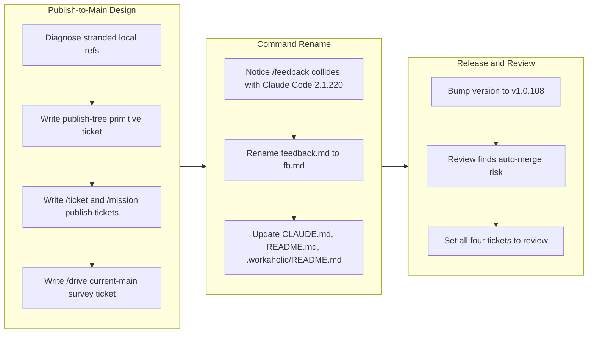

## 1. Overview

This branch recorded a design direction for artifact creation as four dependent ticket specs — moving `/ticket` and `/mission` from cutting a local work branch or worktree at creation time to publishing directly to `main` — and separately renamed the `/feedback` command to `/fb` to stop it colliding with Claude Code's built-in feedback-to-Anthropic command. Together these close a coordination gap for the cron `/drive` loop and remove a silent misfire in an everyday command. The branch was bumped to v1.0.108.

**Highlights:**

1. Wrote four dependent ticket specs — a publish-tree primitive, `/ticket` publishing to main, `/mission` publishing to main, and a `/drive` survey over a current main — completing decision I6 in [loop-engineering-workflow.md](../../docs/loop-engineering-workflow.md), which had already ruled that worktrees are claim-born but never migrated the creation flows
2. Renamed `plugins/workaholic/commands/feedback.md` to `fb.md` (`name: fb`) so the command no longer shadows Claude Code 2.1.220's built-in `/feedback`, which silently sends feedback to Anthropic instead of registering a workaholic record
3. Kept the underlying feedback skill, artifact `type`, and `.workaholic/feedbacks/` tree on the full word, with the command body carrying an explicit instruction not to propagate `fb` into the vocabulary
4. Set all four tickets to `merge_policy: review` after review found they rewrite the very machinery `/drive` uses to merge, and scoped their live rehearsal to a throwaway clone
5. Bumped to v1.0.108 across `marketplace.json`, both plugin manifests, and the generated Codex manifest

## 2. Motivation

Tickets and missions were stranded on unpushed local refs. Because artifact creation cut a work branch or worktree at the moment a ticket or mission was written, no cron runner and no second machine could see the new work until a human pushed it by hand. This was the missing half of decision I6, which had already established that worktrees are claim-born rather than creation-born but had not extended that principle to the artifacts themselves. Rather than implement the change directly, this branch recorded it as four dependent ticket specs so the change can be driven through the normal ticket-to-drive pipeline it describes.

Separately, an unrelated but urgent naming collision surfaced. Claude Code 2.1.220 ships a built-in `/feedback` that routes to Anthropic's own feedback channel, so the plugin's `/feedback` was being shadowed without any error — a developer typing it got the wrong behavior with no indication anything was wrong. The fix was a rename to `/fb`, keeping the skill, its artifact type, and the `.workaholic/feedbacks/` tree on the full word so only the trigger changed, with documentation updated in the same commit per the project's own doc-drift discipline.

## 3. Changes

The branch opened by recording a design fix for stranded local work as four ordered ticket specs, extending the existing claim-born-worktree ruling to artifact creation itself so the cron drive loop can see new tickets and missions immediately. It then pivoted to an unrelated but time-sensitive fix: renaming `/feedback` to `/fb` after discovering the bare name was being silently shadowed by Claude Code's own built-in. Report-time review then found the four specs would auto-merge a rewrite of the claim machinery unattended, and they were switched to `review` before the PR opened.

No tickets were archived on this branch — no `/drive` ran on it, so the sections below are derived from the commits and the diff rather than from archived tickets.

### 3-1. Add tickets for publishing artifacts to main ([fa8033d3](https://github.com/qmu/workaholic/commit/fa8033d3))

Added four new ticket specs under `.workaholic/tickets/todo/a-qmu-jp/` forming a strict dependency chain: a publish-tree primitive (`sync-main.sh`, `open-publish-tree.sh`, `publish-tree-commit.sh`, `close-publish-tree.sh`, writing through a git-ignored `.publish/` checkout that never touches the caller's working tree), then `/ticket` and `/mission` migrated onto it, then the `/drive` survey reconciled with `origin/main` before it reads the queue. Specification only — nothing is implemented.

### 3-2. Rename feedback command to fb ([0d696aec](https://github.com/qmu/workaholic/commit/0d696aec))

Renamed `plugins/workaholic/commands/feedback.md` to `fb.md` with `name: fb` and a rationale block explaining the collision, then updated `CLAUDE.md`, `README.md` (four sites including two mermaid node labels), and `.workaholic/README.md` in the same commit. The `workaholic:feedback` skill, `type: Feedback`, and `.workaholic/feedbacks/` are deliberately unchanged; because commands are Claude-Code-only and never enter the built bundle, `outputs/` needed no regeneration.

### 3-3. Bump version to v1.0.108 ([9b0ab1e8](https://github.com/qmu/workaholic/commit/9b0ab1e8))

Bumped all four lockstep version files. `origin/main` was at 1.0.107 and `v1.0.107` was already the latest GitHub Release, so the target version was confirmed collision-free before bumping.

### 3-4. Set ticket merge policy to review ([2a049721](https://github.com/qmu/workaholic/commit/2a049721))

Changed `merge_policy` from `auto` to `review` on all four tickets and rescoped their live rehearsal to a throwaway clone, after report-time review established that the specs rewrite the machinery `/drive` itself uses to merge and that their verification method, run unattended, would push scratch commits to this repository's own `origin/main`.

## 4. Outcome

This branch is a specification and naming change: nothing in the plugin's executable surface moved, and no `/drive` ran on it.

- **A four-ticket dependency chain** specifying that artifact creation publishes to `main`, closing the gap decision I6 opened on 2026-07-28. `/ticket` and `/mission` still cut a ref *before* writing and never push, stranding artifacts on local refs no cron runner, second machine, or fresh clone can see. The chain is: `20260729183606` (the publish-tree primitive, plus a refactor of `commands/propose.md`'s inline git into `sync-main.sh`, retiring a standing Shell Script Principle violation) → `20260729183607` (`/ticket` becomes a pure source: no `create.sh`, no `work-*` branch, Step 0's worktree-guard prompt deleted) and `20260729183608` (`/mission` likewise, leaving `claim.sh` as the only creator of a branch or worktree anywhere in the plugin) → `20260729183609` (the consumer half: `/drive` fast-forwards before surveying, since `plan-units.sh` reads the local tree while `lib/claims.sh` reads refs).
- **`/feedback` renamed to `/fb`**, with only the trigger abbreviated. All twelve of workaholic's commands were checked against the 117 built-ins; `feedback` was the only collision.
- **Version bumped to v1.0.108** across all four lockstep version files.
- **All four tickets set to `merge_policy: review`** during report-time review.

## 5. Historical Analysis

The tickets' Related History sections converge on one theme: this repository has revised the "where does creation put its output" question twice already, and is now revising it a third time — each time because the executor model underneath it changed.

- **The placement has a documented churn record.** `20260129012614-auto-branch-on-ticket.md` introduced `/ticket`'s auto-branch-on-main, exactly what `20260729183607` removes; `20260714011847-mission-create-worktree-kickoff.md` gave `/mission` its creation-time worktree and itself superseded an earlier in-tree branch-on-create step. The batch treats this as license rather than warning, which is the right read only because the underlying reason changed each time, not the taste.
- **A decision landed as doctrine before all its callers migrated.** The 2026-07-28 round shipped claims (G3) and ruled worktrees claim-born and ship-torn (I6). `drive/SKILL.md` and `mission/SKILL.md` state it; `commands/mission.md` still contradicts it. A documented-but-unimplemented decision reads as done to every later reader.
- **The root cause had accreted four separate workarounds before anyone named it.** Cross-checkout mission resolution in `lib/resolve.sh`, the same class in `validate-ticket.sh`, `claim.sh`'s comment tolerating a mission absent from main, and `drive-loop-runbook.md` §6's troubleshooting entry are four accommodations of one defect. The batch's real contribution is recognizing them as symptoms and removing them together.
- **`/propose` is cited as the shipped precedent in all three creation tickets** — it already scaffolds a mission into the main checkout, commits, and pushes with no worktree and no prompt. The one genuine addition is the publish tree, needed because a headless cron batch can abort on a dirty tree while a developer-typed command cannot.
- **The rename opens a failure class this repository had not seen: the host harness shadowing a plugin trigger.** Prior naming churn was always self-inflicted and produced *missing* commands. An upstream release claiming `/feedback` produces a *silently wrong* one instead, and no gate in this repository would have caught it — it was found by a developer.

## 6. Concerns

### A stale installed plugin now offers a command name that no longer exists in source

- **Severity:** moderate
- **Description:** The rename retires `/feedback` from source (see [0d696aec](https://github.com/qmu/workaholic/commit/0d696aec) in `plugins/workaholic/commands/fb.md`), but an installed marketplace copy refreshes on its own schedule, so a developer on a pre-refresh install still sees `/feedback` alongside the already-stale `/monitor`, `/trip`, and `/carry`. This case is worse than those: Claude Code's built-in `/feedback` occupies the same trigger, so the stale plugin entry and the built-in compete for one name and the developer cannot tell from the list which they will get. This aggravates the open stream concern `installed-plugin-lag-now-includes-commands`, and the branch adds neither a post-release note nor version-mismatch surfacing.
- **How to Fix:** Ship the v1.0.108 release note with an explicit "refresh the plugin; `/feedback` is now `/fb`" line, and add the version-mismatch surfacing that concern has been asking for — simplest form is a `SessionStart` check comparing the installed plugin's `plugin.json` version against the repo's `.claude-plugin/marketplace.json`, reporting a mismatch once per session.

### The `depends_on` chain will batch all four tickets into one PR-unit

- **Severity:** moderate
- **Description:** The four tickets form a strict chain via their `depends_on` frontmatter (see [fa8033d3](https://github.com/qmu/workaholic/commit/fa8033d3) in `.workaholic/tickets/todo/a-qmu-jp/`), and `drive/SKILL.md` names `depends_on` as "the one signal strong enough to group on by itself — a dependent ticket in a separate PR is a PR that cannot merge." So `/drive` will plausibly claim all four as a single PR-unit and open one PR rewriting branching, `/ticket`, `/mission`, and `/drive` together — precisely the PR shape the same section warns reviewers cannot review as one thing. Switching to `merge_policy: review` ([2a049721](https://github.com/qmu/workaholic/commit/2a049721)) means a human now sees it, but does not make it smaller.
- **How to Fix:** Add an explicit note to the foundation ticket that it is intended to merge as its own unit ahead of the callers — the callers' gates already require "the dependency is merged first", which cannot be satisfied inside a single combined PR anyway.

### `/fb` still commits without pushing, so its records never reach `/propose`

- **Severity:** moderate
- **Description:** Two of the new tickets independently flag it in their Considerations: `commands/fb.md` step 4 commits without pushing and never guards on `main`, so a feedback registered from a work branch never reaches `/propose`'s cursor, which reads records *merged to main*. It is the same invisibility defect the whole ticket batch exists to remove for tickets and missions, and it is explicitly declared out of scope in both. The branch touched `fb.md` for the rename and left the defect in place, so the file now carries a correctness fix and a known correctness gap in the same commit.
- **How to Fix:** Once the publish-tree primitive lands, add a fifth ticket routing `/fb`'s write through it, identically to `/ticket` — the tickets already name it as the intended follow-up. Until then, note the gap in `feedback/SKILL.md` so a developer registering feedback mid-branch knows the proposal loop will not see it until the branch merges.

### The ticket-batch convention structurally collides with the per-commit size ceiling

- **Severity:** low
- **Description:** The release scan flagged [fa8033d3](https://github.com/qmu/workaholic/commit/fa8033d3) as `too-large-commit` at 502 non-generated changed lines against a 500 ceiling (`override` tier). The entire 502 is four ticket markdown files, with no executable line among them. This is not a one-off: `create-ticket` caps a split at 2–4 tickets and a ticket written to this repository's density runs 110–140 lines, so any full batch reliably breaches the ceiling. `MAX_COMMIT_CHANGED_LINES` exists to make commit count a comparable throughput unit, which is a claim about implementation commits, not specification ones.
- **How to Fix:** Decide the rule deliberately rather than overriding it each time: either commit a ticket batch one file per commit, or add an explicit spec-commit exemption in `release-scan/scripts/lib/` with the reason recorded. A rule that is always overridden stops measuring anything.

### A design record still names `/feedback` as the capture command

- **Severity:** low
- **Description:** `docs/loop-engineering-workflow.md:177` still reads "A capture skill/command (working name `/feedback`)". It was accurate when written and is hedged as a working name, but it is now the only place in the tree pointing a reader at a trigger that resolves to Anthropic's built-in — and it sits in the document the tickets treat as the authoritative decision record.
- **How to Fix:** Update the line to `/fb` with a parenthetical noting the collision, or strike the working name and reference `commands/fb.md`, which now carries the canonical rationale.

## 7. Successful Development Patterns

- **Foundation-first decomposition with an explicit dependency graph.** One primitive ticket builds four scripts and nothing else; two caller tickets depend on it; one consumer ticket depends on both. Each dependent's Gate states "the dependency is merged first; this ticket does not re-implement any part of the publish sequence." It works because the primitive is independently verifiable — the callers can be reviewed against a contract rather than an intention.
- **`Decided:` blocks in place of prompts.** Every ticket carries four to five recorded rulings with reasons, each marked "recorded rather than asked; override at review time." This applies `rules/interaction.md`'s Recommended-label test at spec time, moving the decision to where a later reader looks for it instead of into a prompt nobody can reconstruct afterwards.
- **One genuinely open question left open, with a required ruling.** Ticket `183608` refuses to pre-decide whether `create-mission-worktree.sh` should be renamed, and states that whichever is chosen the reason must be recorded. Knowing which decisions were *not* recommendable is what makes the recorded ones trustworthy.
- **A single named invariant carried across the whole batch.** "Leaves the caller's checkout byte-identical" appears in three tickets, each calling it "the criterion the whole change exists for", and each Gate insists it be "asserted by a named test, not only observed in the rehearsal." One falsifiable sentence repeated verbatim keeps three independently-driven tickets from drifting into three definitions of success.
- **Verify-before-delete on inherited workarounds.** Ticket `183609` removes `claim.sh`'s stranded-artifact tolerance but explicitly refuses to delete the in-worktree re-resolution on sight, because "deleting a correct behaviour because its comment cited a retired reason would be a regression" — the exact failure the batch found four instances of.
- **Verifying the premise before acting on it.** The rename began as a claim that `/feedback` collides. Rather than accept or dispute it, the binary's own command table was read, confirming the built-in and establishing that `feedback` was the *only* collision among twelve commands — which is also what bounded the change to one file.
- **The rename minimized its own blast radius and wrote down why.** Only the trigger changed; the skill namespace, `type: Feedback`, and the prose vocabulary were preserved, and `fb.md` carries "Do not propagate `fb` into the vocabulary" in the command body — the place a later reader is guaranteed to be standing when tempted to.
- **Report-time review caught a risk creation-time interrogation missed.** `merge_policy: auto` was a reasonable answer when the tickets were written and a bad one once it was clear they rewrite the machinery `/drive` uses to merge, and that their verification would push scratch commits to this repository's own `origin/main` unattended. The gap closed because the story flow re-examined the tickets against the diff rather than trusting the frontmatter.

## 8. Release Preparation

**Verdict**: Ready for release

### 8-1. Concerns

- The branch-safety scan returns `block`, but the sole finding is `override`-tier: category `size`, `fa8033d3`, rule `too-large-commit` — 502 non-generated changed lines against a 500 ceiling. The commit is four pure-prose ticket specs with no code. No `hard` (secret) and no `confirm` (leak) findings.

### 8-2. Pre-release Instructions

- At `/ship`, consciously accept the `size` override for `fa8033d3` (502 > 500 non-generated changed lines) — an oversized-but-legitimate prose-only ticket batch is exactly what the override tier exists for.

### 8-3. Post-release Instructions

- Announce the `/feedback` → `/fb` rename with the release so installed plugins are refreshed; a stale install still offers `/feedback`, which now resolves to Claude Code's built-in.

## 9. Notes

Twelve open deferred concerns were judged against this branch; all twelve remain `still_active` and none were resolved, which is expected — no executable surface changed.

No tickets were archived on this branch, so `tickets:` and `mission:` are both empty and the Changes section is organized by commit rather than by ticket.

## Deployment Evidence

- **When:** 2026-07-30T11:14:06+09:00
- **By:** a@qmu.jp
- **Target:** release-scan
- **Method:** override
- **Status:** bypassed
- **Observed:** size/too-large-commit on fa8033d3 (502 non-generated changed lines > 500); commit is four prose-only ticket specs, no code; zero secret and zero leak findings

## Deployment Evidence

- **When:** 2026-07-30T11:15:05+09:00
- **By:** a@qmu.jp
- **Target:** Workaholic marketplace plugin
- **Method:** other (pre-merge branch proof per .workaholic/deployments/marketplace.md)
- **Status:** pass
- **Observed:** build.mjs clean with empty outputs/ porcelain; verify.mjs reports all built skills self-contained; validate-metadata.mjs reports Codex manifests valid and version-aligned; test-workflow-scripts.mjs 1312 passed 0 failed; version 1.0.108 consistent across all six lockstep entries and ahead of main at 1.0.107
