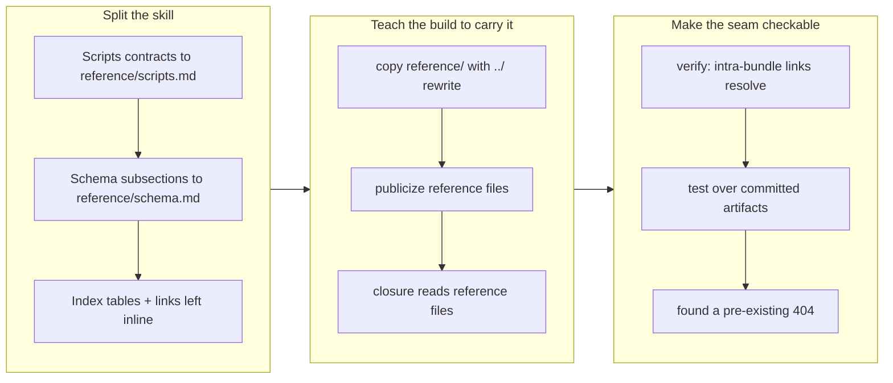

## 1. Overview

The mission skill's `SKILL.md` was 562 lines — the third-longest of 28 skills and the densest per line — and every agent reading `/mission` paid for all of it at load time. It is now **380 lines (−32%)** with nothing deleted: the per-script contracts and the six schema subsections moved verbatim into a companion `reference/` directory that the `SKILL.md` indexes and links. Carrying that directory into the generated cross-agent bundle required extending three build seams, and the new containment check it made possible immediately found a link that had been 404-ing for every non-Claude consumer.

**Highlights:**

1. **A skill can now relocate reference material without breaking its public bundle.** `build.mjs` copies a skill's `reference/` dir, rewrites its script paths with the extra `../` its depth requires, publicizes it, and reads it for closure; `verify.mjs` asserts the links resolve.
2. **Fact preservation was checked mechanically, not by eye** — a set-difference of every substantive original line against the union of the three new files. It caught one bullet that a slice off-by-three had silently dropped.
3. **The shrink surfaced two misfiled sections and one pre-existing broken link**, none of which was visible while the file was too long to hold in view.

## 2. Motivation

Requested via GitHub issue [#101](https://github.com/qmu/workaholic/issues/101), itself relaying a Slack request. `CLAUDE.md` states its own design principle — a skill runs roughly 50-150 lines — and `mission/SKILL.md` was nearly four times that, with 131 lines over 200 characters. The cost is paid on every load: an agent invoking `/mission` to create one mission reads every script's full argument contract and every frontmatter field's rationale before it can act.

The material was not redundant, which is why the ticket forbade deleting anything. It was **misplaced**: a script's emitted JSON keys matter when you run that script, and a field's redefinition record matters when you interpret that field — neither is needed to decide what to do next. So the change is a relocation with an index left behind, not a rewrite.

## 3. Changes

One ticket, one commit. The three phases are inseparable in practice: relocating without the build change ships a broken bundle, and changing the build without the check leaves the next relocation unguarded.

### 3-1. Split the mission skill into reference files ([044a3f8b](https://github.com/qmu/workaholic/commit/044a3f8b))

Moves the `## Scripts` per-script contracts to `reference/scripts.md` and the six `## Schema` subsections to `reference/schema.md`, both verbatim, leaving an index table and a linked field list inline. Promotes the closing doctrine that had accreted *inside* `## Scripts` to its own `## Ending a mission` section and lifts the body-section list out of `### Duration`. Extends `build.mjs` (copy, `../` rewrite, publicize, closure) and `verify.mjs` (intra-bundle link resolution), adds `testSkillReferenceFilesShip`, and documents the convention in `CLAUDE.md`.

## 4. Outcome

`SKILL.md` is 380 lines from 562. `reference/scripts.md` is 144 and `reference/schema.md` 93, so the three total 617 against 562 — the split costs ~55 lines of headers, index table, and pointers, which is the price of the locator and is paid once rather than on every load.

The build now supports a convention rather than a one-off: any skill that outgrows the guideline can relocate into `reference/` and the bundle stays whole. Three seams were extended and each was necessary — the copy (a missing file 404s), `publicizeSkillMd` (a reference file carries the same `workaholic:` prefixes and reaches the same non-Claude agents), and `computeClosure` (a cross-skill reference appearing only in a reference file would otherwise be rewritten with no scripts copied for it, and nothing would notice).

Verification: suite green at 1360 / 0, `wc -l` reported before and after, all three build scripts clean with no residual `outputs/` diff, `posix-lint` conforming, `layout-doctor` `conforming: true`. The one criterion a line count and a test suite cannot prove — that no fact was silently dropped — was checked by diffing every substantive original line against the union of the new files, which is how the dropped `## Goal` bullet was found and restored.

## 5. Historical Analysis

No prior ticket shrank a skill file; this is a new maintenance category, and the ticket said so. What the archive does show is *why* the file grew: the mission skill has been amended incrementally many times — ownership moved to strategies and back (`20260728221801-unify-mission-status-and-merge-policy.md`), the lifecycle collapsed onto one status axis, the claim protocol arrived — and each amendment added content while none consolidated. The two misfiled sections are fossils of exactly that: the closing doctrine was appended after `close.sh`'s entry and inherited its `####` depth, and the body-section list was appended to `### Duration`.

The build-side lesson has a precedent too. `verify.mjs` exists because a cross-skill script reference in the wrong syntactic form would pass review and be missed by the build, shipping a broken closure — the same class of defect this change found in doc-link form. The fix was the same shape: make the containment property machine-checked, in the one place both the build and the lint read.

## 6. Concerns

### A pure relocation cannot fit under the per-commit size ceiling by construction

- **Severity:** moderate
- **Description:** The release scan blocks at `override` tier: 701 non-generated changed lines against a 500 ceiling (see [044a3f8b](https://github.com/qmu/workaholic/commit/044a3f8b)). `MAX_COMMIT_CHANGED_LINES` sums added **plus** deleted lines, so moving 260 lines from one file to another costs 520 before a single line of real work — a refactor-by-relocation is structurally incapable of passing, however well-scoped it is. This is a third instance of the same rule being overridden (the stream already holds `the-ticket-batch-convention-structurally-collides` for spec commits, and PR #108's foundation commit for an implementation commit), and the metric's stated purpose is to make commit count a comparable throughput unit — which a pure move inflates without adding throughput.
- **How to Fix:** Decide the rule deliberately rather than overriding it a third time: either exempt a commit whose diff is dominated by pure renames/moves (git already detects them — `--find-renames` would report this commit's relocation as such), or count added lines only. A rule that is always overridden stops measuring anything, and this is now the pattern rather than the exception.

### The mission skill is still 380 lines, well above the guideline it was measured against

- **Severity:** low
- **Description:** The ticket deliberately set no hard target, and 380 is a 32% reduction — but it is still more than double the ~50-150 band `CLAUDE.md` states (see [044a3f8b](https://github.com/qmu/workaholic/commit/044a3f8b) in `plugins/workaholic/skills/mission/SKILL.md`). What remains is content an agent running `/mission` genuinely needs at load time (lifecycle, allowed location, the schema block, the Creation Interrogation, replan, the position report, the ending doctrine, the update seams), so further shrinking means either moving something load-bearing or tightening prose that carries decisions.
- **How to Fix:** Treat the guideline as measured against *what an agent needs before acting*, and re-derive the band from that rather than shrinking further for its own sake — or accept that a few skills are legitimately above it and say so in `CLAUDE.md`, which currently reads as a flat rule. The two short redefinition records were deliberately left beside the rules they explain, because separating a rule from its *why* costs a reader more than 21 lines.

### Every other long skill still has the old shape, and nothing points them at the new one

- **Severity:** low
- **Description:** The `reference/` convention now exists and is documented in `CLAUDE.md`, but `mission` is its only user (see [044a3f8b](https://github.com/qmu/workaholic/commit/044a3f8b) in `CLAUDE.md`). The other two skills the originating issue measured as longest were not touched, and nothing surfaces a skill that has drifted past the guideline — so the next one grows to 562 lines before anyone notices, exactly as this one did.
- **How to Fix:** Add a line count to whatever already walks the skills (the `Validate Plugins` workflow is the natural host) reporting any `SKILL.md` past a stated threshold as an advisory, not a failure — the same read-only, report-don't-block shape `layout-doctor.sh` uses for the `.workaholic/` tree.

### The new link check is deliberately narrow, and the obvious "improvement" would break it

- **Severity:** low
- **Description:** `verify.mjs` checks only markdown links into or out of a `reference/` dir (see [044a3f8b](https://github.com/qmu/workaholic/commit/044a3f8b) in `scripts/build-plugins/verify.mjs`). Broadened to every relative `.md` link it flags six correct paths — runtime artifact paths in the consuming project (`.workaholic/stories/<branch-name>.md`) and `<placeholder>` templates — and a containment check that cries wolf on correct prose gets deleted rather than fixed.
- **How to Fix:** The narrowing and its reason are written into the code as a comment, which is the mitigation. If broader coverage is ever wanted, the honest form is a distinction the checker can actually make — e.g. only check links whose target has no `<` and does not start with `.workaholic/` — decided once and stated, not discovered by whoever widens the regex.

## 7. Successful Development Patterns

- **Relocate by extracting verbatim line spans, then verify with a set-difference.** Re-typing 260 lines invites paraphrase; extracting spans preserves wording by construction. But construction is not proof — an off-by-three in one slice still dropped a bullet, and a set-difference of every substantive original line against the union of the new files found it in one pass. The two techniques are complements: the extraction protects wording, the diff protects completeness.
- **Answer a ticket's "confirm whether X works" step by measurement before designing around it.** Step 6 asked to confirm the build handles companion files. Reading `buildTarget` took a minute and returned a clear no — which turned a vague step into three specific seams (copy, publicize, closure) and revealed the `../` depth problem before it shipped rather than after.
- **A new check earns its place by being narrow enough to stay.** The link check's first version flagged six correct paths. Narrowing it to the relocation seam — the one thing that can silently break — kept it useful; the reasoning is written as a code comment because the obvious next edit is to broaden it back.
- **Fix an incidental defect the new check surfaces, but only the one blocking your own gate.** The `../feedback/SKILL.md` link had been 404-ing in the public bundle indefinitely. It was fixed because `verify.mjs` must pass for this change to ship, and the fix was one line to a namespace reference. Everything else the restructure exposed (two misfiled sections) was relocated as part of the shrink, and the rule-level questions went to section 6 rather than becoming scope.
- **Structural refactors pay in what they expose, not in the line count.** Two sections had been misfiled for months — closing doctrine nested inside `## Scripts`, the body-section list inside `### Duration`. Neither was findable while the file was too long to hold in view, and neither is a behaviour change to correct.

## 8. Release Preparation

**Verdict**: Needs attention before release

### 8-1. Concerns

- The release scan blocks at `override` tier on commit size. The unit is `merge_policy: review`, so it stops at this PR regardless and no gate was overridden — but see the first concern in section 6: this is the third such override and the rule needs a ruling.
- This branch and PR #108 both edit `plugins/workaholic/skills/mission/SKILL.md`. PR #108 adds +11/−5 lines to the `## Scripts` entries for `create.sh` and `gate.sh`, the Replan section, and the worktree-lifecycle prose — all of which this branch **relocated** into `reference/scripts.md` and `reference/schema.md` or promoted to `## Ending a mission`. Whichever merges second will conflict on those hunks.

### 8-2. Pre-release Instructions

- **Merge PR #108 first, then rebase this branch.** Its edits are small and identifiable (5 hunks), and after the relocation they belong in `reference/scripts.md` and the promoted `## Ending a mission` section rather than where they were written. Resolving in that direction is mechanical; resolving the other way risks dropping #108's decision-record additions (the J1 naming ruling, the publish-tree wording, the `no_worktree` note), which is the loss to guard against.
- No version bump is included.

### 8-3. Post-release Instructions

- None. The change is documentation structure plus build tooling; no runtime behaviour, schema shape, or script contract changed.

## 9. Notes

This branch's ticket was deferred once, in the previous `/drive` run, on the forecast that it would conflict expensively with PR #108. That forecast was wrong and the correction is worth recording: measuring the actual overlap showed **+11/−5 lines across 5 identifiable hunks**, which is a cheap mechanical resolution rather than a re-decide-the-prose conflict. The drive failure contract says a blocker is a finding and not a forecast; the same standard applies to a deferral, and measuring took two commands.

The overlap is still real, which is why section 8-2 states the merge order rather than leaving it to whoever hits the conflict.
