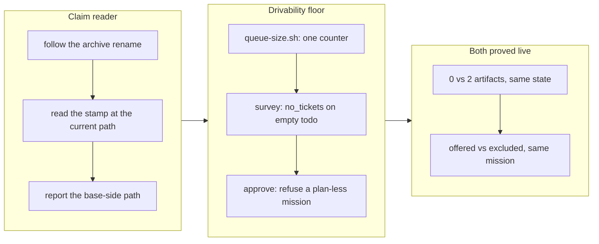

## 1. Overview

Two live correctness holes in `/drive`'s own coordination, both found by driving this repository with its own loop and both fixed here. The claim reader stopped protecting a batch unit's artifacts the moment its first ticket was archived, so the survey offered work already in flight. And "does this mission have a plan" was measured by counting acceptance items, which a `/propose` sketch satisfies with zero tickets — so an approved `merge_policy: auto` mission with an empty queue was being offered as claimable.

**Highlights:**

1. **A claim now protects its artifacts for the whole drive.** Side by side over identical repository state, with both this branch's tickets archived: the old reader reports **0** artifacts, the new one **2**. The old behaviour is the double-pick the claim protocol exists to prevent.
2. **Drivability is measured against the ticket queue, not the acceptance list.** The mission that exposed it — `adopt-a-git-flow-…`, `auto`, `0/8`, `tickets: []`, acceptance opening *"PROPOSED sketch — not a plan"* — is now excluded `no_tickets` instead of offered.
3. **Both defects were observed in production before being specified.** Neither came from review; both came from this loop reporting a survey that did not match reality, over several runs.

## 2. Motivation

These are the two tickets `/drive` minted about itself on 2026-07-30, and each was a case where a script's output was *true* and its meaning was *wrong*.

`claims_scan` derived a claim's artifacts as "the files the claim commit touched that still carry `claim: <branch>` at the tip". Both halves are right, but they live in different path spaces the moment `archive.sh` **renames** a driven ticket from `todo/<user>/X.md` to `archive/<branch>/X.md` — carrying the stamp along. Looking the old path up at the tip finds nothing, so the artifact silently left the claim. A batch unit was protected between claim and first archive, and unprotected from then until merge, which is most of a drive's wall-clock. It was invisible because `list-claims.sh` printed a well-formed claim with `artifacts: []` and `plan-units.sh` then offered those tickets with no exclusion at all.

The second was the same class. `approve.sh` and `plan-units.sh` both answered "has a plan?" by counting `## Acceptance` items — and `/propose` writes a provisional acceptance sketch into exactly that section. A proposal therefore satisfied every floor with no tickets behind it, and the survey offered it under a policy authorising the run to merge whatever it produced. The only thing standing between the run and merging an invented plan was that there were no tickets to invent from: safety by absence rather than by a gate.

## 3. Changes

Grouped as one unit because both correct *what the survey offers* and both edit `plan-units.sh` — driving them separately would have recreated the two-PRs-one-file conflict this repository spent an afternoon resolving by hand.

### 3-1. Read claim stamps at the artifact's current path ([bba6f0dc](https://github.com/qmu/workaholic/commit/bba6f0dc))

`claims_scan` resolves each claimed path to where the file lives *now* at the branch tip — one `git diff --find-renames` per claim, so chained renames collapse to a single row — before reading its stamp, and reports the **base-side** path, which is the coordinate space both consumers compare in. The two deliberate behaviours are preserved and pinned: a genuine stamp removal still drops the artifact, and a deleted artifact is not claimed. `archive.sh` was not touched and neither consumer grew its own resolution.

### 3-2. Measure mission drivability by ticket queue ([ac4a87cc](https://github.com/qmu/workaholic/commit/ac4a87cc))

Adds `mission/scripts/queue-size.sh` — the single counter reporting `todo` / `archive` / `total` tickets naming a mission, read through `read-relation.sh`. `plan-units.sh` excludes a mission with nothing in `todo/` as `no_tickets`, distinct from `no_plan`; `approve.sh` refuses a mission no ticket names at all. Corrects the two claims this falsified (`plan-units.sh`'s "the same floor `drive-authorized.sh` applies" comment and `drive/SKILL.md`'s "passes it by construction") and adds the reason to the runbook with the action it implies. `/propose` is unchanged.

## 4. Outcome

Both fixes are verified against this repository, side by side over identical state rather than only in fixtures:

| | unfixed | fixed |
| --- | --- | --- |
| Claim artifacts, both tickets archived | **0** | **2** (base-side paths) |
| `adopt-a-git-flow-…` (`auto`, `0/8`, no tickets) | offered as claimable | excluded `no_tickets` |

The suite went 1500 → 1512, and the new coverage reaches lifetime phases the old fixtures could not express. `testClaimSurvivesArchive` claims a two-ticket batch and archives its tickets on the claim branch, asserting from the clone that did none of the writing: mid-drive both artifacts held, fully archived both held, the survey excluding both with reason `claimed`, and a second claim refused `already_claimed`. `testPlanFloorCountsQueue` covers the `0/N`-with-no-tickets case, the `0/N`-with-tickets case still offered, `0/0` still `no_plan`, and `approve.sh` refusing the same shape.

Four pre-existing fixtures failed the moment the second floor landed — every one of them a fixture that approved a mission no ticket named. They were given real queues through a shared `seedMissionTicket` helper, which made them more realistic rather than weaker.

## 5. Historical Analysis

Both defects were introduced by the 2026-07-28 round that built the claim protocol and the unified survey (`20260728221802-add-claim-protocol-scripts.md`, `20260728221803-unify-drive-executor.md`), and both survived review for the same reason: the code did exactly what its comment said, and the comment was silent about the case that breaks it. The claim reader's comment described stamp *removal* and said nothing about renames; the survey's comment claimed parity with `drive-authorized.sh`'s floor, which was true about acceptance items and silent about queues.

The pattern across this repository's recent self-inflicted bugs is now consistent enough to name. `20260729183609-drive-surveys-current-main.md` fixed a survey that read a stale checkout and reported it confidently. The claim reader reported an empty artifact list confidently. The plan floor reported a plan confidently. In all three the output was well-formed and the meaning was wrong — which is why each was found by *using* the system rather than by reading it, and why each fix ends in a reported field (`current`, the base-side path, `no_tickets`) rather than a silent correction.

## 6. Concerns

### An empty artifact list is now anomalous and still renders as `[]`

- **Severity:** low
- **Description:** Before this change an empty `artifacts` array was the *normal* mid-drive state, so `list-claims.sh` rendering `[]` said nothing. After it, a claim with no artifacts means something genuinely odd — a `Claim` commit that stamped nothing, or every artifact unstamped or deleted — but the output is unchanged, so the reader cannot tell "nothing to protect" from "protecting nothing" (see [bba6f0dc](https://github.com/qmu/workaholic/commit/bba6f0dc) in `plugins/workaholic/skills/drive/scripts/lib/claims.sh`).
- **How to Fix:** Surface it where claims are already reported — `/drive`'s survey report and `list-claims.sh` — as a note rather than an error, since `claims.sh` deliberately tolerates a stamp-less claim commit. One line naming the unit is enough for a human to look.

### The scan cost grew by one diff per claim, on the five-minute path

- **Severity:** low
- **Description:** `claims_scan` now runs `git diff --find-renames` between each claim commit and its branch tip (see [bba6f0dc](https://github.com/qmu/workaholic/commit/bba6f0dc)). It was chosen over a per-file `git log --follow` precisely because it is one call per claim rather than per artifact, but it is still new work on a path the routine executes every five minutes, and its cost grows with a claim branch's diff size rather than its artifact count.
- **How to Fix:** If a tick's survey latency becomes noticeable, bound it by restricting the diff to `.workaholic/` (`git diff --find-renames <sha> <ref> -- .workaholic/`), which is the only tree claims can name. Measure before changing — the current form is correct and the optimisation narrows what the reader can see.

### `queue-size.sh` walks both ticket areas per mission, per survey

- **Severity:** low
- **Description:** The counter `find`s every `.md` under `tickets/todo/` and `tickets/archive/` and calls `read-relation.sh` once per file (see [ac4a87cc](https://github.com/qmu/workaholic/commit/ac4a87cc) in `plugins/workaholic/skills/mission/scripts/queue-size.sh`). The archive grows without bound, and the survey calls this once per approved mission — so the cost is `missions × archived tickets` on every tick, where only the `todo` half is needed for the survey's question.
- **How to Fix:** Let the survey ask for `todo` alone (a flag, or a second entry point) so it never walks the archive; `approve.sh` is the only caller that needs `total`, and it runs once per approval rather than every five minutes. Worth doing before the archive gets much larger.

### The pathological mission is still approved, and only the survey now declines it

- **Severity:** moderate
- **Description:** `adopt-a-git-flow-branching-model-with-durable-ship-records` remains `status: approved` with `merge_policy: auto`, `tickets: []`, and an acceptance sketch that says it is not a plan. This change stops it being *offered*, which is the code's part; it deliberately does not demote it, because flipping another actor's approved mission back to `draft` from inside an unattended run would be a run overriding a human ruling. So the repository still holds an approved mission that no floor would approve today (see [ac4a87cc](https://github.com/qmu/workaholic/commit/ac4a87cc)).
- **How to Fix:** Replan it — `/mission <instruction referencing it>` — which emits the ticket set its acceptance sketch is a proposal for, and re-approves it through the flow that now checks the queue. Until then it sits in `active/` looking drive-ready and being excluded, which is honest but easy to misread.

## 7. Successful Development Patterns

- **Fix a defect the loop found, then prove the fix with the loop.** Both fixes were verified by running the old and new readers over the *same live repository state* and printing both answers — `0` vs `2` artifacts, offered vs `no_tickets`. That is stronger than any fixture, costs two commands, and is only possible because the branch's scripts are runnable against the main checkout.
- **Let the archive step be the rehearsal.** Archiving this unit's own first ticket performed exactly the rename that used to erase the artifact list, so the live check needed no setup at all — the work under test produced its own test case.
- **When a new floor breaks several fixtures at once, read the fixtures first.** Four failed here, and all four approved a mission no ticket named: the repository's own fixtures had modelled the pathological state as the default. That is a measure of how normal the defect had become, not of the floor being wrong.
- **An ordering-dependent guard needs a fixture per branch.** The survey's `no_tickets` is only reachable on an `approved` mission and `approve.sh`'s only on a `draft`, because `not_approved` and `already_approved` answer first. The first test version asserted both against one mission and failed with an *empty stderr* — which is the tell that an earlier guard answered.
- **Report the fact rather than widening the contract.** The claim reader could have emitted both the base-side and archived paths, as its ticket suggested. No consumer reads the archived one, so the field would have been dead weight in a TSV three scripts parse — the suggestion was worth discarding, and saying so in the Final Report is cheaper than carrying it forever.

## 8. Release Preparation

**Verdict**: Ready for release

### 8-1. Concerns

- None blocking. The branch-safety scan **passes** — no size, secret, or leak findings, unlike the two PRs shipped before it.
- Both changes are to `/drive`'s own coordination machinery, so the installed plugin must refresh before a runner benefits; until it does, a tick keeps using the unfixed reader and floor.

### 8-2. Pre-release Instructions

- Bump the version past the released `v1.0.110` (release-on-merge is idempotent, so a colliding merge publishes nothing).
- Nothing else: no migration, no artifact schema change.

### 8-3. Post-release Instructions

- **Refresh the installed plugin**, then re-run `/drive` once and confirm the survey excludes `adopt-a-git-flow-…` as `no_tickets` rather than offering it.
- **Replan that mission** (section 6's fourth concern) so it stops looking drive-ready while being declined.

## 9. Notes

Both tickets in this unit were written by `/drive` about `/drive`, two runs earlier, after the survey reported claimable work that was already in flight. The loop found them, specified them, and has now fixed them — which is the model working as intended, and also the reason to read section 6's concerns as a set: three of the four are new costs this fix introduced on the five-minute path, and they are cheap now and less cheap later.

## Deployment Evidence

- **When:** 2026-07-30T19:47:15+09:00
- **By:** a@qmu.jp
- **Target:** Workaholic marketplace plugin
- **Method:** other
- **Status:** pass
- **Observed:** Pre-merge proof per the deployment contract: outputs/ fresh after rebuild, verify.mjs + validate-metadata.mjs pass, hermetic suite 1512 passed / 0 failed, version 1.0.111 consistent across all five lockstep files. Branch-safety scan verdict: pass (no findings, no override)
