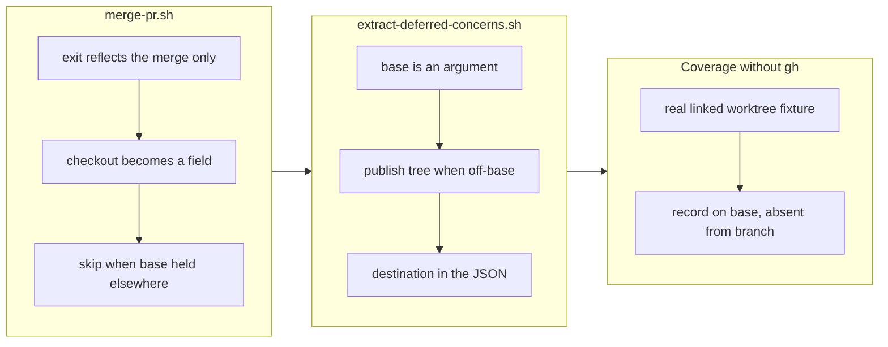

## 1. Overview

`/drive` ships every `auto` unit from that unit's claim worktree, and the ship path could not run there. `merge-pr.sh` ended with a bare `git checkout main`, which git refuses inside a linked worktree while the primary tree holds the base — so it exited non-zero *after* the merge had landed. `extract-deferred-concerns.sh` then committed and pushed on whatever branch it was standing on, assuming that checkout had happened, and sent a merged PR's concern records to the already-merged claim branch while truthfully reporting `pushed: true`.

**Highlights:**

1. **The exit status now reflects the merge, and only the merge.** The merge is irreversible, so a non-zero exit after a successful one answers the caller's most important question backwards. The post-merge checkout became a reported field.
2. **The extraction's destination is explicit, not inherited.** It takes the base, reports the `destination` it pushed to, and publishes through a publish tree when it is not already on the base — which also makes its dedup scan read the base's records rather than the branch's.
3. **Covered without touching `gh`.** The merge needs the network; everything that broke did not. A real linked worktree in the fixture proves the bare checkout fails there and that the record lands on the base and nowhere else.

## 2. Motivation

Both halves of this were observed shipping PR #108 earlier the same day, and both had the same shape: a script whose output was well-formed and whose meaning was wrong.

The first is a location assumption. `merge-pr.sh`'s closing `git checkout main` works from the primary tree and cannot work from a claim worktree, because the base is already checked out. `/drive`'s `auto` route ships from the claim worktree by design, so the sanctioned location was precisely the broken one — and because the failure came *after* `gh pr merge` succeeded, the script reported failure on a ship that had merged as `39b52709`. An unattended caller reading that exit code would retry or halt on work that was already done.

The second is a destination assumption, and it compounded the first. `extract-deferred-concerns.sh`'s header said *"you normally end on `main` level with `origin/main`"* — an assumption about the step before it. With the checkout skipped, the run was still on the claim branch, so four concern records were committed and pushed **there**. The push succeeded, so `pushed: true` was accurate; the records were nonetheless invisible, because the open-concern set is computed from records on the base. They had to be republished by hand as `f4c6f15d`.

## 3. Changes

### 3-1. Separate the merge outcome from its bookkeeping ([7642ebaa](https://github.com/qmu/workaholic/commit/7642ebaa))

`merge-pr.sh` emits its JSON and exits 0 whenever the merge succeeded, reporting `checked_out` with a `checkout_reason` of `base_checked_out_elsewhere`, `checkout_failed`, or `pull_failed`; it detects the held-base case from `git worktree list` and skips the checkout rather than attempting it. `extract-deferred-concerns.sh` takes the base as a fourth argument, reports `destination`, and when not already on the base re-enters itself inside a publish tree and publishes from there. The ruling — the checkout stays best-effort and is never load-bearing — is recorded in `ship/SKILL.md` step 6, and step 8 now instructs the caller to pass the base and read `destination`.

## 4. Outcome

The ship path works from both sanctioned locations, and the difference is reported rather than assumed. A run from the primary tree behaves exactly as before (asserted, so this is not a regression for the interactive path); a run from a claim worktree merges, says `checked_out: false` with the reason, and publishes its concern records to the base.

Suite 1484 → **1505 passed / 0 failed**. The new coverage deliberately avoids `gh`: `testShipWorksFromAClaimWorktree` builds a real linked worktree with the primary tree holding `main`, proves that a bare `git checkout main` genuinely fails there — the original defect, reproduced rather than described — and then asserts the extraction from that worktree lands the record on `origin/main`, leaves it **absent** from the claim branch, leaves the claim worktree clean, tears the publish tree down, and creates nothing on a second run. `testShipExtractionOnBaseIsDirect` pins that the on-base path opens no publish tree at all.

The ticket's step 5 asked whether other strays were left on merged branches. A scan of every `Add deferred concerns from PR #…` commit in the repository found **none** — all 21 are reachable from `origin/main`. PR #108's four records are on main through the by-hand recovery, which is why its extraction commit is not among them.

## 5. Historical Analysis

This is the third defect in one day whose root cause was an assumption about *where* a script runs, and the progression is worth reading together. `20260729183609-drive-surveys-current-main.md` fixed a survey that read the working tree while believing it read the base. `20260730180248-claim-reader-loses-artifacts-on-archive.md` fixed a reader that looked a path up in the wrong path space after a rename. This one fixes a script that assumed a checkout, and another that inherited a destination from it.

The claim protocol (`20260728221802`) introduced the claim worktree as the place work happens, and the unified executor (`20260728221803`) routed `auto` units to ship from there — but the ship scripts predate both and were written when there was one checkout. Each of the three fixes ends the same way: with the location or its consequence reported as a field (`current`, the base-side path, `checked_out` / `destination`) rather than assumed. `lib/push-outcome.sh` is the earliest instance of the same lesson, extracted after PR #86's silent no-op — it made *whether* the push worked visible, and this change makes *where* visible.

## 6. Concerns

### `commit-release-note.sh` shares the location assumption, correctly for now

- **Severity:** low
- **Description:** It pushes to the current branch, which is right because it runs **pre-merge** — the note must ride into the merge — so it was confirmed rather than changed (see [7642ebaa](https://github.com/qmu/workaholic/commit/7642ebaa) in `plugins/workaholic/skills/ship/scripts/`). But the reason it is correct is an ordering property of the Ship Flow, not anything the script itself checks: if a future flow ever called it after the merge, it would push a release note to a dead branch exactly as the extractor did, and report success.
- **How to Fix:** Have it assert its own precondition — refuse when the PR it is noting is already merged (`gh pr view --json merged`, or a passed-in flag) — so the ordering that makes it correct is enforced where it is relied upon rather than documented one step away.

### The off-base extraction now costs a fetch and a worktree

- **Severity:** low
- **Description:** When not already on the base, the extraction opens a publish tree — a fetch plus a `git worktree add` — runs, publishes, and tears it down (see [7642ebaa](https://github.com/qmu/workaholic/commit/7642ebaa) in `plugins/workaholic/skills/ship/scripts/extract-deferred-concerns.sh`). That is the only route that can write to the base from a merged branch's checkout, so the cost is inherent rather than incidental, but it is new work on the `auto` ship path and it can fail for its own reasons (`no_origin`, `dirty_publish_tree`) that have nothing to do with concerns.
- **How to Fix:** Nothing now. If `/drive` ever ships many `auto` units in one run, hold one publish tree open across them rather than opening one per unit — the primitive is idempotent on open, so the change is in the caller, not the script.

### Re-entry through an env-var guard is invisible in a stack trace

- **Severity:** low
- **Description:** The off-base path re-runs the same script inside the publish tree, guarded by `WH_EDC_IN_PUBLISH_TREE` so it cannot recurse (see [7642ebaa](https://github.com/qmu/workaholic/commit/7642ebaa)). It kept the change small — the Python half is cwd-relative, so running it *in* the publish tree redirects both its dedup scan and its writes for free — but a reader debugging a failure sees one script name and two very different executions, and the inner run's JSON is rewritten by `sed` on the way out.
- **How to Fix:** If this needs touching again, split the extractor into "write the records into `<root>`" and "publish `<root>`", so the two executions become two named functions instead of one script twice. Not worth doing pre-emptively; worth doing the moment a third caller appears.

### `checked_out: false` is now normal and nothing reads it yet

- **Severity:** moderate
- **Description:** `merge-pr.sh` reports the field, and `ship/SKILL.md` step 9 says to surface it — but that is prose, and the `/drive` route that ships `auto` units does not yet act on it (see [7642ebaa](https://github.com/qmu/workaholic/commit/7642ebaa) in `plugins/workaholic/skills/ship/SKILL.md`). The concrete consequence: after an `auto` merge from a claim worktree, the run is still on the claim branch, and `/drive` §6's teardown must run from the primary tree because git cannot remove the worktree it is standing in. That works today because the teardown is a separate step with its own cwd, but nothing checks it.
- **How to Fix:** Have `/drive` §6 read `checked_out` and state the cwd it runs the teardown from, so the ordering is explicit rather than incidental. A test that ships an `auto` unit end to end would catch it, which is the composed-loop coverage the stream already tracks as an open concern.

## 7. Successful Development Patterns

- **Reproduce the defect inside the test before asserting the fix.** The claim-worktree case runs `git checkout main` in a real linked worktree and asserts it *fails* with "already used by worktree" — so the test carries the reason it exists, and would fail loudly if a future git made that operation succeed.
- **Cover the half that does not need the network.** The merge needs `gh`, which is why `merge-pr.sh` had no test at all and why this shipped. Its post-merge decision needs nothing but a worktree, and that is exactly the part that broke — the untestable dependency was hiding a testable defect behind it.
- **Read a ticket's implementation options as hypotheses.** Step 3's simpler option — "take the target branch and refuse to push anywhere else" — is not merely worse here, it is impossible: after the merge the base holds a merge commit that is not an ancestor of the claim branch, so the push is correctly rejected. Discovering that ruled the option out in one command.
- **Change where a cwd-relative script runs rather than teaching it a second root.** The extractor's Python half already resolves everything against cwd, so running it inside the publish tree redirected its dedup scan and its writes together, with no changes to the part that parses stories and writes records.
- **When a new parameter changes what an early guard tests, resolve it above that guard.** The re-entry first skipped silently because the pre-existing story-existence check ran before the override that tells the inner run where the story actually is. The symptom looked like a logic bug and was purely ordering.

## 8. Release Preparation

**Verdict**: Ready for release

### 8-1. Concerns

- None blocking. The branch-safety scan **passes** — no size, secret, or leak findings.
- Both changes are on the ship path, so the installed plugin must refresh before an `auto` unit benefits.

### 8-2. Pre-release Instructions

- Bump past the released `v1.0.110` (release-on-merge is idempotent, so a colliding merge publishes nothing).
- PR #112 is open on the same repository and touches `drive/` and `mission/`, not `ship/` — no overlap with this branch, so merge order does not matter between them.

### 8-3. Post-release Instructions

- **Refresh the installed plugin.**
- The next `auto` unit `/drive` ships is the first real exercise of this path end to end; read its summary for `checked_out` and the extraction's `destination` rather than assuming them.

## 9. Notes

This ticket was written by `/drive` about `/drive` two runs earlier, immediately after the defect bit during a real ship — and the by-hand recovery it describes (`f4c6f15d`) used the publish tree that the same afternoon's PR #108 had just introduced. The fix now routes the script through that primitive automatically, so the recovery becomes the normal path rather than a manual repair.
