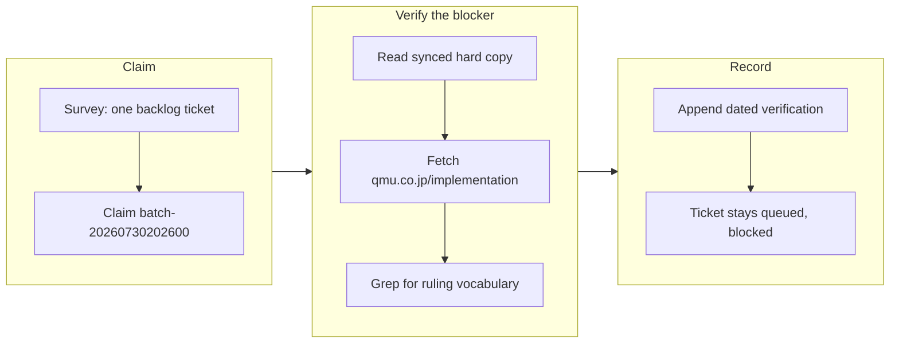

## 1. Overview

A `/drive` tick claimed the one ticket left in the backlog — the request to rule on whether long-running servers may run as bare host processes — and found it blocked on an article that has to be written outside this repository. Rather than accept that verdict from the ticket's own prose, the run checked it, and recorded the check where the next driver will read it.

**Highlights:**

1. The external blocker was re-verified against the live policy site instead of being inherited from a four-day-old note.
2. The verification is written into the ticket as two reproducible `curl` commands, so refreshing it costs seconds rather than a fresh investigation.
3. No policy prose was authored locally — the mirror model that makes this ticket external was respected, not worked around.

## 2. Motivation

The ticket has carried a `Status — BLOCKED on external authoring` section since 2026-07-26, when the developer ruled that the substantive answer belongs in a canonical qmu.co.jp article and that the local `policies/` files are synced hard copies, not an authoring surface. That ruling is durable, but the *fact* it rests on — that the article does not exist yet — is perishable, and nothing in the ticket said when it was last true. Every driver that picked the ticket up therefore faced the same choice: trust stale prose, or redo the investigation. `workaholic:drive`'s failure contract settles that choice in one line — "blocked is a finding, not a forecast" — so the run ran the check.

## 3. Changes

The run's whole substance was a verification. The nearest existing hard copy, `plugins/workaholic/skills/implementation/policies/containerization.md`, was last touched by the 2026-06-17 standards sync and covers multi-stage builds, pinned base images, non-root runtime, and Compose — it is silent on *where* a server may run. The live index at `https://qmu.co.jp/implementation` returned 200 with none of the ruling's vocabulary, and `https://qmu.co.jp/operation` returned 404, every pillar being served under `/implementation`. The blocker holds, so the ticket stays in `todo` and the check is now part of it.

No ticket was archived on this branch, so there is no per-ticket subsection here.

## 4. Outcome

The ticket is unchanged in substance and unchanged in status: still queued, still blocked, still waiting on a named human to publish the canonical article. What changed is that its blocker is now a dated, reproducible finding rather than an assertion — the next driver re-runs two `curl` commands instead of rediscovering the mirror model from scratch.

## 5. Historical Analysis

The pattern this branch continues is the one the ticket's own Status section established on 2026-07-26: a policy question raised from a consuming repository cannot be answered by editing the synced mirror, because the standards-sync controller would clobber the edit and the `source:` link would point at a nonexistent article. That earlier `/drive` correctly refused to author locally; this one adds the missing half — evidence that the external half has not yet happened.

## 6. Concerns

### An externally-blocked ticket is re-picked on every drive tick

- **Severity:** moderate
- **Description:** This ticket is the only item in the backlog, and it cannot be finished from inside this repository. Every `/drive` tick therefore surveys it, claims it, and spends a claim branch discovering the same external blocker (see [e781f825](https://github.com/qmu/workaholic/commit/e781f825) in `.workaholic/tickets/todo/a-qmu-jp/20260724094304-containerize-long-running-servers-policy.md`). The claim protocol contains the waste — a held claim keeps the next tick from re-picking it — but only until the claim is released or goes stale, at which point the cycle resumes.
- **How to Fix:** The icebox is exactly this case's mechanism, and `/drive` is forbidden from using it in either direction by design, so the move is the developer's: either publish the canonical article, or ice the ticket until it is published. If externally-blocked tickets become common, the durable fix is a first-class blocked state the survey can subtract, rather than leaning on claim staleness.

## 7. Successful Development Patterns

- Verifying an inherited blocker before repeating it turns a self-perpetuating note into a checkable fact — the two `curl` commands cost seconds, and their absence had been costing an investigation per driver.
- Writing the verification commands into the artifact, not just the run report, puts the evidence where the next reader already looks; a run report is read once, a queued ticket is read every time it is picked up.
- Refusing the tempting local fix (authoring the policy prose into `policies/`) kept the mirror model intact — the ticket had already recorded *why* that path was rejected, which is what made the refusal cheap rather than a re-litigation.

## 8. Release Preparation

**Verdict**: Ready for release

### 8-1. Concerns

- None — the branch touches one queued knowledge artifact and no plugin code, manifests, or generated outputs.

### 8-2. Pre-release Instructions

- None — no version bump was taken, deliberately: nothing under `plugins/`, `outputs/`, or the version manifests changed, so a bump would publish a release with an empty changelog.

### 8-3. Post-release Instructions

- None.

## 9. Notes

Routing: the ticket records no `merge_policy`, and absent means `review` — so this branch stops at the PR by contract rather than by judgment.

The ticket outcome for this unit is **blocked**, per `workaholic:drive`'s four-outcome contract, with the attempted commands and their raw results recorded both here and in the ticket. Merging this PR does not unblock the ticket; it only preserves the verification.
