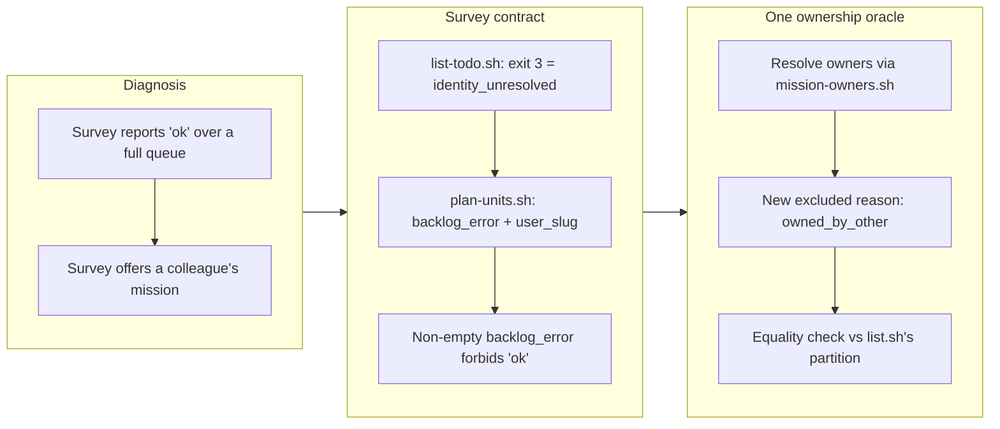

## 1. Overview

Two defects in `/drive`'s survey let an unattended runner report confident nonsense: an unreadable ticket queue rendered exactly like an empty one, and every approved mission was offered to every runner regardless of who owned it. Both were measured while designing an hourly unattended cloud runner, where each stops being cosmetic — the first makes every tick report a healthy, empty queue while the queue is full; the second lets a routine claim a colleague's mission and, under `merge_policy: auto`, drive it to `main`. The survey now distinguishes *unknown* from *empty*, and resolves mission ownership through the same oracle every other consumer already reads.

**Highlights:**

1. `plan-units.sh` gained two top-level keys — `backlog_error` and `user_slug` — so an unreadable queue never renders as an empty one, and a non-empty `backlog_error` forbids the `ok` terminal token exactly as `current: false` does.
2. Missions are filtered by ownership through `mission-owners.sh`, with a new `owned_by_other` exclusion reason; the executor joins the list of consumers that already read ownership through one place.
3. A survey-vs-`list.sh` equality assertion pins the two answers together, so this is a *single source* of the ownership rule rather than a second copy of it.

## 2. Motivation

Both defects share a root: the survey was answering questions it had no basis to answer, and saying so confidently. `plan-units.sh` read the backlog as `$(list-todo.sh 2>/dev/null || true)`, and `list-todo.sh` exits non-zero when `git config user.email` is unset — an exit the `|| true` discarded. A fresh cloud checkout starts with no configured identity, so the run would emit `backlog: []`, name nothing in `excluded[]`, and terminate `ok`. That is indistinguishable in a cron log from a correct idle tick, which is precisely the masked failure `workaholic:implementation` / `observability` exists to forbid.

The mission half failed the other way. The backlog was already user-scoped through `todo/<user>/`, but missions had no ownership filter at all: the surveyor walked every active mission and offered whatever cleared `status`, the acceptance floor and the ticket-queue floor. Meanwhile the mission lens, `list.sh`'s `relation`, `summary.sh`, `validate-mission.sh` and `ship`'s concern lane all resolved owners through `mission-owners.sh` — leaving the executor as the one consumer whose answer could disagree with the roadmap the developer is shown. The two fixes landed together because they touch the same emitted object and the same `excluded[]` vocabulary, and because they compound: a runner with the wrong identity now gets a wrong *mission* offer as well as an empty backlog, which is one more reason the identity failure had to become loud.

## 3. Changes

The work moved from diagnosis to contract to convergence. First the swallowed exit became a named state: `list-todo.sh` now discriminates by exit code, and `plan-units.sh` captures that status instead of discarding it. Then the ownership rule was pulled into the surveyor from the one oracle that already held it — deliberately *not* by re-parsing the frontmatter, since a second reader is exactly how the two answers drifted apart. The equality assertion between the survey's offer set and `list.sh`'s `mine`/`unassigned` partition is what makes the convergence durable rather than coincidental.

### 3-1. A survey that cannot resolve the developer reports an empty backlog instead of a failure ([7e417b2d](https://github.com/qmu/workaholic/commit/7e417b2d))

`list-todo.sh` now separates its two empty outputs by exit code — `0` with no output for a missing queue directory, `3` for an unresolvable identity — and `plan-units.sh` captures that status into a top-level `backlog_error`, alongside `user_slug` reporting whose queue was surveyed. The drive skill, command and runbook all state that a non-empty `backlog_error` forbids `ok`, so the two states can no longer render identically to a person or to a caller loop.

### 3-2. The survey offers every approved mission regardless of who owns it ([1424be98](https://github.com/qmu/workaholic/commit/1424be98))

Approved missions are now filtered through `mission/scripts/mission-owners.sh` using the mission lens's gate verbatim — offerable when the runner's identity is among the owners or when the mission is unowned (team-owned = claimable) — and a mission owned solely by others is dropped as `owned_by_other`. Ownership is resolved, never re-parsed, so the surveyor and the roadmap read one rule.

## 4. Outcome

`/drive`'s survey now reports three things it previously conflated or omitted: whether it could read the backlog at all (`backlog_error`), whose backlog it read (`user_slug`), and whether an approved mission is this runner's to take (`owned_by_other`). All three are additive to the emitted JSON — every existing key keeps its shape and meaning — and all three are reported rather than repaired, preserving the script's side-effect-free contract for the claim worktrees that call it.

The terminal-token truth table gained a row: an unreadable backlog terminates `pending`, joining `current: false` as a condition under which `ok` cannot be earned. That is the honest reading — a run that never learned the queue's contents has established nothing about it.

## 5. Historical Analysis

This branch continues a pattern the drive survey has been converging on since decision J3: **the survey states facts about itself and repairs nothing.** `current`/`surveyed_sha`/`base_sha` were added for exactly this reason — a checkout behind the base surveys a stale queue and reports it confidently — and `backlog_error` is the same move applied to a different unknown. The header comment's reasoning for why staleness is a property of the *survey* rather than of an artifact transferred directly: a queue the surveyor never located does not drop a *named* item, so it cannot be an `excluded[]` entry.

The ownership fix has its own precedent. `mission-owners.sh` was introduced when mission ownership moved onto the mission itself (decision B4, 2026-07-28), and each consumer was migrated to it one at a time; `CLAUDE.md` already listed `/drive`'s survey among them, which turned out to be aspirational rather than true. The documentation described the intended design correctly and the code had simply never caught up — a reminder that a consumer list is a claim someone has to verify, not a guarantee.

## 6. Concerns

### The survey's ownership gate depends on an identity it now knows may be missing

- **Severity:** low
- **Description:** With an unresolvable `git config user.email`, `plan-units.sh` treats every *owned* mission as someone else's and excludes it `owned_by_other`, while `backlog_error` separately reports the real problem (see [1424be98](https://github.com/qmu/workaholic/commit/1424be98) in `plugins/workaholic/skills/drive/scripts/plan-units.sh`). That is the conservative and intended reading — a runner that cannot say who it is must not claim work on anyone's behalf — but an operator reading `excluded[]` alone would see six `owned_by_other` drops and a plausible-looking reason, rather than the one field that explains all of them.
- **How to Fix:** Consider a distinct exclusion reason (or a note on the drop) when the identity is unresolvable, so the mission half points at the same root cause the backlog half already names. Alternatively, teach the drive skill's §1 prose to report `backlog_error` *before* the exclusion list, so the causal field is read first.

### Per-mission resolver subshells grow with the roster

- **Severity:** low
- **Description:** Each active mission now costs one more subshell in the survey (`mission-owners.sh`, on top of the existing `progress.sh` and `queue-size.sh` calls), and the survey runs on every tick (see [1424be98](https://github.com/qmu/workaholic/commit/1424be98) in `plugins/workaholic/skills/drive/scripts/plan-units.sh`). At today's roster size this is unmeasurable, and the ownership check short-circuits before the two more expensive calls, so it is likely net-neutral or better.
- **How to Fix:** If a large roster ever makes the survey slow, add a batch reader in `mission/scripts/` that resolves owners for every mission in one pass — never inline the parsing back into the surveyor, which is the drift this branch just removed.

## 7. Successful Development Patterns

- **Pinning a fix to its single source with an equality assertion, not just a behavior assertion.** The ownership tests assert the four ownership shapes *and* that the survey's offer set equals `list.sh`'s `mine`/`unassigned` partition over the same fixture. The behavior assertions would pass equally well against a hand-rolled copy of the rule; only the equality assertion fails when the two answers drift apart, which is the actual defect being prevented rather than its current symptom.
- **Choosing an exit code over parsed stderr text as a machine-readable discriminator.** `list-todo.sh` signals `identity_unresolved` with exit 3 and keeps the human sentence on stderr. A reason word embedded in a sentence is a parser waiting to drift the first time someone improves the wording; an exit code is one answer a caller cannot misread, and the two audiences get the form each needs.
- **Letting an existing design rationale decide a new field's shape.** Whether `backlog_error` should be a top-level key or an `excluded[]` entry was already answered by `current`'s header comment: `excluded[]` names artifacts the survey *saw and dropped*, so a condition where it never learned any artifact exists belongs on the survey, not on an item. Reading the prior decision's *reasoning* rather than copying its *shape* made the choice mechanical.
- **Fixing two defects together when they share an emitted object and compound each other.** The two tickets had a `depends_on` edge and both rewrote `plan-units.sh`'s JSON contract and `excluded[]` vocabulary; splitting them across PRs would have produced a conflict in the same lines plus a merge order that had to be respected by hand.

## 8. Release Preparation

**Verdict**: Ready for release

### 8-1. Concerns

- None — changes are safe for release. Both changes are additive to a JSON contract read as prose by `commands/drive.md`, the only consumer; no existing key changed shape or meaning.

### 8-2. Pre-release Instructions

- None — standard release process applies. `outputs/workflows` is regenerated and committed, so the `Outputs Freshness` CI workflow has nothing to flag.

### 8-3. Post-release Instructions

- None — no special post-release actions needed. The next `/drive` tick exercises both paths automatically; a runner missing its git identity will now terminate `pending` with `backlog_error: identity_unresolved` instead of a false `ok`.

## 9. Notes

The deferred-concern judge phase was skipped deliberately: the stream carries 66 open concerns, none of which this branch's diff touches, so every verdict would be `still_active` — and `still_active` verdicts write nothing. Skipping produces a byte-identical result to running it.

Verification run in the claim worktree: `node scripts/test-workflow-scripts.mjs` green at 1697 assertions (19 of them new across two suites), `build.mjs` + `verify.mjs` + `validate-metadata.mjs` clean with no residual `outputs/` diff, `layout-doctor.sh .` reporting `conforming: true`, and `scan-branch-safety.sh` reporting `{"verdict": "pass", "findings": []}`.
